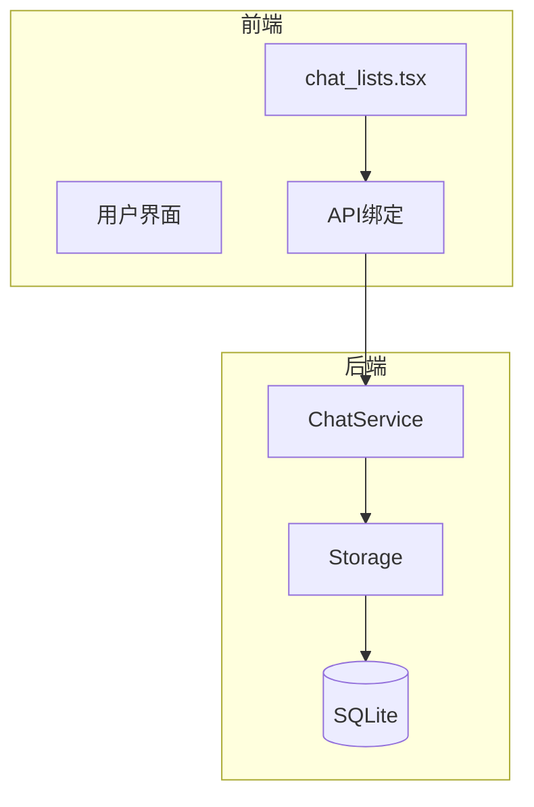
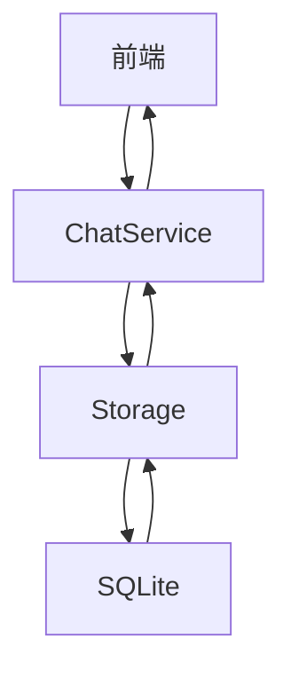
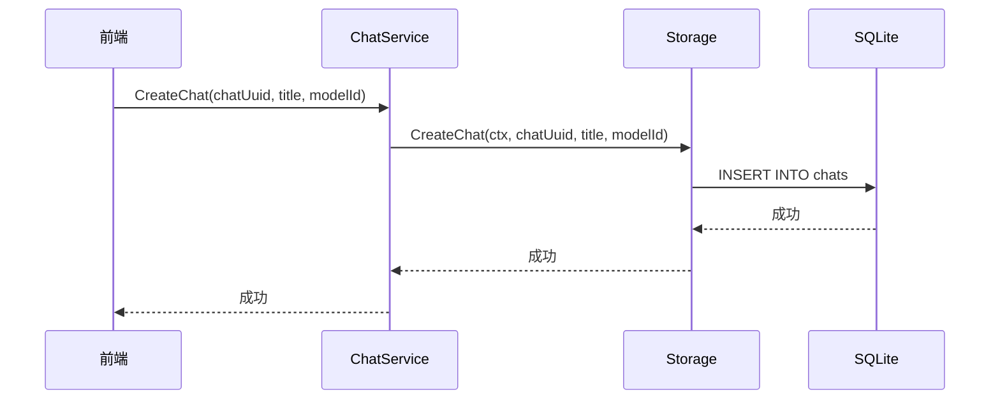
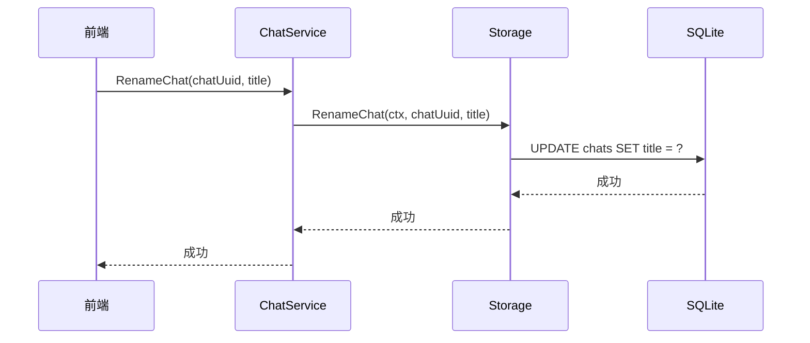
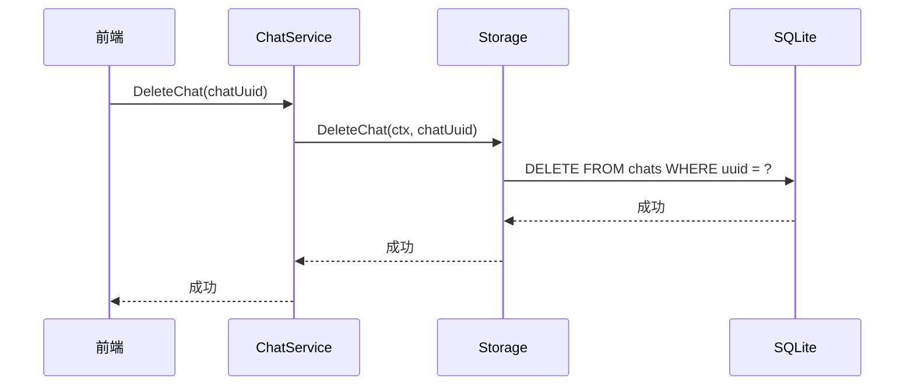
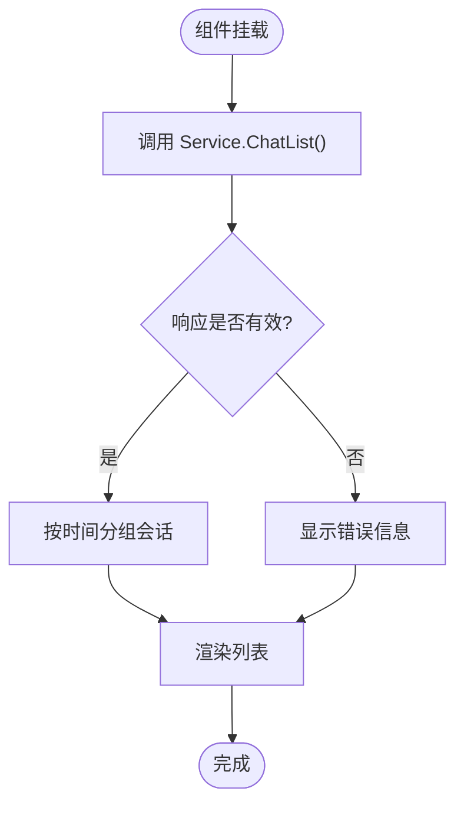
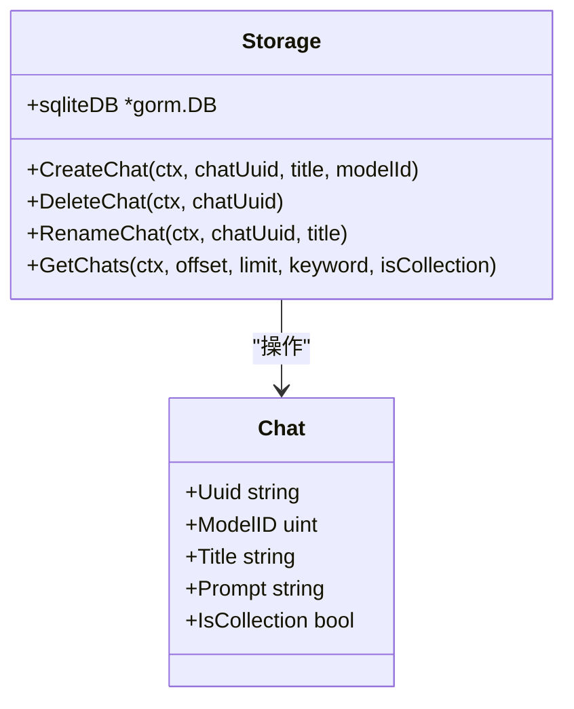
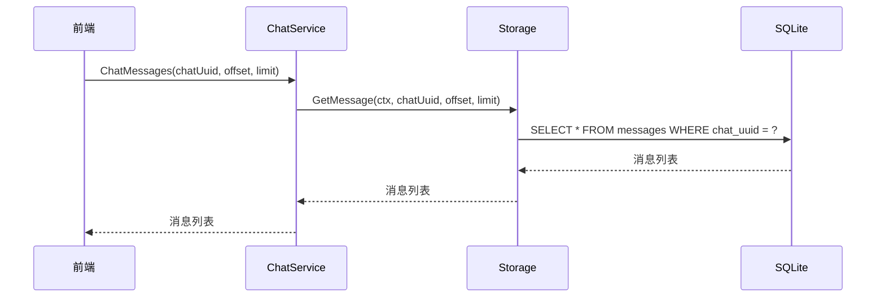
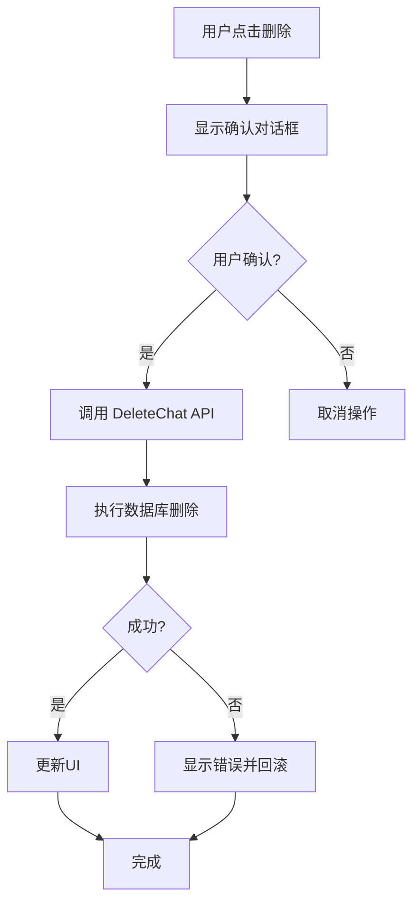
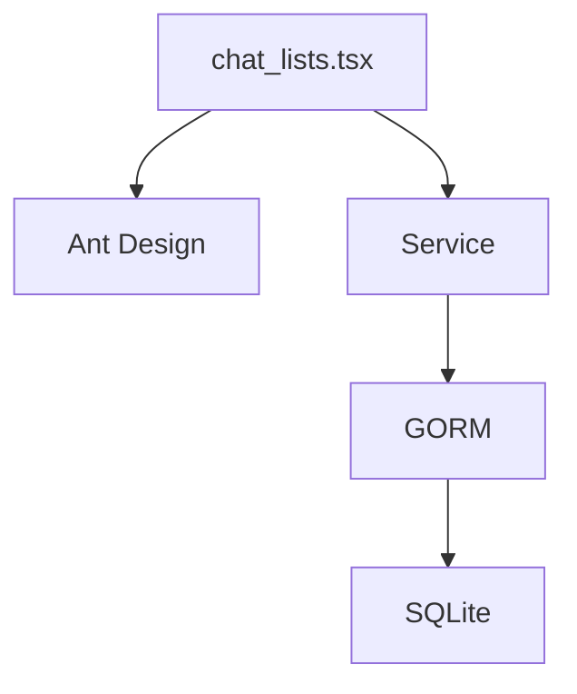

# 会话管理功能

<cite>
**本文档中引用的文件**  
- [chat.go](file://backend/models/data_models/chat.go)
- [chat.go](file://backend/storage/chat.go)
- [chat.go](file://backend/service/chat.go)
- [storage.go](file://backend/storage/storage.go)
- [chat_lists.tsx](file://frontend/src/pages/home/sidebar/chat_lists.tsx)
- [service.ts](file://frontend/bindings/gitlab.linhf.cn/project/lemontea/lemon_tea_desktop/backend/service/service.ts)
- [models.ts](file://frontend/bindings/gitlab.linhf.cn/project/lemontea/lemon_tea_desktop/backend/models/view_models/models.ts)
</cite>

## 目录
1. [简介](#简介)
2. [项目结构](#项目结构)
3. [核心组件](#核心组件)
4. [架构概览](#架构概览)
5. [详细组件分析](#详细组件分析)
6. [依赖分析](#依赖分析)
7. [性能考虑](#性能考虑)
8. [故障排除指南](#故障排除指南)
9. [结论](#结论)

## 简介
本文档详述了会话管理功能的实现机制，涵盖用户如何创建、重命名、删除聊天会话，以及侧边栏如何展示历史会话列表。文档解释了 `ChatService.CreateChat`、`UpdateChat`、`DeleteChat` 等 API 的调用流程，描述了 Storage 层如何将会话数据持久化至 SQLite 并在应用重启后恢复。同时说明了会话切换时上下文消息的加载过程，提供了异常处理建议，如删除正在进行的会话时的确认机制，并结合实际代码展示了事务处理与错误回滚策略。

## 项目结构
项目分为前端和后端两大部分。后端主要由 `models`、`service`、`storage` 和 `utils` 模块组成，负责数据模型定义、业务逻辑处理、数据持久化和工具函数。前端使用 React 框架，通过 `bindings` 与后端服务进行通信，`chat_lists.tsx` 组件负责渲染侧边栏中的会话列表。

**Diagram sources**  
- [chat_lists.tsx](file://frontend/src/pages/home/sidebar/chat_lists.tsx)
- [service.ts](file://frontend/bindings/gitlab.linhf.cn/project/lemontea/lemon_tea_desktop/backend/service/service.ts)
- [chat.go](file://backend/service/chat.go)
- [chat.go](file://backend/storage/chat.go)

**Section sources**  
- [chat_lists.tsx](file://frontend/src/pages/home/sidebar/chat_lists.tsx)
- [chat.go](file://backend/service/chat.go)
- [chat.go](file://backend/storage/chat.go)

## 核心组件
会话管理的核心组件包括前端的 `chat_lists.tsx` 组件、后端的 `ChatService` 服务和 `Storage` 模块。`chat_lists.tsx` 负责展示和交互，`ChatService` 处理业务逻辑，`Storage` 负责与 SQLite 数据库交互。

**Section sources**  
- [chat_lists.tsx](file://frontend/src/pages/home/sidebar/chat_lists.tsx)
- [chat.go](file://backend/service/chat.go)
- [chat.go](file://backend/storage/chat.go)

## 架构概览
系统采用分层架构，前端通过 API 调用后端服务，服务层调用存储层进行数据操作。数据模型分为 `data_models` 和 `view_models`，分别用于数据库存储和视图展示。

**Diagram sources**  
- [chat.go](file://backend/service/chat.go)
- [chat.go](file://backend/storage/chat.go)
- [storage.go](file://backend/storage/storage.go)

## 详细组件分析

### 会话创建、重命名与删除
用户通过前端界面触发会话操作，前端调用相应的 API，后端服务处理请求并持久化数据。

#### 创建会话流程

**Diagram sources**  
- [chat.go](file://backend/service/chat.go#L158-L206)
- [chat.go](file://backend/storage/chat.go#L55-L78)

#### 重命名会话流程

**Diagram sources**  
- [chat.go](file://backend/service/chat.go#L173-L180)
- [chat.go](file://backend/storage/chat.go#L90-L96)

#### 删除会话流程

**Diagram sources**  
- [chat.go](file://backend/service/chat.go#L165-L171)
- [chat.go](file://backend/storage/chat.go#L81-L87)

**Section sources**  
- [chat_lists.tsx](file://frontend/src/pages/home/sidebar/chat_lists.tsx#L500-L550)
- [chat.go](file://backend/service/chat.go#L165-L180)
- [chat.go](file://backend/storage/chat.go#L55-L96)

### 侧边栏会话列表展示
`chat_lists.tsx` 组件通过调用 `Service.ChatList` API 获取会话列表，并根据更新时间分组展示。

**Diagram sources**  
- [chat_lists.tsx](file://frontend/src/pages/home/sidebar/chat_lists.tsx#L200-L300)

**Section sources**  
- [chat_lists.tsx](file://frontend/src/pages/home/sidebar/chat_lists.tsx#L200-L300)
- [chat.go](file://backend/service/chat.go#L4-L15)

### 数据持久化与恢复
`Storage` 层使用 GORM 操作 SQLite 数据库，确保会话数据在应用重启后能够恢复。

**Diagram sources**  
- [storage.go](file://backend/storage/storage.go#L10-L25)
- [chat.go](file://backend/storage/chat.go#L55-L109)

### 上下文消息加载
当用户切换会话时，系统加载该会话的历史消息。

**Diagram sources**  
- [chat.go](file://backend/service/chat.go#L20-L35)
- [chat_message.go](file://backend/storage/chat_message.go#L40-L72)

### 异常处理与事务
系统在删除会话时提供确认机制，并在存储层使用事务确保数据一致性。

**Diagram sources**  
- [chat_lists.tsx](file://frontend/src/pages/home/sidebar/chat_lists.tsx#L500-L550)
- [storage.go](file://backend/storage/storage.go#L30-L50)

**Section sources**  
- [chat_lists.tsx](file://frontend/src/pages/home/sidebar/chat_lists.tsx#L500-L550)
- [storage.go](file://backend/storage/storage.go#L30-L50)

## 依赖分析
系统依赖 GORM 进行数据库操作，使用 Ant Design 作为前端 UI 库。前后端通过自定义绑定进行通信。

**Diagram sources**  
- [chat_lists.tsx](file://frontend/src/pages/home/sidebar/chat_lists.tsx)
- [storage.go](file://backend/storage/storage.go)

**Section sources**  
- [chat_lists.tsx](file://frontend/src/pages/home/sidebar/chat_lists.tsx)
- [storage.go](file://backend/storage/storage.go)

## 性能考虑
- 使用分页加载会话列表，避免一次性加载过多数据。
- 在数据库查询中使用索引优化性能。
- 前端使用防抖处理搜索输入，减少不必要的 API 调用。

## 故障排除指南
- **会话无法创建**：检查数据库连接和模型迁移。
- **消息加载缓慢**：检查数据库索引和网络连接。
- **删除确认不显示**：检查前端组件的事件绑定。

**Section sources**  
- [chat_lists.tsx](file://frontend/src/pages/home/sidebar/chat_lists.tsx#L500-L550)
- [chat.go](file://backend/storage/chat.go#L81-L87)

## 结论
本文档详细阐述了会话管理功能的实现机制，从用户交互到数据持久化，涵盖了整个流程。系统设计合理，具有良好的可维护性和扩展性。