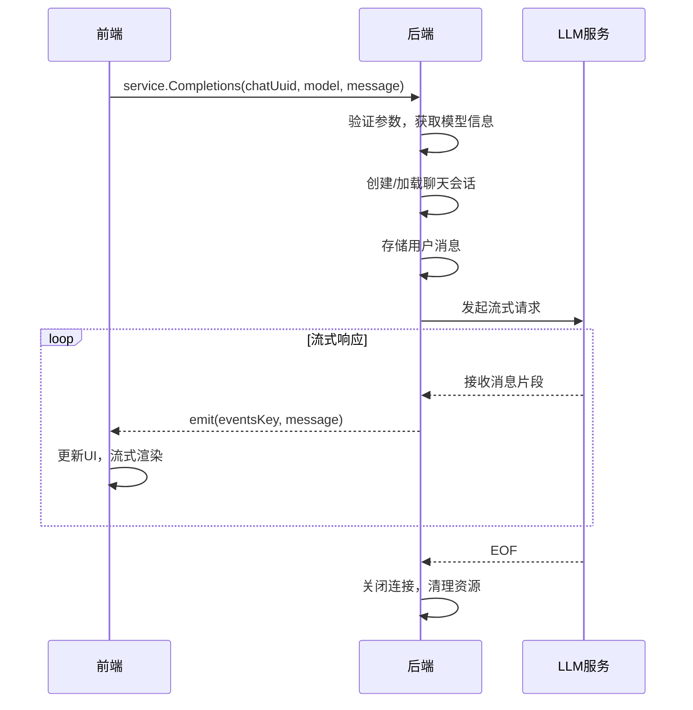

# RPC调用机制

<cite>
**本文档引用文件**  
- [main.go](file://main.go)
- [backend/service/service.go](file://backend/service/service.go)
- [backend/service/chat.go](file://backend/service/chat.go)
- [backend/service/provider.go](file://backend/service/provider.go)
- [backend/storage/storage.go](file://backend/storage/storage.go)
- [frontend/bindings/gitlab.linhf.cn/project/lemontea/lemon_tea_desktop/backend/service/service.ts](file://frontend/bindings/gitlab.linhf.cn/project/lemontea/lemon_tea_desktop/backend/service/service.ts)
- [frontend/src/pages/home/chat/chat_input.tsx](file://frontend/src/pages/home/chat/chat_input.tsx)
- [frontend/src/pages/home/chat/chat_messages.tsx](file://frontend/src/pages/home/chat/chat_messages.tsx)
</cite>

## 目录
1. [简介](#简介)
2. [RPC通信机制概述](#rpc通信机制概述)
3. [Go后端服务注册与初始化](#go后端服务注册与初始化)
4. [前端TypeScript绑定文件生成原理](#前端typescript绑定文件生成原理)
5. [Completions方法调用流程详解](#completions方法调用流程详解)
6. [错误处理与加载状态管理](#错误处理与加载状态管理)
7. [添加新的RPC接口指南](#添加新的rpc接口指南)
8. [总结](#总结)

## 简介
本文档详细阐述了基于Wails框架的桌面应用中前后端之间的RPC通信机制。重点说明如何通过`NewService`注册服务，将Go后端的方法暴露为前端可调用接口，并解释前端TypeScript绑定文件的自动生成原理。通过具体代码示例展示从前端调用到后端处理再到流式返回消息的完整数据流，帮助开发者理解并实现高效的前后端协同开发。

## RPC通信机制概述
Wails框架提供了一套完整的前后端通信解决方案，允许前端通过JavaScript/TypeScript直接调用Go后端定义的服务方法。这种通信基于RPC（远程过程调用）机制，实现了类型安全、异步调用和双向通信能力。

核心特点包括：
- **类型安全**：通过自动生成的TypeScript绑定文件确保前后端接口一致性
- **异步调用**：所有RPC调用均为非阻塞式，支持`Promise`语法
- **流式响应**：支持通过事件系统实现流式数据传输
- **服务化架构**：后端功能以服务形式组织，便于模块化管理

**Section sources**
- [main.go](file://main.go#L1-L60)
- [backend/service/service.go](file://backend/service/service.go#L1-L30)

## Go后端服务注册与初始化
在Wails框架中，Go后端服务通过`application.NewService`函数进行注册，并在应用启动时自动初始化。

### 服务注册
在`main.go`文件中，通过以下方式注册服务：
```go
app := application.New(application.Options{
    Name:        "lemon_tea_desktop",
    Description: "A ai agent client",
    Services: []application.Service{
        application.NewService(service.NewService()),
    },
    // ... 其他配置
})
```

其中`service.NewService()`返回一个实现了具体业务逻辑的`Service`结构体指针。

### 服务初始化
`Service`结构体定义在`backend/service/service.go`中：
```go
type Service struct {
    storage *storage.Storage
    app     *application.App
}
```

`ServiceStartup`方法在服务启动时被调用，用于初始化依赖项：
```go
func (s *Service) ServiceStartup(ctx context.Context, options application.ServiceOptions) error {
    istorage, err := storage.NewStorage()
    if err != nil {
        return err
    }

    s.storage = istorage
    s.app = application.Get()

    return nil
}
```

该方法完成了两个关键初始化：
1. 创建并初始化`storage.Storage`实例，用于数据库操作
2. 获取全局`application.App`实例，用于事件发射和窗口管理

**context.Context**的作用是提供请求上下文，支持超时控制、取消信号等高级功能。

**Section sources**
- [main.go](file://main.go#L1-L60)
- [backend/service/service.go](file://backend/service/service.go#L1-L30)
- [backend/storage/storage.go](file://backend/storage/storage.go#L1-L83)

## 前端TypeScript绑定文件生成原理
Wails框架会自动为注册的服务生成TypeScript绑定文件，确保前后端调用的类型安全和一致性。

### 绑定文件位置
生成的绑定文件位于：
```
frontend/bindings/gitlab.linhf.cn/project/lemontea/lemon_tea_desktop/backend/service/
```

主要文件包括：
- `index.ts`：模块导出入口
- `service.ts`：具体服务方法的TypeScript声明

### 生成机制
当执行`wails3 dev`或`wails3 build`命令时，Wails工具链会：
1. 分析Go代码中的服务方法签名
2. 提取参数类型和返回值类型
3. 生成对应的TypeScript接口定义
4. 创建代理调用函数，封装底层通信逻辑

### 类型安全保证
以`Completions`方法为例，其Go签名：
```go
func (s *Service) Completions(chatUuid, model string, message schema.Message) (*view_models.Completions, error)
```

对应生成的TypeScript声明：
```ts
export function Completions(chatUuid: string, model: string, message: schema$0.Message): $CancellablePromise<view_models$0.Completions | null>
```

这种自动生成机制确保了：
- 参数类型严格匹配
- 返回值类型可预测
- 编译时类型检查
- IDE智能提示支持

**Section sources**
- [frontend/bindings/gitlab.linhf.cn/project/lemontea/lemon_tea_desktop/backend/service/service.ts](file://frontend/bindings/gitlab.linhf.cn/project/lemontea/lemon_tea_desktop/backend/service/service.ts)
- [frontend/bindings/gitlab.linhf.cn/project/lemontea/lemon_tea_desktop/backend/service/index.ts](file://frontend/bindings/gitlab.linhf.cn/project/lemontea/lemon_tea_desktop/backend/service/index.ts)

## Completions方法调用流程详解
以`Completions`方法为例，展示从前端调用到后端处理的完整数据流。

### 前端调用
在聊天输入组件中，用户发送消息时触发调用：
```ts
onSendMessage: (message: string) => void;
```

实际调用代码位于`chat_input.tsx`：
```tsx
const handleSend = useCallback(() => {
    const trimmedValue = inputValue.trim();
    if (trimmedValue) {
        onSendMessage(trimmedValue);
        clearInput();
    }
}, [inputValue, onSendMessage, clearInput]);
```

在父组件中，`onSendMessage`实现为：
```ts
service.Completions(chatUuid, model, message)
```

### 后端处理
`Completions`方法实现在`backend/service/chat.go`中，主要流程如下：

1. **参数验证与模型获取**
```go
providerModel, err := s.storage.GetProviderModel(context.Background(), model)
```

2. **聊天会话管理**
- 若`chatUuid`为空，则创建新聊天
- 否则加载历史消息

3. **消息存储**
```go
err = s.storage.CreateMessage(context.Background(), chatUuid, data_models.Message{...})
```

4. **流式请求处理**
```go
provider := llm.NewLlmProvider(...)
stream, err := provider.Completions(context.Background(), messages)
```

5. **异步消息转发**
使用goroutine监听流式响应，并通过事件系统转发给前端：
```go
msgChan := make(chan *schema.Message)
errChan := make(chan error)
doneChan := make(chan struct{})

go func() {
    defer close(msgChan)
    defer close(errChan)
    defer close(doneChan)
    for {
        message, err := stream.Recv()
        if err == io.EOF {
            doneChan <- struct{}{}
            return
        }
        if err != nil {
            errChan <- err
            return
        }
        msgChan <- message
    }
}()
```

6. **事件发射**
```go
eventsKey := utils.GenEventsKey(messageUuid)
s.app.Event.Emit(eventsKey, dataModelMsg.Message)
```

### 前端接收
在`chat_messages.tsx`中监听事件，更新UI状态：
```tsx
// 通过事件系统接收流式消息
// 实现平滑滚动、加载状态管理等功能
```



**Diagram sources**
- [backend/service/chat.go](file://backend/service/chat.go#L1-L207)
- [frontend/src/pages/home/chat/chat_input.tsx](file://frontend/src/pages/home/chat/chat_input.tsx#L1-L372)
- [frontend/src/pages/home/chat/chat_messages.tsx](file://frontend/src/pages/home/chat/chat_messages.tsx#L1-L512)

**Section sources**
- [backend/service/chat.go](file://backend/service/chat.go#L1-L207)
- [frontend/src/pages/home/chat/chat_input.tsx](file://frontend/src/pages/home/chat/chat_input.tsx#L1-L372)
- [frontend/src/pages/home/chat/chat_messages.tsx](file://frontend/src/pages/home/chat/chat_messages.tsx#L1-L512)

## 错误处理与加载状态管理
### 错误处理机制
后端采用统一的错误包装机制：
```go
import "gitlab.linhf.cn/project/lemontea/lemon_tea_desktop/backend/utils/ierror"

return nil, ierror.NewError(err)
```

前端通过Promise的catch机制处理错误：
```ts
service.Completions(...)
    .then(result => { /* 处理成功 */ })
    .catch(error => { /* 处理错误 */ })
```

### 加载状态管理
前端通过以下方式管理加载状态：
1. **按钮状态**：发送按钮在加载时显示"停止"状态
2. **加载指示器**：显示"AI 正在思考中..."动画
3. **滚动控制**：自动滚动到底部，支持手动暂停

在`chat_messages.tsx`中实现智能滚动逻辑：
```tsx
const isAtBottom = useCallback(() => {
    const { scrollTop, scrollHeight, clientHeight } = element;
    return scrollHeight - scrollTop - clientHeight <= 20;
}, []);
```

用户手动滚动后会暂停自动滚动，提升用户体验。

**Section sources**
- [backend/service/chat.go](file://backend/service/chat.go#L1-L207)
- [backend/utils/ierror/common.go](file://backend/utils/ierror/common.go)
- [frontend/src/pages/home/chat/chat_input.tsx](file://frontend/src/pages/home/chat/chat_input.tsx#L1-L372)
- [frontend/src/pages/home/chat/chat_messages.tsx](file://frontend/src/pages/home/chat/chat_messages.tsx#L1-L512)

## 添加新的RPC接口指南
要添加新的RPC接口，遵循以下步骤：

### 1. 定义服务方法
在`backend/service/`目录下的适当文件中添加方法：
```go
func (s *Service) NewMethod(param1 type1, param2 type2) (returnType, error) {
    // 实现业务逻辑
    return result, nil
}
```

### 2. 确保方法可导出
- 方法名必须大写（Go的导出规则）
- 参数和返回值类型必须是可序列化的

### 3. 重新生成绑定文件
执行以下命令重新生成TypeScript绑定：
```bash
wails3 generate
```

### 4. 前端调用
在TypeScript中可以直接调用新方法：
```ts
import { Service } from "@bindings/.../service";

const result = await Service.NewMethod(param1, param2);
```

### 最佳实践
- **错误处理**：始终返回`error`类型，使用`ierror`包进行错误包装
- **上下文传递**：对于长时间运行的操作，使用`context.Context`支持取消
- **数据验证**：在方法入口处验证参数有效性
- **日志记录**：关键操作添加日志记录

**Section sources**
- [backend/service/service.go](file://backend/service/service.go#L1-L30)
- [backend/service/chat.go](file://backend/service/chat.go#L1-L207)
- [frontend/bindings/gitlab.linhf.cn/project/lemontea/lemon_tea_desktop/backend/service/service.ts](file://frontend/bindings/gitlab.linhf.cn/project/lemontea/lemon_tea_desktop/backend/service/service.ts)

## 总结
本文档详细阐述了Wails框架下前后端RPC通信的完整机制。通过`NewService`注册服务，Go后端方法被安全地暴露给前端调用。TypeScript绑定文件的自动生成确保了类型安全和开发效率。以`Completions`方法为例，展示了从用户输入、前端调用、后端处理到流式返回的完整数据流。合理的错误处理和加载状态管理提升了用户体验。开发者可以遵循文档指南轻松添加新的RPC接口，实现高效的前后端协同开发。