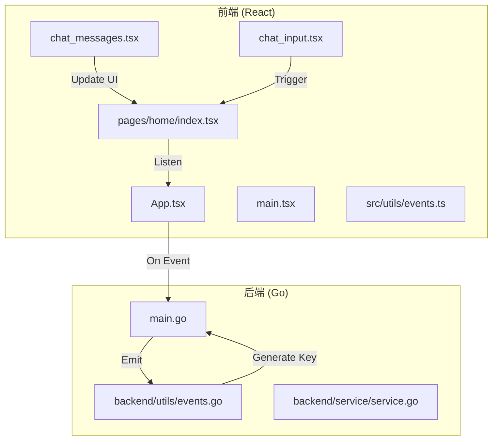
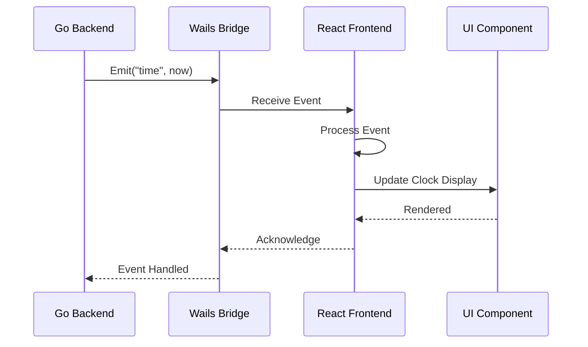
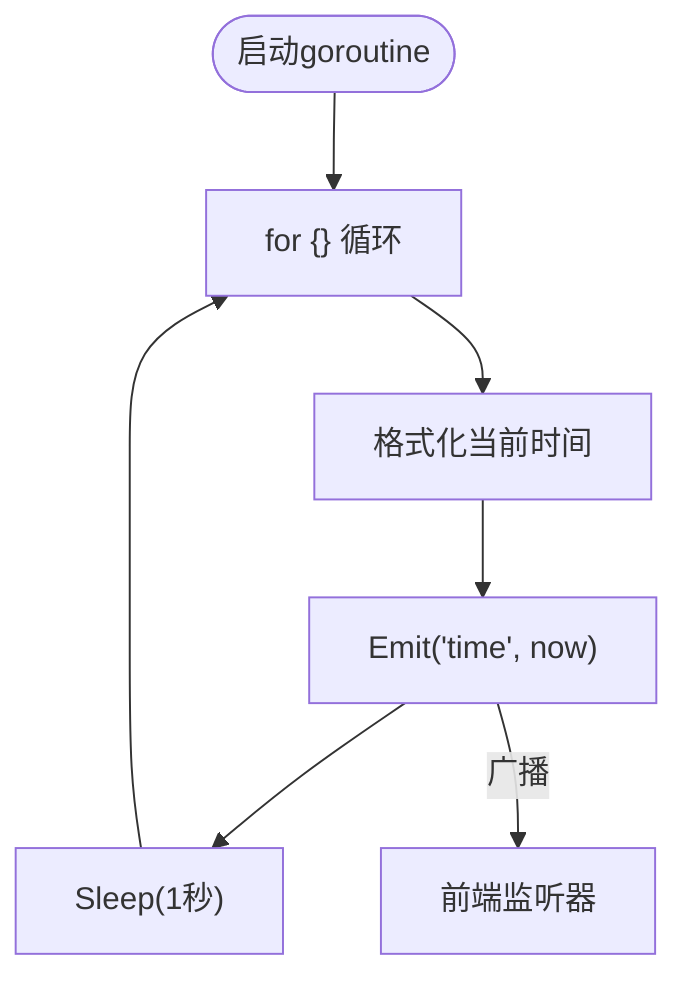
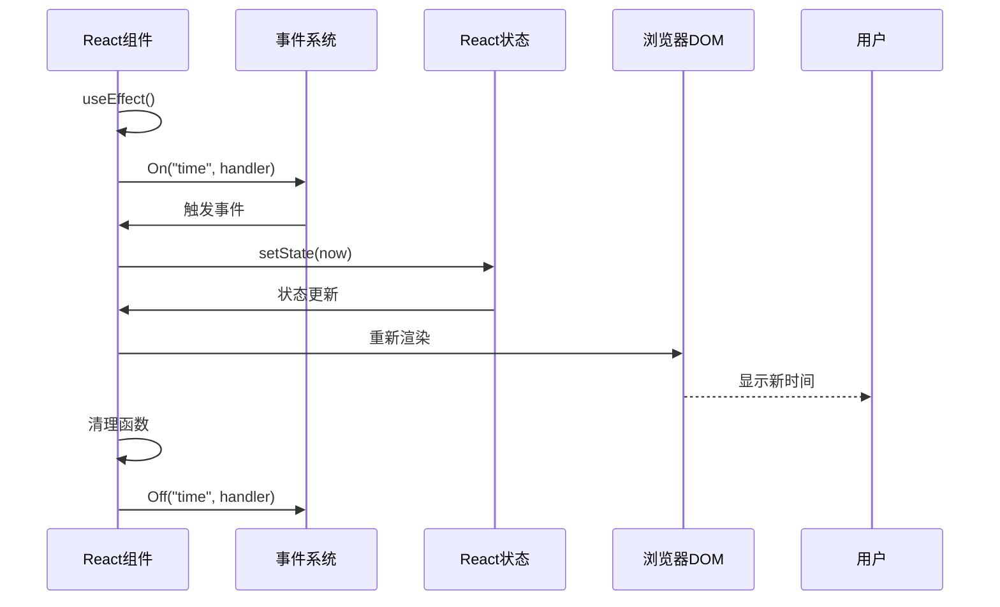
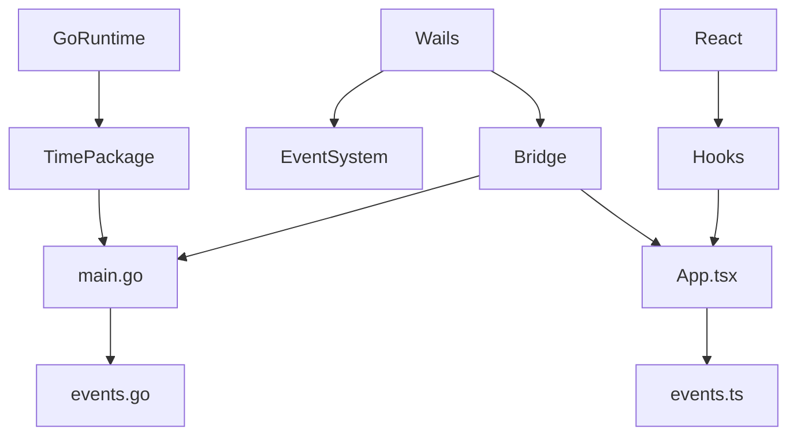

# 事件系统

<cite>
**本文档中引用的文件**   
- [main.go](file://main.go)
- [events.go](file://backend/utils/events.go)
- [events.ts](file://frontend/src/utils/events.ts)
- [App.tsx](file://frontend/src/App.tsx)
- [main.tsx](file://frontend/src/main.tsx)
- [chat_messages.tsx](file://frontend/src/pages/home/chat/chat_messages.tsx)
- [chat_input.tsx](file://frontend/src/pages/home/chat/chat_input.tsx)
- [index.tsx](file://frontend/src/pages/home/index.tsx)
</cite>

## 目录
1. [简介](#简介)
2. [项目结构](#项目结构)
3. [核心组件](#核心组件)
4. [架构概述](#架构概述)
5. [详细组件分析](#详细组件分析)
6. [依赖分析](#依赖分析)
7. [性能考虑](#性能考虑)
8. [故障排除指南](#故障排除指南)
9. [结论](#结论)

## 简介
本文档深入解析基于Wails框架的实时通信机制，重点分析`main.go`中每秒触发`app.Event.Emit("time", now)`的goroutine实现。详细说明事件广播的生命周期与性能影响，阐述前端如何通过`app.Event.On("time", handler)`订阅时间事件并更新UI时钟显示。结合实际代码展示事件监听的注册与销毁时机，避免内存泄漏。同时说明事件系统在跨窗口通信、状态同步、实时通知等场景的应用模式，并提供扩展指南：如何定义自定义事件（如`messageReceived`、`modelUpdated`），在Go服务中触发，并在React组件中安全地绑定与解绑事件监听器。最后包含错误处理策略与调试技巧，例如事件未触发时的排查步骤。

## 项目结构
本项目采用前后端分离架构，Go语言作为后端逻辑层，React作为前端UI层，通过Wails框架进行桥接。事件系统是前后端通信的核心机制之一。



**图示来源**
- [main.go](file://main.go#L1-L60)
- [App.tsx](file://frontend/src/App.tsx#L1-L87)
- [chat_messages.tsx](file://frontend/src/pages/home/chat/chat_messages.tsx#L1-L513)
- [events.ts](file://frontend/src/utils/events.ts#L1-L3)
- [events.go](file://backend/utils/events.go#L1-L8)

**本节来源**
- [main.go](file://main.go#L1-L60)
- [App.tsx](file://frontend/src/App.tsx#L1-L87)
- [main.tsx](file://frontend/src/main.tsx#L1-L27)

## 核心组件
核心组件包括事件发射器（Go后端）、事件监听器（React前端）、事件键生成工具和UI更新机制。`main.go`中的goroutine每秒发射时间事件，前端通过统一的事件键生成函数订阅并更新UI。

**本节来源**
- [main.go](file://main.go#L45-L55)
- [events.go](file://backend/utils/events.go#L1-L8)
- [events.ts](file://frontend/src/utils/events.ts#L1-L3)

## 架构概述
系统采用发布-订阅模式，Go后端作为事件发布者，React前端作为事件订阅者。事件系统通过Wails的`app.Event`接口实现跨语言通信，确保前后端状态同步。



**图示来源**
- [main.go](file://main.go#L45-L55)
- [App.tsx](file://frontend/src/App.tsx#L1-L87)
- [chat_messages.tsx](file://frontend/src/pages/home/chat/chat_messages.tsx#L1-L513)

## 详细组件分析

### 时间事件发射器分析
`main.go`中的goroutine实现了一个持续的时间事件发射器，每秒格式化当前时间并通过`app.Event.Emit`广播。



**图示来源**
- [main.go](file://main.go#L45-L55)

**本节来源**
- [main.go](file://main.go#L45-L55)

### 事件键生成机制分析
前后端使用统一的事件键生成函数，确保事件命名一致性。Go和TypeScript版本的`GenEventsKey`函数均在`user:`前缀基础上生成完整事件键。

```mermaid
classDiagram
class GenEventsKeyGo {
+GenEventsKey(in string) string
}
class GenEventsKeyTs {
+GenEventsKey(input : string) : string
}
GenEventsKeyGo -->|生成| EventKey["事件键 : user : time"]
GenEventsKeyTs -->|生成| EventKey
```

**图示来源**
- [events.go](file://backend/utils/events.go#L1-L8)
- [events.ts](file://frontend/src/utils/events.ts#L1-L3)

**本节来源**
- [events.go](file://backend/utils/events.go#L1-L8)
- [events.ts](file://frontend/src/utils/events.ts#L1-L3)

### 前端事件监听与UI更新分析
前端组件通过`useEffect`钩子注册和销毁事件监听器，确保组件卸载时不会造成内存泄漏。事件触发后，通过React状态更新机制刷新UI。



**图示来源**
- [App.tsx](file://frontend/src/App.tsx#L1-L87)
- [chat_messages.tsx](file://frontend/src/pages/home/chat/chat_messages.tsx#L1-L513)

**本节来源**
- [App.tsx](file://frontend/src/App.tsx#L1-L87)
- [chat_messages.tsx](file://frontend/src/pages/home/chat/chat_messages.tsx#L1-L513)
- [index.tsx](file://frontend/src/pages/home/index.tsx#L1-L415)

## 依赖分析
事件系统依赖于Wails框架的核心模块、Go的time包和React的hooks机制。前后端通过生成的绑定代码进行类型安全的通信。



**图示来源**
- [main.go](file://main.go#L1-L60)
- [events.go](file://backend/utils/events.go#L1-L8)
- [App.tsx](file://frontend/src/App.tsx#L1-L87)
- [events.ts](file://frontend/src/utils/events.ts#L1-L3)

**本节来源**
- [main.go](file://main.go#L1-L60)
- [go.mod](file://go.mod#L1-L20)

## 性能考虑
时间事件每秒触发一次，频率适中，不会造成性能瓶颈。事件系统采用轻量级发布-订阅模式，内存占用小。前端使用`useEffect`的清理函数确保事件监听器正确销毁，避免内存泄漏。

## 故障排除指南
当事件未触发时，可按以下步骤排查：
1. 检查`main.go`中的goroutine是否正常运行
2. 验证事件键名称是否前后端一致
3. 确认前端组件是否正确注册了事件监听器
4. 检查Wails桥接是否正常工作
5. 查看浏览器控制台和Go日志是否有错误信息

**本节来源**
- [main.go](file://main.go#L45-L55)
- [App.tsx](file://frontend/src/App.tsx#L1-L87)
- [events.go](file://backend/utils/events.go#L1-L8)

## 结论
本文档全面分析了基于Wails的事件系统实现，涵盖了从后端事件发射到前端UI更新的完整生命周期。通过goroutine实现的定时事件发射器、统一的事件键生成机制和React的生命周期管理，构建了一个高效、可靠的实时通信系统。该模式可扩展至跨窗口通信、状态同步和实时通知等多种应用场景。