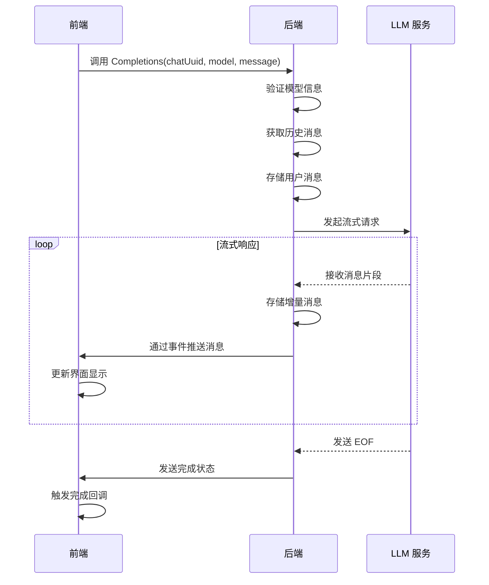
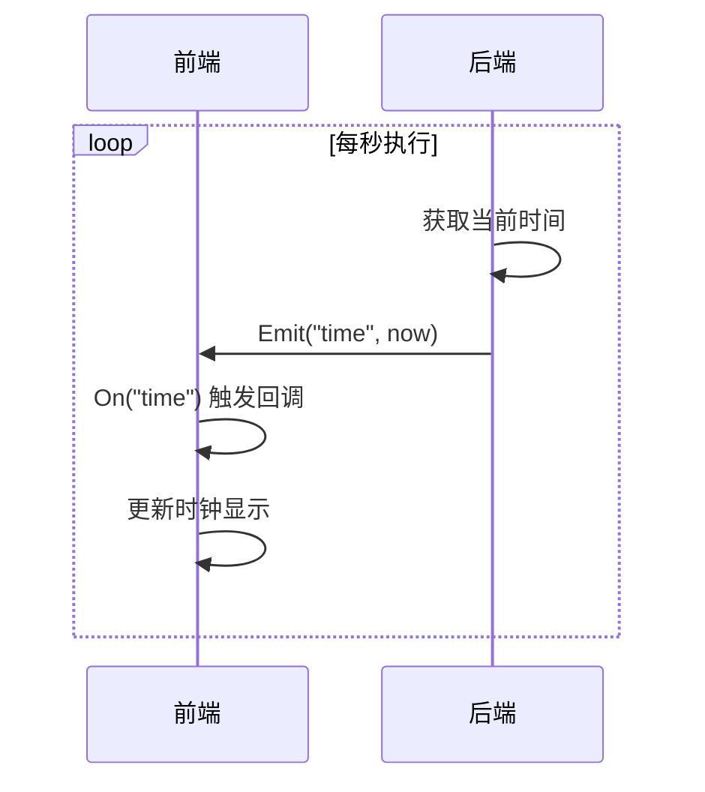

# 前后端通信机制

<cite>
**本文档引用的文件**  
- [main.go](file://main.go)
- [backend/service/chat.go](file://backend/service/chat.go)
- [frontend/bindings/gitlab.linhf.cn/project/lemontea/lemon_tea_desktop/backend/service/service.ts](file://frontend/bindings/gitlab.linhf.cn/project/lemontea/lemon_tea_desktop/backend/service/service.ts)
- [frontend/src/utils/completions.ts](file://frontend/src/utils/completions.ts)
- [backend/utils/events.go](file://backend/utils/events.go)
- [frontend/src/utils/events.ts](file://frontend/src/utils/events.ts)
</cite>

## 目录
1. [Wails RPC 通信机制](#wails-rpc-通信机制)
2. [chat.Completions 调用流程](#chatcompletions-调用流程)
3. [事件系统与实时推送](#事件系统与实时推送)
4. [类型安全与 bindings 生成](#类型安全与-bindings-生成)
5. [调用示例与错误处理](#调用示例与错误处理)

## Wails RPC 通信机制

Wails 框架通过 RPC（远程过程调用）机制实现前后端通信。在 Go 后端，通过 `application.NewService()` 注册服务，将 Go 结构体的方法暴露为前端可调用的接口。前端通过 `import` 导入自动生成的 bindings 服务对象，以异步方式调用这些方法。

Go 服务在 `main.go` 中注册，`service.NewService()` 创建的服务实例被封装为 Wails 应用的服务组件，其公开方法自动映射为前端可调用的 API。

**Section sources**
- [main.go](file://main.go#L1-L58)
- [backend/service/service.go](file://backend/service/service.go#L1-L29)

## chat.Completions 调用流程

`chat.Completions` 方法实现了从前端调用到后端处理再到流式返回消息的完整流程。该流程包含以下关键步骤：

1. **前端发起调用**：前端调用 `Service.Completions()` 方法，传入聊天会话标识、模型信息和用户消息。
2. **后端处理请求**：Go 服务验证模型信息，创建或获取聊天会话，存储用户消息，并调用 LLM 服务获取流式响应。
3. **流式消息推送**：后端通过事件系统将流式响应分段推送到前端，前端通过事件监听器接收并处理每个消息片段。
4. **会话完成处理**：当流式响应结束时，后端发送完成状态，前端清理资源并触发完成回调。



**Diagram sources**
- [backend/service/chat.go](file://backend/service/chat.go#L44-L206)
- [frontend/src/utils/completions.ts](file://frontend/src/utils/completions.ts#L0-L101)

**Section sources**
- [backend/service/chat.go](file://backend/service/chat.go#L44-L206)
- [frontend/src/utils/completions.ts](file://frontend/src/utils/completions.ts#L0-L101)

## 事件系统与实时推送

Wails 事件系统通过 `app.Event.Emit()` 和 `Events.On()` 实现双向通信。在实时推送场景中，后端定期发送事件，前端监听并更新界面。

在 `main.go` 中，一个独立的 goroutine 每秒获取当前时间并通过 `app.Event.Emit("time", now)` 发送时间事件。前端通过 `Events.On("time", callback)` 监听该事件，实现时钟的实时更新。



**Diagram sources**
- [main.go](file://main.go#L50-L56)

**Section sources**
- [main.go](file://main.go#L50-L56)
- [frontend/src/utils/events.ts](file://frontend/src/utils/events.ts#L0-L2)

## 类型安全与 bindings 生成

Wails 自动生成 TypeScript bindings 以确保前后端类型一致性。`frontend/bindings/` 目录下的文件由框架自动生成，包含 Go 结构体对应的 TypeScript 类型定义。

例如，`Completions` 方法的返回类型 `view_models.Completions` 在 Go 中定义为：
```go
type Completions struct {
    ChatUuid    string `json:"chat_uuid"`
    MessageUuid string `json:"message_uuid"`
}
```

对应的 TypeScript 类型在 `frontend/bindings/gitlab.linhf.cn/project/lemontea/lemon_tea_desktop/backend/models/view_models/models.ts` 中自动生成，确保前端调用时具有完整的类型检查和自动补全功能。

**Section sources**
- [backend/models/view_models/chat.go](file://backend/models/view_models/chat.go#L0-L23)
- [frontend/bindings/gitlab.linhf.cn/project/lemontea/lemon_tea_desktop/backend/models/view_models/models.ts](file://frontend/bindings/gitlab.linhf.cn/project/lemontea/lemon_tea_desktop/backend/models/view_models/models.ts#L0-L28)

## 调用示例与错误处理

`CompletionsUtils` 工具函数展示了完整的调用模式，包括加载状态管理、错误处理和取消机制。该函数接受回调函数处理消息接收、错误和完成状态，并支持通过 `AbortController` 取消请求。

事件键通过 `GenEventsKey` 生成，确保每个消息流有唯一的事件通道。前端在接收到完成状态后清理事件监听器，避免内存泄漏。错误处理包含 API 调用失败和消息处理异常的捕获与报告。

**Section sources**
- [frontend/src/utils/completions.ts](file://frontend/src/utils/completions.ts#L0-L101)
- [backend/utils/events.go](file://backend/utils/events.go#L0-L7)
- [frontend/src/utils/events.ts](file://frontend/src/utils/events.ts#L0-L2)