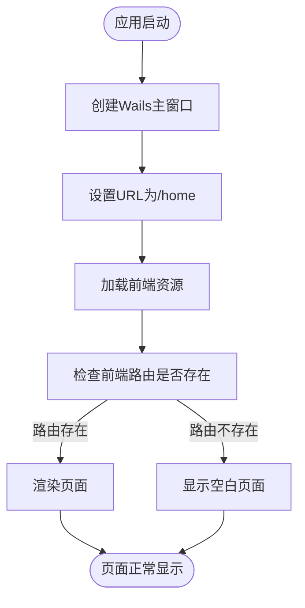
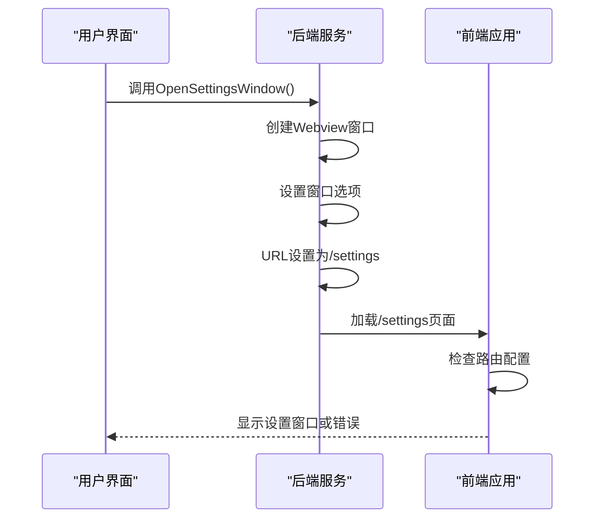
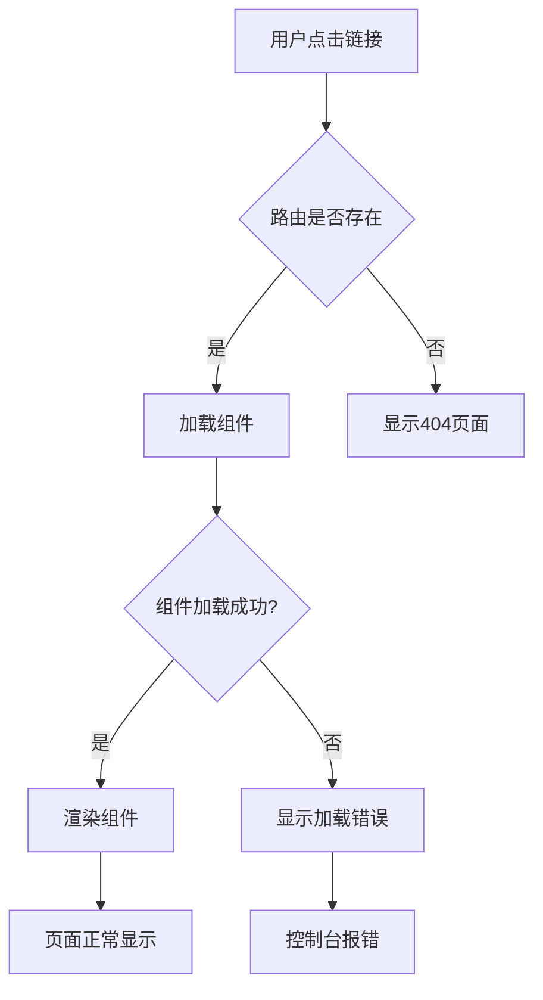
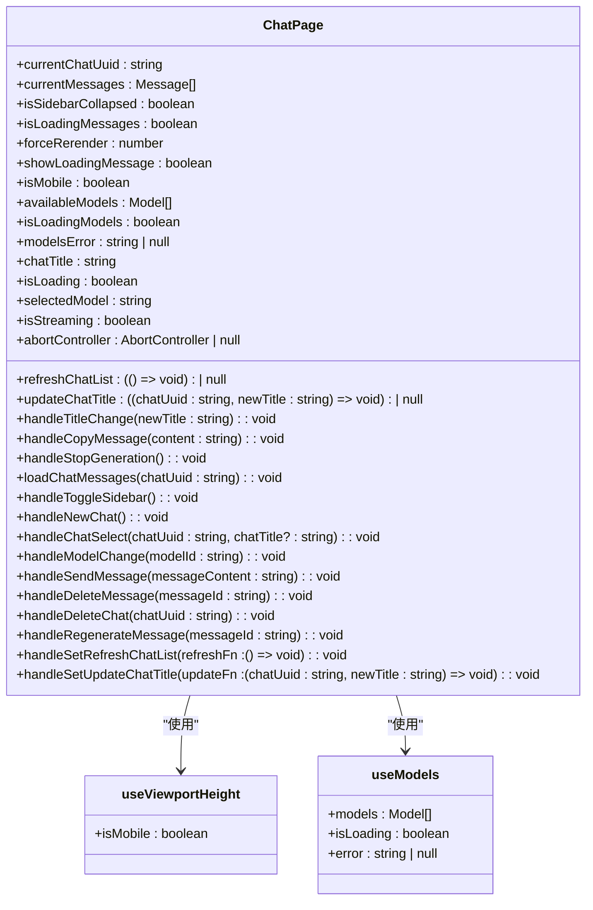
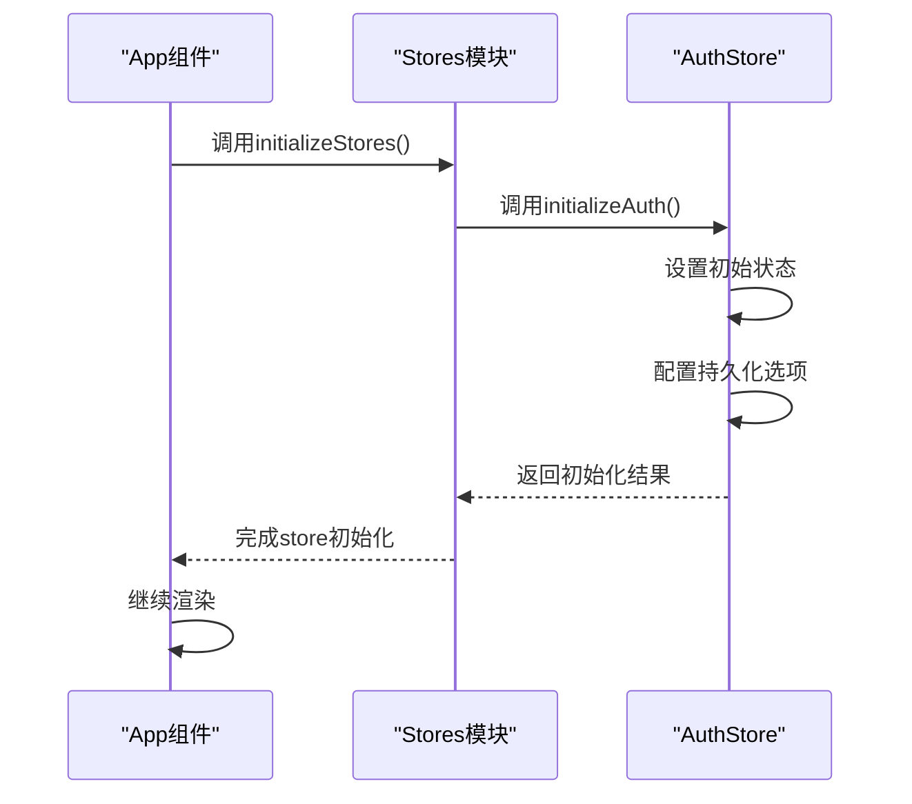
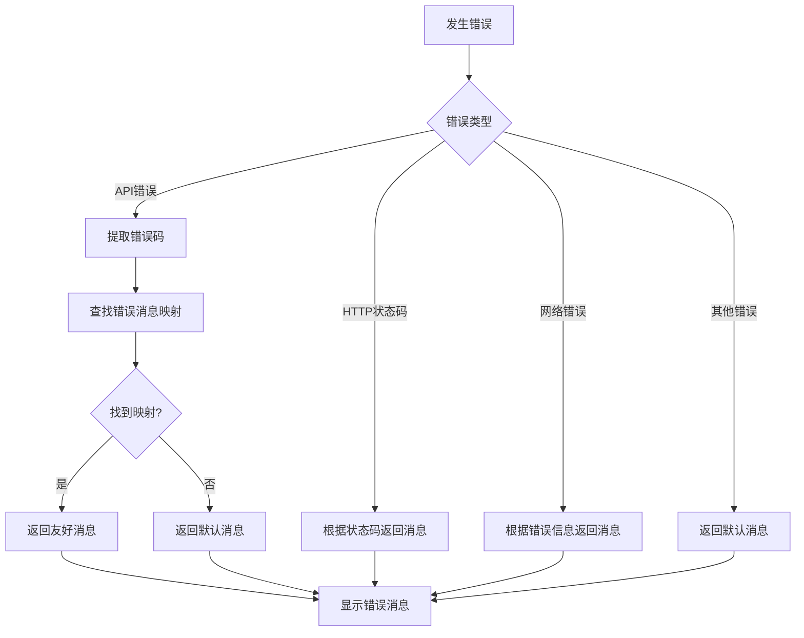

# UI显示与窗口异常

<cite>
**本文档引用的文件**   
- [main.go](file://main.go)
- [settings.go](file://backend/service/settings.go)
- [App.tsx](file://frontend/src/App.tsx)
- [main.tsx](file://frontend/src/main.tsx)
- [authStore.ts](file://frontend/src/stores/authStore.ts)
- [index.ts](file://frontend/src/stores/index.ts)
- [errorHandler.ts](file://frontend/src/utils/errorHandler.ts)
- [settings/index.tsx](file://frontend/src/pages/settings/index.tsx)
- [home/index.tsx](file://frontend/src/pages/home/index.tsx)
</cite>

## 目录
1. [问题概述](#问题概述)
2. [主窗口空白问题分析](#主窗口空白问题分析)
3. [设置窗口无法弹出问题分析](#设置窗口无法弹出问题分析)
4. [路由跳转失效问题分析](#路由跳转失效问题分析)
5. [React组件渲染报错问题分析](#react组件渲染报错问题分析)
6. [Zustand Store加载异常分析](#zustand-store加载异常分析)
7. [前端错误追踪与日志关联](#前端错误追踪与日志关联)
8. [调试工具使用指南](#调试工具使用指南)
9. [解决方案与最佳实践](#解决方案与最佳实践)

## 问题概述
本节分析前端界面无法正常显示的典型问题，包括主窗口空白、设置窗口无法弹出、路由跳转失效、React组件渲染报错等。通过分析Wails窗口配置、前端路由注册、React状态初始化、Zustand store加载等环节，定位问题根源，并提供相应的解决方案。

## 主窗口空白问题分析
主窗口空白通常是由于Wails窗口配置错误或前端应用初始化失败导致。在`main.go`中，主窗口的URL配置为`/home`，如果前端路由未正确注册该路径，将导致页面无法加载。

**Diagram sources**
- [main.go](file://main.go#L50-L55)
- [App.tsx](file://frontend/src/App.tsx#L48-L52)

**Section sources**
- [main.go](file://main.go#L50-L55)
- [App.tsx](file://frontend/src/App.tsx#L48-L52)

## 设置窗口无法弹出问题分析
设置窗口无法弹出的问题可能源于后端服务调用失败或前端路由未正确配置。`OpenSettingsWindow`方法在`settings.go`中定义，创建了一个新的Webview窗口并指向`/settings`路径。

**Diagram sources**
- [settings.go](file://backend/service/settings.go#L0-L22)
- [App.tsx](file://frontend/src/App.tsx#L78-L82)

**Section sources**
- [settings.go](file://backend/service/settings.go#L0-L22)
- [App.tsx](file://frontend/src/App.tsx#L78-L82)

## 路由跳转失效问题分析
路由跳转失效通常是因为React Router的路由配置不正确或组件懒加载失败。在`App.tsx`中，使用`React.lazy`动态导入组件，如果模块路径错误或组件不存在，将导致路由跳转失败。

**Diagram sources**
- [App.tsx](file://frontend/src/App.tsx#L15-L85)

**Section sources**
- [App.tsx](file://frontend/src/App.tsx#L15-L85)

## React组件渲染报错问题分析
React组件渲染报错可能由多种原因引起，包括状态初始化失败、props传递错误、生命周期问题等。在`home/index.tsx`中，`ChatPage`组件使用了多个Hook来管理状态和副作用。

**Diagram sources**
- [home/index.tsx](file://frontend/src/pages/home/index.tsx#L0-L415)

**Section sources**
- [home/index.tsx](file://frontend/src/pages/home/index.tsx#L0-L415)

## Zustand Store加载异常分析
Zustand store加载异常通常发生在状态初始化阶段。在`authStore.ts`中，`useAuthStore`使用`persist`中间件将状态持久化到本地存储，如果初始化失败，可能导致认证状态异常。

**Diagram sources**
- [authStore.ts](file://frontend/src/stores/authStore.ts#L0-L82)
- [index.ts](file://frontend/src/stores/index.ts#L0-L16)

**Section sources**
- [authStore.ts](file://frontend/src/stores/authStore.ts#L0-L82)
- [index.ts](file://frontend/src/stores/index.ts#L0-L16)

## 前端错误追踪与日志关联
前端运行时错误可以通过`errorHandler.ts`中的异常捕获机制进行追踪，并与Go后端日志关联分析跨层问题。`extractErrorMessage`函数负责将各种类型的错误转换为用户友好的消息。

**Diagram sources**
- [errorHandler.ts](file://frontend/src/utils/errorHandler.ts#L84-L128)

**Section sources**
- [errorHandler.ts](file://frontend/src/utils/errorHandler.ts#L84-L128)

## 调试工具使用指南
开发者应使用浏览器开发者工具查看控制台错误、网络请求状态及React组件树。重点关注以下几个方面：
- 控制台中的JavaScript错误和警告
- 网络面板中的请求状态和响应数据
- React DevTools中的组件状态和props
- Sources面板中的断点调试

**Section sources**
- [main.tsx](file://frontend/src/main.tsx#L0-L26)
- [App.tsx](file://frontend/src/App.tsx#L0-L86)

## 解决方案与最佳实践
1. 确保Wails窗口配置的URL与前端路由完全匹配
2. 使用`React.Suspense`包裹懒加载组件，并提供合适的fallback
3. 在`useEffect`中正确初始化Zustand store
4. 使用`errorHandler.ts`统一处理前端错误
5. 在开发环境中启用详细的日志输出
6. 定期检查依赖项的兼容性

**Section sources**
- [main.go](file://main.go#L50-L55)
- [App.tsx](file://frontend/src/App.tsx#L15-L85)
- [authStore.ts](file://frontend/src/stores/authStore.ts#L0-L82)
- [errorHandler.ts](file://frontend/src/utils/errorHandler.ts#L84-L128)