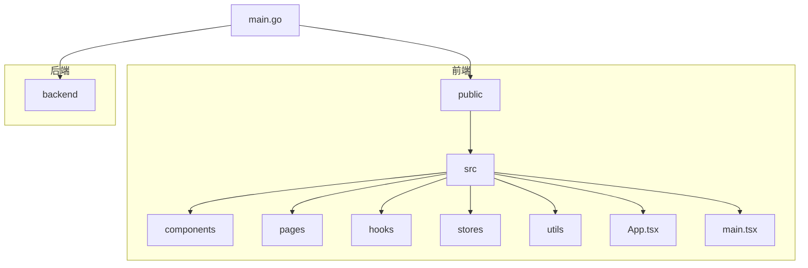
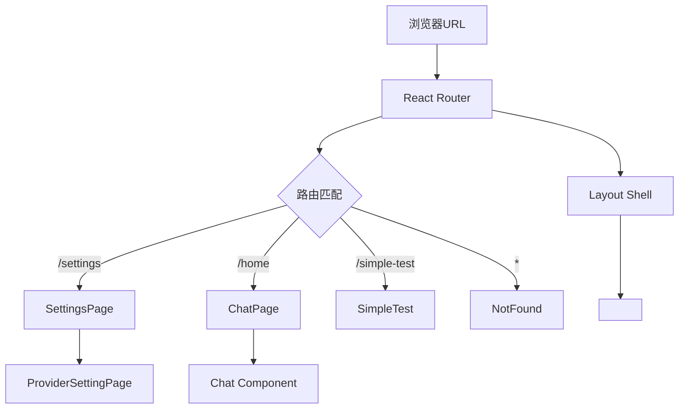
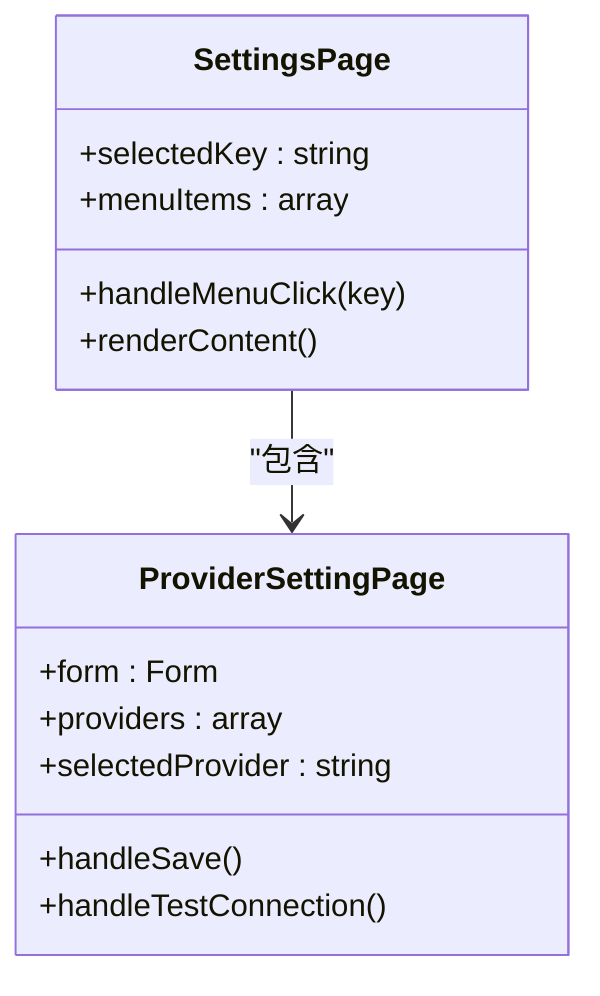
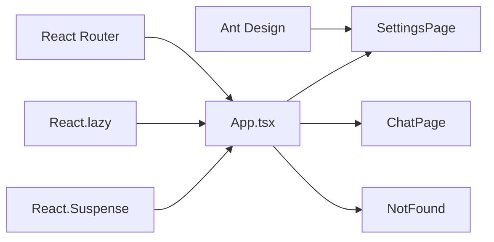

# 前端路由失效

<cite>
**本文档引用的文件**   
- [App.tsx](file://frontend/src/App.tsx)
- [settings/index.tsx](file://frontend/src/pages/settings/index.tsx)
- [home/index.tsx](file://frontend/src/pages/home/index.tsx)
- [Layout/index.tsx](file://frontend/src/components/Layout/index.tsx)
- [NotFound.tsx](file://frontend/src/pages/NotFound.tsx)
</cite>

## 目录
1. [简介](#简介)
2. [项目结构](#项目结构)
3. [核心组件](#核心组件)
4. [架构概述](#架构概述)
5. [详细组件分析](#详细组件分析)
6. [依赖分析](#依赖分析)
7. [性能考虑](#性能考虑)
8. [故障排除指南](#故障排除指南)
9. [结论](#结论)

## 简介
本文档深入探讨了基于React Router实现的前端路由系统工作机制及常见故障。重点分析当Wails窗口指向/frontend路由（如/settings）时，前端App.tsx中的路由配置如何匹配页面组件。详细说明了路由未生效的典型场景：路径大小写错误、嵌套路由未正确配置、动态导入失败、React Suspense边界处理异常等。结合settings/index.tsx的实际代码，演示路由组件的正确注册方式。指导开发者使用浏览器开发者工具检查当前激活路由、查看路由表匹配状态，并通过console.log调试路由生命周期。提供修复路由跳转失效的完整排查流程。

## 项目结构
本项目采用典型的前后端分离架构，前端部分基于React + TypeScript + Vite构建，使用Ant Design作为UI组件库。项目结构清晰地划分为`bindings`、`components`、`hooks`、`pages`、`stores`等目录，遵循模块化设计原则。



**Diagram sources**
- [App.tsx](file://frontend/src/App.tsx)
- [main.go](file://main.go)

**Section sources**
- [App.tsx](file://frontend/src/App.tsx)
- [main.go](file://main.go)

## 核心组件
前端路由系统的核心在于`App.tsx`文件中定义的`<Routes>`和`<Route>`组件。通过React Router的声明式路由配置，实现了不同URL路径与对应页面组件的映射关系。关键特性包括使用`React.lazy()`进行组件的动态导入，配合`React.Suspense`提供加载状态反馈，以及通过`<Navigate>`实现路由重定向。

**Section sources**
- [App.tsx](file://frontend/src/App.tsx#L1-L86)

## 架构概述
整个前端应用采用基于React Router的单页应用(SPA)架构。路由系统作为应用的导航中枢，负责根据URL变化渲染相应的页面组件。`App.tsx`作为根组件，定义了全局路由表，而`Layout`组件则作为包含侧边栏和头部的壳组件，通过`<Outlet>`提供内容插槽。



**Diagram sources**
- [App.tsx](file://frontend/src/App.tsx#L1-L86)
- [Layout/index.tsx](file://frontend/src/components/Layout/index.tsx#L1-L119)

## 详细组件分析

### 路由配置分析
`App.tsx`中的路由配置采用了扁平化设计，所有路由直接定义在根`<Routes>`中。特别地，`/settings`路径通过`React.lazy()`动态导入`settings/index.tsx`组件，确保按需加载。

#### 路由匹配逻辑
```mermaid
flowchart TD
A[URL变更] --> B{路径匹配}
B --> |/settings| C[加载Settings组件]
B --> |/home| D[加载Chat组件]
B --> |/simple-test| E[加载SimpleTest组件]
B --> |未匹配| F[加载NotFound组件]
C --> G[动态导入@/pages/settings]
G --> H{导入成功?}
H --> |是| I[渲染SettingsPage]
H --> |否| J[显示加载Spinner]
```

**Diagram sources**
- [App.tsx](file://frontend/src/App.tsx#L1-L86)

**Section sources**
- [App.tsx](file://frontend/src/App.tsx#L1-L86)

### Settings页面分析
`settings/index.tsx`文件定义了设置页面的UI结构，采用侧边栏菜单与内容区域的布局。该组件作为路由的目标组件，被`App.tsx`中的`/settings`路由引用。

#### 组件结构


**Diagram sources**
- [settings/index.tsx](file://frontend/src/pages/settings/index.tsx#L1-L97)
- [settings/provider/index.tsx](file://frontend/src/pages/settings/provider/index.tsx#L1-L498)

**Section sources**
- [settings/index.tsx](file://frontend/src/pages/settings/index.tsx#L1-L97)

## 依赖分析
前端路由系统的正常运行依赖于多个关键模块的协同工作。React Router提供路由匹配和导航功能，React的Suspense机制处理异步组件加载，Ant Design提供UI组件支持。



**Diagram sources**
- [App.tsx](file://frontend/src/App.tsx#L1-L86)
- [go.mod](file://frontend/package.json)

**Section sources**
- [App.tsx](file://frontend/src/App.tsx#L1-L86)
- [package.json](file://frontend/package.json)

## 性能考虑
路由系统通过代码分割和懒加载优化了初始加载性能。`React.lazy()`确保只有当用户访问特定路由时，对应的组件代码才会被加载，减少了初始bundle大小。`React.Suspense`提供的fallback机制保证了良好的用户体验，避免了页面空白。

## 故障排除指南
当遇到路由跳转失效问题时，可按照以下步骤进行排查：

1. **检查路径大小写**：确保URL路径与路由配置中的path完全匹配（区分大小写）
2. **验证路由配置**：确认`App.tsx`中已正确定义目标路由
3. **检查动态导入**：确保`import()`语句的路径正确无误
4. **调试Suspense边界**：在`React.Suspense`的fallback中添加日志，确认是否卡在加载状态
5. **使用开发者工具**：在浏览器控制台检查React组件树，确认当前激活的路由

**Section sources**
- [App.tsx](file://frontend/src/App.tsx#L1-L86)
- [NotFound.tsx](file://frontend/src/pages/NotFound.tsx#L1-L43)

## 结论
本文档详细分析了前端路由系统的工作机制和常见故障。通过理解`App.tsx`中的路由配置、`React.lazy()`的动态加载机制以及`React.Suspense`的边界处理，开发者可以有效诊断和解决路由相关问题。建议在开发过程中充分利用浏览器开发者工具进行调试，确保路由系统的稳定运行。