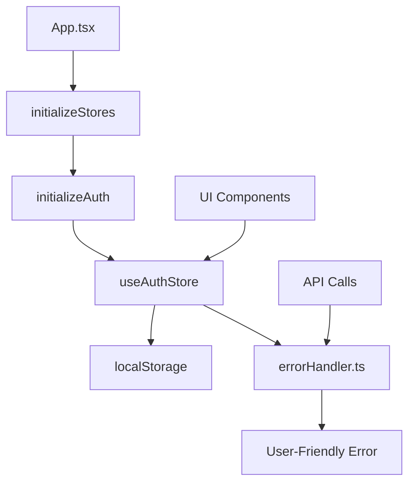
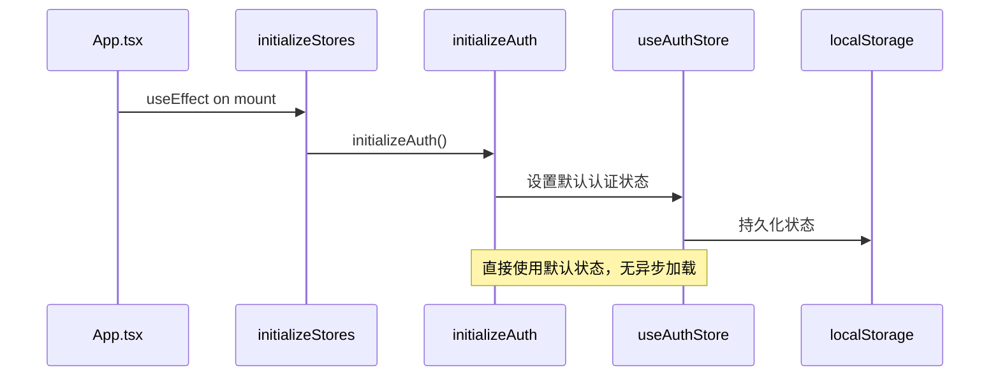
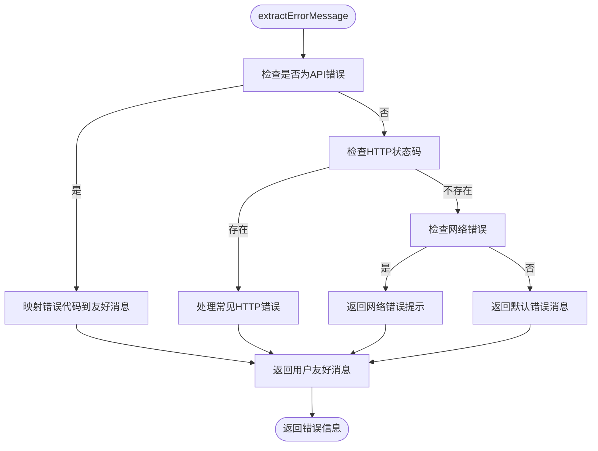
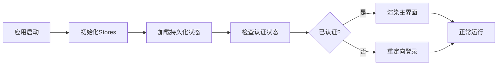
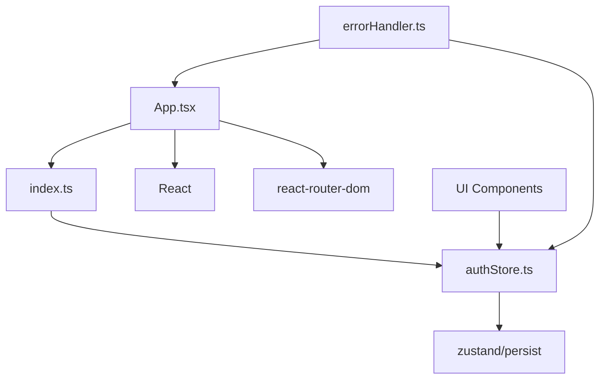

# 状态初始化失败

<cite>
**本文档引用的文件**
- [authStore.ts](file://frontend/src/stores/authStore.ts)
- [errorHandler.ts](file://frontend/src/utils/errorHandler.ts)
- [App.tsx](file://frontend/src/App.tsx)
- [index.ts](file://frontend/src/stores/index.ts)
</cite>

## 目录
1. [简介](#简介)
2. [项目结构](#项目结构)
3. [核心组件](#核心组件)
4. [架构概览](#架构概览)
5. [详细组件分析](#详细组件分析)
6. [依赖分析](#依赖分析)
7. [性能考虑](#性能考虑)
8. [故障排除指南](#故障排除指南)
9. [结论](#结论)

## 简介
本文档系统性地分析React组件渲染失败与状态管理初始化异常之间的关系，重点关注Zustand状态存储（如`authStore.ts`）在应用启动时的数据加载逻辑。文档详细说明了持久化存储失效、初始状态未正确设置导致UI渲染为空白的场景，并结合`errorHandler.ts`中的错误捕获机制，展示如何拦截状态初始化过程中的异常并输出可读性错误信息。同时提供调试方案和最佳实践建议，帮助开发者避免常见问题。

## 项目结构
项目采用前后端分离架构，前端基于React + Zustand + TypeScript构建，后端使用Go语言。前端代码位于`frontend`目录，核心状态管理逻辑集中在`src/stores`中，UI组件分布在`src/components`和`src/pages`中，工具函数位于`src/utils`。

**Section sources**
- [main.go](file://main.go)
- [go.mod](file://go.mod#L1-L10)

## 核心组件

`authStore.ts`定义了用户认证状态的Zustand store，包含用户信息、认证令牌、认证状态、加载状态和错误信息。通过`persist`中间件实现状态持久化至`localStorage`，确保刷新后状态不丢失。`initializeAuth`函数用于初始化认证状态，默认使用预设的演示数据直接进入已认证状态。

`errorHandler.ts`提供了统一的错误处理机制，将后端返回的错误代码映射为用户友好的中文提示，并处理网络异常、HTTP状态码等常见错误场景，确保前端展示的错误信息具有可读性。

**Section sources**
- [authStore.ts](file://frontend/src/stores/authStore.ts#L1-L82)
- [errorHandler.ts](file://frontend/src/utils/errorHandler.ts#L1-L179)

## 架构概览

**Diagram sources**
- [App.tsx](file://frontend/src/App.tsx#L1-L86)
- [index.ts](file://frontend/src/stores/index.ts#L1-L16)
- [authStore.ts](file://frontend/src/stores/authStore.ts#L1-L82)
- [errorHandler.ts](file://frontend/src/utils/errorHandler.ts#L1-L179)

## 详细组件分析

### 认证状态管理分析

`useAuthStore`使用Zustand的`create`和`persist`创建持久化状态存储。初始状态直接设置为已认证，并包含演示用户数据。`partialize`配置确保只有`user`、`token`和`isAuthenticated`字段被持久化。

`initializeAuth`函数在应用启动时被调用，目前仅输出日志，未进行实际异步数据加载或验证，这可能导致状态与后端实际状态不一致。

#### 状态初始化流程

**Diagram sources**
- [App.tsx](file://frontend/src/App.tsx#L1-L86)
- [index.ts](file://frontend/src/stores/index.ts#L1-L16)
- [authStore.ts](file://frontend/src/stores/authStore.ts#L1-L82)

#### 错误处理机制

**Diagram sources**
- [errorHandler.ts](file://frontend/src/utils/errorHandler.ts#L1-L179)

**Section sources**
- [authStore.ts](file://frontend/src/stores/authStore.ts#L1-L82)
- [errorHandler.ts](file://frontend/src/utils/errorHandler.ts#L1-L179)

### 概念性概述

## 依赖分析

**Diagram sources**
- [App.tsx](file://frontend/src/App.tsx#L1-L86)
- [index.ts](file://frontend/src/stores/index.ts#L1-L16)
- [authStore.ts](file://frontend/src/stores/authStore.ts#L1-L82)
- [errorHandler.ts](file://frontend/src/utils/errorHandler.ts#L1-L179)

**Section sources**
- [App.tsx](file://frontend/src/App.tsx#L1-L86)
- [index.ts](file://frontend/src/stores/index.ts#L1-L16)

## 性能考虑
当前状态初始化为同步操作，无异步阻塞，启动速度快。但因未进行真实数据验证，可能存在状态不一致风险。建议在初始化时添加轻量级健康检查，避免后续请求因认证失效而频繁失败。

## 故障排除指南

当出现UI渲染空白时，应按以下步骤排查：

1. 检查`localStorage`中`auth-storage`键值，确认持久化状态是否存在且格式正确。
2. 查看控制台日志，确认`Auth initialized with demo state`是否输出。
3. 验证`useAuthStore`返回的状态是否包含预期的`user`和`token`。
4. 检查网络请求，确认是否有因认证失败导致的401错误。

**Section sources**
- [authStore.ts](file://frontend/src/stores/authStore.ts#L1-L82)
- [errorHandler.ts](file://frontend/src/utils/errorHandler.ts#L1-L179)

## 结论
当前状态初始化机制简单高效，但缺乏对真实认证状态的验证，可能导致UI与后端状态不一致。建议在`initializeAuth`中添加异步验证逻辑，并结合`isLoading`状态避免空白UI。同时，应完善错误处理，确保状态初始化失败时能正确捕获并提示用户。