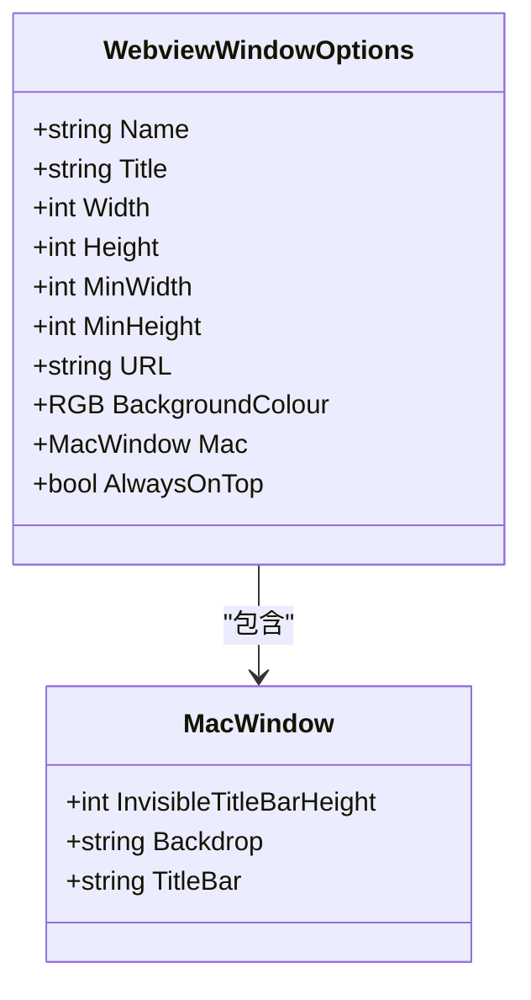
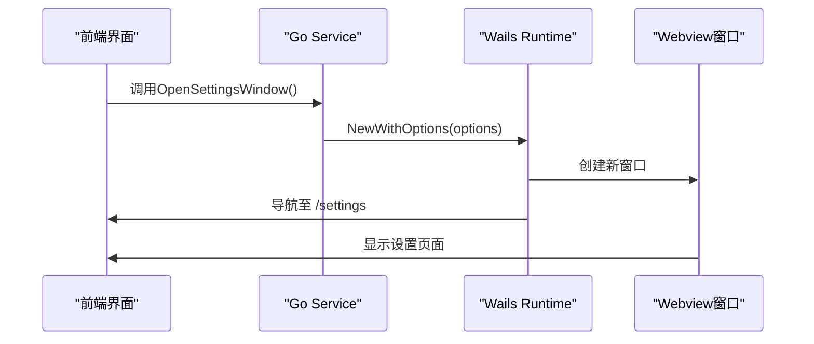

# 窗口配置异常

<cite>
**本文档引用的文件**  
- [main.go](file://main.go)
- [backend/service/settings.go](file://backend/service/settings.go)
- [frontend/src/pages/settings/index.tsx](file://frontend/src/pages/settings/index.tsx)
- [frontend/src/pages/home/index.tsx](file://frontend/src/pages/home/index.tsx)
</cite>

## 目录
1. [简介](#简介)
2. [项目结构](#项目结构)
3. [核心组件](#核心组件)
4. [架构概览](#架构概览)
5. [详细组件分析](#详细组件分析)
6. [依赖分析](#依赖分析)
7. [性能考虑](#性能考虑)
8. [故障排除指南](#故障排除指南)
9. [结论](#结论)

## 简介
本文档旨在深入分析基于 Wails 框架构建的桌面应用中主窗口与设置窗口的创建与配置问题。重点解析 `WebviewWindowOptions` 的各项参数含义，结合 `main.go` 和 `settings.go` 中的实现代码，探讨窗口无法弹出或显示异常的潜在原因，并提供调试建议和最佳实践。

## 项目结构
本项目采用前后端分离架构，前端使用 React + Vite 构建，后端使用 Go 语言并基于 Wails 框架实现桌面集成。主窗口和设置窗口分别通过不同的路由加载前端页面。

**Section sources**
- [main.go](file://main.go#L1-L60)
- [frontend/src/pages/home/index.tsx](file://frontend/src/pages/home/index.tsx#L1-L415)
- [frontend/src/pages/settings/index.tsx](file://frontend/src/pages/settings/index.tsx#L1-L98)

## 核心组件
核心组件包括主窗口（Home）和设置窗口（Settings），分别由 `main.go` 初始化和 `settings.go` 中的方法动态创建。两者均使用 `WebviewWindowOptions` 配置窗口行为和外观。

**Section sources**
- [main.go](file://main.go#L25-L50)
- [backend/service/settings.go](file://backend/service/settings.go#L5-L23)

## 架构概览
系统通过 Wails 框架将 Go 后端服务与 React 前端 UI 集成，使用嵌入式文件系统提供静态资源。主窗口在应用启动时创建，设置窗口通过服务方法按需打开。

```mermaid
graph TB
subgraph "Backend"
A[main.go] --> B[Service]
B --> C[OpenSettingsWindow]
end
subgraph "Frontend"
D[/home] --> E[Home Page]
F[/settings] --> G[Settings Page]
end
A --> H[Wails Runtime]
H < --> D
H < --> F
C --> F
```

**Diagram sources**
- [main.go](file://main.go#L1-L60)
- [backend/service/settings.go](file://backend/service/settings.go#L5-L23)

## 详细组件分析

### 主窗口初始化分析
主窗口在 `main.go` 中通过 `app.Window.NewWithOptions` 创建，配置了名称、标题、尺寸、背景色及初始 URL。

#### WebviewWindowOptions 参数说明


**Diagram sources**
- [main.go](file://main.go#L35-L50)

**Section sources**
- [main.go](file://main.go#L35-L50)

#### 参数含义解析
- **Name**: 窗口唯一标识符，用于内部引用。主窗口为 `"Home"`，设置窗口为 `"Settings"`。
- **URL**: 加载的前端路由路径。必须与前端路由注册路径一致，如 `/home` 和 `/settings`。
- **尺寸参数 (Width/Height/MinWidth/MinHeight)**: 定义窗口初始及最小尺寸。
- **BackgroundColour**: 使用 `application.NewRGB(r, g, b)` 设置背景色，当前为深蓝灰色。
- **Mac 特定设置**:
  - `Backdrop`: 设置为 `application.MacBackdropTranslucent` 实现毛玻璃效果。
  - `InvisibleTitleBarHeight`: 隐藏标题栏高度，用于自定义标题栏布局。
- **AlwaysOnTop**: 设置为 `true` 可使设置窗口始终置顶。

### 设置窗口创建流程分析
设置窗口通过服务方法 `OpenSettingsWindow` 动态创建，其逻辑位于 `backend/service/settings.go`。



**Diagram sources**
- [backend/service/settings.go](file://backend/service/settings.go#L5-L23)
- [frontend/src/pages/settings/index.tsx](file://frontend/src/pages/settings/index.tsx#L1-L98)

**Section sources**
- [backend/service/settings.go](file://backend/service/settings.go#L5-L23)

## 依赖分析
窗口功能依赖于前后端正确协同：Go 后端负责窗口生命周期管理，前端 React 路由负责页面渲染。

```mermaid
graph TD
A[main.go] --> |创建| B[主窗口]
C[settings.go] --> |创建| D[设置窗口]
B --> |加载| E[/home]
D --> |加载| F[/settings]
E --> G[Home Page]
F --> H[Settings Page]
```

**Diagram sources**
- [main.go](file://main.go#L35-L50)
- [backend/service/settings.go](file://backend/service/settings.go#L5-L23)

**Section sources**
- [main.go](file://main.go#L1-L60)
- [backend/service/settings.go](file://backend/service/settings.go#L1-L24)

## 故障排除指南
当窗口无法弹出或显示异常时，应从以下方面排查：

### 常见问题与调试建议
| 问题类型 | 可能原因 | 调试方法 |
|--------|--------|--------|
| 窗口无法打开 | 窗口名称重复 | 检查 `Name` 是否唯一 |
| 页面空白或404 | URL 路由未注册 | 确认前端路由 `/settings` 是否存在并正确注册 |
| 窗口样式异常 | Mac 特定配置错误 | 检查 `Backdrop`、`TitleBar` 是否支持当前系统 |
| 窗口不响应 | 事件循环阻塞 | 确保 `app.Run()` 正常执行，无 panic |
| 背景色不生效 | RGB 值错误或渲染延迟 | 验证 `BackgroundColour` 设置并检查前端 CSS 冲突 |

### 验证步骤
1. **检查窗口名称唯一性**：确保每个窗口的 `Name` 字段不重复。
2. **验证前端路由**：确认 `/settings` 和 `/home` 在前端路由配置中已注册。
3. **确认事件循环运行**：确保 `app.Run()` 被调用且未提前退出。
4. **日志输出调试**：在 `OpenSettingsWindow` 中添加日志，确认方法被调用。

**Section sources**
- [main.go](file://main.go#L55-L59)
- [backend/service/settings.go](file://backend/service/settings.go#L5-L23)

## 结论
正确配置 Wails 多窗口应用需确保：
- 窗口 `Name` 唯一
- `URL` 与前端路由精确匹配
- 跨平台设置（如 Mac 的 `Backdrop`）兼容当前环境
- 事件循环正常运行以支持窗口展示

通过合理使用 `WebviewWindowOptions` 并结合前后端协同调试，可有效避免窗口创建与显示异常。