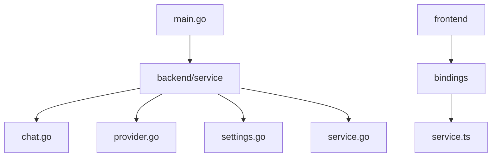
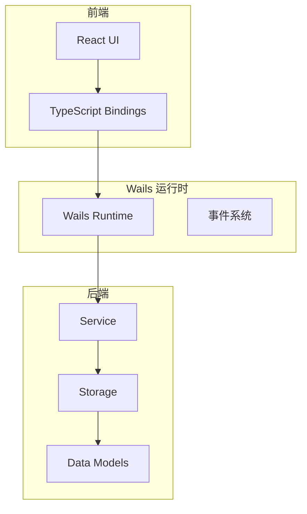
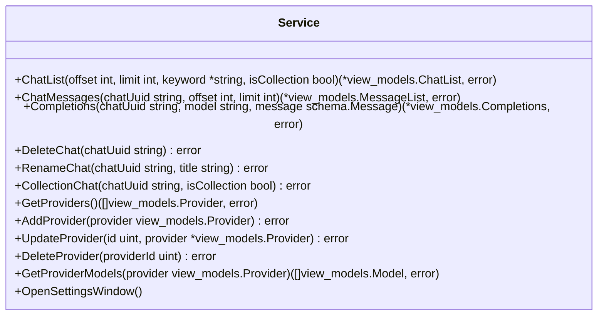
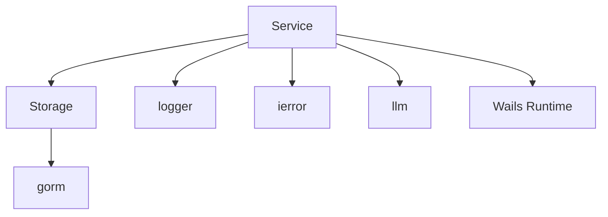

# RPC方法注册异常

<cite>
**本文档引用文件**  
- [main.go](file://main.go)
- [backend/service/service.go](file://backend/service/service.go)
- [backend/service/chat.go](file://backend/service/chat.go)
- [backend/service/provider.go](file://backend/service/provider.go)
- [backend/service/settings.go](file://backend/service/settings.go)
</cite>

## 目录
1. [简介](#简介)
2. [项目结构](#项目结构)
3. [核心组件](#核心组件)
4. [架构概述](#架构概述)
5. [详细组件分析](#详细组件分析)
6. [依赖分析](#依赖分析)
7. [性能考虑](#性能考虑)
8. [故障排查指南](#故障排查指南)
9. [结论](#结论)

## 简介
本文档详细分析Wails框架中RPC方法未正确注册导致的调用失败问题。重点说明在`main.go`中通过`app.RegisterService`机制注入服务实例的原理，强调`NewService()`构造函数的正确实现方式以及导出方法的命名规范（必须首字母大写）。同时提供验证服务注册是否生效的调试方法，并结合代码示例展示常见错误及其修复方案。

## 项目结构
本项目采用前后端分离架构，后端使用Go语言结合Wails框架构建桌面应用逻辑，前端使用TypeScript和React实现UI界面。核心业务逻辑和服务注册位于`backend/service`目录下，入口文件为`main.go`。



**图示来源**  
- [main.go](file://main.go#L1-L60)
- [backend/service/service.go](file://backend/service/service.go#L1-L30)

**本节来源**  
- [main.go](file://main.go#L1-L60)
- [backend/service/service.go](file://backend/service/service.go#L1-L30)

## 核心组件
核心组件包括服务注册入口`main.go`、服务结构体定义`Service`、以及多个功能模块如聊天管理、模型提供者管理、设置窗口打开等。所有RPC方法均通过Wails的服务机制暴露给前端调用。

**本节来源**  
- [main.go](file://main.go#L15-L30)
- [backend/service/service.go](file://backend/service/service.go#L10-L20)
- [backend/service/chat.go](file://backend/service/chat.go#L10-L20)
- [backend/service/provider.go](file://backend/service/provider.go#L10-L20)

## 架构概述
系统基于Wails v3框架构建，采用服务注册模式将Go后端功能暴露为前端可调用的RPC接口。服务通过`application.NewService()`包装并注册到应用实例中，运行时由Wails运行时环境管理生命周期和方法调用。



**图示来源**  
- [main.go](file://main.go#L15-L30)
- [backend/service/service.go](file://backend/service/service.go#L10-L20)

## 详细组件分析

### 服务注册机制分析
Wails通过`application.NewService()`接收一个服务实例指针，并自动扫描其所有**首字母大写的导出方法**作为可调用的RPC端点。服务实例必须通过`NewService()`工厂函数正确构造。

#### 服务构造函数
```go
func NewService() *Service {
	return &Service{}
}
```

该构造函数返回`*Service`指针，确保后续方法绑定到同一实例。



**图示来源**  
- [backend/service/chat.go](file://backend/service/chat.go#L10-L200)
- [backend/service/provider.go](file://backend/service/provider.go#L10-L140)
- [backend/service/settings.go](file://backend/service/settings.go#L5-L20)

#### 服务启动流程
`ServiceStartup`方法在服务初始化时被调用，用于注入依赖如数据库存储实例和应用上下文。

```go
func (s *Service) ServiceStartup(ctx context.Context, options application.ServiceOptions) error {
	istorage, err := storage.NewStorage()
	if err != nil {
		return err
	}
	s.storage = istorage
	s.app = application.Get()
	return nil
}
```

此方法确保服务在调用前已完成依赖注入。

**本节来源**  
- [backend/service/service.go](file://backend/service/service.go#L18-L30)
- [backend/service/chat.go](file://backend/service/chat.go#L10-L200)

### 常见错误与修复方案

#### 错误1：方法未导出（首字母小写）
若方法名以小写字母开头，则不会被Wails识别为RPC方法。

**错误示例**：
```go
func (s *Service) getProviders() // ❌ 不会被注册
```

**修复方案**：改为大写首字母
```go
func (s *Service) GetProviders() // ✅ 正确导出
```

#### 错误2：结构体未实例化
直接传递类型而非实例会导致注册失败。

**错误示例**：
```go
Services: []application.Service{
    application.NewService(Service{}), // ❌ 值拷贝，非指针
}
```

**修复方案**：使用指针或工厂函数
```go
Services: []application.Service{
    application.NewService(NewService()), // ✅ 正确实例化
}
```

#### 错误3：依赖注入顺序错误
在`ServiceStartup`之前调用`storage`或`app`会导致nil指针异常。

**错误示例**：
```go
func (s *Service) SomeMethod() {
    s.storage.Query() // ❌ 可能为nil
}
```

**修复方案**：确保在`ServiceStartup`完成后才使用依赖。

**本节来源**  
- [backend/service/service.go](file://backend/service/service.go#L18-L30)
- [backend/service/chat.go](file://backend/service/chat.go#L10-L200)
- [backend/service/provider.go](file://backend/service/provider.go#L10-L140)

## 依赖分析
服务组件依赖于存储层（storage）、数据模型（models）和工具包（utils），并通过Wails运行时与前端通信。



**图示来源**  
- [backend/service/service.go](file://backend/service/service.go#L1-L30)
- [backend/service/chat.go](file://backend/service/chat.go#L1-L20)
- [backend/service/provider.go](file://backend/service/provider.go#L1-L20)

**本节来源**  
- [backend/service/service.go](file://backend/service/service.go#L1-L30)
- [backend/service/chat.go](file://backend/service/chat.go#L1-L20)
- [backend/service/provider.go](file://backend/service/provider.go#L1-L20)

## 性能考虑
无具体性能问题分析，因本主题聚焦于服务注册机制。

## 故障排查指南
当RPC调用失败时，应按以下步骤排查：

1. **确认方法是否导出**：检查方法名是否首字母大写。
2. **验证服务是否正确注册**：在`main.go`中确认`NewService()`被正确调用。
3. **检查`ServiceStartup`执行情况**：添加日志输出验证依赖是否成功注入。
4. **查看Wails运行时服务注册表**：可通过调试模式输出已注册服务列表。
5. **前端绑定生成是否正常**：检查`frontend/bindings`中生成的TypeScript文件是否包含对应方法。

**本节来源**  
- [main.go](file://main.go#L15-L30)
- [backend/service/service.go](file://backend/service/service.go#L18-L30)
- [backend/service/chat.go](file://backend/service/chat.go#L10-L200)

## 结论
Wails的RPC服务注册机制依赖于正确的服务实例化和导出方法命名规范。开发者必须确保：
- 使用`NewService()`返回`*Service`指针；
- 所有需暴露的方法名首字母大写；
- 依赖在`ServiceStartup`中完成注入；
- 避免在初始化完成前访问未初始化字段。

遵循上述原则可有效避免RPC调用失败问题。