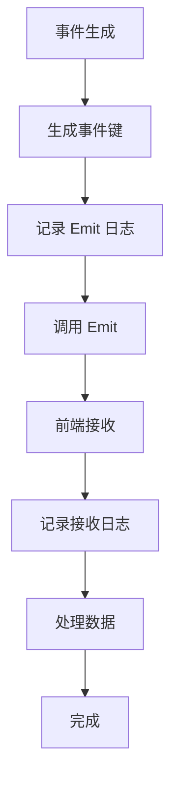

# 事件驱动通信异常

<cite>
**本文档引用文件**  
- [chat.go](file://backend/models/data_models/chat.go)
- [events.go](file://backend/utils/events.go)
- [events.ts](file://frontend/src/utils/events.ts)
- [logger.go](file://backend/pkg/logger/logger.go)
</cite>

## 目录
1. [简介](#简介)
2. [事件通信机制概述](#事件通信机制概述)
3. [典型问题分析](#典型问题分析)
4. [事件键生成与生命周期管理](#事件键生成与生命周期管理)
5. [前端事件监听风险](#前端事件监听风险)
6. [完整的事件调试策略](#完整的事件调试策略)
7. [结论](#结论)

## 简介
本文档旨在深入分析基于 `app.Event.Emit` 和前端事件监听的异步通信模式中存在的典型问题，包括事件未触发、监听丢失、事件键冲突等。通过 `chat.go` 中使用 `utils.GenEventsKey(messageUuid)` 生成唯一事件键并推送消息流的实例，说明事件生命周期管理的重要性。同时，探讨前端未正确绑定或解绑事件监听器可能导致的内存泄漏风险，并提供一套完整的事件调试策略。

## 事件通信机制概述
系统采用事件驱动架构实现前后端异步通信。后端通过 `app.Event.Emit(key, data)` 发送事件，前端通过统一的事件总线机制监听特定键的事件流。该机制广泛应用于实时消息推送、状态更新等场景。

```mermaid
graph TB
Backend[后端服务] --> |Emit(key, data)| EventBus[事件总线]
EventBus --> |on(key, callback)| Frontend[前端监听器]
```

**Diagram sources**  
- [events.go](file://backend/utils/events.go#L3-L6)
- [events.ts](file://frontend/src/utils/events.ts#L1-L3)

## 典型问题分析

### 事件未触发
当 `Emit` 调用未能成功广播事件时，前端将无法接收到数据。常见原因包括：
- 事件键生成逻辑错误导致键不匹配
- `Emit` 调用路径被异常中断
- 事件总线未正确初始化

### 监听丢失
前端监听器注册失败或在组件卸载后未正确清理，会导致后续事件无法被捕获。特别是在 SPA 应用中，路由切换可能导致监听器失效。

### 事件键冲突
若事件键生成算法不具备唯一性或可预测性，可能导致不同消息共用同一键，引发数据覆盖或错乱。

**Section sources**  
- [chat.go](file://backend/models/data_models/chat.go#L1-L63)
- [events.go](file://backend/utils/events.go#L3-L6)

## 事件键生成与生命周期管理
在 `chat.go` 中，消息事件通过 `utils.GenEventsKey(messageUuid)` 生成唯一键，确保每条消息对应独立的事件通道。该机制保障了消息流的隔离性和可追踪性。

```go
key := utils.GenEventsKey(messageUuid)
app.Event.Emit(key, messageStream)
```

事件生命周期应包含明确的开始（Emit）、传输（监听）、结束（解绑）三个阶段。缺少任一环节的管理都可能导致通信异常或资源泄漏。

**Section sources**  
- [chat.go](file://backend/models/data_models/chat.go#L1-L63)
- [events.go](file://backend/utils/events.go#L3-L6)

## 前端事件监听风险
前端若未在组件卸载时调用 `off` 方法解绑事件监听器，将导致：
- 内存泄漏：监听器及其闭包无法被垃圾回收
- 重复响应：同一事件被多个残留监听器处理
- 状态错乱：已销毁组件仍尝试更新 UI

建议使用 React 的 `useEffect` 钩子进行监听器的绑定与解绑：

```ts
useEffect(() => {
  const key = GenEventsKey(uuid);
  app.Event.on(key, handleMessage);
  return () => app.Event.off(key, handleMessage);
}, [uuid]);
```

**Section sources**  
- [events.ts](file://frontend/src/utils/events.ts#L1-L3)

## 完整的事件调试策略

### 后端验证
在 `Emit` 调用前后添加日志，确认事件是否成功发出：

```go
logger.Infof("准备发送事件，键: %s", key)
app.Event.Emit(key, data)
logger.Infof("事件已发送，键: %s", key)
```

### 前端验证
确保 `on/off` 机制成对出现，避免遗漏解绑逻辑。可通过全局事件监听器统计注册/注销次数进行校验。

### 日志追踪
利用 `logger.go` 提供的结构化日志功能，记录事件流转全过程，包含时间戳、事件键、数据摘要等信息，便于问题回溯。



**Diagram sources**  
- [events.go](file://backend/utils/events.go#L3-L6)
- [logger.go](file://backend/pkg/logger/logger.go#L50-L100)

**Section sources**  
- [logger.go](file://backend/pkg/logger/logger.go#L1-L163)
- [events.ts](file://frontend/src/utils/events.ts#L1-L3)

## 结论
基于事件的异步通信模式虽提升了系统的响应性与解耦程度，但也引入了事件管理复杂性。必须严格规范事件键生成、确保监听器生命周期完整，并通过日志系统实现端到端的可观察性，才能有效规避通信异常与资源泄漏风险。