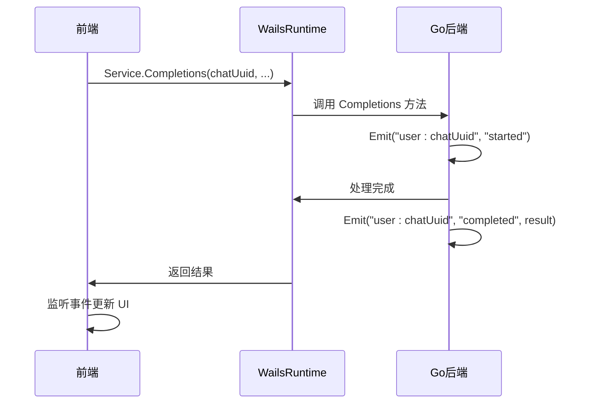

# 前后端通信异常

<cite>
**本文档引用的文件**  
- [main.go](file://main.go)
- [service/service.go](file://backend/service/service.go)
- [service/service.ts](file://frontend/bindings/gitlab.linhf.cn/project/lemontea/lemon_tea_desktop/backend/service/service.ts)
- [logger/logger.go](file://backend/pkg/logger/logger.go)
- [utils/events.go](file://backend/utils/events.go)
- [utils/completions.ts](file://frontend/src/utils/completions.ts)
</cite>

## 目录
1. [典型表现](#典型表现)
2. [根本原因分析](#根本原因分析)
3. [调试路径](#调试路径)
4. [事件监听与通信反馈](#事件监听与通信反馈)
5. [降级机制设计](#降级机制设计)

## 典型表现

Wails 框架中前后端通过 RPC 实现 Go 与前端（如 React）之间的方法调用。当通信异常发生时，通常表现为以下几种形式：

- **方法调用无响应**：前端调用 `Service.Completions()` 等绑定方法后，无任何返回或回调触发。
- **返回空值或 null**：RPC 调用成功返回，但数据体为 `null` 或空对象，例如 `Completions(chatUuid, model, message)` 返回 `null`。
- **抛出 'unknown method' 异常**：控制台报错 `unknown method: Completions`，表示前端请求的方法在后端未注册。
- **Promise 永久挂起**：前端使用 `await Service.Completions(...)` 时，Promise 不 resolve 也不 reject，导致界面卡死。
- **错误未被捕获**：虽有异常，但未进入 `.catch()` 或 `try-catch` 块，前端无提示。

这些现象通常源于 RPC 注册、类型匹配或异步处理问题。

**Section sources**
- [service/service.ts](file://frontend/bindings/gitlab.linhf.cn/project/lemontea/lemon_tea_desktop/backend/service/service.ts#L0-L125)
- [utils/completions.ts](file://frontend/src/utils/completions.ts#L0-L101)

## 根本原因分析

### 1. 服务未正确注册
在 `main.go` 中，必须通过 `application.NewService()` 将服务实例注册到 Wails 应用中。若服务未注册或注册失败，所有方法调用均会返回 `unknown method`。

```go
app := application.New(application.Options{
    Services: []application.Service{
        application.NewService(service.NewService()), // 必须正确注册
    },
})
```

**Section sources**
- [main.go](file://main.go#L15-L20)

### 2. Go 方法未导出
Wails 仅能暴露首字母大写的导出方法（即 public 方法）。若方法为小写（如 `completions()`），则无法通过 RPC 调用。

```go
func (s *Service) Completions(...) { ... } // 正确：首字母大写
func (s *Service) completions(...) { ... } // 错误：无法被调用
```

**Section sources**
- [service/service.go](file://backend/service/service.go#L0-L30)

### 3. 参数类型不匹配
前端传递的参数类型必须与 Go 方法签名严格一致。例如：
- 前端传递 `string | null`，但 Go 接收 `string` 类型，可能导致 panic。
- 结构体字段名大小写不匹配（Go 的 `UUID` vs 前端的 `uuid`）导致反序列化失败。

绑定文件 `service.ts` 中的类型由 Wails 自动生成，需确保前后端模型一致。

**Section sources**
- [service/service.ts](file://frontend/bindings/gitlab.linhf.cn/project/lemontea/lemon_tea_desktop/backend/service/service.ts#L50-L60)
- [service/service.go](file://backend/service/service.go#L0-L30)

### 4. 异步处理未返回
若 Go 方法为异步操作（如数据库查询、网络请求），但未正确返回结果或未处理 context 取消，会导致前端调用永久挂起。

```go
func (s *Service) Completions(ctx context.Context, ...) {
    // 必须确保在协程中正确返回，或监听 ctx.Done()
}
```

**Section sources**
- [service/service.go](file://backend/service/service.go#L0-L30)

## 调试路径

### 1. 前端调用栈追踪
从前端调用入口开始，检查是否正确调用绑定方法：

```ts
const resp: Completions | null = await Service.Completions(chatUuid, selectedModel, userMessage);
```

- 检查 `Service` 是否已正确导入。
- 使用浏览器开发者工具查看网络/控制台，确认是否发出 RPC 调用。
- 捕获异常并输出详细错误：

```ts
try {
    const resp = await Service.Completions(...);
} catch (error) {
    console.error('RPC 调用失败:', error);
}
```

**Section sources**
- [utils/completions.ts](file://frontend/src/utils/completions.ts#L34-L64)

### 2. 后端日志记录入参与返回值
利用 `pkg/logger` 记录方法入参和返回值，定位执行流程：

```go
func (s *Service) Completions(chatUuid string, model string, message schema.Message) (*Completions, error) {
    logger.Infof("Completions called with chatUuid=%s, model=%s", chatUuid, model)
    defer logger.Infof("Completions finished for chatUuid=%s", chatUuid)

    // 业务逻辑...
    return result, nil
}
```

若日志未输出，说明方法未被调用，问题出在注册或路由层。

**Section sources**
- [logger/logger.go](file://backend/pkg/logger/logger.go#L0-L162)
- [service/service.go](file://backend/service/service.go#L0-L30)

### 3. 验证 RPC 方法签名合规性
- 确保方法为结构体方法且首字母大写。
- 确保参数和返回值为可序列化类型。
- 检查 `wails generate` 是否重新生成了绑定文件，确保 `service.ts` 与 Go 代码同步。

```bash
wails3 generate
```

**Section sources**
- [service/service.go](file://backend/service/service.go#L0-L30)
- [service/service.ts](file://frontend/bindings/gitlab.linhf.cn/project/lemontea/lemon_tea_desktop/backend/service/service.ts#L0-L125)

## 事件监听与通信反馈

当 RPC 调用存在延迟或需实时状态反馈时，可通过事件机制补充通信：

```go
func (s *Service) Completions(chatUuid string, ...) {
    s.app.Event.Emit(GenEventsKey(chatUuid), "started")
    // 处理中...
    s.app.Event.Emit(GenEventsKey(chatUuid), "completed", result)
}
```

前端监听事件：

```ts
import { Events } from '@wailsio/runtime';
import { GenEventsKey } from "@/utils/events.ts";

Events.On(GenEventsKey(chatUuid), (status, data) => {
    console.log('后端状态:', status, data);
});
```

此机制可有效弥补 RPC 无状态的缺陷，提升用户体验。



**Diagram sources**
- [service/service.go](file://backend/service/service.go#L0-L30)
- [utils/events.go](file://backend/utils/events.go#L0-L7)
- [utils/completions.ts](file://frontend/src/utils/completions.ts#L0-L101)

**Section sources**
- [utils/events.go](file://backend/utils/events.go#L0-L7)
- [utils/completions.ts](file://frontend/src/utils/completions.ts#L0-L101)

## 降级机制设计

为提升应用健壮性，应设计 RPC 失败时的降级策略：

1. **超时控制**：前端设置调用超时，避免永久挂起。
2. **错误兜底**：捕获异常并显示友好提示，如“服务暂时不可用，请稍后重试”。
3. **本地缓存**：对可缓存数据（如模型列表），在 RPC 失败时返回本地缓存版本。
4. **重试机制**：对临时性错误（如网络抖动），实现指数退避重试。

```ts
async function CompletionsWithRetry(...) {
    let retries = 3;
    while (retries > 0) {
        try {
            return await Service.Completions(...);
        } catch (error) {
            retries--;
            if (retries === 0) throw error;
            await new Promise(r => setTimeout(r, 1000 * (4 - retries)));
        }
    }
}
```

通过以上机制，确保在 RPC 通信异常时，应用仍能保持基本可用性。

**Section sources**
- [utils/completions.ts](file://frontend/src/utils/completions.ts#L64-L101)