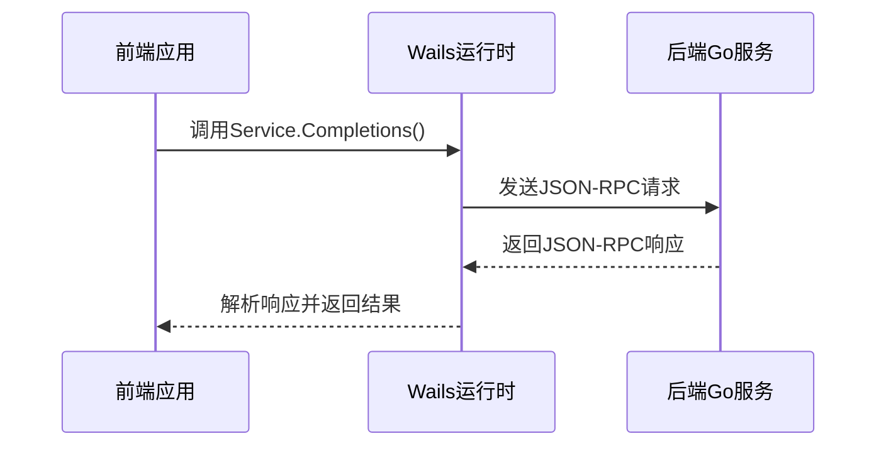

# 参数与返回值序列化异常

<cite>
**本文档引用的文件**
- [main.go](file://main.go)
- [backend/models/view_models/chat.go](file://backend/models/view_models/chat.go)
- [backend/models/view_models/models.go](file://backend/models/view_models/models.go)
- [backend/models/view_models/provider.go](file://backend/models/view_models/provider.go)
- [backend/models/data_models/common.go](file://backend/models/data_models/common.go)
- [backend/service/chat.go](file://backend/service/chat.go)
- [backend/service/service.go](file://backend/service/service.go)
- [frontend/bindings/gitlab.linhf.cn/project/lemontea/lemon_tea_desktop/backend/models/view_models/models.ts](file://frontend/bindings/gitlab.linhf.cn/project/lemontea/lemon_tea_desktop/backend/models/view_models/models.ts)
- [frontend/bindings/gitlab.linhf.cn/project/lemontea/lemon_tea_desktop/backend/service/service.ts](file://frontend/bindings/gitlab.linhf.cn/project/lemontea/lemon_tea_desktop/backend/service/service.ts)
- [frontend/src/utils/completions.ts](file://frontend/src/utils/completions.ts)
</cite>

## 目录
1. [引言](#引言)
2. [Wails通信机制与JSON-RPC序列化](#wails通信机制与json-rpc序列化)
3. [DTO结构体字段标签与序列化](#dto结构体字段标签与序列化)
4. [Go结构体导出字段与序列化](#go结构体导出字段与序列化)
5. [前端TypeScript类型定义同步](#前端typescript类型定义同步)
6. [序列化异常排查流程](#序列化异常排查流程)
7. [结论](#结论)

## 引言
本文档深入探讨在前后端数据传输过程中因类型不匹配引发的序列化错误。通过分析Wails框架的JSON-RPC通信机制，研究view_models中DTO结构体字段标签（如json:"fieldName"）对序列化的影响。同时，说明Go结构体字段必须为导出（大写开头）才能被序列化，并对比frontend/bindings中自动生成的TypeScript类型定义是否同步更新。最后，提供从前端调用传参到后端方法接收参数、返回值序列化及前端解析结果的完整排查流程，以定位类型断层位置。

## Wails通信机制与JSON-RPC序列化
Wails框架基于JSON-RPC协议实现前后端通信。该机制通过将Go语言中的服务方法暴露给前端JavaScript环境，使得前端可以像调用本地函数一样调用后端方法。JSON-RPC是一种轻量级远程过程调用协议，它使用JSON作为数据格式，支持异步调用和批量请求。

在本项目中，`main.go`文件中定义了应用的服务选项，其中包含了`service.NewService()`，这表明后端服务是通过Wails框架注册并暴露给前端的。前端通过`@bindings`路径下的自动生成文件来调用这些服务方法。



**图示来源**
- [main.go](file://main.go#L1-L58)
- [frontend/bindings/gitlab.linhf.cn/project/lemontea/lemon_tea_desktop/backend/service/service.ts](file://frontend/bindings/gitlab.linhf.cn/project/lemontea/lemon_tea_desktop/backend/service/service.ts#L0-L37)

**本节来源**
- [main.go](file://main.go#L1-L58)
- [frontend/bindings/gitlab.linhf.cn/project/lemontea/lemon_tea_desktop/backend/service/service.ts](file://frontend/bindings/gitlab.linhf.cn/project/lemontea/lemon_tea_desktop/backend/service/service.ts#L0-L37)

## DTO结构体字段标签与序列化
在Go语言中，结构体字段可以通过标签（tags）来控制其序列化行为。特别是在使用JSON序列化时，`json`标签用于指定字段在JSON中的名称。例如，在`backend/models/view_models/chat.go`文件中，`Chat`结构体的字段使用了`json`标签来指定其在JSON中的表示形式。

```go
type Chat struct {
	data_models.Chat
	Content          []MatchMessage `json:"content"`
	ReasoningContent []MatchMessage `json:"reasoning_content"`
}
```

这里的`json:"content"`和`json:"reasoning_content"`标签确保了当`Chat`结构体被序列化为JSON时，`Content`和`ReasoningContent`字段会被转换为`content`和`reasoning_content`。这对于前后端数据交换至关重要，因为前端期望接收到的数据格式必须与后端发送的数据格式一致。

此外，`backend/models/view_models/models.go`文件中的`Model`结构体也使用了类似的`json`标签来控制字段的序列化：

```go
type Model struct {
	ID         uint           `gorm:"primaryKey;autoIncrement" json:"id"`
	CreatedAt  time.Time      `json:"created_at"`
	UpdatedAt  time.Time      `json:"updated_at"`
	DeletedAt  gorm.DeletedAt `gorm:"index" json:"deleted_at"`
	ProviderId uint           `gorm:"index" json:"provider_id"`
	Model      string         `gorm:"index" json:"model"`
	OwnedBy    string         `gorm:"type:varchar(255)" json:"owned_by"`
	Object     string         `gorm:"type:varchar(255)" json:"object"`
	Enable     bool           `gorm:"index;type:bool;default:1" json:"enable"`
	Alias      *string        `gorm:"index;type:varchar(255)" json:"alias"`
}
```

这些标签不仅影响JSON序列化，还影响GORM数据库操作，确保数据库字段与结构体字段之间的正确映射。

**本节来源**
- [backend/models/view_models/chat.go](file://backend/models/view_models/chat.go#L0-L24)
- [backend/models/view_models/models.go](file://backend/models/view_models/models.go#L0-L21)

## Go结构体导出字段与序列化
在Go语言中，只有导出的字段（即首字母大写的字段）才能被外部包访问，包括序列化库。这意味着如果一个结构体字段不是导出的，那么它将不会被包含在序列化的输出中。这是Go语言的一个重要特性，用于控制数据的可见性和封装性。

在本项目的`backend/models/view_models/chat.go`文件中，所有需要被序列化的字段都是导出的，如`Content`、`ReasoningContent`等。这些字段的首字母均为大写，确保它们可以在序列化过程中被正确处理。

```go
type MatchMessage struct {
	Role    string `json:"role"`
	Content string `json:"content"`
}
```

在这个例子中，`Role`和`Content`字段都是导出的，因此它们会被包含在序列化的JSON输出中。如果这些字段的首字母是小写的，比如`role`和`content`，那么它们将不会被序列化，导致前端无法接收到这些数据。

**本节来源**
- [backend/models/view_models/chat.go](file://backend/models/view_models/chat.go#L0-L24)

## 前端TypeScript类型定义同步
前端的TypeScript类型定义是由Wails工具自动生成的，位于`frontend/bindings`目录下。这些类型定义文件确保了前端代码能够正确地与后端服务进行交互。例如，`frontend/bindings/gitlab.linhf.cn/project/lemontea/lemon_tea_desktop/backend/models/view_models/models.ts`文件中定义了`Chat`、`ChatList`、`Completions`等类，这些类的属性与后端Go结构体的字段相对应。

```typescript
export class Chat {
    "id": number;
    "created_at": time$0.Time;
    "updated_at": time$0.Time;
    "deleted_at": gorm$0.DeletedAt;
    "uuid": string;
    "model_id": number;
    "title": string;
    "prompt": string;
    "is_collection": boolean;
    "content": MatchMessage[];
    "reasoning_content": MatchMessage[];

    constructor($$source: Partial<Chat> = {}) {
        // 初始化逻辑
        Object.assign(this, $$source);
    }

    static createFrom($$source: any = {}): Chat {
        let $$parsedSource = typeof $$source === 'string' ? JSON.parse($$source) : $$source;
        return new Chat($$parsedSource as Partial<Chat>);
    }
}
```

这些自动生成的类型定义文件通过`createFrom`静态方法提供了从JSON字符串或对象创建实例的能力，确保了前后端数据的一致性。此外，`frontend/bindings/gitlab.linhf.cn/project/lemontea/lemon_tea_desktop/backend/service/service.ts`文件中定义了服务方法的调用接口，如`Completions`方法，它返回一个`Completions`类型的Promise。

```typescript
export function Completions(chatUuid: string, selectedModel: string, userMessage: Message): $CancellablePromise<Completions | null> {
    return $Call.ByID(4205977752, chatUuid, selectedModel, userMessage).then(($result: any) => {
        return $$createType2($result);
    });
}
```

这些类型定义文件的同步更新对于维护前后端数据一致性至关重要。任何后端结构体的更改都应触发前端类型定义的重新生成，以确保前端代码能够正确处理新的数据结构。

**本节来源**
- [frontend/bindings/gitlab.linhf.cn/project/lemontea/lemon_tea_desktop/backend/models/view_models/models.ts](file://frontend/bindings/gitlab.linhf.cn/project/lemontea/lemon_tea_desktop/backend/models/view_models/models.ts#L0-L335)
- [frontend/bindings/gitlab.linhf.cn/project/lemontea/lemon_tea_desktop/backend/service/service.ts](file://frontend/bindings/gitlab.linhf.cn/project/lemontea/lemon_tea_desktop/backend/service/service.ts#L0-L37)

## 序列化异常排查流程
为了有效排查因类型不匹配引发的序列化错误，可以遵循以下步骤：

1. **前端调用传参**：检查前端调用服务方法时传递的参数是否符合预期。例如，在`frontend/src/utils/completions.ts`文件中，`CompletionsUtils`函数调用了`Service.Completions`方法，传递了`chatUuid`、`selectedModel`和`userMessage`三个参数。

   ```typescript
   const resp: Completions | null = await Service.Completions(chatUuid, selectedModel, userMessage);
   ```

2. **Go方法接收参数**：确认后端服务方法是否正确接收了前端传递的参数。在`backend/service/chat.go`文件中，`Completions`方法接收了`chatUuid`、`model`和`message`三个参数，并进行了相应的处理。

   ```go
   func (s *Service) Completions(chatUuid, model string, message schema.Message) (*view_models.Completions, error) {
       // 方法实现
   }
   ```

3. **返回值序列化**：检查后端方法返回的值是否被正确序列化为JSON。在`Completions`方法中，返回了一个`*view_models.Completions`指针，该结构体的字段使用了`json`标签来控制序列化。

   ```go
   return &view_models.Completions{
       ChatUuid:    chatUuid,
       MessageUuid: messageUuid,
   }, nil
   ```

4. **前端解析结果**：验证前端是否能够正确解析后端返回的JSON数据。在`frontend/src/utils/completions.ts`文件中，`CompletionsUtils`函数通过`Events.On`监听事件，接收并处理后端返回的消息。

   ```typescript
   cancel = Events.On(GenEventsKey(resp?.message_uuid!), (event) => {
       const responseMessage: Message = event.data[0];
       onMessage(responseMessage);
   });
   ```

通过以上步骤，可以系统地定位和解决序列化异常问题。如果发现前端接收到的数据与预期不符，应首先检查后端结构体的字段标签和导出状态，然后确认前端类型定义是否已同步更新。

**本节来源**
- [frontend/src/utils/completions.ts](file://frontend/src/utils/completions.ts#L0-L101)
- [backend/service/chat.go](file://backend/service/chat.go#L0-L207)

## 结论
本文档详细探讨了前后端数据传输过程中因类型不匹配引发的序列化错误。通过分析Wails框架的JSON-RPC通信机制，我们了解了如何通过DTO结构体字段标签（如`json:"fieldName"`）来控制序列化行为。同时，强调了Go结构体字段必须为导出（大写开头）才能被序列化的重要性。此外，我们还讨论了前端TypeScript类型定义的同步更新机制，以及如何通过系统化的排查流程来定位和解决序列化异常问题。这些知识对于维护前后端数据一致性、提高开发效率具有重要意义。