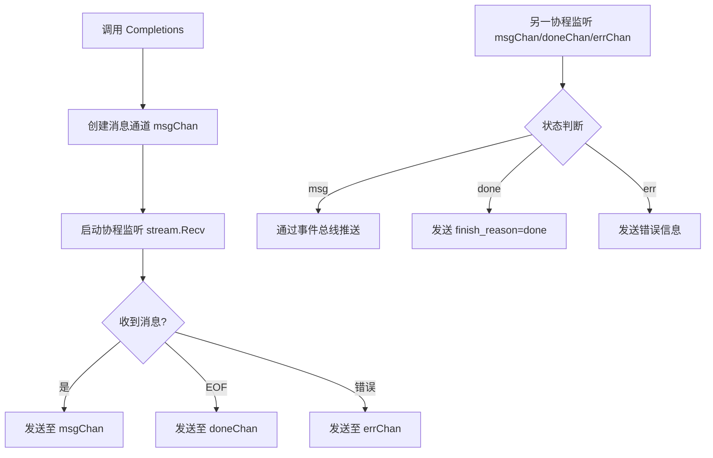
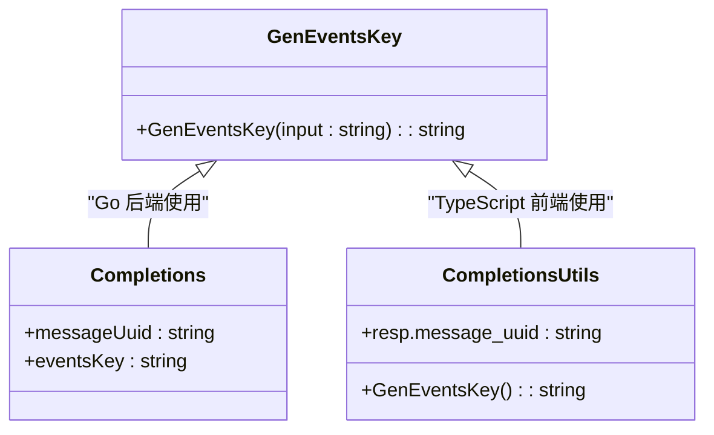
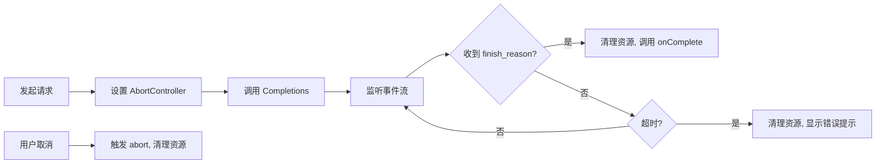

# 异步处理返回异常

<cite>
**本文档引用文件**  
- [chat.go](file://backend/service/chat.go)
- [completions.ts](file://frontend/src/utils/completions.ts)
- [events.go](file://backend/utils/events.go)
- [events.ts](file://frontend/src/utils/events.ts)
- [chat.go](file://backend/models/view_models/chat.go)
</cite>

## 目录
1. [简介](#简介)
2. [核心组件分析](#核心组件分析)
3. [流式响应机制与挂起问题](#流式响应机制与挂起问题)
4. [前后端事件通信机制](#前后端事件通信机制)
5. [最佳实践建议](#最佳实践建议)
6. [结论](#结论)

## 简介
本文档旨在分析在流式响应场景下，由于异步处理未正确返回导致前端界面挂起的问题。以 `chat.Completions` 方法为例，说明其通过事件通道推送增量消息的设计模式。重点阐述若后端未正确关闭事件流或前端未妥善处理结束信号，将可能导致 UI 卡顿或加载状态无法终止。同时提供容错处理的最佳实践方案。

## 核心组件分析

`Completions` 方法是聊天功能的核心异步接口，负责接收用户输入并启动与大语言模型的交互流程。该方法不直接返回完整响应，而是通过事件机制逐步推送增量消息，实现流式输出效果。

在后端实现中，`Completions` 方法创建独立的 Goroutine 来监听来自 LLM 提供商的流式响应，并通过事件总线（Event Bus）将每一条增量消息广播给前端。前端通过动态生成的事件键（events key）订阅这些消息，实现实时更新。

**Section sources**
- [chat.go](file://backend/service/chat.go#L50-L207)
- [completions.ts](file://frontend/src/utils/completions.ts#L1-L102)

## 流式响应机制与挂起问题

### 服务端流式处理逻辑
`Completions` 方法通过 `llm.NewLlmProvider().Completions()` 获取一个流式响应对象（stream），并启动一个协程持续调用 `stream.Recv()` 方法读取增量数据。当遇到 `io.EOF` 时表示流正常结束，此时会向 `doneChan` 发送信号。

**Diagram sources**
- [chat.go](file://backend/service/chat.go#L50-L207)

### 前端事件监听与完成判断
前端通过 `CompletionsUtils` 函数封装了完整的调用逻辑。在接收到事件后，检查 `response_meta.finish_reason` 字段是否非空来判断对话是否完成。一旦检测到完成信号，立即清理事件监听器并调用 `onComplete` 回调。

若服务端未能正确设置 `finish_reason` 或未关闭事件流，前端将无法触发完成逻辑，导致：
- 加载动画持续显示
- 无法发送新消息
- 资源泄漏（事件监听器未清除）

**Section sources**
- [completions.ts](file://frontend/src/utils/completions.ts#L1-L102)

## 前后端事件通信机制

### 事件键生成一致性
前后端使用相同的逻辑生成事件键，确保通信匹配：

**Diagram sources**
- [events.go](file://backend/utils/events.go#L5-L7)
- [events.ts](file://frontend/src/utils/events.ts#L1-L3)

### 消息完成状态传递
服务端通过 `fillCompletionsMsg` 方法在流结束或出错时注入特殊的 `finish_reason` 标记：

- 正常结束：`finish_reason = "done"`
- 出错结束：`finish_reason = error.Error()`

前端据此判断流程终结，避免无限等待。

**Section sources**
- [chat.go](file://backend/service/chat.go#L180-L207)

## 最佳实践建议

### 服务端保障措施
1. **确保流关闭**：所有 `stream.Recv()` 路径必须最终关闭 `doneChan` 或 `errChan`
2. **统一完成标记**：始终通过 `fillCompletionsMsg` 注入结束信号
3. **错误兜底**：即使发生内部错误也应尝试发送终止事件

### 前端容错策略
1. **超时机制**：为 `CompletionsUtils` 添加最大等待时间，超时后自动触发降级处理
2. **错误降级 UI**：当收到错误或超时时，显示可重试的提示而非空白加载
3. **资源清理**：无论成功与否，均需确保事件监听器被移除

**Diagram sources**
- [completions.ts](file://frontend/src/utils/completions.ts#L1-L102)

## 结论
流式响应虽能提升用户体验，但也引入了复杂的生命周期管理问题。必须确保每个事件流都有明确的开始与结束标记，前后端协同处理各种终止场景。前端应设置超时机制与错误降级 UI，结合 `completions.ts` 中的调用封装逻辑进行全方位容错，防止因异常导致界面挂起。