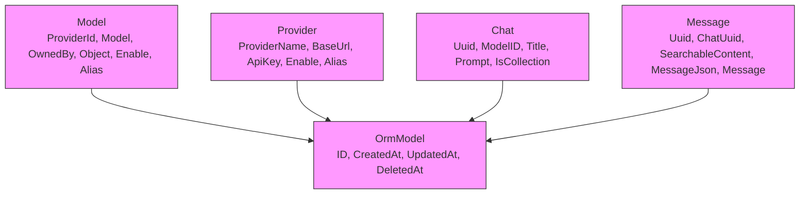

# GORM自动迁移失败

<cite>
**本文档引用的文件**  
- [models.go](file://backend/models/data_models/models.go)
- [common.go](file://backend/models/data_models/common.go)
- [provider.go](file://backend/models/data_models/provider.go)
- [chat.go](file://backend/models/data_models/chat.go)
- [storage.go](file://backend/storage/storage.go)
- [logger.go](file://backend/pkg/logger/logger.go)
</cite>

## 目录
1. [简介](#简介)
2. [项目结构与核心模型](#项目结构与核心模型)
3. [GORM AutoMigrate机制分析](#gorm-automigrate机制分析)
4. [常见迁移异常原因](#常见迁移异常原因)
5. [GORM标签使用错误分析](#gorm标签使用错误分析)
6. [日志与SQL语句追踪](#日志与sql语句追踪)
7. [解决方案与最佳实践](#解决方案与最佳实践)
8. [结论](#结论)

## 简介
本文深入解析在使用GORM进行数据库自动迁移（AutoMigrate）过程中可能遇到的异常情况，重点分析由于表结构冲突、字段类型不兼容或索引创建失败导致的迁移中断问题。结合项目中`models.go`等文件的结构体定义和GORM标签配置，说明常见注解错误如何影响迁移流程，并通过`logger`包捕获底层SQL执行过程，提供有效的排查与解决策略。

## 项目结构与核心模型

项目采用分层结构，核心数据模型位于`backend/models/data_models/`目录下，主要包括：
- `common.go`：定义基础ORM模型`OrmModel`
- `models.go`：定义模型信息`Model`
- `provider.go`：定义服务提供商`Provider`
- `chat.go`：定义会话`Chat`与消息`Message`

这些结构体通过嵌入`OrmModel`实现通用字段（如ID、时间戳）的复用，符合GORM推荐的嵌入式设计模式。



**Diagram sources**  
- [common.go](file://backend/models/data_models/common.go#L5-L13)
- [models.go](file://backend/models/data_models/models.go#L3-L11)
- [provider.go](file://backend/models/data_models/provider.go#L3-L10)
- [chat.go](file://backend/models/data_models/chat.go#L3-L63)

**Section sources**  
- [common.go](file://backend/models/data_models/common.go#L3-L13)
- [models.go](file://backend/models/data_models/models.go#L3-L11)
- [provider.go](file://backend/models/data_models/provider.go#L3-L10)
- [chat.go](file://backend/models/data_models/chat.go#L3-L63)

## GORM AutoMigrate机制分析
GORM的`AutoMigrate`功能用于自动创建或更新数据库表结构以匹配Go结构体定义。在本项目中，该功能在`storage.go`的`NewStorage()`函数中被调用：

```go
err = db.AutoMigrate(&data_models.Model{}, &data_models.Provider{}, &data_models.Chat{}, &data_models.Message{})
```

此操作会依次检查每个模型对应的表是否存在，若不存在则创建；若存在则尝试添加缺失的列或索引。但不会删除已存在的列，以防止数据丢失。

**Section sources**  
- [storage.go](file://backend/storage/storage.go#L25-L30)

## 常见迁移异常原因

### 表结构冲突
当数据库中已存在与模型定义不一致的表时，可能导致迁移失败。例如：
- 字段类型不匹配（如`varchar(255)` vs `text`）
- 索引重复定义
- 主键约束冲突

### 字段类型不兼容
GORM根据结构体字段类型推断数据库类型。若手动指定的`gorm:"type:xxx"`与实际类型不符，可能引发错误。例如：
- `bool`字段映射为非布尔类型数据库字段
- `uint`主键与`INTEGER PRIMARY KEY`不兼容（SQLite）

### 索引创建失败
在已有大量数据的表上添加新索引可能导致超时或锁表失败。此外，重复创建同名索引也会报错。

**Section sources**  
- [models.go](file://backend/models/data_models/models.go#L3-L11)
- [provider.go](file://backend/models/data_models/provider.go#L3-L10)
- [chat.go](file://backend/models/data_models/chat.go#L3-L63)

## GORM标签使用错误分析

### 拼写错误
在`chat.go`中发现一个潜在错误：
```go
Uuid string `grom:"unique;index" json:"uuid"`
```
`grom`应为`gorm`，这将导致GORM忽略该标签，无法正确创建唯一索引。

### 字段大小写问题
GORM默认使用字段名作为列名（可被`json`标签覆盖），但若字段未导出（小写开头），则不会被映射到数据库。

### 类型映射错误
合理使用`gorm:"type:xxx"`可确保类型一致性。例如：
- `string`字段建议明确指定长度：`gorm:"type:varchar(255)"`
- 布尔字段使用`gorm:"type:bool;default:1"`确保默认值

**Section sources**  
- [chat.go](file://backend/models/data_models/chat.go#L7-L8)

## 日志与SQL语句追踪

项目中集成了`pkg/logger`包，可用于捕获GORM执行的原始SQL语句。虽然当前配置未开启GORM的`Logger`接口，但可通过以下方式增强调试能力：

1. **启用GORM日志**：在`gorm.Config`中设置`Logger`字段
2. **包装现有Logger**：将`backend/pkg/logger`适配为GORM的`logger.Interface`
3. **输出SQL语句**：通过`logger.Debugf`输出每条执行的SQL

当前错误日志已能捕获迁移失败信息：
```go
logger.Errorf("Failed to migrate models: %v", err)
```

**Section sources**  
- [logger.go](file://backend/pkg/logger/logger.go#L0-L162)
- [storage.go](file://backend/storage/storage.go#L28-L30)

## 解决方案与最佳实践

### 手动删除数据库文件重建
最直接的方式是删除`data.db`文件，触发GORM重新创建所有表。适用于开发环境。

### 分步执行迁移
避免一次性迁移所有模型，可按依赖顺序逐个迁移：
```go
db.AutoMigrate(&data_models.Provider{})
db.AutoMigrate(&data_models.Model{})
db.AutoMigrate(&data_models.Chat{})
db.AutoMigrate(&data_models.Message{})
```

### 使用Migrator接口进行增量更新
利用GORM的`Migrator`接口实现更精细的控制：
```go
migrator := db.Migrator()
if !migrator.HasColumn(&data_models.Chat{}, "is_collection") {
    migrator.AddColumn(&data_models.Chat{}, "is_collection")
}
```

### 修复GORM标签拼写错误
修正`chat.go`中的`grom`为`gorm`：
```go
Uuid string `gorm:"uniqueIndex;index" json:"uuid"`
```

### 添加迁移前检查逻辑
在`AutoMigrate`前检查数据库状态，或使用版本化迁移工具（如`gorm.io/gorm/migrate`）替代自动迁移。

**Section sources**  
- [storage.go](file://backend/storage/storage.go#L25-L30)
- [chat.go](file://backend/models/data_models/chat.go#L7-L8)

## 结论
GORM的`AutoMigrate`功能虽便捷，但在生产环境中需谨慎使用。建议结合日志追踪、标签规范检查及分步迁移策略，确保数据库结构演进的稳定性。对于已上线系统，推荐使用显式迁移脚本而非自动迁移，以保障数据安全与可追溯性。