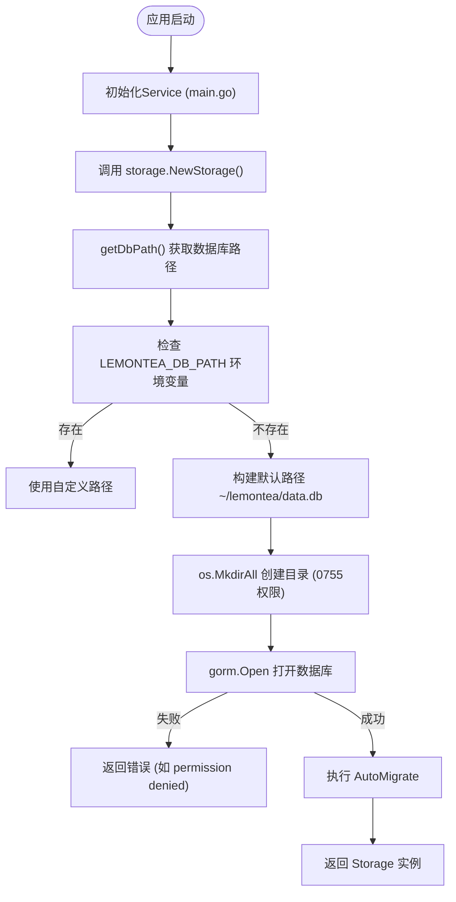
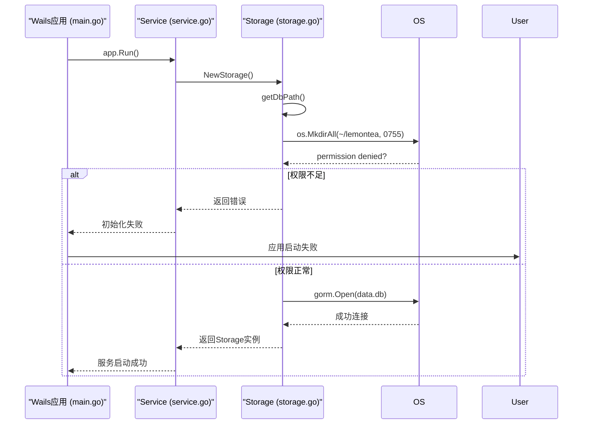

# 数据库文件权限不足

<cite>
**本文档引用的文件**   
- [storage.go](file://backend/storage/storage.go)
- [main.go](file://main.go)
- [service.go](file://backend/service/service.go)
</cite>

## 目录

1. [问题概述](#问题概述)
2. [核心组件分析](#核心组件分析)
3. [权限错误的产生机制](#权限错误的产生机制)
4. [桌面应用沙盒限制分析](#桌面应用沙盒限制分析)
5. [跨平台权限排查步骤](#跨平台权限排查步骤)
6. [解决方案与修复方法](#解决方案与修复方法)
7. [结论](#结论)

## 问题概述

当桌面应用程序尝试访问SQLite数据库文件时，若目标目录权限受限，可能导致读写失败。本项目中，数据库文件默认存储于用户主目录下的 `~/lemontea/data.db` 路径。若该路径所在目录权限配置不当，或应用运行于沙盒环境中，可能导致 `permission denied` 错误。本文系统性分析此问题的成因、表现及解决方案。

## 核心组件分析

数据库访问逻辑由 `backend/storage/storage.go` 文件中的 `NewStorage()` 函数初始化，该函数负责获取数据库路径并建立连接。`main.go` 是Wails桌面应用的入口点，通过调用后端服务启动整个应用上下文。



**Diagram sources**  
- [storage.go](file://backend/storage/storage.go#L15-L82)
- [main.go](file://main.go#L1-L60)

**Section sources**  
- [storage.go](file://backend/storage/storage.go#L1-L82)
- [main.go](file://main.go#L1-L60)

## 权限错误的产生机制

在 `storage.go` 中，`NewStorage()` 函数首先调用 `getDbPath()` 确定数据库文件路径。若环境变量 `LEMONTEA_DB_PATH` 未设置，则使用默认路径 `~/lemontea/data.db`。在打开数据库前，会调用 `os.MkdirAll(dbDir, 0755)` 确保目录存在。

若当前用户对目标目录无写权限（例如目录所有者为root或其他用户），`os.MkdirAll` 将返回 `permission denied` 错误。此错误将直接传递给 `NewStorage()` 的调用方，最终导致应用无法启动数据库服务。

此外，`gorm.Open` 在尝试读写 `.db` 文件时，若文件或其父目录权限不足，也会抛出 `permission denied` 类型的系统错误。此类错误会被 `logger.Errorf` 记录，并通过函数返回链传递至 `ServiceStartup`。

**Section sources**  
- [storage.go](file://backend/storage/storage.go#L15-L82)

## 桌面应用沙盒限制分析

本应用基于 Wails 框架构建，`main.go` 中通过 `application.New` 初始化应用实例。在 macOS 和 Windows 等现代操作系统中，桌面应用常运行于沙盒环境中，其文件系统访问受到严格限制。

例如，在 macOS 上，应用默认只能访问其容器目录（如 `~/Library/Containers/`），若尝试访问 `~/lemontea/` 目录而未获得用户授权，则会被系统拒绝。即使目录存在，沙盒机制也可能阻止应用创建或修改文件，从而触发 `permission denied` 错误。

Wails 应用在启动时由 `ServiceStartup` 调用 `storage.NewStorage()`，若此时因沙盒权限不足导致数据库初始化失败，整个服务层将无法正常工作，进而影响前端功能。



**Diagram sources**  
- [main.go](file://main.go#L1-L60)
- [service.go](file://backend/service/service.go#L1-L29)
- [storage.go](file://backend/storage/storage.go#L15-L82)

**Section sources**  
- [main.go](file://main.go#L1-L60)
- [service.go](file://backend/service/service.go#L1-L29)

## 跨平台权限排查步骤

### macOS

1. 检查应用数据目录权限：
   ```bash
   ls -la ~/lemontea/
   ```
2. 查看目录拥有者与权限位，确保当前用户有读写权限（如 `drwxr-xr-x`）。
3. 若目录属于其他用户，可通过以下命令修复：
   ```bash
   sudo chown -R $(whoami) ~/lemontea/
   ```

### Windows

1. 打开资源管理器，导航至 `%USERPROFILE%\lemontea`。
2. 右键点击 `lemontea` 文件夹 → 属性 → 安全选项卡。
3. 确认当前用户具有“完全控制”或“修改”权限。
4. 若无权限，点击“编辑”添加当前用户并赋予权限。

### Linux

1. 检查目录权限：
   ```bash
   ls -ld ~/lemontea
   ```
2. 若权限不足，使用以下命令修复：
   ```bash
   chmod 755 ~/lemontea
   chown $USER:$USER ~/lemontea
   ```

**Section sources**  
- [storage.go](file://backend/storage/storage.go#L78-L82)

## 解决方案与修复方法

### 方法一：修复目录权限

使用 `chmod` 和 `chown` 命令修复默认数据库目录权限：

```bash
# 创建目录（若不存在）
mkdir -p ~/lemontea

# 修改拥有者为当前用户
chown $(whoami) ~/lemontea

# 设置标准读写执行权限
chmod 755 ~/lemontea
```

### 方法二：重定向数据库路径

通过设置环境变量 `LEMONTEA_DB_PATH` 指向具有读写权限的路径：

```bash
# 临时设置（当前终端会话）
export LEMONTEA_DB_PATH="/path/to/writable/directory/data.db"

# 启动应用
./lemon_tea_desktop
```

或在系统级配置文件（如 `~/.bashrc` 或 `~/.zshrc`）中永久设置：

```bash
echo 'export LEMONTEA_DB_PATH="$HOME/Documents/lemon_tea_data.db"' >> ~/.zshrc
source ~/.zshrc
```

此方法可绕过沙盒限制，将数据库存储于用户明确授权的目录中。

**Section sources**  
- [storage.go](file://backend/storage/storage.go#L70-L78)

## 结论

SQLite数据库文件的读写失败通常源于目录权限不足或桌面应用沙盒机制限制。通过分析 `storage.go` 中的 `NewStorage` 和 `getDbPath` 函数可知，应用在初始化时会尝试创建并访问 `~/lemontea/data.db`。若该路径权限配置不当，将导致 `permission denied` 错误。建议用户优先检查并修复目录权限，或通过 `LEMONTEA_DB_PATH` 环境变量重定向数据库位置以规避权限问题。