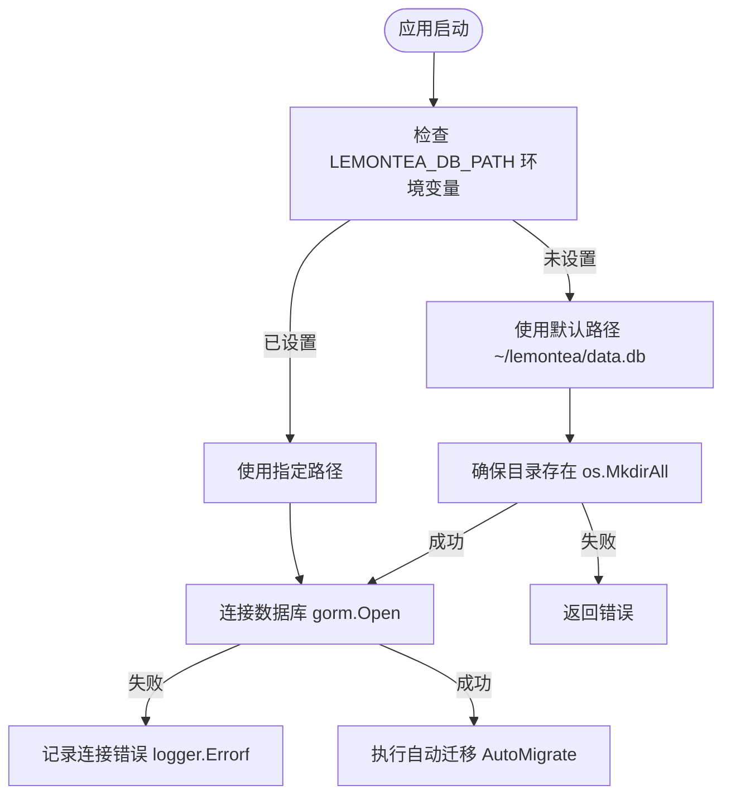
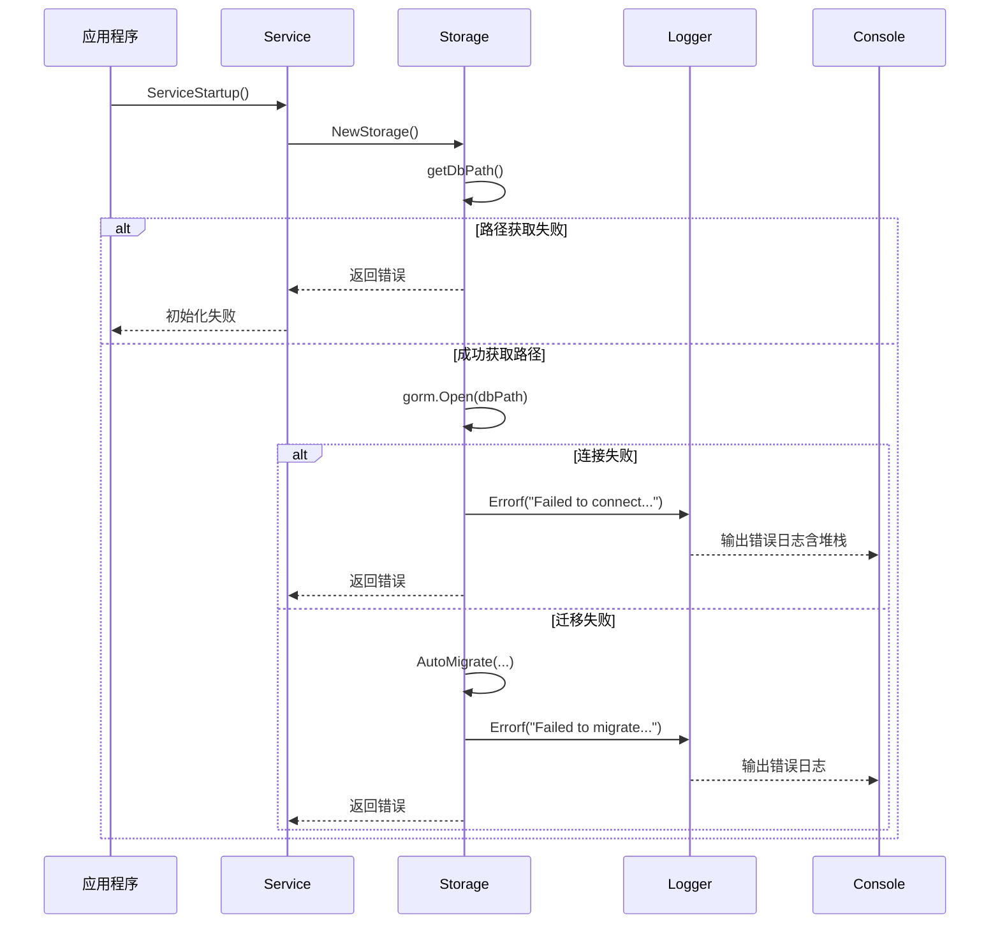

# 数据库连接与存储错误

<cite>
**本文档引用的文件**  
- [storage.go](file://backend/storage/storage.go)
- [logger.go](file://backend/pkg/logger/logger.go)
- [service.go](file://backend/service/service.go)
- [models.go](file://backend/models/data_models/models.go)
- [common.go](file://backend/utils/ierror/common.go)
</cite>

## 目录
1. [引言](#引言)
2. [数据库连接失败场景分析](#数据库连接失败场景分析)
3. [错误日志特征识别方法](#错误日志特征识别方法)
4. [数据库路径与权限检查](#数据库路径与权限检查)
5. [GORM自动迁移失败处理](#gorm自动迁移失败处理)
6. [日志追踪SQL执行语句](#日志追踪sql执行语句)
7. [恢复策略与实用操作指南](#恢复策略与实用操作指南)
8. [总结](#总结)

## 引言
本指南系统性地记录了LemonTea桌面应用在启动和运行过程中可能遇到的数据库连接与存储相关错误。重点涵盖环境变量未设置、文件权限不足、数据库损坏、GORM迁移失败等常见问题，并提供基于`logger`包的精准日志定位方法和恢复策略。

## 数据库连接失败场景分析

### LEMONTEA_DB_PATH环境变量未设置
当环境变量`LEMONTEA_DB_PATH`未配置时，系统将使用默认路径`~/lemontea/data.db`作为数据库文件位置。若该路径无法访问或目录不存在，将导致连接失败。



**Diagram sources**
- [storage.go](file://backend/storage/storage.go#L60-L82)

**Section sources**
- [storage.go](file://backend/storage/storage.go#L60-L82)

### SQLite数据库文件路径权限不足
若目标数据库文件所在目录无写入权限，或文件本身被锁定，则`os.MkdirAll`或`gorm.Open`将返回权限错误。此类问题常见于多用户环境或受控系统中。

### 数据库文件损坏或版本不兼容
SQLite数据库文件若因异常关闭、磁盘错误等原因损坏，或使用了不兼容的SQLite版本，`gorm.Open`会抛出底层驱动错误，表现为连接失败。

### GORM自动迁移失败
在调用`db.AutoMigrate()`时，若模型结构与现有表结构冲突（如字段类型变更、约束冲突），或数据库处于只读模式，将导致迁移失败并中断初始化流程。

**Section sources**
- [storage.go](file://backend/storage/storage.go#L15-L25)

## 错误日志特征识别方法

### 日志级别与输出格式
系统使用自定义`logger`包输出结构化日志，关键错误通过`logger.Errorf`记录，包含时间戳、日志级别、调用堆栈等信息。

```go
logger.Errorf("Failed to connect to database: %v", err)
```

典型错误日志格式如下：
```
2024-04-05 10:23:45 | ERROR | [logger]: Failed to connect to database: unable to open database file
file: /path/to/lemon_tea/backend/storage/storage.go
line: 18
function: NewStorage
```

### 定位异常位置
通过日志中的`file`、`line`、`function`字段可精确定位错误发生位置。例如，`NewStorage`函数第18行的连接失败，表明问题出在数据库初始化阶段。



**Diagram sources**
- [storage.go](file://backend/storage/storage.go#L10-L25)
- [logger.go](file://backend/pkg/logger/logger.go#L62-L70)
- [service.go](file://backend/service/service.go#L20-L25)

**Section sources**
- [storage.go](file://backend/storage/storage.go#L10-L25)
- [logger.go](file://backend/pkg/logger/logger.go#L62-L70)

## 数据库路径与权限检查

### 检查数据库路径读写权限
用户可通过以下命令检查默认数据库路径的权限：

```bash
# 检查目录是否存在及权限
ls -la ~/lemontea/

# 检查文件权限
ls -l ~/lemontea/data.db

# 手动创建目录并设置权限
mkdir -p ~/lemontea && chmod 755 ~/lemontea
```

### 手动指定数据库位置
通过设置环境变量可自定义数据库路径：

```bash
# Linux/macOS
export LEMONTEA_DB_PATH="/custom/path/to/data.db"
./lemon_tea_desktop

# Windows
set LEMONTEA_DB_PATH=C:\custom\path\data.db
lemon_tea_desktop.exe
```

**Section sources**
- [storage.go](file://backend/storage/storage.go#L60-L82)

## GORM自动迁移失败处理

### 常见迁移失败原因
- 表结构变更导致约束冲突
- 字段类型不兼容（如TEXT与INTEGER）
- 缺少必要索引或主键
- 数据库文件只读

### 解决方案
1. **备份后重置数据库**：删除`data.db`文件，让系统重新生成。
2. **手动执行SQL修复**：使用SQLite工具连接数据库，手动调整表结构。
3. **禁用自动迁移**：修改代码跳过`AutoMigrate`调用进行调试。

```go
// db.AutoMigrate(...) 调用位置
err = db.AutoMigrate(&data_models.Model{}, &data_models.Provider{}, &data_models.Chat{}, &data_models.Message{})
if err != nil {
    logger.Errorf("Failed to migrate models: %v", err) // 错误在此处被捕获
    return nil, err
}
```

**Section sources**
- [storage.go](file://backend/storage/storage.go#L20-L25)

## 日志追踪SQL执行语句

### 启用GORM调试模式
虽然当前`logger`包未直接暴露GORM的SQL日志开关，但可通过启用调试模式查看更详细的执行信息：

```go
// 在 GORM 配置中启用日志（需代码修改）
db, err := gorm.Open(sqlite.Open(dbPath), &gorm.Config{
    Logger: logger.Default.LogMode(logger.Info),
})
```

### 通过现有日志定位问题
所有数据库操作失败均会触发`logger.Errorf`，结合堆栈信息可反向追踪到具体操作方法，如`CreateMessage`、`GetProviders`等。

**Section sources**
- [provider.go](file://backend/storage/provider.go#L10-L15)
- [chat_message.go](file://backend/storage/chat_message.go#L10-L15)

## 恢复策略与实用操作指南

### 重置数据库文件
当数据库损坏或结构异常时，可安全删除`data.db`文件，系统将在下次启动时自动重建：

```bash
# 关闭应用后执行
rm ~/lemontea/data.db
# 重启应用，数据库将重新初始化
```

### 导出聊天记录备份
目前系统未提供直接导出功能，但可通过SQLite客户端工具手动导出：

```sql
-- 使用 sqlite3 命令行工具
sqlite3 ~/lemontea/data.db
.tables
.schema chat_messages
SELECT * FROM chat_messages;
.output backup_chat.json
SELECT json(*); FROM chat_messages;
```

### 错误处理统一入口
所有内部错误最终通过`ierror.NewError(err)`包装并记录，确保异常不会静默失败：

```go
func NewError(err error) error {
    logger.Error(err) // 统一记录错误
    return IError{errCode: ErrCodeInternalError}
}
```

**Section sources**
- [common.go](file://backend/utils/ierror/common.go#L10-L15)
- [storage.go](file://backend/storage/storage.go#L60-L82)

## 总结
本文档详细分析了LemonTea应用中数据库连接与存储的各类故障场景，提供了基于`logger`包的日志识别方法、路径权限检查步骤、GORM迁移问题解决方案以及实用的恢复操作指南。建议用户优先检查环境变量与文件权限，并善用日志中的堆栈信息进行精准定位。