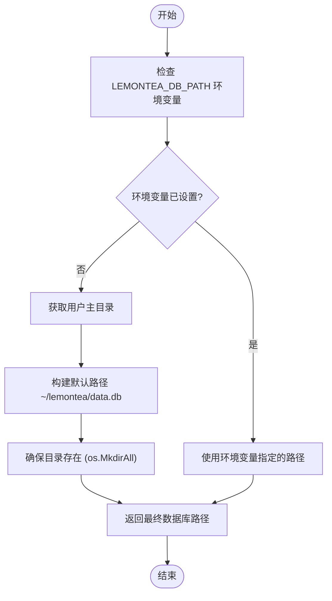
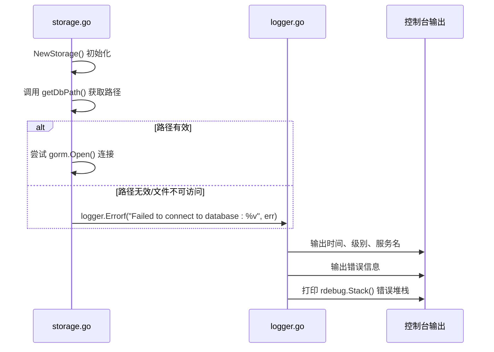

# 数据库连接失败

<cite>
**Referenced Files in This Document**  
- [storage.go](file://backend/storage/storage.go)
- [logger.go](file://backend/pkg/logger/logger.go)
- [main.go](file://main.go)
- [service.go](file://backend/service/service.go)
</cite>

## 目录
1. [问题概述](#问题概述)
2. [核心机制分析](#核心机制分析)
3. [日志诊断与错误堆栈](#日志诊断与错误堆栈)
4. [环境变量配置方法](#环境变量配置方法)
5. [应用配置自定义](#应用配置自定义)
6. [调试技巧](#调试技巧)
7. [总结](#总结)

## 问题概述

当环境变量 `LEMONTEA_DB_PATH` 未设置或指定路径无效时，应用程序将无法成功建立数据库连接。此问题通常表现为应用启动失败、数据持久化异常或服务初始化错误。根本原因在于 `storage.go` 文件中的 `getDbPath` 函数依赖该环境变量来确定数据库文件的存储位置。若变量缺失或路径不可写，将导致 SQLite 数据库初始化失败，进而中断整个应用的数据层服务。

## 核心机制分析

`getDbPath` 函数负责解析环境变量并构造数据库连接字符串（DSN），其逻辑直接决定了数据库文件的存储位置。



**Diagram sources**  
- [storage.go](file://backend/storage/storage.go#L64-L82)

该函数首先检查 `LEMONTEA_DB_PATH` 是否存在且非空。如果存在，则直接返回该路径作为数据库文件位置。否则，函数将使用 `os.UserHomeDir()` 获取当前用户的主目录，并在此基础上构建默认路径 `~/lemontea/data.db`。在返回路径前，`os.MkdirAll` 会确保目标目录结构已创建，避免因目录缺失导致的写入失败。

**Section sources**  
- [storage.go](file://backend/storage/storage.go#L64-L82)

## 日志诊断与错误堆栈

当数据库连接失败时，系统通过 `logger.go` 提供详细的日志输出和错误堆栈，帮助开发者快速定位问题根源。



**Diagram sources**  
- [storage.go](file://backend/storage/storage.go#L15-L20)
- [logger.go](file://backend/pkg/logger/logger.go#L75-L90)

`NewStorage` 函数在调用 `gorm.Open` 失败后，会立即通过 `logger.Errorf` 记录错误。`logger.go` 中的 `standerLog` 方法不仅会格式化输出时间戳、日志级别和错误信息，更重要的是，当级别为 "ERROR" 或 "PANIC" 时，它会自动调用 `rdebug.Stack()` 打印完整的运行时堆栈跟踪。这使得开发者能够清晰地看到错误是从 `NewStorage` 发起，并经过 `getDbPath` 路径解析的完整调用链。

**Section sources**  
- [storage.go](file://backend/storage/storage.go#L15-L20)
- [logger.go](file://backend/pkg/logger/logger.go#L75-L90)

## 环境变量配置方法

为避免因 `LEMONTEA_DB_PATH` 未设置导致的连接失败，开发者应在启动应用前正确配置该环境变量。以下是在不同操作系统下的设置示例：

**Linux/macOS (Bash/Zsh):**
```bash
# 临时设置（仅在当前终端会话有效）
export LEMONTEA_DB_PATH="/path/to/custom/database.db"
./lemon_tea_desktop

# 永久设置（添加到 shell 配置文件）
echo 'export LEMONTEA_DB_PATH="/path/to/custom/database.db"' >> ~/.zshrc
source ~/.zshrc
```

**Windows (命令提示符):**
```cmd
# 临时设置
set LEMONTEA_DB_PATH=C:\path\to\custom\database.db
lemon_tea_desktop.exe

# 永久设置
setx LEMONTEA_DB_PATH "C:\path\to\custom\database.db"
```

**Windows (PowerShell):**
```powershell
# 临时设置
$env:LEMONTEA_DB_PATH = "C:\path\to\custom\database.db"
.\lemon_tea_desktop.exe

# 永久设置（用户级别）
[Environment]::SetEnvironmentVariable("LEMONTEA_DB_PATH", "C:\path\to\custom\database.db", "User")
```

**Section sources**  
- [storage.go](file://backend/storage/storage.go#L64-L65)

## 应用配置自定义

除了通过环境变量配置，开发者也可以通过修改 `main.go` 中的应用初始化逻辑来自定义数据库路径。虽然 `main.go` 本身不直接处理数据库连接，但它是整个应用服务的入口点。

```mermaid
graph TB
subgraph main.go
App[application.New] --> Services["Services: []application.Service"]
Services --> ServiceInstance["NewService()"]
end
subgraph service.go
ServiceInstance --> ServiceStartup["ServiceStartup(ctx, options)"]
ServiceStartup --> NewStorage["storage.NewStorage()"]
end
subgraph storage.go
NewStorage --> GetDbPath["getDbPath()"]
GetDbPath --> EnvCheck["os.Getenv(\"LEMONTEA_DB_PATH\")"]
EnvCheck --> |Not Set| DefaultPath["~/lemontea/data.db"]
end
style main.go fill:#f9f,stroke:#333
style service.go fill:#bbf,stroke:#333
style storage.go fill:#f96,stroke:#333
```

**Diagram sources**  
- [main.go](file://main.go#L15-L20)
- [service.go](file://backend/service/service.go#L15-L25)
- [storage.go](file://backend/storage/storage.go#L10-L12)

`main.go` 通过 `application.NewService` 注册了 `service.NewService()` 实例。当应用启动时，Wails 框架会调用 `ServiceStartup` 方法，该方法内部创建了 `storage.Storage` 实例。因此，若需更深层次的自定义（如注入配置对象），应在 `service.go` 的 `ServiceStartup` 中进行修改，而非直接改动 `main.go`。

**Section sources**  
- [main.go](file://main.go#L15-L20)
- [service.go](file://backend/service/service.go#L15-L25)

## 调试技巧

为了有效调试数据库连接问题，建议采用以下技巧：

1.  **打印实际连接字符串**：在 `storage.go` 的 `NewStorage` 函数中，于 `gorm.Open` 调用前添加日志，打印 `dbPath` 变量的值，确认最终使用的路径是否符合预期。
2.  **验证 SQLite 驱动加载状态**：确保 `gorm.io/driver/sqlite` 包已正确导入且版本兼容。可通过 `go list -m all | grep gorm` 检查依赖版本。
3.  **检查文件权限**：确认应用进程对 `LEMONTEA_DB_PATH` 指定的目录和文件具有读写权限。在 Unix 系统上，可使用 `ls -la /path/to/db` 检查。
4.  **手动创建测试连接**：使用 `sqlite3` 命令行工具或数据库浏览器手动打开目标 `.db` 文件，验证文件是否可访问且未被锁定。

**Section sources**  
- [storage.go](file://backend/storage/storage.go#L10-L15)

## 总结

数据库连接失败的根本原因在于 `LEMONTEA_DB_PATH` 环境变量的缺失或路径无效，这直接导致 `getDbPath` 函数无法提供有效的数据库文件位置。通过 `logger.go` 提供的详细错误日志和堆栈跟踪，开发者可以快速识别此问题。解决方案包括正确设置环境变量、理解默认路径的生成逻辑，以及利用 `main.go` 和 `service.go` 构成的应用初始化流程进行自定义配置。结合有效的调试技巧，可以确保数据库层的稳定运行。