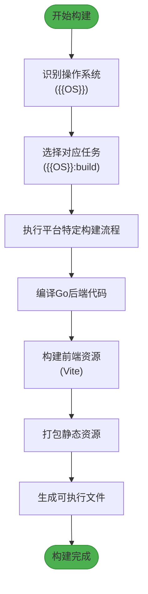

# 构建失败问题排查

<cite>
**本文档引用文件**  
- [main.go](file://main.go)
- [Taskfile.yml](file://Taskfile.yml)
- [README.md](file://README.md)
- [backend/service/service.go](file://backend/service/service.go)
- [frontend/src/utils/errorHandler.ts](file://frontend/src/utils/errorHandler.ts)
- [backend/pkg/logger/logger.go](file://backend/pkg/logger/logger.go)
- [backend/utils/ierror/common.go](file://backend/utils/ierror/common.go)
</cite>

## 目录
1. [简介](#简介)
2. [常见构建错误类型](#常见构建错误类型)
3. [环境检查与诊断](#环境检查与诊断)
4. [构建工具链安装指南](#构建工具链安装指南)
5. [使用Taskfile.yml进行跨平台构建](#使用taskfileyml进行跨平台构建)
6. [构建中断点定位与恢复](#构建中断点定位与恢复)
7. [错误日志分析与解决方案](#错误日志分析与解决方案)
8. [总结](#总结)

## 简介
本文档旨在全面分析在使用 Wails3 框架构建桌面应用程序过程中可能遇到的各类构建失败问题。涵盖从开发环境配置、依赖缺失到前端构建脚本执行失败等典型场景，并提供详细的错误日志示例、根本原因分析及分步解决方法。同时指导开发者如何通过 `wails3 doctor` 命令检查环境健康状态，正确安装构建工具链，并利用 `Taskfile.yml` 实现跨平台自动化构建。

**Section sources**
- [README.md](file://README.md#L0-L59)

## 常见构建错误类型
在构建基于 Wails3 的项目时，常见的错误主要包括以下几类：

1. **Wails3 CLI 工具未安装或版本不匹配**
2. **Go 开发环境配置异常（如 GOPATH、GOROOT 设置错误）**
3. **Node.js 及 npm/yarn 依赖缺失或版本不兼容**
4. **前端构建脚本（Vite）执行失败**
5. **跨平台构建任务配置错误**
6. **权限不足或路径访问异常**

这些错误通常会导致构建流程中断，表现为编译失败、依赖下载失败或打包过程异常。

**Section sources**
- [README.md](file://README.md#L0-L59)
- [Taskfile.yml](file://Taskfile.yml#L0-L32)

## 环境检查与诊断
在开始构建前，建议首先运行 `wails3 doctor` 命令来检查开发环境的健康状态。该命令会自动检测以下内容：

- Go 编译器是否已安装并配置正确
- Node.js 和 npm/yarn 是否可用
- Wails3 CLI 工具版本是否匹配
- 必要的系统构建工具（如 make、gcc 等）是否存在
- 前端依赖是否完整

执行命令：
```bash
wails3 doctor
```

输出示例：
```
✅ Go: Installed (v1.21.0)
✅ Node.js: Installed (v18.17.0)
✅ NPM: Installed (v9.6.7)
✅ Wails CLI: Installed (v3.0.0-alpha)
✅ Build Tools: Available
```

若发现任何 `❌` 标记项，则需根据提示进行修复。

**Section sources**
- [README.md](file://README.md#L0-L59)

## 构建工具链安装指南
为确保构建成功，必须正确安装以下工具链：

### 1. 安装 Go
确保安装 Go 1.19 或更高版本。可通过以下命令验证：
```bash
go version
```

### 2. 安装 Node.js
推荐使用 Node.js v16 或 v18 LTS 版本。可通过以下命令验证：
```bash
node -v
npm -v
```

### 3. 安装 Wails3 CLI
通过以下命令全局安装 Wails3 CLI：
```bash
npm install -g wails3
```

验证安装：
```bash
wails3 --version
```

### 4. 安装前端依赖
进入 `frontend` 目录并安装依赖：
```bash
cd frontend
npm install
```

**Section sources**
- [README.md](file://README.md#L0-L59)
- [Taskfile.yml](file://Taskfile.yml#L0-L32)

## 使用Taskfile.yml进行跨平台构建
本项目使用 `Taskfile.yml` 实现跨平台构建任务管理。该文件定义了针对不同操作系统的构建、打包和运行任务。

### Taskfile.yml 结构解析
```yaml
version: '3'

includes:
  common: ./build/Taskfile.yml
  windows: ./build/windows/Taskfile.yml
  darwin: ./build/darwin/Taskfile.yml
  linux: ./build/linux/Taskfile.yml

vars:
  APP_NAME: "lemon_tea_desktop"
  BIN_DIR: "bin"
  VITE_PORT: '{{.WAILS_VITE_PORT | default 9245}}'

tasks:
  build:
    summary: 构建应用程序
    cmds:
      - task: "{{OS}}:build"

  package:
    summary: 打包生产版本
    cmds:
      - task: "{{OS}}:package"

  run:
    summary: 运行应用程序
    cmds:
      - task: "{{OS}}:run"

  dev:
    summary: 开发模式运行
    cmds:
      - wails3 dev -config ./build/config.yml -port {{.VITE_PORT}}
```

### 构建命令说明
- `task build`：根据当前操作系统调用对应平台的构建任务
- `task package`：生成可分发的安装包
- `task run`：运行应用（非开发模式）
- `task dev`：启动开发服务器，支持热重载

支持的操作系统包括 Windows、macOS（Darwin）和 Linux，各自的任务定义位于 `build/{platform}/Taskfile.yml`。

**Diagram sources**
- [Taskfile.yml](file://Taskfile.yml#L0-L32)



**Diagram sources**
- [Taskfile.yml](file://Taskfile.yml#L0-L32)
- [main.go](file://main.go#L0-L58)

## 构建中断点定位与恢复
当构建过程中断时，可按以下步骤进行定位与恢复：

### 1. 查看错误日志
构建失败时，终端会输出详细错误信息。重点关注：
- 错误类型（如编译错误、依赖缺失、权限问题）
- 出错文件路径与行号
- 堆栈跟踪信息

### 2. 检查依赖完整性
运行以下命令确保前后端依赖均完整：
```bash
# 检查Go模块
go mod tidy

# 检查前端依赖
cd frontend && npm install
```

### 3. 清理缓存并重新构建
有时缓存可能导致构建异常，建议清理后重试：
```bash
# 清理Wails缓存
wails3 clean

# 删除前端构建产物
rm -rf frontend/dist

# 重新构建
task build
```

### 4. 分阶段执行构建任务
可通过手动分步执行构建流程来定位问题：
```bash
# 仅构建前端
cd frontend && npm run build

# 仅编译Go程序
wails3 build --skip-frontend
```

**Section sources**
- [Taskfile.yml](file://Taskfile.yml#L0-L32)
- [main.go](file://main.go#L0-L58)

## 错误日志分析与解决方案
以下是几种典型错误的日志示例及其解决方案。

### 错误1：Wails3 CLI 未安装
**错误日志：**
```
zsh: command not found: wails3
```

**根本原因：** Wails3 CLI 工具未全局安装。

**解决方案：**
```bash
npm install -g wails3
```

### 错误2：Go 模块下载失败
**错误日志：**
```
go: failed to download gitlab.linhf.cn/project/lemontea/lemon_tea_desktop/backend/service: malformed module path "gitlab.linhf.cn/project/lemontea/lemon_tea_desktop/backend/service": missing dot in first path element
```

**根本原因：** Go 模块路径格式不正确或网络无法访问私有仓库。

**解决方案：**
1. 确保 `go env -w GOPRIVATE=gitlab.linhf.cn/*`
2. 配置 SSH 密钥以访问私有仓库
3. 使用代理（如企业内网）：
   ```bash
   go env -w GOPROXY=https://goproxy.cn,direct
   ```

### 错误3：前端依赖缺失
**错误日志：**
```
Error: Cannot find module 'vite'
```

**根本原因：** `node_modules` 缺失或未安装依赖。

**解决方案：**
```bash
cd frontend
npm install
```

### 错误4：构建脚本权限不足
**错误日志：**
```
EACCES: permission denied, mkdir '/usr/local/lib/wails'
```

**根本原因：** 当前用户无权写入系统目录。

**解决方案：**
1. 使用 `sudo` 提权（不推荐）
2. 修改 npm 全局安装路径：
   ```bash
   npm config set prefix ~/.npm-global
   export PATH=~/.npm-global/bin:$PATH
   ```

### 错误5：跨平台构建任务未定义
**错误日志：**
```
Task "windows:build" not found
```

**根本原因：** `Taskfile.yml` 中未包含对应平台的任务定义。

**解决方案：**
检查 `includes` 是否正确引用了平台特定的 Taskfile：
```yaml
includes:
  windows: ./build/windows/Taskfile.yml
```

确保该文件存在且语法正确。

**Section sources**
- [README.md](file://README.md#L0-L59)
- [Taskfile.yml](file://Taskfile.yml#L0-L32)
- [backend/utils/ierror/common.go](file://backend/utils/ierror/common.go#L0-L19)
- [frontend/src/utils/errorHandler.ts](file://frontend/src/utils/errorHandler.ts#L39-L128)

## 总结
构建失败是开发过程中常见的挑战，但通过系统化的诊断与修复流程可以有效解决。关键在于：
1. 使用 `wails3 doctor` 提前检查环境健康状态
2. 正确安装 Go、Node.js 和 Wails3 CLI 工具链
3. 理解 `Taskfile.yml` 的跨平台构建机制
4. 能够根据错误日志快速定位问题根源
5. 掌握分步构建与缓存清理技巧

遵循本文档提供的方法，开发者可显著提升构建成功率，减少环境相关问题带来的开发阻塞。