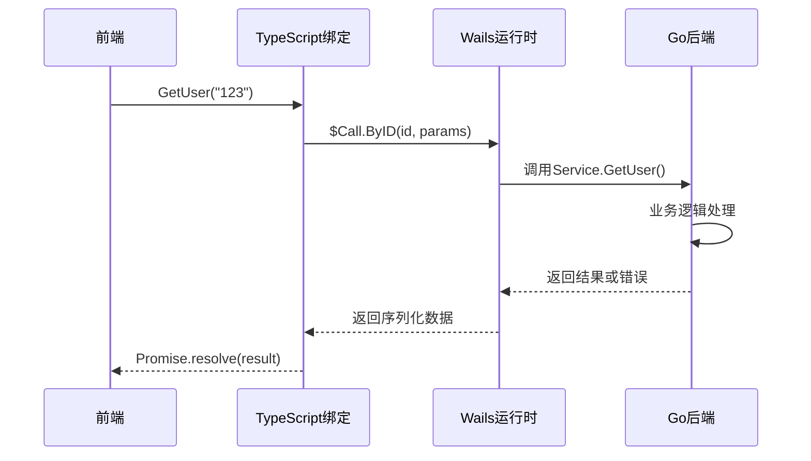

# API扩展指南

<cite>
**本文档引用的文件**  
- [main.go](file://main.go)
- [service/service.go](file://backend/service/service.go)
- [service/chat.go](file://backend/service/chat.go)
- [service/models.go](file://backend/service/models.go)
- [service/provider.go](file://backend/service/provider.go)
- [service/settings.go](file://backend/service/settings.go)
- [utils/ierror/common.go](file://backend/utils/ierror/common.go)
- [frontend/bindings/gitlab.linhf.cn/project/lemontea/lemon_tea_desktop/backend/service/service.ts](file://frontend/bindings/gitlab.linhf.cn/project/lemontea/lemon_tea_desktop/backend/service/service.ts)
</cite>

## 目录
1. [简介](#简介)
2. [项目结构概览](#项目结构概览)
3. [核心服务注册机制](#核心服务注册机制)
4. [添加新的后端API方法](#添加新的后端API方法)
5. [前端TypeScript绑定生成](#前端TypeScript绑定生成)
6. [前端调用新API](#前端调用新API)
7. [参数传递与返回值处理](#参数传递与返回值处理)
8. [错误处理与ierror机制](#错误处理与ierror机制)
9. [跨域调试配置](#跨域调试配置)
10. [接口版本管理策略](#接口版本管理策略)
11. [完整示例：添加GetUser方法](#完整示例：添加GetUser方法)
12. [最佳实践与注意事项](#最佳实践与注意事项)

## 简介
本文档详细说明如何在本Wails3项目中扩展新的Go后端API方法，并将其暴露给前端调用。涵盖从服务定义、注册、绑定生成到前端调用的完整流程，同时解释错误处理、跨域调试和版本管理等关键机制。

## 项目结构概览
本项目采用前后端分离架构，后端使用Go语言开发，前端使用TypeScript。关键目录包括：
- `backend/service/`：核心业务逻辑和服务方法
- `frontend/bindings/`：自动生成的前端TypeScript绑定
- `main.go`：应用入口和全局服务注册

```mermaid
graph TB
subgraph "Backend"
S[Service Methods]
ST[service.go]
M[Models]
U[Utils]
end
subgraph "Frontend"
B[Bindings]
C[Components]
H[Hooks]
end
ST --> B : wails generate
C --> B : import & call
```

**图示来源**  
- [main.go](file://main.go#L1-L60)
- [service/service.go](file://backend/service/service.go#L1-L30)

## 核心服务注册机制
所有后端服务通过`application.NewService()`注册，并在`main.go`中统一注入。`NewService()`函数返回`*Service`实例，该实例包含所有导出的方法。

```go
app := application.New(application.Options{
    Services: []application.Service{
        application.NewService(service.NewService()),
    },
})
```

**关键点**：
- 服务方法必须是`*Service`类型的方法
- 方法需为导出（首字母大写）
- 方法签名需符合Wails3规范

**中文来源**  
- [main.go](file://main.go#L15-L20)
- [service/service.go](file://backend/service/service.go#L8-L13)

## 添加新的后端API方法
在`backend/service/`目录下创建新的服务文件（如`user.go`），并实现方法。方法需使用Wails注释标记。

```go
// GetUser 获取用户信息
func (s *Service) GetUser(userID string) (*view_models.User, error) {
    user, err := s.storage.GetUser(context.Background(), userID)
    if err != nil {
        return nil, ierror.NewError(err)
    }
    return &view_models.User{
        ID:    user.ID,
        Name:  user.Name,
        Email: user.Email,
    }, nil
}
```

**中文来源**  
- [service/chat.go](file://backend/service/chat.go#L10-L207)
- [service/models.go](file://backend/service/models.go#L10-L33)

## 前端TypeScript绑定生成
运行`wails generate`命令生成前端TypeScript绑定。该命令会扫描所有导出的服务方法，并生成对应的TypeScript接口。

```bash
wails3 generate
```

生成的绑定文件位于`frontend/bindings/`目录下，例如：
- `frontend/bindings/gitlab.linhf.cn/project/lemontea/lemon_tea_desktop/backend/service/service.ts`

```typescript
/**
 * GetUser 获取用户信息
 */
export function GetUser(userID: string): $CancellablePromise<view_models$0.User | null> {
    return $Call.ByID(1234567890, userID).then(($result: any) => {
        return $$createTypeUser($result);
    });
}
```

**中文来源**  
- [service/service.go](file://backend/service/service.go#L8-L13)
- [frontend/bindings/gitlab.linhf.cn/project/lemontea/lemon_tea_desktop/backend/service/service.ts](file://frontend/bindings/gitlab.linhf.cn/project/lemontea/lemon_tea_desktop/backend/service/service.ts#L0-L125)

## 前端调用新API
在前端组件中导入生成的绑定并调用API方法。

```typescript
import { GetUser } from '@/bindings/gitlab.linhf.cn/project/lemontea/lemon_tea_desktop/backend/service/service';

async function fetchUser() {
    try {
        const user = await GetUser('123');
        console.log('用户信息:', user);
    } catch (error) {
        console.error('获取用户失败:', error);
    }
}
```

**中文来源**  
- [frontend/bindings/gitlab.linhf.cn/project/lemontea/lemon_tea_desktop/backend/service/service.ts](file://frontend/bindings/gitlab.linhf.cn/project/lemontea/lemon_tea_desktop/backend/service/service.ts#L0-L125)
- [frontend/src/components/Profile.tsx](file://frontend/src/pages/Profile.tsx)

## 参数传递与返回值处理
Wails3自动处理Go与TypeScript之间的类型映射。基本类型和结构体可直接传递。

**参数传递规则**：
- 基本类型：string, number, boolean
- 结构体：需定义在`models/view_models/`中
- 上下文：context.Context自动注入

**返回值处理**：
- 成功：返回Promise.resolve(result)
- 失败：返回Promise.reject(error)



**图示来源**  
- [service/service.go](file://backend/service/service.go#L8-L13)
- [frontend/bindings/gitlab.linhf.cn/project/lemontea/lemon_tea_desktop/backend/service/service.ts](file://frontend/bindings/gitlab.linhf.cn/project/lemontea/lemon_tea_desktop/backend/service/service.ts#L0-L125)

## 错误处理与ierror机制
项目使用`ierror`包进行统一错误处理。所有服务方法应返回`ierror.IError`类型错误。

```go
package ierror

type IError struct {
    errCode ErrorCode
}

func (e IError) Error() string {
    return string(e.errCode)
}

func New(errCode ErrorCode) error {
    return IError{errCode: errCode}
}

func NewError(err error) error {
    logger.Error(err)
    return IError{errCode: ErrCodeInternalError}
}
```

**错误处理流程**：
1. 服务方法中使用`ierror.NewError(err)`包装错误
2. Wails运行时自动序列化错误
3. 前端Promise.reject包含错误信息

**中文来源**  
- [utils/ierror/common.go](file://backend/utils/ierror/common.go#L1-L20)
- [service/chat.go](file://backend/service/chat.go#L15-L207)

## 跨域调试配置
Wails3内置开发服务器支持跨域调试。在开发模式下，前端通过`wails3 dev`启动，自动处理CORS。

**配置要点**：
- 开发模式：`wails3 dev`自动启用HMR和CORS
- 生产模式：静态资源由Go服务器提供，无跨域问题
- 自定义CORS：可通过`application.Options`配置

```go
app := application.New(application.Options{
    Assets: application.AssetOptions{
        Handler: application.AssetFileServerFS(assets),
        // 可添加CORS中间件
    },
})
```

**中文来源**  
- [main.go](file://main.go#L1-L60)
- [README.md](file://README.md#L1-L49)

## 接口版本管理策略
建议通过以下方式管理API版本：

1. **URL版本控制**：在路由中包含版本号
2. **服务分组**：按功能模块组织服务
3. **向后兼容**：避免破坏性变更

```go
// v1版本
func (s *Service) GetUserV1(userID string) (*view_models.UserV1, error) { ... }

// v2版本
func (s *Service) GetUserV2(userID string) (*view_models.UserV2, error) { ... }
```

**最佳实践**：
- 使用语义化版本号
- 文档化变更日志
- 逐步弃用旧版本

**中文来源**  
- [service/service.go](file://backend/service/service.go#L8-L13)
- [service/models.go](file://backend/service/models.go#L10-L33)

## 完整示例：添加GetUser方法
### 1. 创建服务方法
```go
// backend/service/user.go
func (s *Service) GetUser(userID string) (*view_models.User, error) {
    user, err := s.storage.GetUser(context.Background(), userID)
    if err != nil {
        return nil, ierror.NewError(err)
    }
    return &view_models.User{
        ID:    user.ID,
        Name:  user.Name,
        Email: user.Email,
    }, nil
}
```

### 2. 生成绑定
```bash
wails3 generate
```

### 3. 前端调用
```typescript
import { GetUser } from '@/bindings/.../service';

const user = await GetUser('123');
```

**中文来源**  
- [service/service.go](file://backend/service/service.go#L8-L13)
- [service/chat.go](file://backend/service/chat.go#L10-L207)
- [frontend/bindings/gitlab.linhf.cn/project/lemontea/lemon_tea_desktop/backend/service/service.ts](file://frontend/bindings/gitlab.linhf.cn/project/lemontea/lemon_tea_desktop/backend/service/service.ts#L0-L125)

## 最佳实践与注意事项
1. **命名规范**：使用驼峰命名法，注释清晰
2. **错误处理**：始终使用`ierror`包装错误
3. **类型安全**：确保模型定义完整
4. **性能考虑**：避免在UI线程中执行耗时操作
5. **测试**：为新API编写单元测试

**中文来源**  
- [service/service.go](file://backend/service/service.go#L8-L13)
- [utils/ierror/common.go](file://backend/utils/ierror/common.go#L1-L20)
- [main.go](file://main.go#L1-L60)