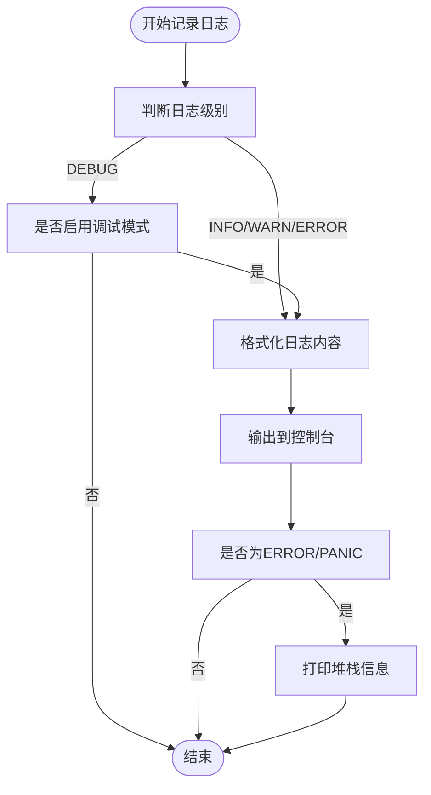
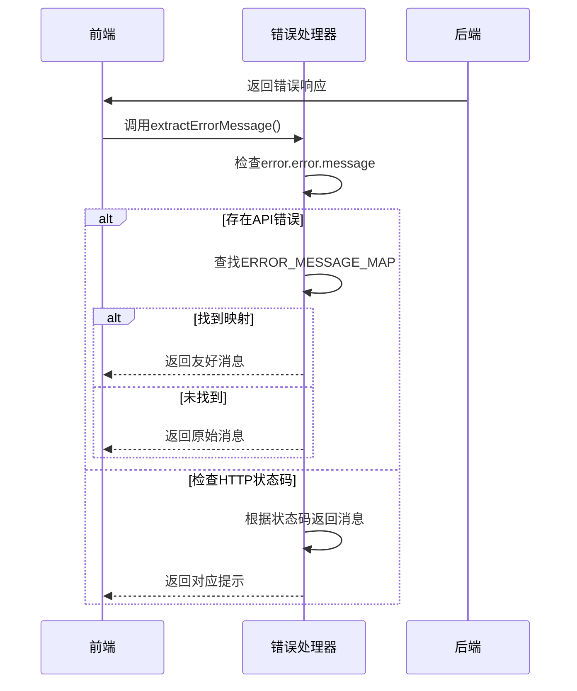
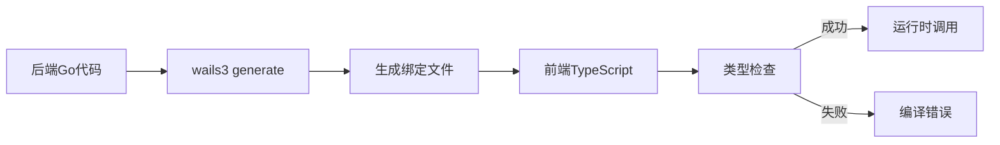
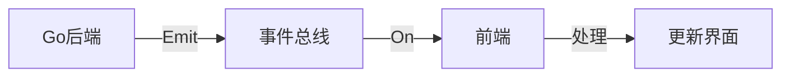
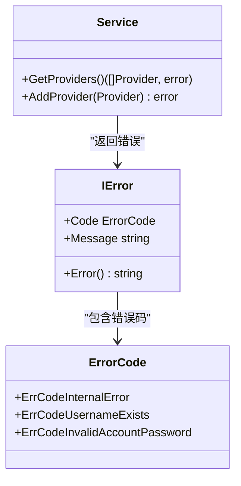

# 开发与调试指南

<cite>
**本文档引用的文件**
- [main.go](file://main.go)
- [backend/service/service.go](file://backend/service/service.go)
- [backend/service/chat.go](file://backend/service/chat.go)
- [backend/service/provider.go](file://backend/service/provider.go)
- [backend/pkg/logger/logger.go](file://backend/pkg/logger/logger.go)
- [backend/utils/ierror/code.go](file://backend/utils/ierror/code.go)
- [frontend/src/utils/errorHandler.ts](file://frontend/src/utils/errorHandler.ts)
- [frontend/bindings/gitlab.linhf.cn/project/lemontea/lemon_tea_desktop/backend/service/service.ts](file://frontend/bindings/gitlab.linhf.cn/project/lemontea/lemon_tea_desktop/backend/service/service.ts)
- [frontend/bindings/gitlab.linhf.cn/project/lemontea/lemon_tea_desktop/backend/models/view_models/models.ts](file://frontend/bindings/gitlab.linhf.cn/project/lemontea/lemon_tea_desktop/backend/models/view_models/models.ts)
</cite>

## 目录
1. [简介](#简介)
2. [添加新API的完整流程](#添加新api的完整流程)
3. [后端日志调试](#后端日志调试)
4. [前端错误处理](#前端错误处理)
5. [绑定类型更新](#绑定类型更新)
6. [调试技巧](#调试技巧)
7. [开发规范建议](#开发规范建议)

## 简介
本文档旨在为开发者提供本项目的扩展与调试指导。涵盖API扩展流程、日志调试、错误处理、类型绑定更新及开发规范等内容，帮助开发者高效参与项目开发。

## 添加新API的完整流程

### 1. 在service/中定义方法
在相应的服务文件（如`chat.go`或`provider.go`）中定义新的业务方法。方法应遵循清晰的命名规范，并使用`ierror`包处理错误。

例如，在`backend/service/chat.go`中添加新方法：
```go
func (s *Service) NewChatFeature(param string) (*view_models.Result, error) {
    // 业务逻辑实现
    if param == "" {
        return nil, ierror.New(ierror.ErrCodeInvalidInput)
    }
    // ...
    return result, nil
}
```

### 2. 在service.go中注册服务
确保`NewService`函数返回的服务实例能被Wails框架正确注册。服务方法会自动通过反射暴露给前端。

在`backend/service/service.go`中：
```go
func NewService() *Service {
    return &Service{}
}
```

### 3. 前端通过bindings调用
Wails自动生成TypeScript绑定文件，前端可直接调用后端方法。

前端调用示例：
```ts
import { Service } from '@/bindings/gitlab.linhf.cn/project/lemontea/lemon_tea_desktop/backend/service';

try {
    const result = await Service.NewChatFeature("test");
} catch (error) {
    console.error("调用失败:", error);
}
```

**Section sources**
- [backend/service/chat.go](file://backend/service/chat.go#L1-L208)
- [backend/service/service.go](file://backend/service/service.go#L1-L30)
- [frontend/bindings/gitlab.linhf.cn/project/lemontea/lemon_tea_desktop/backend/service/service.ts](file://frontend/bindings/gitlab.linhf.cn/project/lemontea/lemon_tea_desktop/backend/service/service.ts#L1-L125)

## 后端日志调试

### 使用pkg/logger包输出日志
项目使用自定义`logger`包进行日志记录，支持多种日志级别和输出格式。

#### 日志级别
- `Infof`: 信息日志
- `Warmf`: 警告日志
- `Errorf`: 错误日志
- `Debugf`: 调试日志
- `Panicf`: 致命错误日志

#### 使用示例
```go
logger.Infof("用户 %s 登录成功", username)
logger.Errorf("数据库连接失败: %v", err)
logger.Debugf("请求参数: %+v", request)
```

日志输出包含时间、级别、调用文件、行号和函数名，便于定位问题。

#### 输出目标
日志默认输出到控制台，支持输出到文件（需配置）。错误和PANIC级别日志会自动打印堆栈信息。



**Diagram sources**
- [backend/pkg/logger/logger.go](file://backend/pkg/logger/logger.go#L1-L163)

**Section sources**
- [backend/pkg/logger/logger.go](file://backend/pkg/logger/logger.go#L1-L163)

## 前端错误处理

### errorHandler.ts错误捕获机制
前端通过`errorHandler.ts`统一处理后端异常，将技术性错误转换为用户友好的提示信息。

#### 错误映射机制
```ts
const ERROR_MESSAGE_MAP: Record<string, string> = {
    'ErrCodeInvalidAccountPassword': '用户名或密码错误',
    'ErrCodeAccountNotFound': '账户不存在',
    // ...
};
```

#### 错误提取流程


**Diagram sources**
- [frontend/src/utils/errorHandler.ts](file://frontend/src/utils/errorHandler.ts#L1-L180)

**Section sources**
- [frontend/src/utils/errorHandler.ts](file://frontend/src/utils/errorHandler.ts#L1-L180)
- [backend/utils/ierror/code.go](file://backend/utils/ierror/code.go#L1-L29)

## 绑定类型更新

### 使用wails generate更新绑定
当后端API变更时，需重新生成前端绑定类型。

#### 更新步骤
1. 修改后端服务方法
2. 运行生成命令：
   ```bash
   wails3 generate
   ```
3. 检查生成的绑定文件

#### 绑定文件结构
生成的绑定文件位于`frontend/bindings/`目录：
- `service.ts`: 服务方法的TypeScript声明
- `models.ts`: 数据模型类型定义

#### 类型安全保证
绑定文件确保前后端类型一致，提供编译时检查。



**Diagram sources**
- [frontend/bindings/gitlab.linhf.cn/project/lemontea/lemon_tea_desktop/backend/service/service.ts](file://frontend/bindings/gitlab.linhf.cn/project/lemontea/lemon_tea_desktop/backend/service/service.ts#L1-L125)
- [frontend/bindings/gitlab.linhf.cn/project/lemontea/lemon_tea_desktop/backend/models/view_models/models.ts](file://frontend/bindings/gitlab.linhf.cn/project/lemontea/lemon_tea_desktop/backend/models/view_models/models.ts#L1-L50)

## 调试技巧

### Go代码断点调试
使用支持Delve的IDE（如GoLand或VS Code）进行断点调试。

#### 调试配置
```json
{
    "type": "go",
    "request": "launch",
    "name": "Debug Wails App",
    "program": "${workspaceFolder}/main.go",
    "args": ["wails3", "dev"]
}
```

### 网络请求查看
通过浏览器开发者工具监控前后端通信。

#### 监控内容
- Wails RPC调用
- 事件流（Event Stream）
- 错误响应

### 事件流监控
项目使用事件系统进行实时通信。

#### 事件调试方法
1. 在`main.go`中查看事件发射：
   ```go
   app.Event.Emit("time", now)
   ```
2. 在前端监听事件：
   ```ts
   app.Event.On("time", callback)
   ```

#### 事件流示意图


**Section sources**
- [main.go](file://main.go#L1-L58)
- [frontend/bindings/gitlab.linhf.cn/project/lemontea/lemon_tea_desktop/backend/service/service.ts](file://frontend/bindings/gitlab.linhf.cn/project/lemontea/lemon_tea_desktop/backend/service/service.ts#L1-L125)

## 开发规范建议

### 接口命名一致性
遵循统一的命名规范：

#### 命名规则
- **动词+名词**：`GetProviders`, `DeleteChat`
- **驼峰命名**：`Completions`, `ChatMessages`
- **语义清晰**：避免缩写，如用`CollectionChat`而非`ColChat`

#### 示例对比
| 推荐 | 不推荐 |
|------|--------|
| `GetModels` | `FetchMod` |
| `UpdateProvider` | `ModProv` |
| `RenameChat` | `ChangeTitle` |

### 错误码定义规范
使用`ierror`包统一管理错误码。

#### 错误码命名
- 前缀`ErrCode`表示错误常量
- 使用有意义的描述性名称
- 避免数字编码

#### 错误码示例
```go
const (
    ErrCodeInternalError         ErrorCode = "ErrCodeInternalError"
    ErrCodeUsernameExists        ErrorCode = "ErrCodeUsernameExists"
    ErrCodeInvalidAccountPassword ErrorCode = "ErrCodeInvalidAccountPassword"
)
```

#### 错误处理最佳实践
1. **尽早定义**：在`code.go`中预先定义所有可能的错误码
2. **统一处理**：使用`ierror.New()`创建错误
3. **层级传递**：服务层错误应包装并传递，不丢失上下文



**Diagram sources**
- [backend/utils/ierror/code.go](file://backend/utils/ierror/code.go#L1-L29)

**Section sources**
- [backend/utils/ierror/code.go](file://backend/utils/ierror/code.go#L1-L29)
- [backend/service/chat.go](file://backend/service/chat.go#L1-L208)
- [backend/service/provider.go](file://backend/service/provider.go#L1-L146)