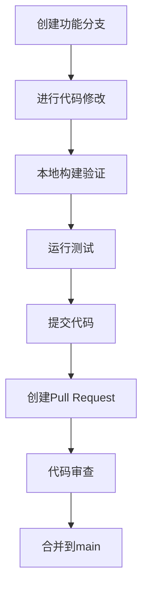

# 开发流程规范

<cite>
**本文档引用文件**  
- [Taskfile.yml](file://Taskfile.yml)
- [README.md](file://README.md)
- [frontend/doc/README.md](file://frontend/doc/README.md)
</cite>

## 目录
1. [分支管理策略](#分支管理策略)
2. [开发与测试流程](#开发与测试流程)
3. [提交信息规范](#提交信息规范)
4. [代码审查要求](#代码审查要求)
5. [完整流程示例](#完整流程示例)

## 分支管理策略

本项目采用功能分支开发模式（Feature Branch Workflow），确保代码质量和开发流程的可控性。

所有新功能开发和缺陷修复均需从 `main` 分支创建独立的功能分支。功能分支命名应具有描述性，建议采用 `feature/功能描述` 或 `fix/问题描述` 的格式，例如 `feature/user-authentication` 或 `fix/message-scrolling-bug`。

功能开发完成后，需通过 Pull Request (PR) 方式请求合并到 `main` 分支。`main` 分支作为主干分支，始终保持稳定和可部署状态。

**Section sources**
- [README.md](file://README.md#L1-L60)

## 开发与测试流程

本地开发环境的构建、运行和测试通过 `Taskfile.yml` 中定义的任务命令进行管理，确保开发环境的一致性。



**Diagram sources**
- [Taskfile.yml](file://Taskfile.yml#L1-L35)

开发人员应使用以下命令进行本地开发和验证：

- `task dev`：在开发模式下运行应用，支持热重载
- `task build`：构建应用
- `task run`：运行已构建的应用
- `task package`：打包生产版本

这些任务通过 Wails3 框架与 Go 后端和前端代码集成，确保前后端协同工作。

**Section sources**
- [Taskfile.yml](file://Taskfile.yml#L1-L35)

## 提交信息规范

每次代码提交必须包含清晰、规范的提交信息，遵循约定式提交（Conventional Commits）格式：`类型(范围): 描述`。

提交信息的类型（type）应从以下预定义类别中选择：
- `feat`：新增功能
- `fix`：修复缺陷
- `docs`：文档更新
- `style`：代码格式调整（不影响逻辑）
- `refactor`：代码重构
- `test`：测试相关修改
- `chore`：构建过程或辅助工具的变动

范围（scope）应指明修改影响的模块或组件，如 `chat`、`auth`、`ui` 等。

示例：
- `fix(chat): 修复消息滚动定位问题`
- `feat(auth): 添加用户登录功能`
- `docs(readme): 更新项目说明文档`

**Section sources**
- [README.md](file://README.md#L1-L60)

## 代码审查要求

所有 Pull Request 必须经过至少一名其他开发人员的代码审查（Code Review）后方可合并。代码审查重点关注以下方面：

1. **代码质量**：代码是否遵循项目编码规范，结构是否清晰，是否有重复代码
2. **错误处理**：是否妥善处理了各种异常情况和边界条件
3. **性能影响**：修改是否可能引入性能瓶颈，数据库查询是否优化
4. **安全性**：是否存在潜在的安全漏洞
5. **测试覆盖**：是否包含适当的单元测试和集成测试
6. **文档更新**：相关文档是否同步更新

审查人员应提供具体、建设性的反馈，作者应及时响应并修改代码。只有当所有审查意见都得到妥善处理后，PR 才能被合并。

**Section sources**
- [frontend/doc/README.md](file://frontend/doc/README.md#L1-L125)

## 完整流程示例

以下是一个完整的功能开发流程示例：

1. 从 `main` 分支创建新分支：
   ```bash
   git checkout main
   git pull origin main
   git checkout -b feature/new-chat-ui
   ```

2. 进行代码修改并使用本地任务验证：
   ```bash
   task dev
   # 在浏览器中测试功能
   ```

3. 提交代码并遵循提交信息规范：
   ```bash
   git add .
   git commit -m "feat(chat): 实现新的聊天界面布局"
   git push origin feature/new-chat-ui
   ```

4. 在代码托管平台创建 Pull Request，请求将 `feature/new-chat-ui` 合并到 `main` 分支。

5. 团队成员进行代码审查，提出修改意见。

6. 根据审查意见修改代码，提交新的 commit：
   ```bash
   git commit -m "refactor(chat): 优化聊天消息组件结构"
   git push origin feature/new-chat-ui
   ```

7. 审查通过后，将 PR 合并到 `main` 分支。

8. 删除已合并的功能分支：
   ```bash
   git checkout main
   git pull origin main
   git branch -d feature/new-chat-ui
   ```

此流程确保了代码质量，促进了知识共享，并维护了项目的稳定性和可维护性。

**Section sources**
- [Taskfile.yml](file://Taskfile.yml#L1-L35)
- [README.md](file://README.md#L1-L60)