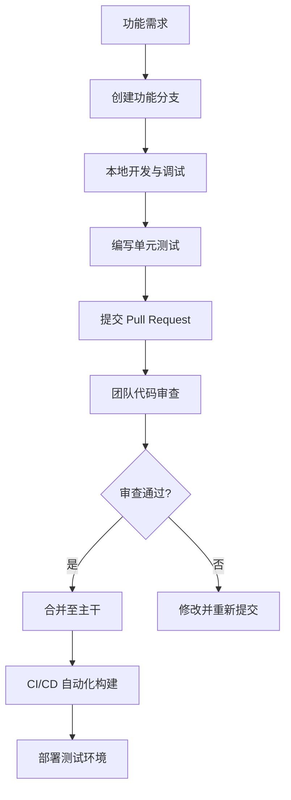

# 开发规范与最佳实践

<cite>
**本文档引用文件**  
- [code.go](file://backend/utils/ierror/code.go)
- [common.go](file://backend/utils/ierror/common.go)
- [errorHandler.ts](file://frontend/src/utils/errorHandler.ts)
- [authStore.ts](file://frontend/src/stores/authStore.ts)
- [index.ts](file://frontend/src/stores/index.ts)
- [useModels.ts](file://frontend/src/hooks/useModels.ts)
</cite>

## 目录
1. [简介](#简介)
2. [后端错误处理规范](#后端错误处理规范)
3. [前端错误处理与用户反馈](#前端错误处理与用户反馈)
4. [接口命名与语义一致性](#接口命名与语义一致性)
5. [前端状态管理规范](#前端状态管理规范)
6. [React Hooks 使用规范](#react-hooks-使用规范)
7. [代码格式化与风格统一](#代码格式化与风格统一)
8. [开发流程与协作规范](#开发流程与协作规范)
9. [正确与错误实现对比示例](#正确与错误实现对比示例)
10. [结论](#结论)

## 简介
本文档旨在为 `lemon_tea_desktop` 项目制定统一的开发规范与最佳实践，涵盖后端错误码体系、前后端接口命名、前端状态管理、代码风格及开发流程等方面。通过标准化设计，提升代码可维护性、团队协作效率和用户体验一致性。

## 后端错误处理规范

本项目后端采用 `ierror` 包实现标准化错误处理，确保所有错误具备明确语义和统一结构。

### 错误码定义
所有错误码均在 `backend/utils/ierror/code.go` 中定义为 `ErrorCode` 类型的常量，采用统一前缀 `ErrCode`，例如：
- `ErrCodeInternalError`：系统内部错误
- `ErrCodeInvalidInput`：输入数据格式不正确
- `ErrCodeModelNotFound`：模型不存在
- `ErrCodeChatNotFound`：对话不存在

该设计确保错误语义清晰且易于国际化处理。

### 错误创建与封装
通过 `ierror.New(errCode)` 创建标准化错误对象，封装为 `IError` 类型，实现 `error` 接口。核心方法包括：
- `New(errCode ErrorCode)`：根据错误码创建错误
- `NewError(err error)`：将普通错误包装为内部错误并记录日志

此机制确保所有错误均可追溯且日志记录完整。

**Section sources**
- [code.go](file://backend/utils/ierror/code.go#L1-L28)
- [common.go](file://backend/utils/ierror/common.go#L4-L20)

## 前端错误处理与用户反馈

前端通过 `errorHandler.ts` 实现错误映射机制，将后端错误码转换为用户友好的提示信息。

### 错误消息映射
定义 `ERROR_MESSAGE_MAP` 对象，将后端错误码映射为中文提示：
```ts
'ErrCodeInvalidInput': '输入数据格式不正确',
'ErrCodeDataNotFound': '数据不存在',
'ErrCodeInternalError': '系统内部错误，请联系技术支持'
```

### 错误提取与展示
提供 `extractErrorMessage(error)` 工具函数，自动从 Axios 错误或其他异常中提取错误码，并查找对应友好消息。若未找到匹配项，则返回默认提示“操作失败，请稍后重试”。

该机制保障用户始终获得可理解的反馈，避免暴露技术细节。

**Section sources**
- [errorHandler.ts](file://frontend/src/utils/errorHandler.ts#L39-L82)
- [errorHandler.ts](file://frontend/src/utils/errorHandler.ts#L130-L178)

## 接口命名与语义一致性

### 命名规范
所有 API 接口命名采用**驼峰式**（CamelCase），并遵循 **动词 + 名词** 的清晰语义结构：
- `GetChatList`：获取聊天列表
- `GetModels`：获取模型列表
- `CreateChat`：创建新聊天
- `DeleteChat`：删除指定聊天

该命名方式增强可读性，便于开发者快速理解接口用途。

### 前后端一致性
前后端共享相同的错误码体系（如 `ErrCodeChatNotFound`），确保错误语义在全链路中保持一致。前端可根据错误码精准展示对应提示，无需解析模糊的 HTTP 状态码或原始错误信息。

**Section sources**
- [service.ts](file://frontend/bindings/gitlab.linhf.cn/project/lemontea/lemon_tea_desktop/backend/service/service.ts)
- [useModels.ts](file://frontend/src/hooks/useModels.ts#L50-L60)

## 前端状态管理规范

### Zustand 单一 Store 模式
项目采用 Zustand 作为状态管理库，遵循**单一 store**原则，所有全局状态集中管理于 `src/stores` 目录下。

#### 认证状态管理
`authStore.ts` 定义了用户认证相关状态：
- `user`: 当前用户信息
- `token`: 认证令牌
- `isAuthenticated`: 登录状态
- `isLoading`: 加载状态
- `error`: 错误信息

使用 `persist` 中间件实现状态持久化，关键数据（如用户信息、token）自动保存至本地存储，避免页面刷新后丢失。

#### Store 初始化
通过 `initializeStores()` 函数统一初始化所有 store，目前仅初始化 `authStore`。提供 `resetAllStores()` 函数用于登出时重置所有状态。

```ts
export const initializeStores = () => {
  initializeAuth();
};

export const resetAllStores = () => {
  useAuthStore.getState().logout();
};
```

**Section sources**
- [authStore.ts](file://frontend/src/stores/authStore.ts#L1-L82)
- [index.ts](file://frontend/src/stores/index.ts#L1-L16)

## React Hooks 使用规范

### 自定义 Hook 设计
项目通过自定义 Hook 封装业务逻辑，提升组件复用性和可测试性。以 `useModels` 为例：

#### 功能职责
- 调用 `Service.GetModels()` 获取模型列表
- 将后端数据转换为前端可用格式
- 管理加载状态、错误信息
- 提供 `refetch` 方法支持手动刷新

#### 避免不必要重渲染
- 使用 `useCallback` 缓存 `fetchModels` 函数，防止因函数引用变化导致子组件重渲染
- 使用 `useState` 精确控制状态更新粒度
- 默认提供模拟数据作为后备，保障 UI 稳定性

```ts
const fetchModels = useCallback(async () => { ... }, []);
```

**Section sources**
- [useModels.ts](file://frontend/src/hooks/useModels.ts#L1-L150)

## 代码格式化与风格统一

### 后端格式化
- 使用 `gofmt` 统一 Go 代码风格
- 所有 `.go` 文件在提交前必须通过 `gofmt -s -w .` 格式化

### 前端格式化
- 使用 `Prettier` 统一 TypeScript/SCSS 代码风格
- 配置 `.prettierrc` 文件定义缩进、引号、换行等规则
- 所有前端代码在提交前必须通过 `prettier --write` 格式化

该规范确保团队成员代码风格一致，减少代码审查中的格式争议。

## 开发流程与协作规范

建议采用以下标准开发流程：



**Diagram sources**
- [Taskfile.yml](file://Taskfile.yml)

### 关键步骤说明
1. **功能分支开发**：基于 `main` 分支创建 `feature/xxx` 分支进行开发
2. **单元测试验证**：确保新增功能具备充分的单元测试覆盖
3. **PR 代码审查**：至少一名团队成员审查代码逻辑、规范符合性
4. **主干合并**：审查通过后合并至 `main` 分支，触发 CI/CD 流程

## 正确与错误实现对比示例

### 错误处理：正确 vs 错误

#### ✅ 正确做法：使用标准错误码
```go
// 返回预定义的标准错误
return ierror.New(ierror.ErrCodeModelNotFound)
```

#### ❌ 错误做法：返回字符串错误
```go
// 避免直接返回字符串，无法统一处理
return errors.New("model not found")
```

**Section sources**
- [common.go](file://backend/utils/ierror/common.go#L15-L20)

### 状态管理：正确 vs 错误

#### ✅ 正确做法：使用 Zustand 持久化 store
```ts
// 状态自动持久化，刷新不丢失
useAuthStore.getState().setAuthState(user, token, true);
```

#### ❌ 错误做法：使用普通 useState 管理全局状态
```ts
// 状态无法持久化，刷新即丢失
const [user, setUser] = useState(null);
```

**Section sources**
- [authStore.ts](file://frontend/src/stores/authStore.ts#L30-L50)

### Hooks 使用：正确 vs 错误

#### ✅ 正确做法：使用 useCallback 避免重创建
```ts
const fetchModels = useCallback(async () => { ... }, []);
```

#### ❌ 错误做法：每次渲染都创建新函数
```ts
const fetchModels = async () => { ... }; // 每次渲染都不同
```

**Section sources**
- [useModels.ts](file://frontend/src/hooks/useModels.ts#L60-L70)

## 结论
本项目通过建立统一的错误码体系、规范化的接口命名、Zustand 单一 store 状态管理、React Hooks 最佳实践以及标准化的开发流程，构建了一套高效、可维护的全栈开发规范。所有开发者应严格遵守本指南，确保代码质量与团队协作效率。