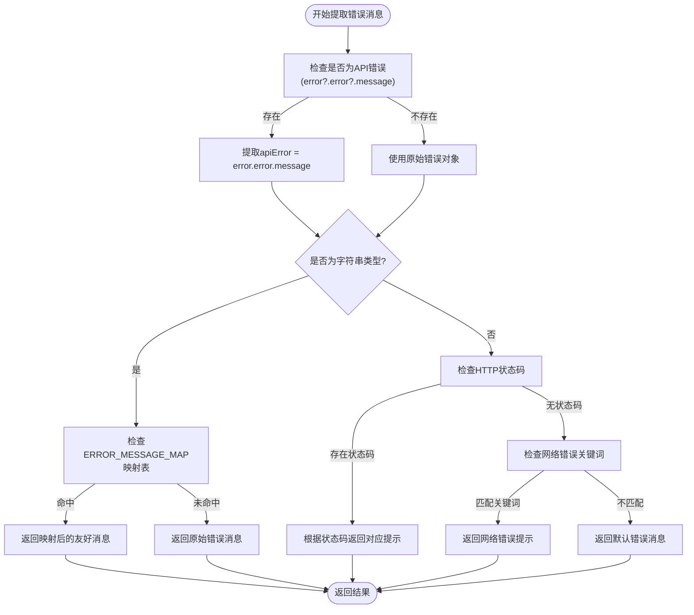
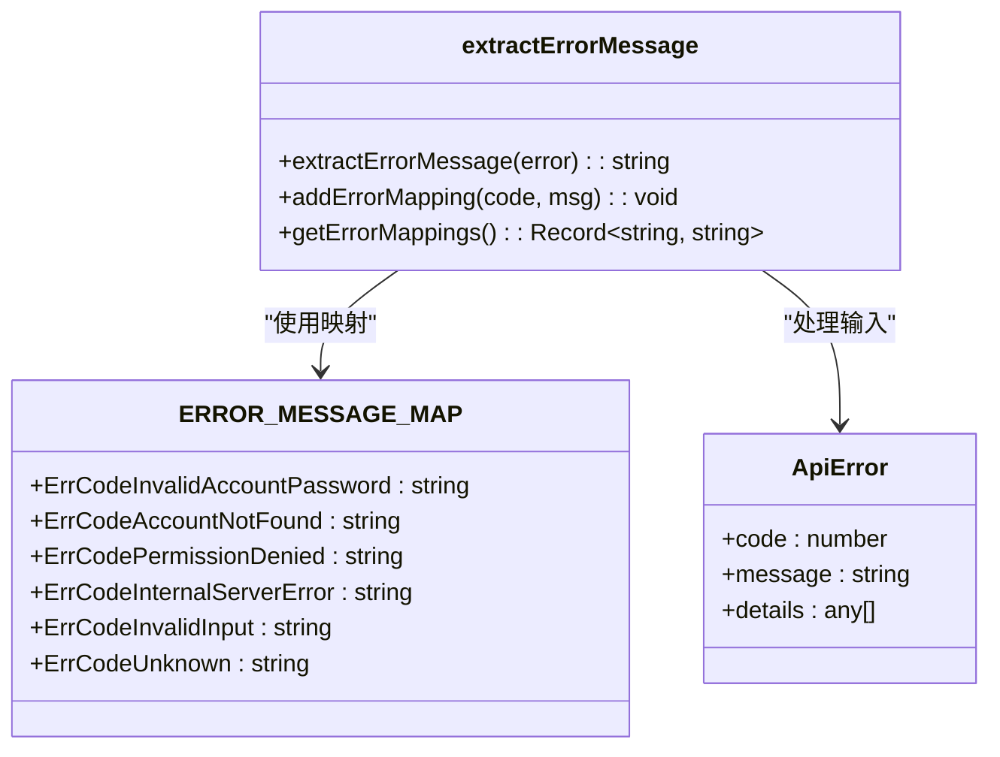
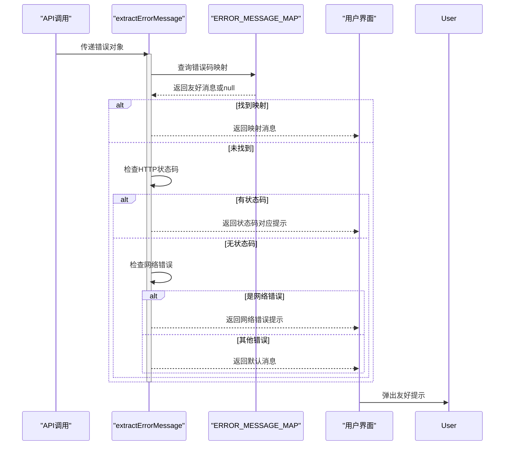

# 前端错误解析

<cite>
**本文档引用的文件**  
- [errorHandler.ts](file://frontend/src/utils/errorHandler.ts)
- [index.ts](file://frontend/src/types/index.ts)
- [notification.ts](file://frontend/src/utils/notification.ts)
- [common.go](file://backend/utils/ierror/common.go)
</cite>

## 目录
1. [简介](#简介)
2. [核心错误处理机制](#核心错误处理机制)
3. [错误消息提取流程](#错误消息提取流程)
4. [错误映射与降级策略](#错误映射与降级策略)
5. [HTTP状态码兜底处理](#http状态码兜底处理)
6. [网络异常特殊判断](#网络异常特殊判断)
7. [类型守卫函数isApiError](#类型守卫函数isapierror)
8. [完整错误处理链路示例](#完整错误处理链路示例)
9. [扩展与调试支持](#扩展与调试支持)

## 简介
本文档深入解析前端如何系统化处理来自后端的各类错误响应。重点阐述`extractErrorMessage`函数的工作机制，包括对AxiosError的识别、错误码字符串的提取、用户友好提示的映射逻辑，以及多层级的错误降级策略。同时说明网络连接异常和HTTP状态码的处理方式，并介绍类型安全相关的`isApiError`类型守卫函数。

## 核心错误处理机制

前端通过统一的错误处理器将原始错误转换为用户可理解的提示信息。该机制位于`errorHandler.ts`中，核心为`extractErrorMessage`函数，负责从复杂的错误对象中提取关键信息并转化为友好消息。

**Section sources**
- [errorHandler.ts](file://frontend/src/utils/errorHandler.ts#L62-L128)

## 错误消息提取流程

`extractErrorMessage`函数采用分层解析策略，优先尝试从错误对象中提取结构化API错误，再逐级降级到通用处理。



**Diagram sources**
- [errorHandler.ts](file://frontend/src/utils/errorHandler.ts#L62-L128)

**Section sources**
- [errorHandler.ts](file://frontend/src/utils/errorHandler.ts#L62-L128)

## 错误映射与降级策略

系统定义了`ERROR_MESSAGE_MAP`常量对象，将后端返回的错误码字符串映射为中文友好提示。该映射表覆盖认证、权限、数据、服务器等多个维度的错误场景。

当映射表中存在对应条目时，优先使用映射后的消息；若无匹配项但错误消息本身可读，则直接返回原始消息。



**Diagram sources**
- [errorHandler.ts](file://frontend/src/utils/errorHandler.ts#L15-L37)

**Section sources**
- [errorHandler.ts](file://frontend/src/utils/errorHandler.ts#L15-L37)

## HTTP状态码兜底处理

当无法提取结构化错误时，系统会检查HTTP响应状态码，并根据常见状态码返回预设提示：

- **400**: 请求参数错误
- **401**: 未授权，请重新登录
- **403**: 权限不足
- **404**: 请求的资源不存在
- **429**: 请求过于频繁，请稍后重试
- **500**: 服务器内部错误，请稍后重试
- **502/503**: 服务暂时不可用，请稍后重试
- **504**: 请求超时，请检查网络连接

此机制确保即使后端未返回标准错误格式，用户仍能获得有意义的反馈。

**Section sources**
- [errorHandler.ts](file://frontend/src/utils/errorHandler.ts#L84-L104)

## 网络异常特殊判断

针对网络层异常，函数通过关键字匹配识别特定错误类型：

- 包含"Network Error"或"timeout" → "网络连接异常，请检查网络后重试"
- 包含"ECONNREFUSED"或"ERR_CONNECTION_REFUSED" → "无法连接到服务器，请稍后重试"

这种判断方式能有效区分客户端网络问题与服务端业务错误，提供更具指导性的恢复建议。

**Section sources**
- [errorHandler.ts](file://frontend/src/utils/errorHandler.ts#L106-L115)

## 类型守卫函数isApiError

`isApiError`函数作为TypeScript类型守卫，用于安全地判断一个对象是否符合`ApiError`接口结构：

```typescript
export const isApiError = (error: any): error is ApiError => {
  return error && 
         typeof error.code === 'number' && 
         typeof error.message === 'string' && 
         Array.isArray(error.details);
};
```

该函数在类型系统中起到关键作用，允许在条件判断后安全访问`error.code`、`error.message`等属性，避免运行时错误，提升代码健壮性。

**Section sources**
- [errorHandler.ts](file://frontend/src/utils/errorHandler.ts#L151-L156)

## 完整错误处理链路示例

典型错误处理流程如下：
1. API调用失败抛出AxiosError
2. 调用`extractErrorMessage(error)`提取消息
3. 优先查找`ERROR_MESSAGE_MAP`映射
4. 未命中则检查HTTP状态码
5. 再次失败则检查网络错误关键词
6. 最终返回`DEFAULT_ERROR_MESSAGE`
7. 通过`notification`模块展示给用户



**Diagram sources**
- [errorHandler.ts](file://frontend/src/utils/errorHandler.ts#L62-L128)
- [notification.ts](file://frontend/src/utils/notification.ts#L1-L49)

**Section sources**
- [errorHandler.ts](file://frontend/src/utils/errorHandler.ts#L62-L128)
- [notification.ts](file://frontend/src/utils/notification.ts#L1-L49)

## 扩展与调试支持

系统提供两个辅助函数用于扩展和调试：
- `addErrorMapping(code, message)`: 动态添加新的错误码映射
- `getErrorMappings()`: 获取当前所有映射（用于调试）

此外，后端`ierror`包中的`IError`结构确保了错误码的统一生成，使前后端错误体系保持一致。

**Section sources**
- [errorHandler.ts](file://frontend/src/utils/errorHandler.ts#L130-L178)
- [common.go](file://backend/utils/ierror/common.go#L0-L19)