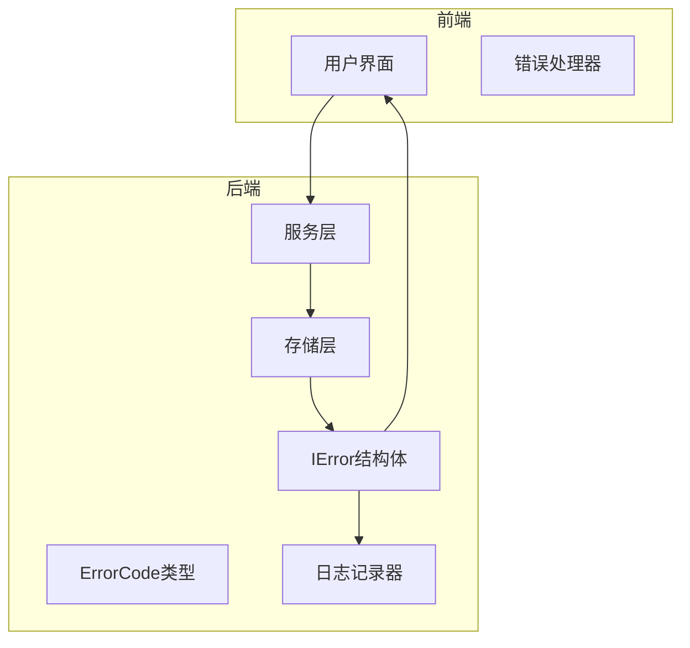
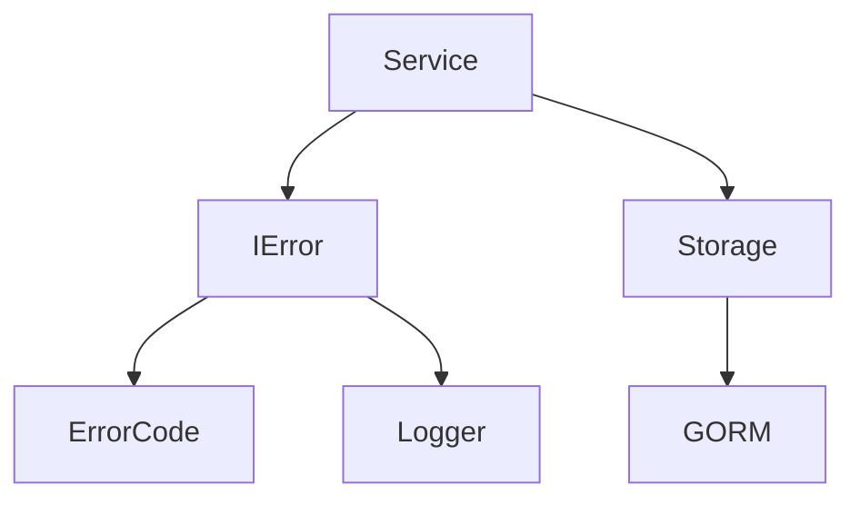

# 后端错误定义

<cite>
**本文档引用的文件**
- [common.go](file://backend/utils/ierror/common.go)
- [code.go](file://backend/utils/ierror/code.go)
- [chat.go](file://backend/service/chat.go)
- [provider.go](file://backend/service/provider.go)
- [chat.go](file://backend/storage/chat.go)
- [provider.go](file://backend/storage/provider.go)
- [errorHandler.ts](file://frontend/src/utils/errorHandler.ts)
</cite>

## 目录
1. [简介](#简介)
2. [核心组件](#核心组件)
3. [架构概述](#架构概述)
4. [详细组件分析](#详细组件分析)
5. [依赖分析](#依赖分析)
6. [性能考虑](#性能考虑)
7. [故障排除指南](#故障排除指南)
8. [结论](#结论)

## 简介
本文档详细说明了后端错误处理机制的实现方式。基于 `ierror` 包中的 `IError` 结构体和 `ErrorCode` 类型，解释如何通过 `New(errCode)` 创建标准化错误实例，并在服务层统一返回。分析 `common.go` 中 `NewError` 函数如何包装原始错误并记录日志，确保错误可追溯。展示从 `data_models` 到 `service` 层的错误传递路径，包括错误码的定义规范、新增错误码的注册流程以及与 GORM 数据库操作异常的集成方式。提供在 `chat.go`、`provider.go` 等服务中实际抛出错误的代码示例，并说明如何通过 Wails RPC 将错误序列化传输至前端。

## 核心组件

后端错误处理机制的核心组件包括 `IError` 结构体、`ErrorCode` 类型以及相关的错误创建函数。`IError` 结构体用于封装错误码，`ErrorCode` 类型定义了所有可能的错误码。通过 `New(errCode)` 函数可以创建标准化的错误实例，并在服务层统一返回。

**Section sources**
- [common.go](file://backend/utils/ierror/common.go#L4-L6)
- [code.go](file://backend/utils/ierror/code.go#L2-L2)

## 架构概述

后端错误处理机制的架构如下图所示：



**Diagram sources**
- [common.go](file://backend/utils/ierror/common.go#L4-L6)
- [code.go](file://backend/utils/ierror/code.go#L2-L2)
- [chat.go](file://backend/service/chat.go#L158-L206)
- [provider.go](file://backend/service/provider.go#L0-L145)

## 详细组件分析

### 错误定义与创建

#### IError 结构体
`IError` 结构体用于封装错误码，其定义如下：

```go
type IError struct {
	errCode ErrorCode
}
```

该结构体包含一个 `errCode` 字段，类型为 `ErrorCode`，用于存储具体的错误码。

#### ErrorCode 类型
`ErrorCode` 类型定义了所有可能的错误码，其定义如下：

```go
type ErrorCode string

const (
	ErrCodeInternalError ErrorCode = "ErrCodeInternalError"
	ErrCodeUsernameExists = "ErrCodeUsernameExists"
	ErrCodeEmailExists = "ErrCodeEmailExists"
	// 其他错误码...
)
```

这些错误码用于标识不同的错误情况，例如系统内部错误、用户名已存在等。

#### New 函数
`New` 函数用于创建标准化的错误实例，其定义如下：

```go
func New(errCode ErrorCode) error {
	return IError{errCode: errCode}
}
```

该函数接收一个 `ErrorCode` 类型的参数，并返回一个 `IError` 类型的错误实例。

#### NewError 函数
`NewError` 函数用于包装原始错误并记录日志，其定义如下：

```go
func NewError(err error) error {
	logger.Error(err)
	return IError{errCode: ErrCodeInternalError}
}
```

该函数接收一个 `error` 类型的参数，记录该错误的日志，并返回一个 `IError` 类型的错误实例，错误码为 `ErrCodeInternalError`。

**Section sources**
- [common.go](file://backend/utils/ierror/common.go#L0-L19)
- [code.go](file://backend/utils/ierror/code.go#L0-L27)

### 错误传递路径

#### 从 data_models 到 service 层
错误从 `data_models` 层传递到 `service` 层的过程如下：

1. 在 `storage` 层，当发生数据库操作异常时，直接返回错误。
2. 在 `service` 层，捕获来自 `storage` 层的错误，并使用 `ierror.NewError` 或 `ierror.New` 函数将其转换为标准化的错误实例。
3. 将标准化的错误实例返回给调用者。

例如，在 `chat.go` 文件中，`DeleteChat` 方法的实现如下：

```go
func (s *Service) DeleteChat(chatUuid string) error {
	err := s.storage.DeleteChat(context.Background(), chatUuid)
	if err != nil {
		return ierror.NewError(err)
	}
	return nil
}
```

**Section sources**
- [chat.go](file://backend/service/chat.go#L158-L206)
- [chat.go](file://backend/storage/chat.go#L0-L110)

### 新增错误码的注册流程

新增错误码需要在 `code.go` 文件中进行定义。例如，如果需要添加一个新的错误码 `ErrCodeInvalidInput`，可以在 `code.go` 文件中添加如下代码：

```go
const (
	// ErrCodeInvalidInput 输入数据格式不正确
	ErrCodeInvalidInput ErrorCode = "ErrCodeInvalidInput"
)
```

然后在需要的地方使用 `ierror.New(ierror.ErrCodeInvalidInput)` 创建相应的错误实例。

**Section sources**
- [code.go](file://backend/utils/ierror/code.go#L0-L27)

### 与 GORM 数据库操作异常的集成

GORM 数据库操作异常通常会返回一个 `error` 类型的值。在 `storage` 层，可以直接将这些错误返回给 `service` 层。在 `service` 层，使用 `ierror.NewError` 函数将这些错误转换为标准化的错误实例。

例如，在 `provider.go` 文件中，`GetProviders` 方法的实现如下：

```go
func (s *Service) GetProviders() ([]view_models.Provider, error) {
	providers, err := s.storage.GetProviders(context.Background())
	if err != nil {
		return nil, ierror.NewError(err)
	}
	// 处理结果...
	return res, nil
}
```

**Section sources**
- [provider.go](file://backend/service/provider.go#L0-L145)
- [provider.go](file://backend/storage/provider.go#L0-L49)

### 实际抛出错误的代码示例

在 `chat.go` 和 `provider.go` 等服务中，实际抛出错误的代码示例如下：

#### chat.go
```go
func (s *Service) DeleteChat(chatUuid string) error {
	err := s.storage.DeleteChat(context.Background(), chatUuid)
	if err != nil {
		return ierror.NewError(err)
	}
	return nil
}
```

#### provider.go
```go
func (s *Service) AddProvider(provider view_models.Provider) error {
	providerId, err := s.storage.AddProvider(context.Background(), data_models.Provider{
		ProviderName: provider.ProviderName,
		BaseUrl:      provider.BaseUrl,
		ApiKey:       provider.ApiKey,
		Enable:       provider.Enable,
		Alias:        provider.Alias,
	})
	if err != nil {
		return ierror.NewError(err)
	}
	// 更新模型信息...
	return nil
}
```

**Section sources**
- [chat.go](file://backend/service/chat.go#L158-L206)
- [provider.go](file://backend/service/provider.go#L0-L145)

### 通过 Wails RPC 将错误序列化传输至前端

Wails RPC 框架支持将 Go 的错误类型序列化并传输至前端。在前端，可以通过 `extractErrorMessage` 函数将错误码转换为用户友好的消息。

例如，在 `errorHandler.ts` 文件中，`extractErrorMessage` 函数的实现如下：

```typescript
export const extractErrorMessage = (error: any): string => {
  try {
    let apiError: ApiError | null = null;
    if (error?.error?.message != null) {
      apiError = error.error.message;
    } else {
      apiError = error
    }
    
    if (apiError && typeof apiError === 'string') {
      const friendlyMessage = ERROR_MESSAGE_MAP[apiError];
      if (friendlyMessage) {
        return friendlyMessage;
      }
      
      return apiError;
    }

    // 处理常见的HTTP状态码错误
    if (error?.response?.status) {
      switch (error.response.status) {
        case 400:
          return '请求参数错误';
        case 401:
          return '未授权，请重新登录';
        case 403:
          return '权限不足';
        case 404:
          return '请求的资源不存在';
        case 429:
          return '请求过于频繁，请稍后重试';
        case 500:
          return '服务器内部错误，请稍后重试';
        case 502:
        case 503:
          return '服务暂时不可用，请稍后重试';
        case 504:
          return '请求超时，请检查网络连接';
        default:
          return DEFAULT_ERROR_MESSAGE;
      }
    }

    // 处理网络错误
    if (error?.message) {
      if (error.message.includes('Network Error') || error.message.includes('timeout')) {
        return '网络连接异常，请检查网络后重试';
      }
      
      if (error.message.includes('ECONNREFUSED') || error.message.includes('ERR_CONNECTION_REFUSED')) {
        return '无法连接到服务器，请稍后重试';
      }
    }

    return apiError?.message || DEFAULT_ERROR_MESSAGE;

  } catch (e) {
    console.error('Error while extracting error message:', e);
    return DEFAULT_ERROR_MESSAGE;
  }
};
```

**Section sources**
- [errorHandler.ts](file://frontend/src/utils/errorHandler.ts#L39-L82)

## 依赖分析

后端错误处理机制的依赖关系如下图所示：



**Diagram sources**
- [common.go](file://backend/utils/ierror/common.go#L4-L6)
- [code.go](file://backend/utils/ierror/code.go#L2-L2)
- [chat.go](file://backend/service/chat.go#L158-L206)
- [provider.go](file://backend/service/provider.go#L0-L145)
- [chat.go](file://backend/storage/chat.go#L0-L110)
- [provider.go](file://backend/storage/provider.go#L0-L49)

## 性能考虑

后端错误处理机制在性能方面的主要考虑点包括：

1. **日志记录**：每次调用 `NewError` 函数时都会记录一条错误日志，这可能会对性能产生一定影响。建议在生产环境中合理配置日志级别，避免过多的日志输出。
2. **错误码转换**：在前端，`extractErrorMessage` 函数需要根据错误码查找对应的用户友好消息，这涉及到字符串匹配操作。为了提高性能，可以使用哈希表来存储错误码和消息的映射关系。

## 故障排除指南

### 常见问题及解决方案

1. **错误码未正确映射**
   - **问题描述**：前端显示的错误消息与预期不符。
   - **解决方案**：检查 `ERROR_MESSAGE_MAP` 中是否包含了正确的错误码和消息映射。如果没有，可以使用 `addErrorMapping` 函数添加新的映射。

2. **日志记录过多**
   - **问题描述**：日志文件过大，影响系统性能。
   - **解决方案**：调整日志级别，仅记录严重错误或警告级别的日志。可以在 `logger` 配置中设置合适的日志级别。

3. **错误传递失败**
   - **问题描述**：后端抛出的错误未能正确传递到前端。
   - **解决方案**：检查 Wails RPC 的配置，确保错误能够被正确序列化和传输。同时，确认前端的错误处理逻辑是否正确。

**Section sources**
- [errorHandler.ts](file://frontend/src/utils/errorHandler.ts#L130-L178)

## 结论

本文档详细介绍了后端错误处理机制的实现方式，包括错误定义、创建、传递路径、新增错误码的注册流程以及与 GORM 数据库操作异常的集成方式。通过标准化的错误处理机制，可以确保错误信息的一致性和可追溯性，提高系统的稳定性和用户体验。同时，通过 Wails RPC 将错误序列化传输至前端，使得前端能够根据错误码显示用户友好的消息，进一步提升了应用的可用性。