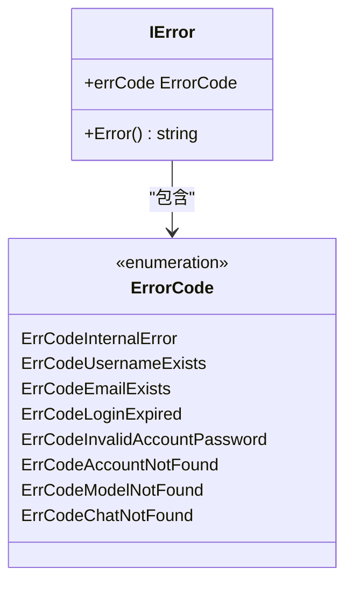
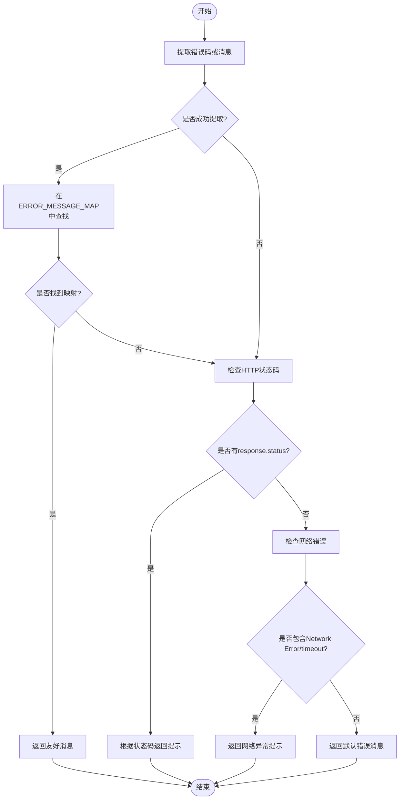

# 错误处理规范

<cite>
**本文档引用的文件**   
- [code.go](file://backend/utils/ierror/code.go)
- [common.go](file://backend/utils/ierror/common.go)
- [errorHandler.ts](file://frontend/src/utils/errorHandler.ts)
- [logger.go](file://backend/pkg/logger/logger.go)
- [static.go](file://backend/pkg/logger/static.go)
</cite>

## 目录
1. [引言](#引言)
2. [后端错误定义与创建](#后端错误定义与创建)
3. [前端错误解析与展示](#前端错误解析与展示)
4. [错误处理完整链路示例](#错误处理完整链路示例)
5. [最佳实践](#最佳实践)
6. [结论](#结论)

## 引言
本规范旨在统一前后端错误处理机制，确保系统在面对各类异常情况时能够提供一致、可读性强的用户反馈。通过标准化错误码定义、统一错误创建方式、前后端映射机制以及完善的日志记录策略，提升系统的可维护性和用户体验。

**Section sources**
- [code.go](file://backend/utils/ierror/code.go#L1-L28)
- [errorHandler.ts](file://frontend/src/utils/errorHandler.ts#L1-L179)

## 后端错误定义与创建

后端使用 `ierror` 包来定义和创建标准化错误类型。所有错误码均以 `ErrCode` 为前缀，通过 `ErrorCode` 类型进行统一管理，并在 `code.go` 文件中集中声明。

错误通过 `ierror.New(errCode)` 方法创建，返回一个实现了标准 `error` 接口的 `IError` 实例。该实例的 `Error()` 方法返回错误码字符串，便于日志输出和网络传输。

当捕获到非预期错误时，应使用 `ierror.NewError(err)` 方法包装原始错误，此方法会自动将错误记录到日志系统，并返回统一的内部错误码 `ErrCodeInternalError`。

**Diagram sources**
- [common.go](file://backend/utils/ierror/common.go#L5-L19)
- [code.go](file://backend/utils/ierror/code.go#L5-L27)

**Section sources**
- [common.go](file://backend/utils/ierror/common.go#L1-L19)
- [code.go](file://backend/utils/ierror/code.go#L1-L28)

## 前端错误解析与展示

前端通过 `extractErrorMessage` 工具函数解析后端返回的错误信息。该函数位于 `errorHandler.ts` 文件中，能够处理多种错误来源，包括 Axios 网络错误、HTTP 状态码错误以及自定义错误对象。

核心机制是通过 `ERROR_MESSAGE_MAP` 映射表将后端错误码转换为用户友好的提示信息。例如，`ErrCodeInvalidInput` 被映射为“输入数据格式不正确”。

该函数具备多层容错能力：
1. 首先尝试从错误对象中提取后端返回的错误码字符串
2. 若提取成功，则在映射表中查找对应的友好消息
3. 若未找到映射，则根据 HTTP 状态码返回通用错误提示
4. 若为网络连接异常，则返回相应的网络错误提示
5. 最终兜底返回默认错误消息

**Diagram sources**
- [errorHandler.ts](file://frontend/src/utils/errorHandler.ts#L84-L128)

**Section sources**
- [errorHandler.ts](file://frontend/src/utils/errorHandler.ts#L0-L179)

## 错误处理完整链路示例

### 数据校验失败场景
1. **服务层**：`service/chat.go` 在创建新对话前校验输入参数
2. **抛出错误**：`return ierror.New(ierror.ErrCodeInvalidInput)`
3. **日志记录**：`ierror.NewError()` 内部调用 `logger.Error()` 记录错误堆栈
4. **HTTP响应**：框架将错误序列化为 JSON 响应体，包含错误码字符串
5. **前端接收**：Axios 捕获非 2xx 响应，进入错误处理流程
6. **解析展示**：`extractErrorMessage` 识别 `ErrCodeInvalidInput` 并显示“输入数据格式不正确”

### API错误场景
1. **服务层**：`service/provider.go` 查询模型时未找到指定ID
2. **抛出错误**：`return ierror.New(ierror.ErrCodeModelNotFound)`
3. **HTTP响应**：返回 404 状态码及错误码
4. **前端解析**：`extractErrorMessage` 优先使用映射表中的“模型不存在”提示

### 网络异常场景
1. **前端请求**：用户发起请求时网络中断
2. **Axios捕获**：抛出包含 'Network Error' 的错误对象
3. **解析处理**：`extractErrorMessage` 检测到 'Network Error' 关键词
4. **用户提示**：显示“网络连接异常，请检查网络后重试”

**Section sources**
- [common.go](file://backend/utils/ierror/common.go#L15-L19)
- [errorHandler.ts](file://frontend/src/utils/errorHandler.ts#L84-L128)
- [logger.go](file://backend/pkg/logger/logger.go#L62-L102)

## 最佳实践

### 错误码注册
新增错误码必须在 `backend/utils/ierror/code.go` 中以 `ErrCode` 为前缀定义，并添加中文注释说明。同时，前端必须在 `frontend/src/utils/errorHandler.ts` 的 `ERROR_MESSAGE_MAP` 中添加对应的用户友好消息。

### 自定义消息映射
对于特殊场景需要覆盖默认提示，可使用 `addErrorMapping(errorCode, message)` 动态添加或修改映射关系。调试时可通过 `getErrorMappings()` 查看当前所有映射。

### 日志记录
所有通过 `ierror.NewError(err)` 包装的错误都会被自动记录到日志系统。日志包含时间、级别（ERROR）、调用栈信息，便于问题追踪。日志格式由 `logger.Logger` 统一管理，支持颜色输出和调试信息显示。

### 语义一致性保证
前后端团队需定期同步错误码列表，建议通过自动化脚本验证映射完整性。所有错误码变更应作为 API 变更的一部分进行评审。

**Section sources**
- [common.go](file://backend/utils/ierror/common.go#L19)
- [errorHandler.ts](file://frontend/src/utils/errorHandler.ts#L130-L178)
- [static.go](file://backend/pkg/logger/static.go#L70-L82)

## 结论
本规范建立了一套完整的错误处理体系，从前端展示到后端实现再到日志追踪形成了闭环。通过标准化的错误码、统一的创建方式和智能的解析机制，确保了系统在各种异常情况下都能为用户提供清晰、一致的反馈，同时为开发人员提供了强大的调试支持。