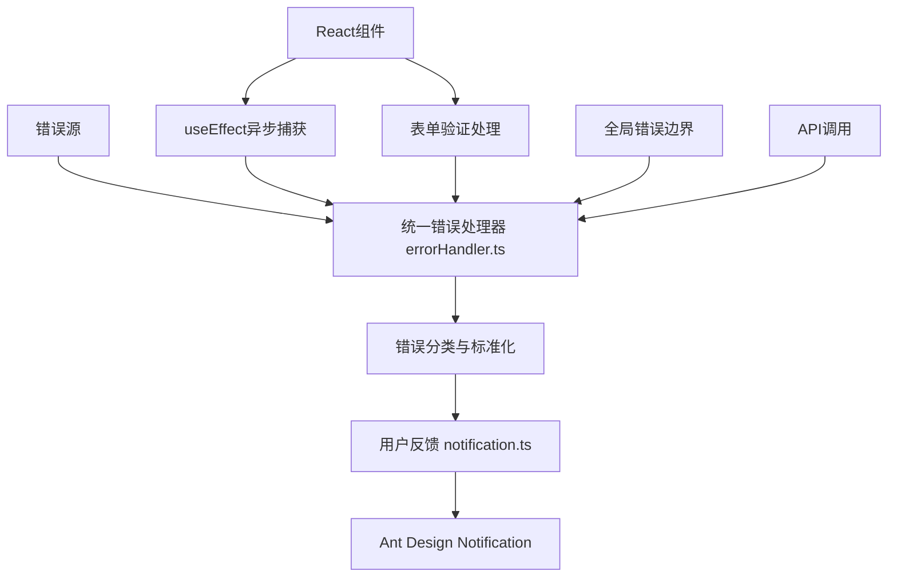
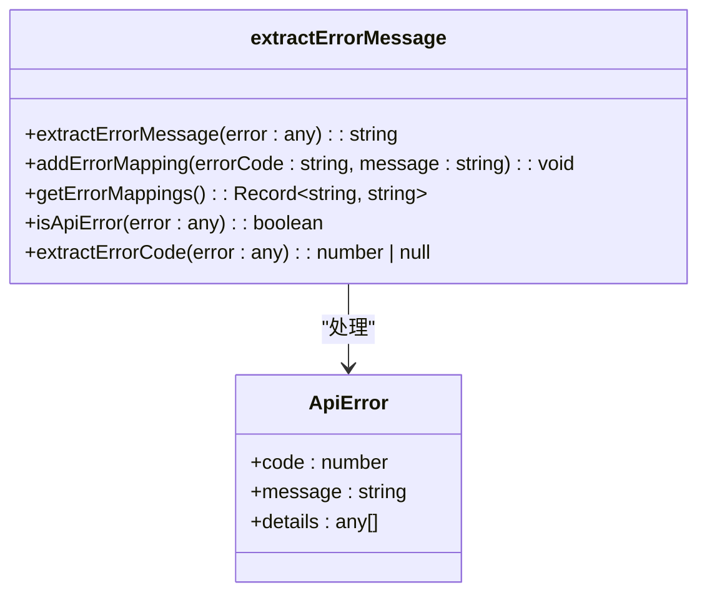
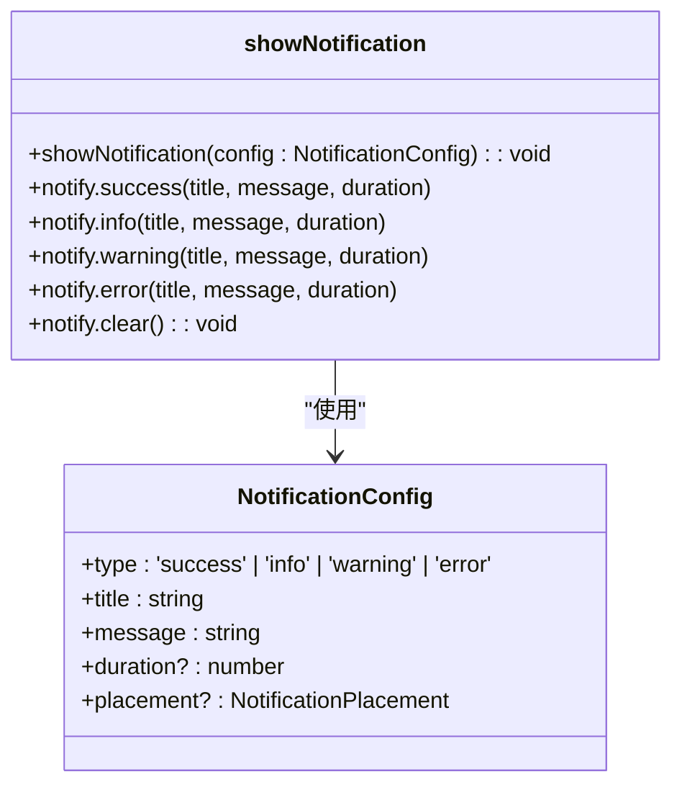
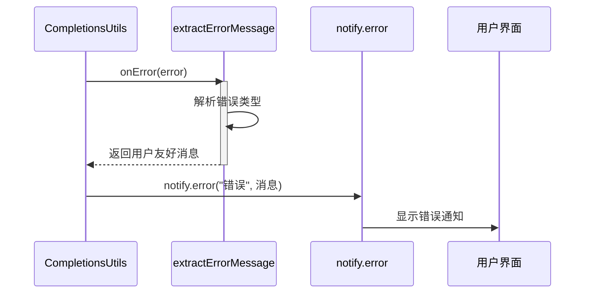

# 前端错误处理机制

<cite>
**本文档引用文件**  
- [errorHandler.ts](file://frontend/src/utils/errorHandler.ts)
- [notification.ts](file://frontend/src/utils/notification.ts)
- [completions.ts](file://frontend/src/utils/completions.ts)
- [chat_messages.tsx](file://frontend/src/pages/home/chat/chat_messages.tsx)
- [index.scss](file://frontend/src/styles/index.scss)
</cite>

## 目录
1. [引言](#引言)
2. [错误处理架构概览](#错误处理架构概览)
3. [核心组件分析](#核心组件分析)
4. [错误分类与标准化处理](#错误分类与标准化处理)
5. [用户反馈机制集成](#用户反馈机制集成)
6. [实际应用场景示例](#实际应用场景示例)
7. [全局错误边界与日志记录](#全局错误边界与日志记录)
8. [安全与脱敏原则](#安全与脱敏原则)
9. [结论](#结论)

## 引言
本文档全面阐述了前端错误处理架构与用户反馈机制的设计与实现。重点分析`errorHandler.ts`模块如何统一捕获和处理各类异常，包括同步错误、异步Promise拒绝及网络请求失败，并通过`notification.ts`模块向用户提供清晰、友好的提示信息。系统设计兼顾用户体验与开发调试需求，同时遵循错误信息脱敏原则，确保终端用户不会暴露于敏感技术细节。

## 错误处理架构概览



**图示来源**  
- [errorHandler.ts](file://frontend/src/utils/errorHandler.ts)
- [notification.ts](file://frontend/src/utils/notification.ts)

## 核心组件分析

### 错误处理器 (errorHandler.ts)

`errorHandler.ts`模块提供了统一的异常捕获接口，封装了从原始错误对象到用户友好消息的转换逻辑。该模块支持多种错误类型的识别与处理，包括后端API响应错误、HTTP状态码错误以及网络连接异常。



**图示来源**  
- [errorHandler.ts](file://frontend/src/utils/errorHandler.ts#L1-L179)

**本节来源**  
- [errorHandler.ts](file://frontend/src/utils/errorHandler.ts#L1-L179)

### 通知服务 (notification.ts)

`notification.ts`模块封装了Ant Design的Notification组件，提供了一套简洁的API用于向用户展示不同级别的提示信息，包括成功、信息、警告和错误。



**图示来源**  
- [notification.ts](file://frontend/src/utils/notification.ts#L1-L49)

**本节来源**  
- [notification.ts](file://frontend/src/utils/notification.ts#L1-L49)

## 错误分类与标准化处理

### 错误消息映射机制
系统通过`ERROR_MESSAGE_MAP`常量维护错误代码到用户友好消息的映射关系，覆盖认证、注册、权限、服务器、数据等多类错误场景。当捕获到错误时，处理器优先查找映射表，若未找到则根据HTTP状态码或错误特征进行兜底处理。

### 错误提取流程
`extractErrorMessage`函数是核心处理逻辑，其流程如下：
1. 尝试解析Axios错误结构，提取后端返回的错误信息
2. 若为标准API错误格式，使用映射表转换为用户友好消息
3. 根据HTTP状态码处理常见错误（如401未授权、500服务器错误等）
4. 处理网络连接异常（如网络错误、连接拒绝等）
5. 最终返回默认错误消息作为兜底方案

**本节来源**  
- [errorHandler.ts](file://frontend/src/utils/errorHandler.ts#L45-L134)

## 用户反馈机制集成

### 与Notification模块的协作
错误处理器与通知服务深度集成，通过调用`notify.error()`方法将处理后的用户友好消息展示给用户。例如，在API调用失败时，系统会自动提取错误消息并以错误通知形式弹出。

### 实际调用示例
在`completions.ts`中，当API调用或消息处理出现异常时，会通过`onError`回调传递错误信息，并最终转换为用户可读的通知：



**图示来源**  
- [completions.ts](file://frontend/src/utils/completions.ts#L64-L101)
- [errorHandler.ts](file://frontend/src/utils/errorHandler.ts#L45-L134)
- [notification.ts](file://frontend/src/utils/notification.ts#L28-L32)

**本节来源**  
- [completions.ts](file://frontend/src/utils/completions.ts#L64-L101)

## 实际应用场景示例

### 异步操作异常捕获
在`useEffect`中执行异步操作时，可通过try-catch捕获异常，并使用错误处理器进行处理：

```typescript
useEffect(() => {
  const fetchData = async () => {
    try {
      await someAsyncOperation();
    } catch (error) {
      const userFriendlyMessage = extractErrorMessage(error);
      notify.error('操作失败', userFriendlyMessage);
    }
  };
  fetchData();
}, []);
```

### 表单提交验证处理
表单提交时若后端返回验证失败，错误处理器会自动将`ErrCodeInvalidInput`等错误码转换为"输入数据格式不正确"等用户可理解的提示。

**本节来源**  
- [errorHandler.ts](file://frontend/src/utils/errorHandler.ts)
- [notification.ts](file://frontend/src/utils/notification.ts)

## 全局错误边界与日志记录

### 潜在扩展方案
虽然当前代码未显式实现React错误边界，但`index.scss`中定义了`.error-boundary`样式类，为未来实现全局错误边界组件提供了样式支持。可通过创建`ErrorBoundary`组件捕获渲染异常，并结合`extractErrorMessage`展示统一错误页面。

### 前端错误日志
系统在错误处理过程中会调用`console.error`记录原始错误信息，便于开发者在调试模式下分析问题根源。这些日志可用于后续的错误分析与系统优化。

**本节来源**  
- [errorHandler.ts](file://frontend/src/utils/errorHandler.ts#L125-L127)
- [index.scss](file://frontend/src/styles/index.scss#L455-L468)

## 安全与脱敏原则

### 敏感信息保护
系统严格遵循错误信息脱敏原则：
- 不直接暴露后端错误堆栈或技术细节
- 通过映射表将技术性错误码转换为业务性描述
- 网络错误统一提示为"网络连接异常"而非具体错误类型
- 默认错误消息避免透露系统架构信息

### 可配置性
通过`addErrorMapping`接口，系统支持动态添加新的错误映射，便于在不修改核心代码的情况下扩展错误提示内容。

**本节来源**  
- [errorHandler.ts](file://frontend/src/utils/errorHandler.ts#L135-L147)

## 结论
本前端错误处理机制通过`errorHandler.ts`与`notification.ts`的协同工作，构建了一个健壮、用户友好的异常处理体系。系统能够有效分类处理各类错误，提供一致的用户体验，并兼顾安全性与可维护性。未来可通过实现React错误边界进一步完善全局异常捕获能力，同时建议建立前端错误日志上报机制，用于生产环境的问题追踪与分析。