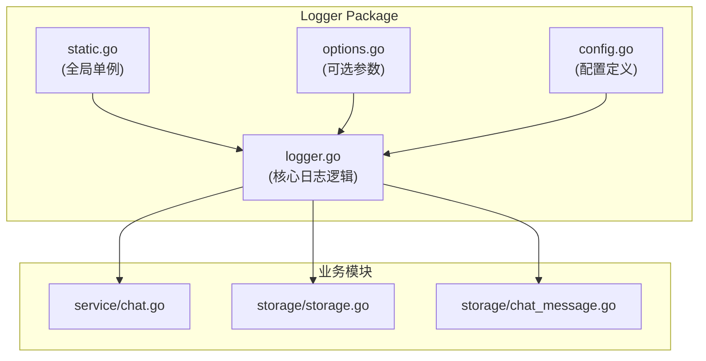
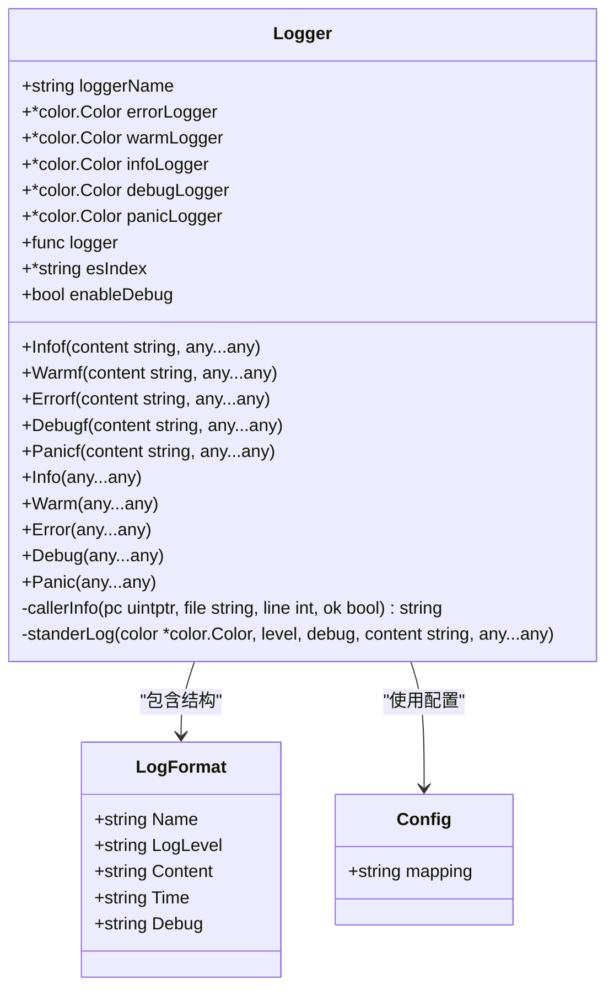
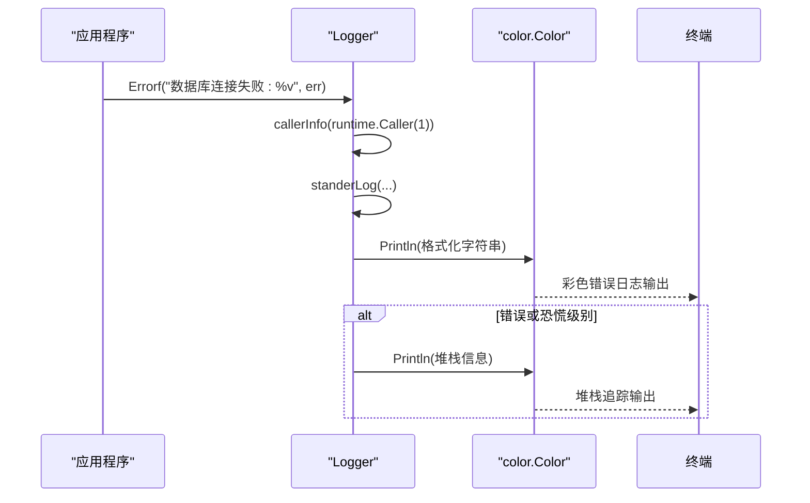
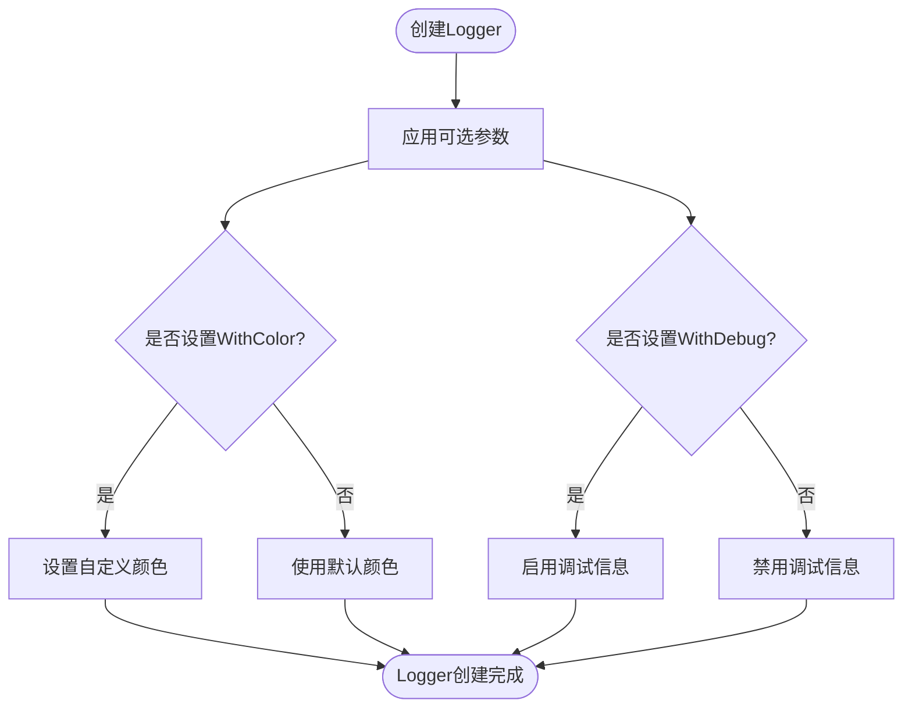
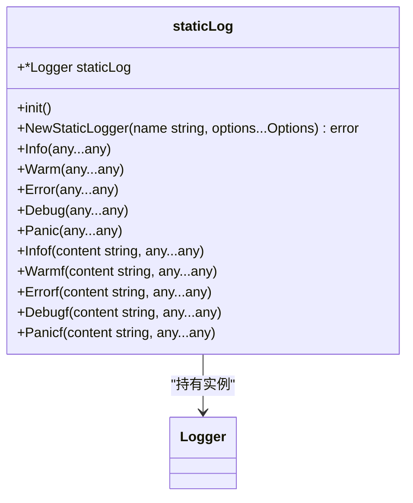
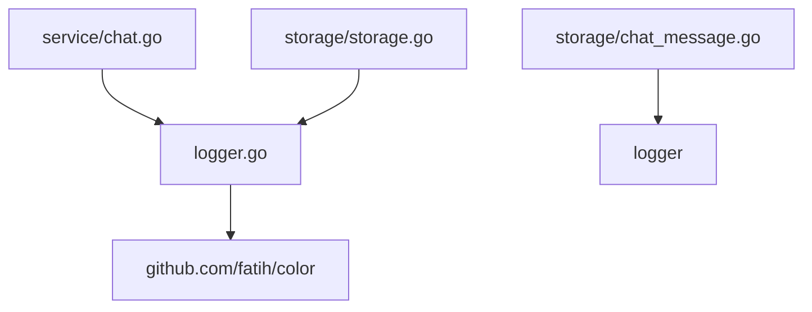

# 后端日志系统

<cite>
**本文档引用文件**  
- [logger.go](file://backend/pkg/logger/logger.go)
- [config.go](file://backend/pkg/logger/config.go)
- [options.go](file://backend/pkg/logger/options.go)
- [static.go](file://backend/pkg/logger/static.go)
- [chat.go](file://backend/service/chat.go)
- [storage.go](file://backend/storage/storage.go)
- [chat_message.go](file://backend/storage/chat_message.go)
</cite>

## 目录
1. [简介](#简介)
2. [项目结构](#项目结构)
3. [核心组件](#核心组件)
4. [架构概览](#架构概览)
5. [详细组件分析](#详细组件分析)
6. [依赖分析](#依赖分析)
7. [性能考量](#性能考量)
8. [故障排查指南](#故障排查指南)
9. [结论](#结论)

## 简介
本文档深入解析`pkg/logger`包的设计与实现，涵盖结构化日志接口、日志配置初始化、可选参数配置、全局单例管理机制以及在业务层的实际应用。重点说明日志系统如何支持多格式输出、调试控制、调用栈追踪等功能，并提供服务层与存储层的日志实践示例。

## 项目结构
`pkg/logger`包位于`backend/pkg/logger`目录下，包含四个核心文件：`logger.go`（主日志逻辑）、`config.go`（配置结构）、`options.go`（可选参数）、`static.go`（全局实例）。该日志系统被`service`和`storage`等模块广泛引用，用于记录运行时信息、错误追踪和调试输出。

**图示来源**  
- [logger.go](file://backend/pkg/logger/logger.go#L1-L162)
- [static.go](file://backend/pkg/logger/static.go#L1-L83)
- [options.go](file://backend/pkg/logger/options.go#L1-L24)
- [config.go](file://backend/pkg/logger/config.go#L1-L29)

**本节来源**  
- [backend/pkg/logger](file://backend/pkg/logger)

## 核心组件
`pkg/logger`包提供了结构化的日志接口，支持`Info`、`Error`、`Warn`、`Debug`、`Panic`五种日志级别。通过`NewLogger`函数创建实例，支持自定义名称和可选参数。日志输出包含时间戳、日志级别、日志名称和内容，并在错误和恐慌级别自动打印堆栈信息。全局静态日志实例通过`static.go`实现单例模式，便于在项目各处直接调用。

**本节来源**  
- [logger.go](file://backend/pkg/logger/logger.go#L1-L162)
- [static.go](file://backend/pkg/logger/static.go#L1-L83)

## 架构概览
日志系统采用结构化设计，`Logger`结构体封装了不同级别的颜色输出器和日志处理函数。通过函数式选项模式（Functional Options）实现灵活配置。全局静态实例通过`init`函数初始化，并可通过`NewStaticLogger`重新配置。日志内容以彩色文本格式输出到控制台，错误和恐慌级别附带调用栈追踪。

**图示来源**  
- [logger.go](file://backend/pkg/logger/logger.go#L1-L162)
- [config.go](file://backend/pkg/logger/config.go#L1-L29)

## 详细组件分析

### 日志接口实现分析
`logger.go`中的`Logger`结构体实现了完整的日志功能。每个日志方法（如`Infof`、`Errorf`）首先通过`callerInfo`获取调用者信息（文件、行号、函数名），然后调用`standerLog`进行格式化输出。输出格式支持带名称和不带名称两种模式，并在错误和恐慌级别自动打印堆栈追踪。

**图示来源**  
- [logger.go](file://backend/pkg/logger/logger.go#L50-L150)

**本节来源**  
- [logger.go](file://backend/pkg/logger/logger.go#L1-L162)

### 配置与可选参数分析
`config.go`定义了日志系统的配置结构，目前包含一个用于Elasticsearch映射的JSON常量。`options.go`实现了函数式选项模式，提供`WithColor`和`WithDebug`两个选项函数，允许在创建Logger实例时自定义颜色样式和启用调试信息输出。

**图示来源**  
- [options.go](file://backend/pkg/logger/options.go#L1-L24)
- [config.go](file://backend/pkg/logger/config.go#L1-L29)

**本节来源**  
- [options.go](file://backend/pkg/logger/options.go#L1-L24)
- [config.go](file://backend/pkg/logger/config.go#L1-L29)

### 全局单例管理机制分析
`static.go`实现了全局日志实例的单例模式。通过`init`函数初始化一个默认的静态日志实例`staticLog`。提供`NewStaticLogger`函数用于重新配置全局实例，以及一系列全局函数（如`Info`、`Error`等）直接操作静态实例，方便在项目任何位置进行日志记录。

**图示来源**  
- [static.go](file://backend/pkg/logger/static.go#L1-L83)

**本节来源**  
- [static.go](file://backend/pkg/logger/static.go#L1-L83)

## 依赖分析
日志系统主要依赖`github.com/fatih/color`库实现彩色输出。`service`和`storage`模块通过导入`pkg/logger`包来使用日志功能。`storage.go`在数据库连接失败时调用`logger.Errorf`，`chat.go`在保存消息失败时调用`logger.Errorf`，体现了日志系统在关键错误点的集成。

**图示来源**  
- [logger.go](file://backend/pkg/logger/logger.go#L6-L7)
- [storage.go](file://backend/storage/storage.go#L8-L9)
- [chat.go](file://backend/service/chat.go#L8-L9)
- [chat_message.go](file://backend/storage/chat_message.go#L6-L7)

**本节来源**  
- [logger.go](file://backend/pkg/logger/logger.go#L1-L162)
- [storage.go](file://backend/storage/storage.go#L1-L83)
- [chat.go](file://backend/service/chat.go#L1-L207)

## 性能考量
日志系统在非调试模式下仅进行一次格式化输出，性能开销较小。在错误和恐慌级别打印堆栈信息会带来额外性能开销，但仅在异常情况下触发。全局静态实例避免了频繁创建Logger对象的开销。建议在生产环境中关闭调试日志以减少I/O压力。

## 故障排查指南
当遇到问题时，可通过设置`LEMONTEA_LOG_PATH`环境变量指定日志文件路径（当前实现中未直接使用该变量，但可通过扩展实现）。在开发模式下，使用`WithDebug()`选项启用调试日志，可查看详细的调用者信息。对于数据库相关错误，检查`storage.go`中的`logger.Errorf`输出可快速定位问题根源。

**本节来源**  
- [logger.go](file://backend/pkg/logger/logger.go#L1-L162)
- [storage.go](file://backend/storage/storage.go#L1-L83)
- [chat.go](file://backend/service/chat.go#L1-L207)

## 结论
`pkg/logger`包提供了一个轻量级、结构化的日志解决方案，支持彩色输出、调用栈追踪和函数式配置。通过全局单例模式简化了日志调用，已在`service`和`storage`模块中有效集成。建议未来扩展支持文件输出、日志轮转和JSON格式输出，以满足生产环境需求。