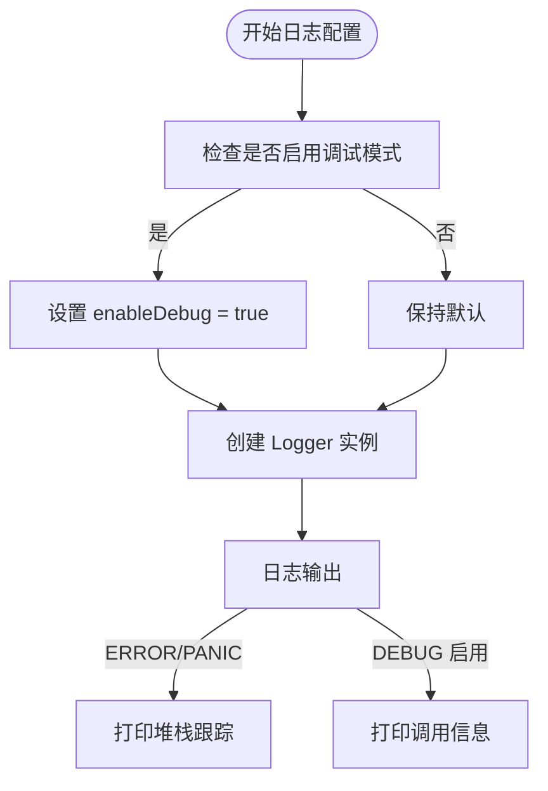
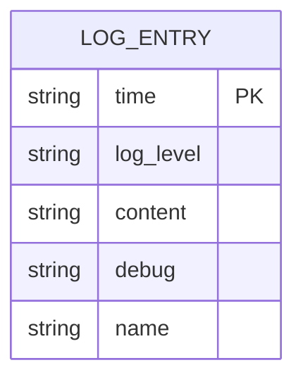

# 日志与调试

<cite>
**本文档中引用的文件**  
- [logger.go](file://backend/pkg/logger/logger.go)
- [static.go](file://backend/pkg/logger/static.go)
- [options.go](file://backend/pkg/logger/options.go)
- [config.go](file://backend/pkg/logger/config.go)
- [errorHandler.ts](file://frontend/src/utils/errorHandler.ts)
- [notification.ts](file://frontend/src/utils/notification.ts)
- [common.go](file://backend/utils/ierror/common.go)
- [code.go](file://backend/utils/ierror/code.go)
</cite>

## 目录
1. [简介](#简介)
2. [后端日志机制](#后端日志机制)
3. [前端错误处理机制](#前端错误处理机制)
4. [日志级别与配置](#日志级别与配置)
5. [开发调试实践](#开发调试实践)
6. [性能监控与日志分析](#性能监控与日志分析)
7. [常见问题排查](#常见问题排查)
8. [总结](#总结)

## 简介
本项目采用前后端分离架构，具备完善的日志记录与错误调试机制。后端通过自定义 `pkg/logger` 包实现结构化日志输出，支持多级别日志控制、调用栈追踪和彩色终端输出；前端通过 `errorHandler.ts` 捕获运行时异常，并结合 `notification` 模块向用户展示友好提示。本文档详细说明日志系统的实现原理、配置方式及在开发过程中的实际应用。

## 后端日志机制

后端日志系统由 `backend/pkg/logger` 包提供，核心功能包括结构化日志输出、多级别日志控制、调用栈信息追踪以及静态日志接口封装。

日志系统通过 `Logger` 结构体实现，包含 `Info`、`Error`、`Debug`、`Warn` 和 `Panic` 等方法，支持格式化输出（`Infof`、`Errorf` 等）。日志输出时会自动记录时间戳、日志级别、日志名称（可选）和调用上下文（文件、行号、函数名）。

当记录 `ERROR` 或 `PANIC` 级别日志时，系统会自动打印完整的堆栈跟踪信息，便于快速定位问题根源。

此外，系统提供了静态日志接口（如 `logger.Info()`、`logger.Error()`），通过 `staticLog` 全局变量实现，开发者无需每次创建日志实例即可直接调用，简化了日志使用流程。

**Section sources**
- [logger.go](file://backend/pkg/logger/logger.go#L0-L162)
- [static.go](file://backend/pkg/logger/static.go#L0-L82)

## 前端错误处理机制

前端通过 `errorHandler.ts` 文件实现统一的错误处理机制，主要职责是捕获后端返回的错误响应，并将其转换为用户可理解的友好提示信息。

系统定义了 `ERROR_MESSAGE_MAP` 映射表，将后端返回的错误代码（如 `ErrCodeInvalidAccountPassword`）映射为中文提示（如“用户名或密码错误”）。该映射覆盖了认证、权限、数据、网络等多种错误类型，确保用户始终获得清晰的操作指引。

错误处理流程如下：
1. 接收错误对象（可能是 Axios 错误或其他类型）
2. 尝试提取后端返回的错误码或消息
3. 根据错误码查找预设的友好提示
4. 若无匹配，则根据 HTTP 状态码提供通用提示（如 401 → “未授权，请重新登录”）
5. 对于网络错误（如连接超时、拒绝连接），提供专门的网络异常提示
6. 最终通过 `notification` 模块展示提示

`notification.ts` 封装了 Ant Design 的通知组件，提供 `notify.success`、`notify.error` 等便捷方法，支持自定义标题、消息、持续时间和位置。

**Section sources**
- [errorHandler.ts](file://frontend/src/utils/errorHandler.ts#L0-L179)
- [notification.ts](file://frontend/src/utils/notification.ts#L0-L49)

## 日志级别与配置

### 日志级别
后端日志支持以下四个级别，按严重程度递增：
- **DEBUG**：调试信息，用于开发阶段追踪执行流程
- **INFO**：常规信息，记录关键业务事件（如服务启动、用户操作）
- **WARN**：警告信息，表示潜在问题但不影响系统运行
- **ERROR**：错误信息，表示发生异常，可能影响功能
- **PANIC**：严重错误，导致程序终止

### 日志输出格式
日志默认以彩色文本格式输出到控制台，格式为：
```
时间 | 级别 | [日志名]: 内容
```
若设置了日志名称，则包含在方括号中；否则省略。

### 调试模式启用
通过 `WithDebug()` 选项可启用调试模式，启用后会额外输出详细的调用栈信息（文件、行号、函数名），帮助开发者精确定位问题。



**Diagram sources**
- [logger.go](file://backend/pkg/logger/logger.go#L104-L161)
- [options.go](file://backend/pkg/logger/options.go#L0-L23)

**Section sources**
- [logger.go](file://backend/pkg/logger/logger.go#L0-L162)
- [options.go](file://backend/pkg/logger/options.go#L0-L23)

## 开发调试实践

### 启用详细日志
在开发环境中，可通过调用 `NewStaticLogger` 并传入 `WithDebug()` 选项来启用详细日志输出：

```go
logger.NewStaticLogger("main", logger.WithDebug())
```

此后调用 `logger.Info()` 或 `logger.Error()` 时，除常规信息外，还会输出调用堆栈，便于追踪代码执行路径。

### 定位数据库查询问题
当数据库操作失败时，系统会在 `storage` 层通过 `logger.Errorf()` 记录错误。例如，在 `storage.go` 中，若数据库连接失败或迁移出错，会立即输出错误日志并附带堆栈信息，帮助开发者快速识别是连接问题、权限问题还是表结构问题。

```go
if err != nil {
    logger.Errorf("Failed to connect to database: %v", err)
    return nil, err
}
```

### 跟踪 RPC 调用链
虽然当前项目为桌面应用，但其服务间调用逻辑清晰。通过在关键服务入口（如 `service/chat.go`）添加 `logger.Infof()`，可记录请求开始与结束，结合时间戳分析处理耗时。未来若扩展为微服务架构，此模式可直接用于分布式追踪。

## 性能监控与日志分析

### 请求处理耗时监控
通过在服务方法前后记录日志，可计算关键操作的执行时间。例如：

```go
logger.Infof("开始处理聊天请求: %s", requestID)
// 处理逻辑...
logger.Infof("聊天请求处理完成: %s, 耗时: %v", requestID, time.Since(start))
```

长期收集此类日志，可分析系统性能瓶颈。

### 事件触发频率分析
通过统计特定 `INFO` 日志的出现频率，可监控用户行为或系统事件。例如，记录“用户登录”、“模型调用”等事件，可用于分析活跃用户数、功能使用频率等指标。

日志结构体 `LogFormat` 定义了标准化的日志字段（时间、级别、内容、调试信息、名称），便于后续集成 ELK 等日志分析系统进行可视化展示。



**Diagram sources**
- [logger.go](file://backend/pkg/logger/logger.go#L158-L161)

**Section sources**
- [logger.go](file://backend/pkg/logger/logger.go#L158-L161)

## 常见问题排查

### 后端错误排查流程
1. 查看控制台输出的 `ERROR` 或 `PANIC` 日志
2. 检查附带的堆栈跟踪，定位到具体文件和行号
3. 根据日志内容判断错误类型（如数据库连接失败、空指针等）
4. 结合 `ierror` 包中的错误码（如 `ErrCodeInternalError`）确认业务逻辑错误
5. 修改代码并重启服务验证

### 前端错误排查流程
1. 打开浏览器开发者工具，查看控制台错误
2. 若出现网络错误，检查服务是否正常运行
3. 若后端返回错误码，在 `errorHandler.ts` 中查找对应映射
4. 如需新增错误提示，使用 `addErrorMapping()` 动态添加
5. 通过 `getErrorMappings()` 可在调试时查看所有已注册的错误映射

### 日志未输出问题
- 确认是否正确初始化了 `staticLog`
- 检查是否误用了 `Debug` 方法（当前实现中 `Debug` 实际输出为 `ERROR` 级别，需注意）
- 确保调用的是 `logger` 包的静态方法而非未初始化的实例

## 总结
本项目的日志与调试机制为开发和运维提供了强有力的支撑。后端通过 `pkg/logger` 实现了结构化、多级别的日志输出，结合调用栈追踪，极大提升了问题定位效率。前端通过 `errorHandler` 和 `notification` 的组合，实现了用户友好的错误提示，提升了用户体验。

建议在开发过程中始终启用 `WithDebug()` 模式，在生产环境中关闭以减少性能开销。同时，应持续完善错误码映射表，确保所有可能的错误都有清晰的用户提示。未来可考虑将日志输出到文件或集成集中式日志系统，以支持更复杂的监控需求。