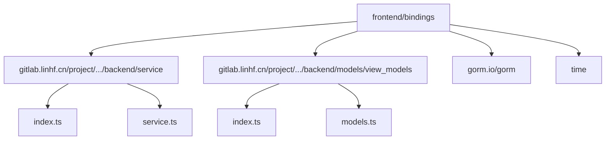
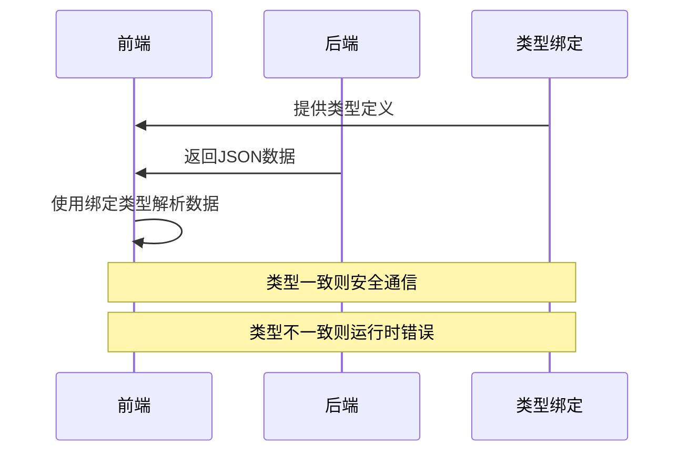

# 类型绑定生成

<cite>
**本文档引用的文件**  
- [main.go](file://main.go)
- [service.go](file://backend/service/service.go)
- [chat.go](file://backend/models/view_models/chat.go)
- [models.ts](file://frontend/bindings/gitlab.linhf.cn/project/lemontea/lemon_tea_desktop/backend/models/view_models/models.ts)
- [service.ts](file://frontend/bindings/gitlab.linhf.cn/project/lemontea/lemontea_desktop/backend/service/service.ts)
- [tsconfig.app.json](file://frontend/tsconfig.app.json)
- [vite.config.ts](file://frontend/vite.config.ts)
</cite>

## 目录

1. [简介](#简介)
2. [绑定生成机制](#绑定生成机制)
3. [bindings目录结构](#bindings目录结构)
4. [手动触发绑定更新](#手动触发绑定更新)
5. [常见生成失败问题及解决](#常见生成失败问题及解决)
6. [类型同步的重要性](#类型同步的重要性)
7. [最佳实践建议](#最佳实践建议)
8. [结论](#结论)

## 简介

Wails框架通过自动生成TypeScript绑定类型，实现Go后端与前端之间的类型安全通信。当Go结构体或服务方法发生变更时，必须执行`wails generate`命令重新生成前端类型定义文件，以确保前后端数据交互的类型一致性。本文详细说明该机制的工作原理、目录结构、更新流程、常见问题及最佳实践。

## 绑定生成机制

Wails框架在构建过程中自动分析Go代码中的结构体和服务方法，将其转换为对应的TypeScript类型定义。这些类型定义文件位于`frontend/bindings/`目录下，由`wails generate`命令触发生成。生成过程依赖于Go代码的结构标签（如`json`标签）来确定字段名称和类型映射。

当Go结构体或服务接口发生变化时，必须重新运行生成命令，否则前端使用的类型将与后端实际返回的数据不匹配，可能导致运行时错误。

**Section sources**
- [main.go](file://main.go#L1-L58)
- [service.go](file://backend/service/service.go#L1-L29)

## bindings目录结构

`frontend/bindings/`目录按照模块化方式组织生成的类型定义文件：

- `gitlab.linhf.cn/project/lemontea/lemon_tea_desktop/backend/service/`：对应后端服务方法的TypeScript函数签名
- `gitlab.linhf.cn/project/lemontea/lemon_tea_desktop/backend/models/view_models/`：对应数据传输对象（DTO）的TypeScript类定义
- `gorm.io/gorm/` 和 `time/`：第三方依赖的类型映射

每个模块包含`index.ts`和`models.ts`（或`service.ts`）文件，其中`index.ts`导出所有类型，便于前端代码导入使用。



**Diagram sources**
- [models.ts](file://frontend/bindings/gitlab.linhf.cn/project/lemontea/lemon_tea_desktop/backend/models/view_models/models.ts#L1-L336)
- [service.ts](file://frontend/bindings/gitlab.linhf.cn/project/lemontea/lemon_tea_desktop/backend/service/service.ts#L1-L126)

## 手动触发绑定更新

当修改了Go结构体或服务方法后，需手动执行以下命令重新生成类型绑定：

```bash
wails generate
```

或根据项目配置使用：

```bash
wails3 dev -config ./build/config.yml -port 9245
```

该命令会扫描所有标记为服务的Go结构体及其方法，以及被引用的数据模型，生成最新的TypeScript类型定义。生成完成后，前端开发环境会自动检测到文件变化并重新编译。

**Section sources**
- [Taskfile.yml](file://Taskfile.yml#L1-L32)
- [main.go](file://main.go#L1-L58)

## 常见生成失败问题及解决

### Go语法错误
若Go代码存在语法错误，类型生成将失败。需先修复所有编译错误再运行生成命令。

### 循环引用
当两个包相互导入时会导致生成失败。应重构代码消除循环依赖，通常通过引入接口层或重新组织包结构解决。

### 缺失JSON标签
确保所有需要序列化的结构体字段都有正确的`json`标签，否则生成的TypeScript类型可能不准确。

### 第三方类型未映射
如`time.Time`或`gorm.Model`等类型需确保其绑定已正确生成。Wails会自动处理常见类型，但自定义类型需手动配置。

**Section sources**
- [chat.go](file://backend/models/view_models/chat.go#L1-L25)
- [models.ts](file://frontend/bindings/gitlab.linhf.cn/project/lemontea/lemon_tea_desktop/backend/models/view_models/models.ts#L1-L336)

## 类型同步的重要性

保持前后端类型同步至关重要。若绑定未及时更新，可能出现以下问题：

- 类型检查失效，导致运行时`undefined`错误
- IDE无法提供正确代码补全
- 数据序列化/反序列化失败
- 难以调试的隐性bug

例如，若后端新增一个字段但前端未更新绑定，则访问该字段时将返回`undefined`，而TypeScript编译器无法捕获此错误。



**Diagram sources**
- [service.ts](file://frontend/bindings/gitlab.linhf.cn/project/lemontea/lemon_tea_desktop/backend/service/service.ts#L1-L126)
- [models.ts](file://frontend/bindings/gitlab.linhf.cn/project/lemontea/lemon_tea_desktop/backend/models/view_models/models.ts#L1-L336)

## 最佳实践建议

### Git提交前自动运行生成
在`.git/hooks/pre-commit`中添加脚本，确保每次提交前自动运行`wails generate`：

```bash
#!/bin/sh
wails generate
if [ $? -ne 0 ]; then
  echo "类型生成失败，请检查Go代码"
  exit 1
fi
```

### 启用严格类型检查
在`tsconfig.app.json`中启用严格模式，充分利用生成的类型信息：

```json
{
  "compilerOptions": {
    "strict": true,
    "noImplicitAny": true,
    "strictNullChecks": true
  }
}
```

### 使用路径别名
通过`vite.config.ts`和`tsconfig.app.json`配置路径别名，简化导入：

```ts
import { GetProviders } from '@bindings/gitlab.linhf.cn/project/lemontea/lemon_tea_desktop/backend/service/service';
```

**Section sources**
- [tsconfig.app.json](file://frontend/tsconfig.app.json#L1-L30)
- [vite.config.ts](file://frontend/vite.config.ts#L1-L16)

## 结论

Wails框架的类型绑定生成功能是保障前后端类型安全的核心机制。通过理解其工作原理、目录结构和更新流程，开发者可以有效避免因类型不同步导致的运行时错误。遵循最佳实践，特别是在版本控制中集成自动生成，能够显著提升开发效率和应用稳定性。