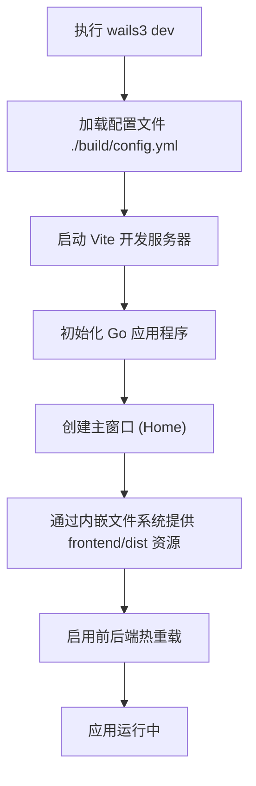

# 快速开始

<cite>
**本文档中引用的文件**  
- [README.md](file://README.md)
- [Taskfile.yml](file://Taskfile.yml)
- [main.go](file://main.go)
- [vite.config.ts](file://frontend/vite.config.ts)
- [package.json](file://frontend/package.json)
- [service.go](file://backend/service/service.go)
- [main.tsx](file://frontend/src/main.tsx)
- [App.tsx](file://frontend/src/App.tsx)
</cite>

## 目录
1. [简介](#简介)
2. [开发环境准备](#开发环境准备)
3. [项目运行步骤](#项目运行步骤)
4. [开发模式详解](#开发模式详解)
5. [生产构建命令](#生产构建命令)
6. [前后端集成机制](#前后端集成机制)
7. [常见问题与解决方案](#常见问题与解决方案)
8. [总结](#总结)

## 简介
本指南旨在帮助新手开发者快速上手并成功运行 `lemon_tea_desktop` 项目。该项目基于 Wails3 框架构建，结合 Go 后端与 React 前端，提供一个现代化的桌面应用开发体验。通过本指南，您将在10分钟内完成本地环境搭建、项目启动与基础调试。

**Section sources**
- [README.md](file://README.md#L1-L60)

## 开发环境准备
在开始之前，请确保您的系统已安装以下依赖：

- **Go 1.20 或更高版本**：用于编译和运行后端逻辑。
- **Node.js 18 或更高版本**：用于前端资源的构建与管理。
- **Wails CLI 工具（wails3）**：可通过以下命令安装：
  ```bash
  go install github.com/wailsapp/wails/v3/cmd/wails3@latest
  ```

安装完成后，验证是否可用：
```bash
wails3 version
```

预期输出应显示 Wails3 的版本信息。

**Section sources**
- [README.md](file://README.md#L1-L60)

## 项目运行步骤
按照以下步骤即可快速启动项目：

1. **克隆仓库**
   ```bash
   git clone https://gitlab.linhf.cn/project/lemontea/lemon_tea_desktop.git
   cd lemon_tea_desktop
   ```

2. **启动开发模式**
   ```bash
   wails3 dev -config ./build/config.yml -port 9245
   ```

   此命令将同时启动前端 Vite 开发服务器和 Go 后端，并自动打开主窗口界面。

3. **查看主窗口**
   成功启动后，您将看到标题为 "Home" 的主窗口，界面由 React 渲染，宽度为1300px，高度为860px，背景色为深蓝（RGB: 27, 38, 54）。

**Section sources**
- [README.md](file://README.md#L7-L15)
- [Taskfile.yml](file://Taskfile.yml#L25-L34)
- [main.go](file://main.go#L35-L55)

## 开发模式详解
`wails3 dev` 命令会监听前后端文件变化并实现热重载。其工作流程如下：



**Diagram sources**
- [Taskfile.yml](file://Taskfile.yml#L25-L34)
- [main.go](file://main.go#L1-L60)
- [vite.config.ts](file://frontend/vite.config.ts#L1-L18)

**Section sources**
- [Taskfile.yml](file://Taskfile.yml#L25-L34)
- [main.go](file://main.go#L1-L60)
- [vite.config.ts](file://frontend/vite.config.ts#L1-L18)

## 生产构建命令
使用 `Taskfile.yml` 中定义的命令进行生产打包：

| 命令 | 说明 |
|------|------|
| `task build:mac` | 构建 macOS 平台的应用程序 |
| `task build:win` | 构建 Windows 平台的应用程序 |
| `task package` | 打包生产版本（根据当前操作系统） |
| `task run` | 直接运行应用（不生成构建产物） |

这些命令通过 `Taskfile.yml` 的 `includes` 机制引入不同平台的构建配置，确保跨平台一致性。

**Section sources**
- [Taskfile.yml](file://Taskfile.yml#L1-L24)

## 前后端集成机制
本项目采用 Wails3 的服务注入机制实现前后端通信：

1. **前端资源编译**：使用 Vite 编译 `frontend/src` 中的 TSX 和 SCSS 文件，输出至 `frontend/dist`。
2. **后端服务注册**：在 `main.go` 中通过 `application.NewService()` 注册 `service.Service` 实例。
3. **绑定生成**：Wails CLI 自动生成前端绑定代码至 `frontend/bindings/` 目录，使 TypeScript 可直接调用 Go 方法。
4. **资源嵌入**：通过 `//go:embed all:frontend/dist` 将前端资源编译进二进制文件。

```mermaid
graph TB
subgraph Frontend
A[TSX/SCSS] --> B[Vite]
B --> C[frontend/dist]
end
subgraph Backend
D[main.go] --> E[Embed frontend/dist]
F[service.go] --> G[Service Registration]
end
C --> E
G --> H[Wails Runtime]
H < --> I[前端 bindings 调用]
```

**Diagram sources**
- [main.go](file://main.go#L10-L15)
- [vite.config.ts](file://frontend/vite.config.ts#L1-L18)
- [service.go](file://backend/service/service.go#L1-L30)
- [package.json](file://frontend/package.json#L1-L48)

**Section sources**
- [main.go](file://main.go#L10-L15)
- [vite.config.ts](file://frontend/vite.config.ts#L1-L18)
- [service.go](file://backend/service/service.go#L1-L30)
- [package.json](file://frontend/package.json#L1-L48)

## 常见问题与解决方案
### 1. 绑定类型未生成
**现象**：前端无法调用 Go 函数，提示类型不存在。  
**解决方法**：重新运行绑定生成命令：
```bash
wails3 generate
```

### 2. 端口冲突
若默认端口 `9245` 被占用，可通过环境变量更改：
```bash
WAILS_VITE_PORT=9246 wails3 dev
```

### 3. 页面空白或加载失败
检查 `frontend/dist` 是否存在，若不存在请手动构建：
```bash
cd frontend && npm run build:dev
```

### 4. 服务启动失败
确保 `storage.NewStorage()` 初始化成功，查看日志输出：
```go
log.Println("Storage initialized:", s.storage != nil)
```

**Section sources**
- [service.go](file://backend/service/service.go#L15-L30)
- [main.go](file://main.go#L50-L58)
- [App.tsx](file://frontend/src/App.tsx#L1-L87)

## 总结
通过本指南，您已掌握如何快速搭建、运行和调试 `lemon_tea_desktop` 项目。核心流程包括环境准备、开发模式启动、生产构建及常见问题处理。借助 Wails3 的强大集成功能，您可以高效开发跨平台桌面应用。

**Section sources**
- [README.md](file://README.md#L1-L60)
- [Taskfile.yml](file://Taskfile.yml#L1-L34)
- [main.go](file://main.go#L1-L60)