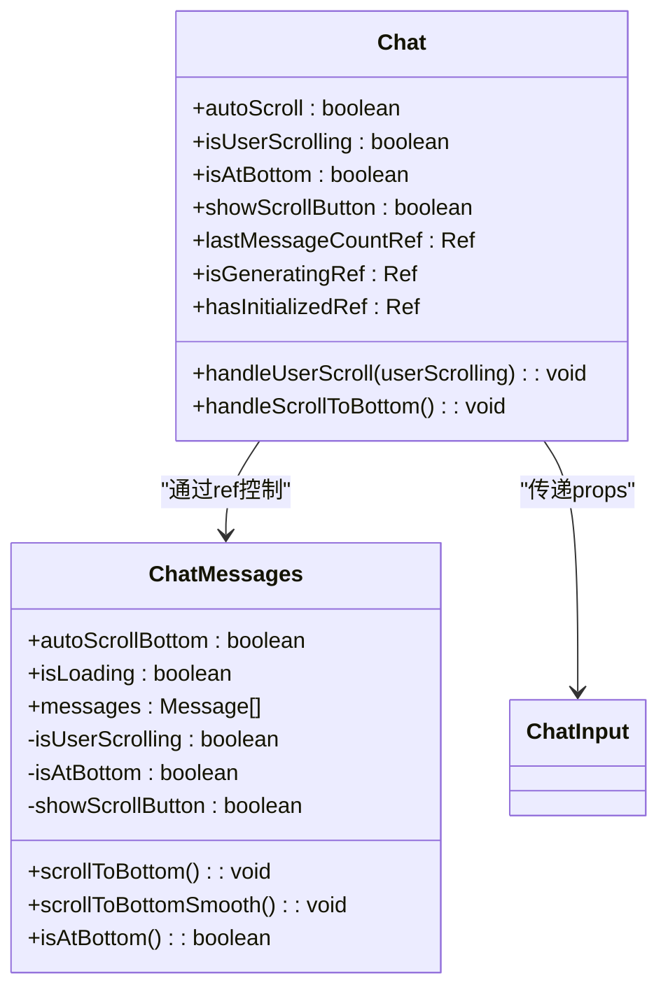
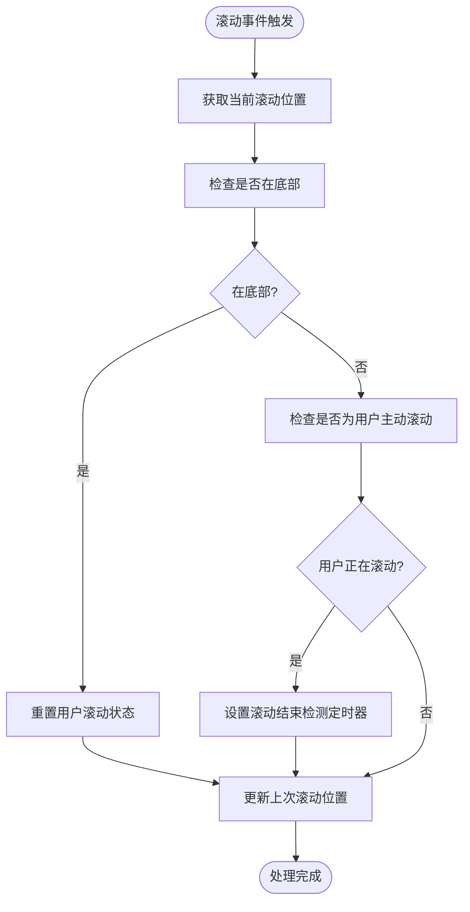
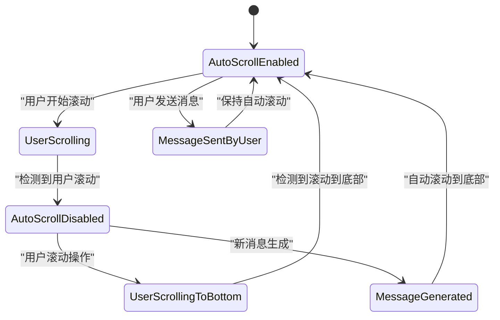
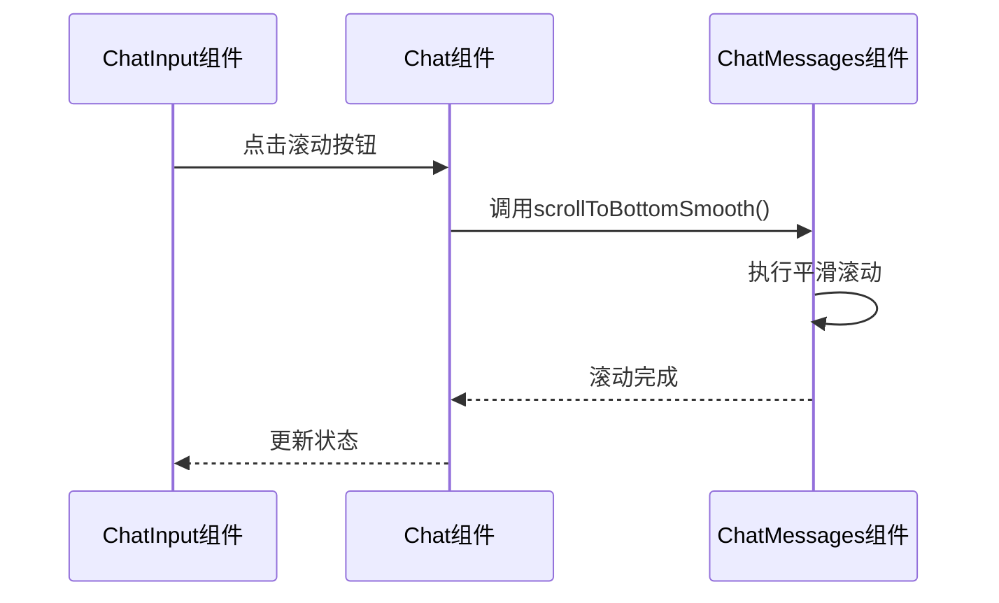

<cite>
**本文档中引用的文件**  
- [SCROLL_OPTIMIZATION.md](file://frontend/doc/SCROLL_OPTIMIZATION.md)
- [chat_messages.tsx](file://frontend/src/pages/home/chat/chat_messages.tsx)
- [index.tsx](file://frontend/src/pages/home/chat/index.tsx)
- [chat_input.tsx](file://frontend/src/pages/home/chat/chat_input.tsx)
</cite>

# 前端滚动优化

## Table of Contents
1. [引言](#引言)
2. [核心滚动状态管理](#核心滚动状态管理)
3. [高精度滚动位置检测](#高精度滚动位置检测)
4. [用户滚动事件协同机制](#用户滚动事件协同机制)
5. [自动滚动与用户状态交互](#自动滚动与用户状态交互)
6. [滚动策略与性能优化](#滚动策略与性能优化)
7. [智能状态恢复机制](#智能状态恢复机制)
8. [滚动API暴露与调用](#滚动api暴露与调用)
9. [结论](#结论)

## 引言

本文档详细阐述了聊天消息列表的前端滚动优化策略，重点分析了如何通过React Hooks实现高精度的滚动位置检测和智能的用户交互响应。系统通过useRef和useCallback等Hooks构建了高效的滚动状态管理系统，实现了在AI消息生成过程中允许用户自由滚动，并能立即响应任何用户操作的极致敏感检测机制。

**Section sources**
- [SCROLL_OPTIMIZATION.md](file://frontend/doc/SCROLL_OPTIMIZATION.md#L1-L280)

## 核心滚动状态管理

系统采用多维度状态管理策略，通过useState和useRef组合实现滚动状态的精确控制。核心状态包括`autoScroll`（自动滚动开关）、`isUserScrolling`（用户滚动状态）和`isAtBottom`（是否位于底部），配合`showScrollButton`（滚动按钮显示状态）共同构成完整的滚动控制体系。

状态管理的关键在于区分程序滚动和用户滚动，避免状态冲突。通过引用（ref）而非状态（state）来跟踪消息数量变化（`lastMessageCountRef`）和生成状态（`isGeneratingRef`），确保在复杂异步场景下状态的准确性和一致性。



**Diagram sources**
- [index.tsx](file://frontend/src/pages/home/chat/index.tsx#L70-L120)
- [chat_messages.tsx](file://frontend/src/pages/home/chat/chat_messages.tsx#L30-L50)

**Section sources**
- [index.tsx](file://frontend/src/pages/home/chat/index.tsx#L70-L120)
- [chat_messages.tsx](file://frontend/src/pages/home/chat/chat_messages.tsx#L30-L50)

## 高精度滚动位置检测

系统实现了高精度的滚动位置检测机制，通过`isAtBottom`函数判断是否位于滚动容器底部，允许20px的误差范围，提供更宽松和用户友好的底部判断。

```typescript
const isAtBottom = useCallback(() => {
    if (!chatMessagesPageRef.current) return false;
    const { scrollTop, scrollHeight, clientHeight } = chatMessagesPageRef.current;
    return scrollHeight - scrollTop - clientHeight <= 20;
}, []);
```

该检测机制通过useCallback进行记忆化处理，避免不必要的重新创建，同时依赖于滚动容器的引用（`chatMessagesPageRef`），确保每次检测都能获取最新的滚动状态。20px的误差范围设计考虑了不同设备和浏览器的渲染差异，提高了检测的鲁棒性。

**Section sources**
- [chat_messages.tsx](file://frontend/src/pages/home/chat/chat_messages.tsx#L90-L95)

## 用户滚动事件协同机制

系统通过`handleScroll`和`handleUserScrollStart`两个事件处理器实现协同工作机制，确保滚动检测的实时性和准确性。

### handleScroll事件处理器

`handleScroll`监听滚动事件，进行位置计算和状态更新。它通过比较当前滚动位置与上次记录的位置（`lastScrollTopRef`）来检测滚动变化，并结合底部判断逻辑更新相关状态。



**Diagram sources**
- [chat_messages.tsx](file://frontend/src/pages/home/chat/chat_messages.tsx#L122-L185)

### handleUserScrollStart事件处理器

`handleUserScrollStart`通过监听wheel、touchstart、touchmove和keydown事件实现零延迟用户操作检测。该处理器在用户任何滚动操作开始时立即触发，无需等待滚动位置累积变化。

```typescript
const handleUserScrollStart = useCallback(() => {
    isScrollingByUserRef.current = true;
    setIsUserScrolling(true);
    onUserScroll?.(true);
}, [onUserScroll]);
```

这种多事件监听策略确保了对所有滚动输入方式（鼠标、触摸、键盘）的全面覆盖，实现了真正的零延迟检测。

**Section sources**
- [chat_messages.tsx](file://frontend/src/pages/home/chat/chat_messages.tsx#L188-L208)

## 自动滚动与用户状态交互

系统通过`autoScrollBottom`与`isUserScrolling`状态的交互实现智能的自动滚动控制。当`autoScrollBottom`为true且`isUserScrolling`为false时，系统会自动将滚动条定位到底部。

交互逻辑遵循以下原则：
1. 用户开始滚动时立即设置`isUserScrolling`为true，暂停自动滚动
2. 用户滚动到底部时自动恢复`autoScrollBottom`为true
3. 用户发送新消息时强制启用自动滚动
4. AI消息生成过程中保持自动滚动，除非用户主动干预



**Diagram sources**
- [index.tsx](file://frontend/src/pages/home/chat/index.tsx#L130-L180)
- [chat_messages.tsx](file://frontend/src/pages/home/chat/chat_messages.tsx#L210-L250)

**Section sources**
- [index.tsx](file://frontend/src/pages/home/chat/index.tsx#L130-L180)
- [chat_messages.tsx](file://frontend/src/pages/home/chat/chat_messages.tsx#L210-L250)

## 滚动策略与性能优化

系统实现了两种滚动策略：`scrollToBottomInstant`（无动画）和`scrollToBottomSmooth`（平滑），根据场景智能选择。

### 滚动策略选择

- **无动画滚动**：用于流式消息生成或加载状态，确保实时跟进，避免动画延迟
- **平滑滚动**：用于用户点击滚动按钮或常规消息更新，提供更好的用户体验

```typescript
useEffect(() => {
    if (hasStreamingMessage || isLoading) {
        scrollToBottomInstant();
    } else {
        scrollToBottomSmooth();
    }
}, [messages, isLoading]);
```

### requestAnimationFrame优化

系统使用`requestAnimationFrame`优化滚动性能，在浏览器下一次重绘前执行滚动操作，确保滚动的流畅性。

```typescript
requestAnimationFrame(() => {
    if (hasStreamingMessage || isLoading) {
        scrollToBottomInstant();
    } else {
        scrollToBottomSmooth();
    }
});
```

这种优化避免了在高频滚动事件中直接操作DOM可能造成的性能问题，确保了滚动操作的高效执行。

**Section sources**
- [chat_messages.tsx](file://frontend/src/pages/home/chat/chat_messages.tsx#L210-L250)

## 智能状态恢复机制

系统实现了基于150ms超短延迟的`userScrollDetectionRef`定时器的智能状态恢复机制，这是v2.2极致敏感检测方案的核心。

当用户开始滚动时，系统立即标记`isScrollingByUserRef.current`为true，并设置150ms的定时器。如果用户在150ms内停止滚动且检测到已回到底部，则自动恢复自动滚动状态。

```typescript
userScrollDetectionRef.current = setTimeout(() => {
    if (isAtBottom()) {
        isScrollingByUserRef.current = false;
        setIsUserScrolling(false);
        onUserScroll?.(false);
    }
}, 150);
```

150ms的超短延迟设计平衡了响应速度和误判率，既能快速响应用户操作，又能避免因微小滚动抖动导致的状态频繁切换。

**Section sources**
- [chat_messages.tsx](file://frontend/src/pages/home/chat/chat_messages.tsx#L160-L170)

## 滚动API暴露与调用

系统通过`useImperativeHandle`暴露滚动API，使父组件能够直接调用子组件的滚动方法。

### API暴露

```typescript
useImperativeHandle(ref, () => ({
    scrollToBottom: scrollToBottomInstant,
    scrollToBottomSmooth,
    isAtBottom,
    getScrollContainer: () => chatMessagesPageRef.current,
    enableAutoScroll
}));
```

### API调用

父组件通过ref调用暴露的API：

```typescript
const chatMessagesRef = useRef<ChatMessagesRef>(null);
const handleScrollToBottom = useCallback(() => {
    if (chatMessagesRef.current) {
        chatMessagesRef.current.scrollToBottomSmooth();
        setAutoScroll(true);
    }
}, []);
```

这种设计实现了组件间的解耦，父组件无需关心滚动实现细节，只需调用标准化的API即可完成滚动操作。



**Diagram sources**
- [chat_messages.tsx](file://frontend/src/pages/home/chat/chat_messages.tsx#L200-L210)
- [index.tsx](file://frontend/src/pages/home/chat/index.tsx#L110-L120)
- [chat_input.tsx](file://frontend/src/pages/home/chat/chat_input.tsx#L250-L260)

**Section sources**
- [chat_messages.tsx](file://frontend/src/pages/home/chat/chat_messages.tsx#L200-L210)
- [index.tsx](file://frontend/src/pages/home/chat/index.tsx#L110-L120)

## 结论

本文档详细阐述了聊天消息列表的前端滚动优化策略，展示了如何通过React Hooks和精细化的状态管理实现极致敏感的滚动检测。系统通过useRef和useCallback构建了高效的滚动状态管理系统，利用多事件监听实现零延迟用户操作检测，并通过智能的定时器机制实现状态的平滑恢复。

核心优化点包括：20px误差范围的高精度底部检测、150ms超短延迟的智能状态恢复、无动画与平滑滚动的智能策略选择，以及通过useImperativeHandle实现的API暴露机制。这些优化共同确保了在AI消息生成过程中用户能够自由滚动，同时系统能立即响应任何用户操作，提供了流畅自然的用户体验。