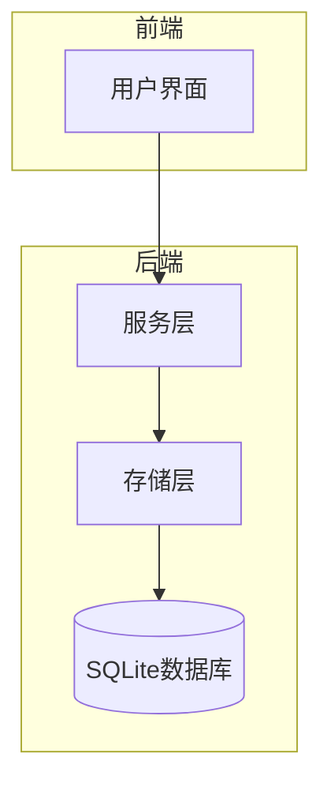
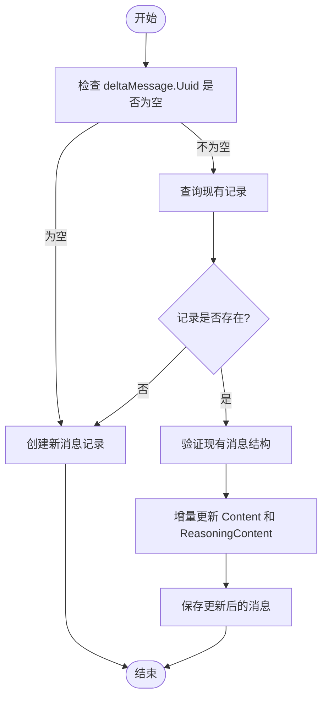
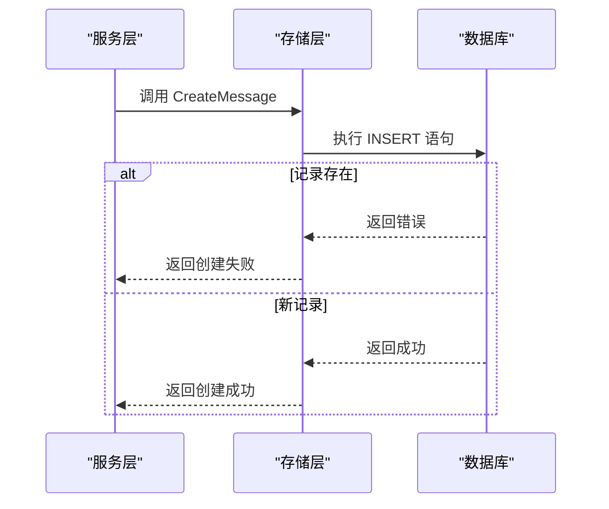
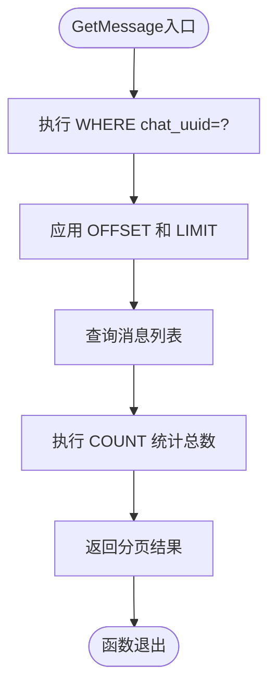
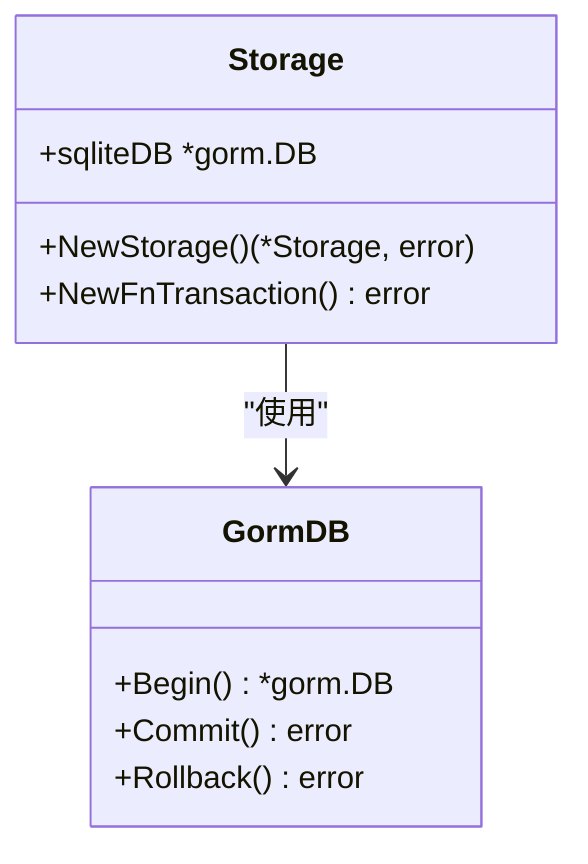
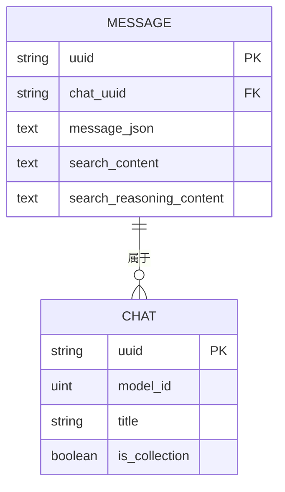

# 后端存储优化

<cite>
**本文档引用的文件**   
- [chat_message.go](file://backend/storage/chat_message.go)
- [storage.go](file://backend/storage/storage.go)
- [chat.go](file://backend/models/data_models/chat.go)
- [chat.go](file://backend/service/chat.go)
</cite>

## 目录
1. [简介](#简介)
2. [项目结构](#项目结构)
3. [核心组件](#核心组件)
4. [架构概述](#架构概述)
5. [详细组件分析](#详细组件分析)
6. [依赖分析](#依赖分析)
7. [性能考虑](#性能考虑)
8. [故障排除指南](#故障排除指南)
9. [结论](#结论)

## 简介
本文档深入解析后端消息存储的性能优化机制，重点分析增量消息更新、批量插入事务处理、分页查询内存控制、连接池配置及流式处理场景下的关键作用。通过分析 `SaveOrUpdateDeltaMessage`、`CreateMessage`、`GetMessage` 等核心方法，阐述系统如何在高并发、大数据量场景下保持高效稳定。

## 项目结构
项目采用分层架构设计，主要分为 `backend` 和 `frontend` 两大模块。后端存储核心位于 `backend/storage` 目录，包含消息、对话等数据的持久化逻辑。`backend/models/data_models` 定义了数据结构，`backend/service` 提供业务服务接口。

**Section sources**
- [chat_message.go](file://backend/storage/chat_message.go#L1-L73)
- [storage.go](file://backend/storage/storage.go#L1-L83)

## 核心组件
核心组件包括消息存储服务（Storage）、数据模型（Message、Chat）、服务层（Service）以及 GORM 数据库交互层。其中 `SaveOrUpdateDeltaMessage` 方法实现了增量更新，`GetMessage` 支持分页查询，`NewStorage` 初始化数据库连接。

**Section sources**
- [chat_message.go](file://backend/storage/chat_message.go#L1-L73)
- [chat.go](file://backend/models/data_models/chat.go#L1-L63)

## 架构概述
系统采用典型的三层架构：前端通过 API 调用后端服务层，服务层调用存储层进行数据操作，存储层通过 GORM 与 SQLite 数据库交互。消息数据以 JSON 字符串形式存储在 `message_json` 字段中，并通过 GORM 钩子实现自动序列化与反序列化。

**Diagram sources**
- [chat.go](file://backend/service/chat.go#L1-L207)
- [chat_message.go](file://backend/storage/chat_message.go#L1-L73)

## 详细组件分析

### 增量消息更新机制分析
`SaveOrUpdateDeltaMessage` 方法通过检查 `deltaMessage.Uuid` 判断是否为新消息。若存在则查询现有记录并合并 `Content` 和 `ReasoningContent` 字段，避免全量更新带来的性能损耗。

**Diagram sources**
- [chat_message.go](file://backend/storage/chat_message.go#L16-L58)

**Section sources**
- [chat_message.go](file://backend/storage/chat_message.go#L16-L58)

### 批量插入与事务处理分析
`CreateMessage` 方法在批量插入时依赖 GORM 的事务机制确保数据一致性。虽然单次调用未显式开启事务，但在批量操作场景下可通过 `NewFnTransaction` 方法封装事务逻辑。

**Diagram sources**
- [chat_message.go](file://backend/storage/chat_message.go#L11-L13)
- [storage.go](file://backend/storage/storage.go#L70-L82)

### 分页查询与内存控制分析
`GetMessage` 方法通过 `Offset/Limit` 实现分页查询，有效防止内存溢出。先查询指定范围的数据，再通过 `Count` 获取总数，避免一次性加载全部数据。

**Diagram sources**
- [chat_message.go](file://backend/storage/chat_message.go#L60-L72)

**Section sources**
- [chat_message.go](file://backend/storage/chat_message.go#L60-L72)

### 连接池与并发写入分析
`NewStorage` 方法初始化 SQLite 数据库连接，虽然未显式配置连接池参数，但 GORM 默认使用连接池管理数据库连接。合理的连接池配置可显著提升并发写入性能。

**Diagram sources**
- [storage.go](file://backend/storage/storage.go#L1-L83)

## 依赖分析
系统依赖 GORM 作为 ORM 框架，SQLite 作为嵌入式数据库，通过 `go.mod` 管理第三方库版本。`data_models.Message` 结构体依赖 `schema.Message` 进行消息内容的序列化与反序列化。

**Diagram sources**
- [chat.go](file://backend/models/data_models/chat.go#L1-L63)

**Section sources**
- [chat.go](file://backend/models/data_models/chat.go#L1-L63)

## 性能考虑
为优化 `GetMessage` 查询性能，建议在 `chat_uuid` 字段上创建索引。虽然外键约束能保证数据完整性，但在高并发写入场景下可能影响性能，需根据实际业务权衡使用。

**Section sources**
- [chat.go](file://backend/models/data_models/chat.go#L1-L63)

## 故障排除指南
常见问题包括数据库连接失败、消息更新异常等。可通过查看日志中的 `Failed to connect to database` 或 `save or update delta message failed` 错误信息进行排查。确保数据库路径可写，消息结构体字段正确初始化。

**Section sources**
- [storage.go](file://backend/storage/storage.go#L1-L83)
- [chat.go](file://backend/service/chat.go#L192-L206)

## 结论
本文档详细分析了后端消息存储的性能优化机制，涵盖增量更新、事务处理、分页查询、连接池配置等方面。通过合理使用 GORM 特性与数据库优化策略，系统能够在流式 AI 响应生成等高负载场景下保持高效稳定运行。