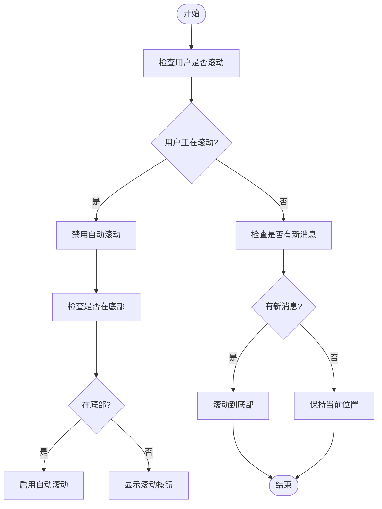
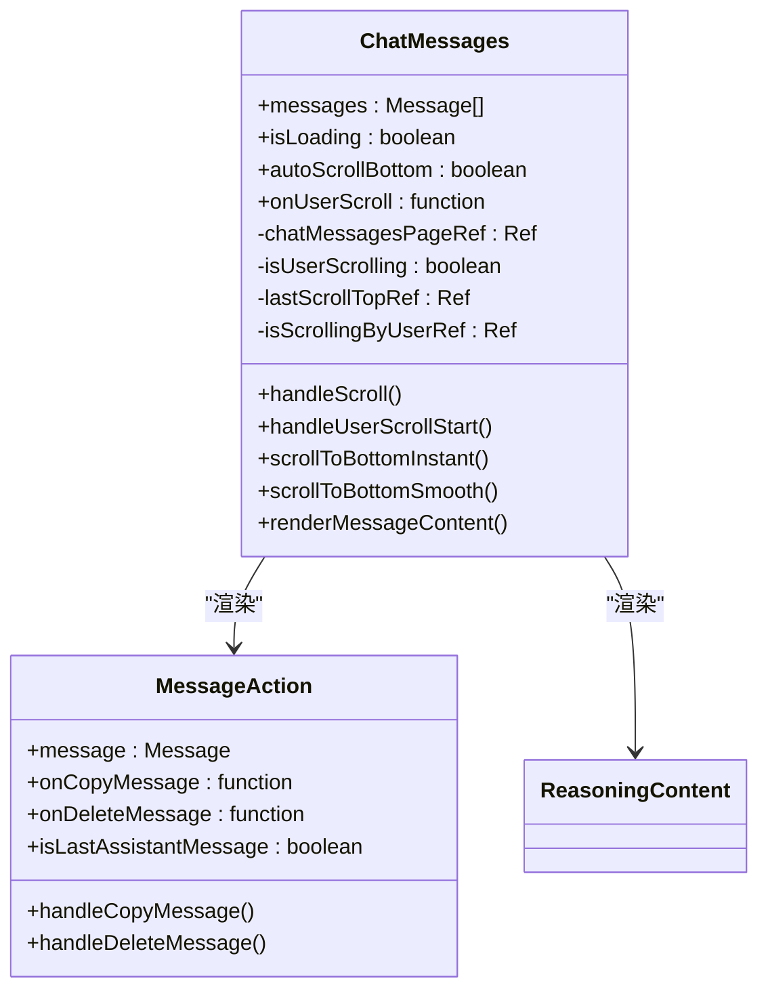
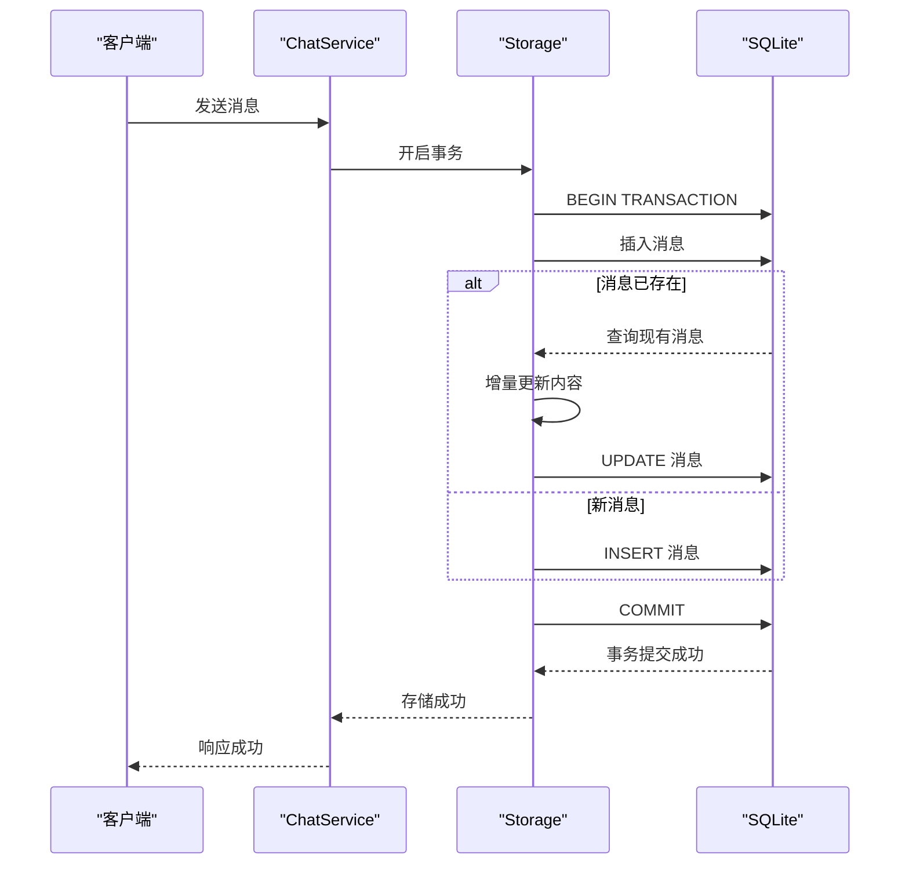

# 性能优化策略

<cite>
**本文档引用文件**  
- [SCROLL_OPTIMIZATION.md](file://frontend/doc/SCROLL_OPTIMIZATION.md)
- [chat_messages.tsx](file://frontend/src/pages/home/chat/chat_messages.tsx)
- [index.tsx](file://frontend/src/pages/home/chat/index.tsx)
- [chat_input.tsx](file://frontend/src/pages/home/chat/chat_input.tsx)
- [chat.go](file://backend/service/chat.go)
- [chat_message.go](file://backend/storage/chat_message.go)
- [chat.go](file://backend/models/data_models/chat.go)
- [storage.go](file://backend/storage/storage.go)
</cite>

## 目录
1. [引言](#引言)
2. [前端滚动优化策略](#前端滚动优化策略)
3. [前端渲染性能优化](#前端渲染性能优化)
4. [后端消息存储优化](#后端消息存储优化)
5. [未来优化建议](#未来优化建议)
6. [结论](#结论)

## 引言
本文档总结了项目在性能优化方面的实践，重点分析聊天消息列表的滚动优化策略、前端渲染性能优化以及后端消息存储的事务与索引优化。通过精细化的状态管理、事件监听和数据库操作优化，系统在用户体验和性能表现上均取得了显著提升。

## 前端滚动优化策略

### 滚动状态管理机制
系统通过精细化的状态管理实现了智能滚动控制，核心状态包括：
- `autoScroll`：控制是否启用自动滚动到底部
- `isUserScrolling`：标记用户是否正在进行手动滚动
- `isAtBottom`：判断当前视图是否位于消息列表底部
- `showScrollButton`：控制是否显示“滚动到底部”按钮

这些状态协同工作，确保在AI生成消息时既能实时跟进，又不会干扰用户查看历史消息。

**图示来源**  
- [index.tsx](file://frontend/src/pages/home/chat/index.tsx#L25-L100)
- [chat_messages.tsx](file://frontend/src/pages/home/chat/chat_messages.tsx#L50-L150)

**本节来源**  
- [SCROLL_OPTIMIZATION.md](file://frontend/doc/SCROLL_OPTIMIZATION.md#L1-L50)
- [index.tsx](file://frontend/src/pages/home/chat/index.tsx#L25-L100)

### 高敏感度滚动检测
为实现极致的用户体验，系统采用了高敏感度的滚动检测机制：

1. **零容忍检测**：任何滚动位置变化（> 0px）都被视为用户操作
2. **多事件监听**：同时监听 `scroll`、`wheel`、`touchstart`、`touchmove` 和 `keydown` 事件
3. **即时响应**：用户开始滚动的瞬间立即停止自动滚动
4. **智能恢复**：当用户滚动回底部时，自动恢复自动滚动功能

该机制确保了在AI消息生成过程中，用户可以随时中断自动滚动查看历史消息，且操作响应延迟极低。

### 智能滚动策略
系统根据不同的场景采用不同的滚动策略：

- **流式消息生成时**：使用 `scrollToBottomInstant` 立即滚动，无动画效果，确保实时跟进
- **普通消息更新时**：使用 `scrollToBottomSmooth` 平滑滚动，提供更好的视觉体验
- **用户手动滚动时**：根据是否在底部智能决定是否恢复自动滚动

这种差异化策略在保证实时性的同时，也兼顾了用户体验的流畅性。

**本节来源**  
- [chat_messages.tsx](file://frontend/src/pages/home/chat/chat_messages.tsx#L200-L350)
- [SCROLL_OPTIMIZATION.md](file://frontend/doc/SCROLL_OPTIMIZATION.md#L100-L150)

## 前端渲染性能优化

### 组件级性能优化
系统通过多种技术手段优化前端渲染性能：

1. **React.memo 优化**：对 `MessageAction`、`ReasoningContent` 等组件使用 `React.memo`，避免不必要的重复渲染
2. **useCallback 缓存**：关键事件处理函数使用 `useCallback` 缓存，防止子组件因父组件重新渲染而无谓重渲染
3. **useMemo 优化列表渲染**：消息列表使用 `useMemo` 缓存渲染结果，减少重复计算

**图示来源**  
- [chat_messages.tsx](file://frontend/src/pages/home/chat/chat_messages.tsx#L1-L50)
- [MessageAction/index.tsx](file://frontend/src/components/MessageAction/index.tsx#L1-L20)

### 虚拟滚动优化建议
当前实现中，消息列表采用全量渲染方式。对于超长会话场景，建议引入虚拟滚动（Virtualized List）技术：

1. **性能优势**：只渲染可视区域内的消息，大幅减少DOM节点数量
2. **内存优化**：避免大量消息导致的内存占用过高
3. **滚动流畅性**：即使在数千条消息的会话中也能保持流畅滚动

可考虑使用 `react-window` 或 `react-virtualized` 等成熟库实现虚拟滚动功能。

**本节来源**  
- [chat_messages.tsx](file://frontend/src/pages/home/chat/chat_messages.tsx#L400-L450)
- [MessageAction/index.tsx](file://frontend/src/components/MessageAction/index.tsx#L1-L157)

## 后端消息存储优化

### 事务处理机制
后端在处理消息存储时采用了事务机制，确保数据一致性：

**图示来源**  
- [chat.go](file://backend/service/chat.go#L50-L100)
- [storage.go](file://backend/storage/storage.go#L50-L70)

### 批量插入与索引优化
系统在消息存储方面实现了以下优化：

1. **增量更新机制**：对于流式生成的消息，采用 `SaveOrUpdateDeltaMessage` 方法进行增量更新，避免频繁的全量写入
2. **JSON字段管理**：消息内容以JSON格式存储在 `MessageJson` 字段中，通过GORM的 `BeforeCreate` 和 `BeforeUpdate` 钩子自动序列化
3. **索引优化**：在关键字段上创建索引，包括：
   - `chat_uuid`：快速查询特定聊天的消息
   - `uuid`：唯一标识符索引
   - `is_collection`：收藏状态索引

这些优化确保了即使在大量消息存储的情况下，查询和更新操作仍能保持高效。

**本节来源**  
- [chat_message.go](file://backend/storage/chat_message.go#L1-L50)
- [chat.go](file://backend/models/data_models/chat.go#L30-L60)
- [storage.go](file://backend/storage/storage.go#L1-L30)

## 未来优化建议

### 虚拟滚动实现
建议在前端实现虚拟滚动功能，具体方案包括：

1. **技术选型**：采用 `react-window` 库实现高性能虚拟列表
2. **分页加载**：结合后端的分页查询接口，实现消息的按需加载
3. **缓存策略**：对已加载的消息进行内存缓存，避免重复请求

### 后端批量处理优化
针对大量消息的批量处理场景，建议：

1. **批量插入**：实现批量插入接口，减少数据库事务开销
2. **异步处理**：对于非实时性要求高的操作，采用消息队列异步处理
3. **缓存层**：引入Redis等缓存机制，减轻数据库压力

## 结论
本项目通过精细化的前端滚动控制、组件性能优化和后端存储优化，实现了良好的用户体验和系统性能。滚动优化策略确保了在AI生成过程中既能实时跟进，又不会干扰用户查看历史消息。前端通过React.memo等技术避免了不必要的渲染，后端通过事务处理和索引优化保证了数据操作的高效性。未来可通过引入虚拟滚动等技术进一步提升超长会话场景下的性能表现。