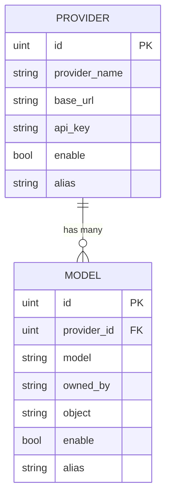

# AI提供方实体 (Provider)

<cite>
**Referenced Files in This Document**   
- [provider.go](file://backend/models/data_models/provider.go)
- [models.go](file://backend/models/data_models/models.go)
- [provider.go](file://backend/storage/provider.go)
- [provider.go](file://backend/service/provider.go)
- [common.go](file://backend/models/data_models/common.go)
</cite>

## 目录
1. [简介](#简介)
2. [核心字段解析](#核心字段解析)
3. [GORM标签详解](#gorm标签详解)
4. [与模型实体的关联关系](#与模型实体的关联关系)
5. [配置示例与最佳实践](#配置示例与最佳实践)
6. [数据访问与服务层](#数据访问与服务层)
7. [结论](#结论)

## 简介

`Provider` 实体是本系统中用于配置和管理AI服务提供商的核心数据模型。它作为所有外部AI服务（如OpenAI、自定义部署的模型服务等）的配置载体，集中存储了连接和认证所需的关键信息。该实体定义了如何与不同的AI服务进行交互，是系统实现多提供商支持和灵活路由的基础。

**Section sources**
- [provider.go](file://backend/models/data_models/provider.go#L1-L10)

## 核心字段解析

`Provider` 实体包含以下关键字段，每个字段都承担着特定的配置职责：

- **ProviderName** (`provider_name`): 用于标识AI服务提供商的名称，例如 "OpenAI"、"Anthropic" 或 "自定义部署"。此字段帮助用户在界面上区分不同的服务来源。
- **BaseUrl** (`base_url`): AI服务API的根地址。该字段支持自定义部署场景，允许用户指向私有或本地的模型服务端点，极大地增强了系统的灵活性。
- **ApiKey** (`api_key`): 用于向AI服务提供商进行身份验证的密钥。这是一个敏感信息，其安全性至关重要。
- **Enable** (`enable`): 布尔标志，表示该提供商配置是否处于启用状态。系统在路由请求时会优先考虑启用的提供商。
- **Alias** (`alias`): 用户可自定义的别名，用于在用户界面中以更友好的名称展示该提供商，提升用户体验。

**Section sources**
- [provider.go](file://backend/models/data_models/provider.go#L4-L9)

## GORM标签详解

`Provider` 实体的 `Enable` 字段上应用了特定的GORM标签：`gorm:"index;type:bool;default:1"`。该标签具有以下重要含义：

- **`index`**: 在数据库的 `enable` 列上创建索引。这使得系统在查询所有“已启用”的提供商时（例如 `WHERE enable = 1`）能够进行高效的查找，避免全表扫描，显著提升查询性能。
- **`type:bool`**: 明确指定数据库中该字段的数据类型为布尔型（bool），确保数据存储的一致性和正确性。
- **`default:1`**: 为该字段设置默认值为 `1`（即 `true`）。这意味着，当用户添加一个新的提供商配置而未明确指定其状态时，系统会自动将其设置为“启用”状态，简化了用户的初始配置流程。

**Section sources**
- [provider.go](file://backend/models/data_models/provider.go#L7)

## 与模型实体的关联关系

`Provider` 实体与 `Model` 实体通过外键关系紧密关联，形成了“一提供方，多模型”的数据结构。

- **关联字段**: `Model` 实体中的 `ProviderId` 字段 (`gorm:"index" json:"provider_id"`) 是一个外键，它引用了 `Provider` 实体的主键 `ID`。
- **数据结构**: 这种设计允许一个AI服务提供商（如OpenAI）关联多个具体的模型（如 `gpt-3.5-turbo`, `gpt-4`, `gpt-4-turbo`）。当用户从某个提供商处获取模型列表时，系统会将这些模型与该提供商的 `ID` 关联起来并存储在 `Model` 表中。
- **级联操作**: 当删除一个 `Provider` 记录时，相关的 `Model` 记录也会被清理（通过 `DeleteAllProviderModel` 方法实现），保证了数据的完整性。

**Diagram sources**
- [provider.go](file://backend/models/data_models/provider.go#L1-L10)
- [models.go](file://backend/models/data_models/models.go#L1-L10)

## 配置示例与最佳实践

### 配置示例
以下是一个添加新的API提供方的典型流程：
1.  在管理界面中，用户填写 `ProviderName` (如 "My OpenAI")。
2.  输入 `BaseUrl` (如 `https://api.openai.com/v1`)。
3.  提供有效的 `ApiKey`。
4.  可选择设置一个 `Alias` (如 "我的主账号")。
5.  点击保存。由于 `Enable` 字段的默认值为 `1`，新配置将自动启用。

### 安全性与性能建议
- **敏感信息保护**: `ApiKey` 字段的值应仅在本地安全存储，绝不应在前端日志、网络请求或错误消息中明文暴露。系统应确保其传输和存储过程的安全性。
- **性能优化**: 虽然 `Enable` 字段已建立索引，但为了进一步优化基于API地址的路由查找性能，**强烈建议在 `BaseUrl` 字段上也建立数据库索引**。这可以通过在GORM标签中为 `BaseUrl` 添加 `index` 来实现，例如：`gorm:"type:varchar(255);index" json:"base_url"`。

**Section sources**
- [provider.go](file://backend/models/data_models/provider.go#L5-L6)
- [provider.go](file://backend/service/provider.go#L30-L45)

## 数据访问与服务层

`Provider` 实体的生命周期由数据访问层（`storage`）和服务层（`service`）共同管理。

- **数据访问层 (Storage)**: `backend/storage/provider.go` 文件中的 `Storage` 结构体提供了对 `Provider` 实体的CRUD（创建、读取、更新、删除）操作，如 `GetProviders`, `AddProvider`, `UpdateProvider` 和 `DeleteProvider`。这些方法直接与数据库交互。
- **服务层 (Service)**: `backend/service/provider.go` 文件中的 `Service` 结构体封装了业务逻辑。例如，`AddProvider` 方法在调用存储层添加提供商后，会自动触发 `updateProviderModel` 流程，从新添加的提供商处拉取其支持的模型列表并同步到本地数据库，实现了配置的自动化。

**Section sources**
- [provider.go](file://backend/storage/provider.go#L10-L48)
- [provider.go](file://backend/service/provider.go#L30-L45)

## 结论

`Provider` 实体是系统多AI提供商架构的基石。通过对 `ProviderName`, `BaseUrl`, `ApiKey`, `Enable` 和 `Alias` 等字段的精心设计，以及利用GORM的 `index` 和 `default` 标签优化查询和默认行为，该实体实现了灵活、高效且安全的服务配置管理。其与 `Model` 实体的“一对多”关系，清晰地组织了提供商与具体模型的层级结构。遵循在 `BaseUrl` 上建立索引的最佳实践，将进一步提升系统的整体性能。