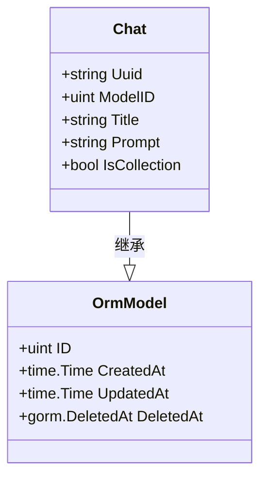
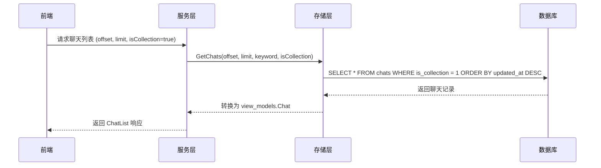
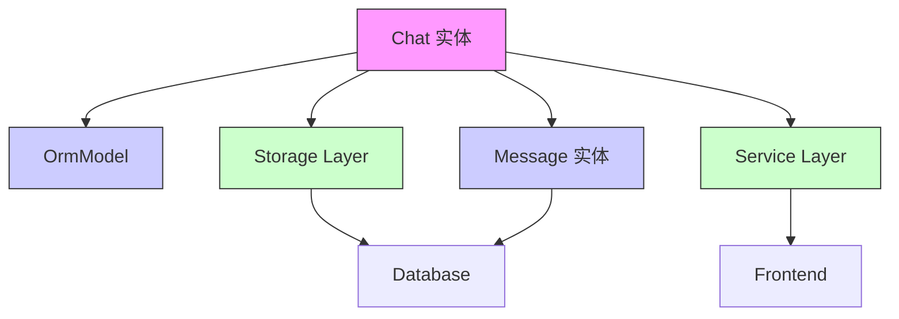

# 会话实体 (Chat)

<cite>
**Referenced Files in This Document**   
- [chat.go](file://backend/models/data_models/chat.go)
- [common.go](file://backend/models/data_models/common.go)
- [chat.go](file://backend/storage/chat.go)
- [chat.go](file://backend/service/chat.go)
</cite>

## 目录
1. [简介](#简介)
2. [核心数据结构](#核心数据结构)
3. [字段详解](#字段详解)
4. [GORM 标签与数据库优化](#gorm-标签与数据库优化)
5. [在聊天界面中的作用](#在聊天界面中的作用)
6. [代码示例](#代码示例)
7. [性能优化建议](#性能优化建议)
8. [依赖关系分析](#依赖关系分析)

## 简介
`Chat` 实体是本应用中会话管理的核心数据结构，定义了用户聊天会话的持久化模型。该实体不仅存储会话的基本信息，还通过 GORM 框架与数据库进行高效交互，支撑着聊天列表展示、上下文加载、搜索过滤等关键功能。本文档详细解析其结构、用途及最佳实践。

## 核心数据结构

`Chat` 实体定义在 `backend/models/data_models/chat.go` 文件中，是一个典型的 GORM 模型，继承了 `OrmModel` 基础结构，包含了会话的所有核心属性。



**Diagram sources**
- [chat.go](file://backend/models/data_models/chat.go#L9-L16)
- [common.go](file://backend/models/data_models/common.go#L8-L13)

**Section sources**
- [chat.go](file://backend/models/data_models/chat.go#L9-L16)

## 字段详解

`Chat` 实体包含以下关键字段，每个字段都通过 JSON 标签暴露给前端，并通过 GORM 标签指导数据库行为。

| 字段名 | 类型 | 说明 |
| :--- | :--- | :--- |
| `Uuid` | string | 会话的全局唯一标识符，用于精确查找和关联消息。 |
| `ModelID` | uint | 关联的 AI 模型 ID，标识此会话使用的是哪个模型。 |
| `Title` | string | 会话的标题，通常由第一条用户消息生成或用户手动编辑。 |
| `Prompt` | string | 自定义的系统提示（System Prompt），用于在会话开始时引导 AI 的行为。 |
| `IsCollection` | bool | 标记会话是否被收藏，`true` 表示已收藏，便于用户快速访问重要会话。 |

**Section sources**
- [chat.go](file://backend/models/data_models/chat.go#L9-L16)

## GORM 标签与数据库优化

GORM 标签是连接 Go 结构体与数据库表的关键，`Chat` 实体中的标签确保了数据的正确存储和高效查询。

- **`gorm:"index"`**: 在 `ModelID` 和 `IsCollection` 字段上创建数据库索引。索引能极大加速 `WHERE` 查询条件的执行速度，例如按模型过滤或按收藏状态筛选会话。
- **`gorm:"type:varchar(255)"`**: 明确定义 `Title` 字段在数据库中的类型和长度。这防止了过长的标题导致的数据库错误，并优化了存储空间。
- **`gorm:"index;default:false"`**: 为 `IsCollection` 字段同时创建索引并设置默认值为 `false`。这意味着新创建的会话默认不被收藏，且对收藏状态的查询非常高效。
- **`grom:"unique;index"`**: （注：代码中存在拼写错误，应为 `gorm`）此标签应为 `Uuid` 字段创建唯一索引，确保每个会话的 UUID 全局唯一。

**Section sources**
- [chat.go](file://backend/models/data_models/chat.go#L9-L16)

## 在聊天界面中的作用

`Chat` 实体是聊天界面功能实现的基石，其作用贯穿于整个用户交互流程。

### 1. 会话列表展示
当用户打开应用时，前端通过 `ChatList` API 获取会话列表。后端服务层 (`service/chat.go`) 调用存储层 (`storage/chat.go`) 的 `GetChats` 方法，从数据库中查询 `Chat` 记录，并将其转换为前端可消费的 `view_models.Chat` 格式，最终在侧边栏中渲染为会话列表。

### 2. 上下文加载
当用户点击某个会话时，应用需要加载该会话的历史消息。系统使用 `Chat` 实体的 `Uuid` 作为外键，在 `Message` 表中查询所有关联的消息，从而恢复完整的对话上下文。

### 3. 搜索与过滤
用户可以通过关键字搜索会话标题，或通过“仅显示收藏”来过滤会话。这些功能的实现都依赖于 `Chat` 实体上的数据库索引（`Title` 和 `IsCollection` 字段的索引），确保了即使在大量会话的情况下也能快速响应。



**Diagram sources**
- [chat.go](file://backend/service/chat.go#L4-L14)
- [chat.go](file://backend/storage/chat.go#L5-L35)

**Section sources**
- [chat.go](file://backend/service/chat.go#L4-L14)
- [chat.go](file://backend/storage/chat.go#L5-L35)

## 代码示例

以下代码片段展示了如何使用 GORM 创建新会话以及如何进行条件查询。

### 创建新会话
当用户开始一个新对话时，服务层会调用 `CreateChat` 方法。

```go
// 代码逻辑示意，非直接复制
func (s *Service) Completions(chatUuid, model string, message schema.Message) {
    // ...
    if chatUuid == "" { // 新建聊天
        chatUuid = uuid.New().String()
        err = s.storage.CreateChat(context.Background(), chatUuid, message.Content, providerModel.ModelId)
    }
    // ...
}
```

**Section sources**
- [chat.go](file://backend/service/chat.go#L56-L60)
- [chat.go](file://backend/storage/chat.go#L55-L68)

### 按收藏状态查询
`GetChats` 方法根据 `isCollection` 参数构建不同的查询条件。

```go
// 代码逻辑示意，非直接复制
func (s *Storage) GetChats(ctx context.Context, offset, limit int, keyword *string, isCollection bool) {
    queryBase := s.sqliteDB.Model(&data_models.Chat{})
    if isCollection {
        queryBase = queryBase.Where("is_collection = ?", 1) // 仅查询收藏的会话
    }
    // ...
}
```

**Section sources**
- [chat.go](file://backend/storage/chat.go#L10-L15)

## 性能优化建议

为了确保应用在数据量增长时依然保持流畅，针对 `Chat` 实体提出以下性能优化建议：

1.  **复合索引 (Composite Index)**: 当前 `ModelID` 和 `IsCollection` 字段是单独索引。如果应用支持“按模型查看收藏的会话”这类复合查询，建议在 `(model_id, is_collection)` 上创建复合索引。这能显著提升此类查询的效率，避免数据库进行多次索引查找或全表扫描。
2.  **定期归档**: 对于大量历史会话，可以考虑实现归档机制，将不活跃的会话移动到单独的归档表中，以保持主 `chats` 表的查询性能。
3.  **索引维护**: 定期分析数据库的查询执行计划，确保索引被正确使用。避免在低选择性的字段上创建不必要的索引，因为索引会增加写操作的开销。

**Section sources**
- [chat.go](file://backend/models/data_models/chat.go#L9-L16)
- [chat.go](file://backend/storage/chat.go#L10-L15)

## 依赖关系分析

`Chat` 实体是整个会话功能模块的核心，与多个组件紧密耦合。



**Diagram sources**
- [chat.go](file://backend/models/data_models/chat.go#L9-L16)
- [common.go](file://backend/models/data_models/common.go#L8-L13)
- [chat.go](file://backend/service/chat.go#L4-L14)
- [chat.go](file://backend/storage/chat.go#L5-L35)

**Section sources**
- [chat.go](file://backend/models/data_models/chat.go#L9-L16)
- [common.go](file://backend/models/data_models/common.go#L8-L13)
- [chat.go](file://backend/service/chat.go#L4-L14)
- [chat.go](file://backend/storage/chat.go#L5-L35)