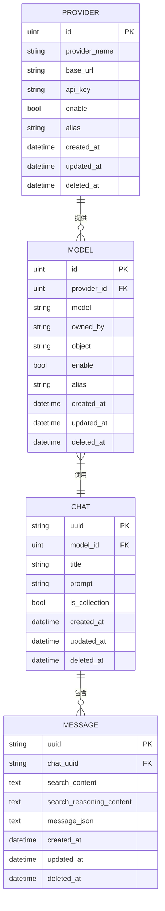

# 数据模型与数据库设计

<cite>
**本文档引用的文件**
- [chat.go](file://backend/models/data_models/chat.go)
- [common.go](file://backend/models/data_models/common.go)
- [models.go](file://backend/models/data_models/models.go)
- [provider.go](file://backend/models/data_models/provider.go)
- [storage.go](file://backend/storage/storage.go)
- [chat_message.go](file://backend/storage/chat_message.go)
- [chat.go](file://backend/storage/chat.go)
</cite>

## 目录
1. [引言](#引言)
2. [核心数据模型定义](#核心数据模型定义)
3. [GORM实体关系与字段说明](#gorm实体关系与字段说明)
4. [ER图：实体关系可视化](#er图实体关系可视化)
5. [数据库自动迁移机制](#数据库自动迁移机制)
6. [数据查询示例与性能优化](#数据查询示例与性能优化)
7. [总结](#总结)

## 引言
本项目采用GORM作为ORM框架，构建了基于SQLite的本地持久化存储系统。数据模型围绕会话（Chat）、消息（Message）、模型（Model）和提供商（Provider）四大核心实体展开，支持会话管理、消息存储、AI模型配置与API提供商管理。本文档详细描述各GORM实体的字段定义、关系映射、业务含义及数据库操作机制。

## 核心数据模型定义

### 基础模型（OrmModel）
所有实体均继承自`OrmModel`，提供统一的主键、时间戳和软删除功能。

**Section sources**
- [common.go](file://backend/models/data_models/common.go#L5-L14)

### 会话实体（Chat）
表示一次用户对话，包含会话元数据。

**Section sources**
- [chat.go](file://backend/models/data_models/chat.go#L7-L14)

### 消息实体（Message）
表示会话中的单条消息，内容以JSON格式存储。

**Section sources**
- [chat.go](file://backend/models/data_models/chat.go#L16-L27)

### 模型实体（Model）
表示可用的AI模型及其归属提供商。

**Section sources**
- [models.go](file://backend/models/data_models/models.go#L3-L12)

### 提供商实体（Provider）
表示AI服务的API提供商，如OpenAI、Anthropic等。

**Section sources**
- [provider.go](file://backend/models/data_models/provider.go#L3-L13)

## GORM实体关系与字段说明

### 字段GORM标签详解
| 标签 | 说明 | 示例 |
|------|------|------|
| `gorm:"primaryKey"` | 定义主键字段，自动递增 | `ID uint` |
| `gorm:"index"` | 为字段创建数据库索引，加速查询 | `ChatUuid string` |
| `gorm:"unique;index"` | 创建唯一索引，防止重复值 | `Uuid string` |
| `gorm:"type:varchar(255)"` | 指定数据库字段类型和长度 | `Title string` |
| `gorm:"-"` | 忽略该字段，不映射到数据库 | `Message *schema.Message` |

### 实体字段与业务含义
#### Chat（会话）
- `Uuid`: 会话唯一标识符，用于外部引用
- `ModelID`: 关联的AI模型ID，外键指向`Model`表
- `Title`: 会话标题，用户可读名称
- `Prompt`: 自定义系统提示词
- `IsCollection`: 是否收藏，用于快速访问重要会话

#### Message（消息）
- `Uuid`: 消息唯一标识符
- `ChatUuid`: 所属会话的UUID，建立一对多关系
- `SearchableContent`: 可搜索的文本内容，用于全文检索
- `SearchableReasoningContent`: 可搜索的推理内容（如思维链）
- `MessageJson`: 消息对象的JSON序列化字符串
- `Message`: 运行时反序列化的消息对象（非数据库字段）

#### Provider（提供商）
- `ProviderName`: 提供商名称（如 "openai"）
- `BaseUrl`: API基础URL，支持自定义端点
- `ApiKey`: 认证密钥，加密存储
- `Enable`: 是否启用该提供商
- `Alias`: 用户自定义别名

#### Model（模型）
- `ProviderId`: 所属提供商ID，外键
- `Model`: 模型名称（如 "gpt-3.5-turbo"）
- `OwnedBy`: 模型所有者（如 "openai"）
- `Object`: 对象类型（如 "model"）
- `Enable`: 是否启用该模型
- `Alias`: 模型别名，用于界面显示

**Section sources**
- [chat.go](file://backend/models/data_models/chat.go#L7-L27)
- [models.go](file://backend/models/data_models/models.go#L3-L12)
- [provider.go](file://backend/models/data_models/provider.go#L3-L13)

## ER图：实体关系可视化



**Diagram sources**
- [chat.go](file://backend/models/data_models/chat.go#L7-L27)
- [models.go](file://backend/models/data_models/models.go#L3-L12)
- [provider.go](file://backend/models/data_models/provider.go#L3-L13)

## 数据库自动迁移机制

系统在启动时通过`AutoMigrate`自动同步表结构，确保数据库模式与代码定义一致。

```go
err = db.AutoMigrate(&data_models.Model{}, &data_models.Provider{}, &data_models.Chat{}, &data_models.Message{})
```

### 迁移机制特点
- **自动创建表**：若表不存在，则根据结构体定义创建
- **添加新列**：若结构体新增字段，自动添加对应列
- **保留旧数据**：修改字段类型或删除字段需手动处理
- **索引同步**：`gorm:"index"`标签会自动创建索引

### 初始化流程
1. 调用`NewStorage()`创建存储实例
2. 使用`gorm.Open()`连接SQLite数据库
3. 执行`AutoMigrate`同步所有模型
4. 返回可复用的`Storage`实例

**Section sources**
- [storage.go](file://backend/storage/storage.go#L25-L35)

## 数据查询示例与性能优化

### 查询示例：根据ChatID加载消息列表
```go
func (s *Storage) GetMessage(ctx context.Context, chatUuid string, offset, limit int) ([]data_models.Message, int, error) {
    var messages []data_models.Message
    err := s.sqliteDB.Model(&data_models.Message{}).
        Where("chat_uuid = ?", chatUuid).
        Offset(offset).
        Limit(limit).
        Find(&messages).Error
    
    var total int64
    s.sqliteDB.Model(&data_models.Message{}).
        Where("chat_uuid = ?", chatUuid).
        Count(&total)
    
    return messages, int(total), err
}
```

### 性能优化点
#### 1. 索引优化
- `Message.ChatUuid`：为`chat_uuid`字段创建索引，加速会话消息查询
- `Chat.Uuid`：为`uuid`字段创建唯一索引，确保快速定位会话
- `Chat.IsCollection`：为收藏状态创建索引，优化收藏列表查询

#### 2. 查询优化
- **分页加载**：使用`Offset`和`Limit`避免一次性加载大量消息
- **分离查询**：将数据查询与总数统计分离，提高灵活性
- **预加载优化**：消息内容通过JSON字段存储，减少JOIN操作

#### 3. 事务支持
通过`NewFnTransaction`方法支持事务操作，确保数据一致性：
```go
storage.NewFnTransaction(ctx, func(ctx context.Context, s *Storage) error {
    // 事务内操作
    s.CreateChat(...)
    s.CreateMessage(...)
    return nil
})
```

**Section sources**
- [chat_message.go](file://backend/storage/chat_message.go#L40-L73)
- [chat.go](file://backend/storage/chat.go#L6-L53)

## 总结
本系统通过GORM实现了清晰的数据模型设计，四大核心实体（Chat、Message、Provider、Model）构成了完整的AI对话管理基础。`AutoMigrate`机制确保了数据库结构的自动同步，而合理的索引设计和分页查询策略保障了系统的响应性能。通过`MessageJson`字段的序列化存储，系统灵活支持复杂的消息结构，同时保持数据库的简洁性。