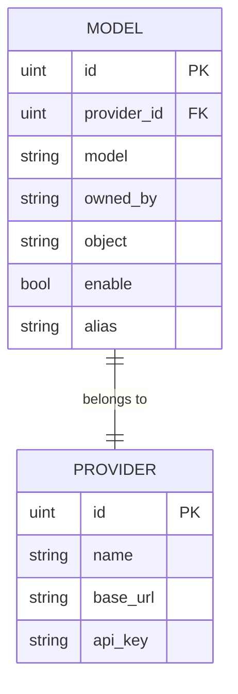

# 模型实体 (Model)

<cite>
**本文档引用文件**  
- [models.go](file://backend/models/data_models/models.go)
- [models.go](file://backend/storage/models.go)
- [models.go](file://backend/service/models.go)
- [models.ts](file://frontend/bindings/gitlab.linhf.cn/project/lemontea/lemon_tea_desktop/backend/models/view_models/models.ts)
</cite>

## 目录
1. [简介](#简介)
2. [核心字段说明](#核心字段说明)
3. [数据库索引策略](#数据库索引策略)
4. [业务功能解析](#业务功能解析)
5. [数据库查询示例](#数据库查询示例)
6. [缓存策略建议](#缓存策略建议)
7. [总结](#总结)

## 简介
`Model` 实体是本系统中用于注册和管理可用AI模型的核心数据结构。它作为模型注册表，记录了每个AI模型的基本信息、归属关系、启用状态以及用户自定义别名。该实体广泛应用于模型查询、服务调用和前端展示等场景，是连接AI提供方与用户使用的关键桥梁。

**Section sources**  
- [models.go](file://backend/models/data_models/models.go#L2-L10)

## 核心字段说明
`Model` 结构体包含以下关键字段，定义了模型的元数据和行为属性：

- **ProviderId**：外键字段，指向 `Provider` 实体，标识该模型所属的AI服务提供方。通过此字段可实现多提供方模型的统一管理。
- **Model**：模型标识符，如 `gpt-3.5-turbo`、`claude-2` 等，用于在系统内部唯一标识一个具体的AI模型。
- **OwnedBy**：模型所有者信息，通常为提供方或组织名称，用于展示模型的归属方。
- **Object**：对象类型字段，用于分类模型用途，如 `model`、`embedding` 等。
- **Enable**：布尔类型字段，表示该模型是否启用。默认值为 `true`（启用），支持动态开关控制。
- **Alias**：可选字符串指针，允许用户为模型设置自定义别名，提升使用体验。

这些字段共同构成了模型的完整描述，支持灵活的模型管理和用户个性化配置。

**Section sources**  
- [models.go](file://backend/models/data_models/models.go#L2-L10)  
- [models.ts](file://frontend/bindings/gitlab.linhf.cn/project/lemontea/lemon_tea_desktop/backend/models/view_models/models.ts#L194-L253)

## 数据库索引策略
为提升查询性能，`Model` 实体在数据库层面采用了以下GORM索引策略：

- `ProviderId` 字段设置单独索引，加速按提供方ID过滤的查询。
- `Model` 字段设置单独索引，支持快速通过模型名称查找。
- 联合索引虽未显式声明，但通过 `GetProviderModel` 等方法的查询逻辑（先查 `Model`，再关联 `ProviderId`），实际形成了 `(ProviderId, Model)` 的复合查询路径，有效支持“获取某提供方下所有模型”的高频操作。

此外，`Enable` 和 `Alias` 字段也设置了索引，便于按启用状态或别名进行快速筛选。



**Diagram sources**  
- [models.go](file://backend/models/data_models/models.go#L2-L10)  
- [models.go](file://backend/storage/models.go#L10-L20)

## 业务功能解析
### 启用/禁用机制
`Enable` 字段是实现模型动态管理的核心。用户可通过设置界面切换模型的启用状态，系统在调用AI服务前会检查此字段。若模型未启用，则不会出现在可用模型列表中，也无法被调用。该机制支持灰度发布、故障隔离和资源优化。

### 用户别名功能
`Alias` 字段允许用户为技术性模型名称（如 `gpt-3.5-turbo-0125`）设置更易记的别名（如“快速对话模型”）。前端在展示模型列表时优先显示别名，若未设置则回退到原始 `Model` 名称。此功能显著提升了用户体验和可操作性。

**Section sources**  
- [models.go](file://backend/models/data_models/models.go#L2-L10)  
- [models.go](file://backend/service/models.go#L5-L33)

## 数据库查询示例
以下为获取某提供方下所有启用模型的典型查询实现：

```go
func (s *Storage) GetEnabledModelsByProvider(ctx context.Context, providerId uint) ([]data_models.Model, error) {
    var models []data_models.Model
    err := s.sqliteDB.
        Where("provider_id = ? AND enable = ?", providerId, true).
        Find(&models).Error
    if err != nil {
        return nil, err
    }
    return models, nil
}
```

该查询利用 `ProviderId` 和 `Enable` 字段的索引，确保在大数据量下仍能高效执行。

**Section sources**  
- [models.go](file://backend/storage/models.go#L10-L20)

## 缓存策略建议
由于模型信息变更频率较低但查询频率极高（尤其在聊天请求路径中），建议引入缓存层以减轻数据库压力：

1. **缓存键设计**：使用 `provider_models:{provider_id}` 作为缓存键，存储某提供方下所有启用模型的列表。
2. **缓存更新**：当新增、删除或修改模型（特别是 `Enable` 状态）时，主动失效对应缓存。
3. **缓存实现**：可使用 Redis 或内存缓存（如 `sync.Map`），TTL 设置为 5-10 分钟，防止长时间不一致。
4. **读取流程**：先查缓存，未命中则查数据库并回填缓存。

此策略可将高频查询从数据库迁移至缓存，显著提升系统响应速度和稳定性。

## 总结
`Model` 实体作为AI模型的注册中心，通过清晰的字段设计和合理的索引策略，实现了模型的高效管理与快速查询。其 `Enable` 和 `Alias` 字段支持动态控制和用户友好体验，结合适当的缓存策略，能够满足高并发场景下的性能需求。该设计体现了良好的可维护性和扩展性，为系统的稳定运行提供了坚实基础。