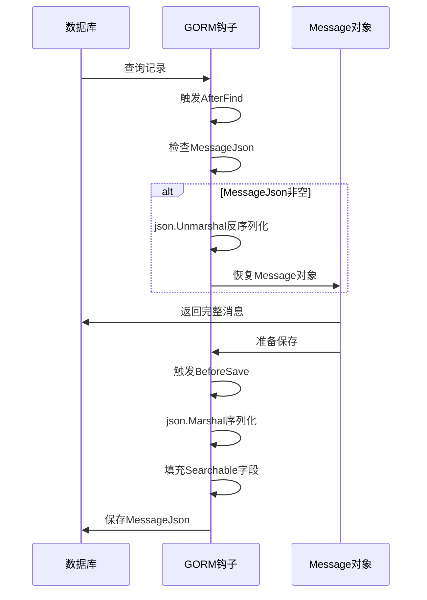
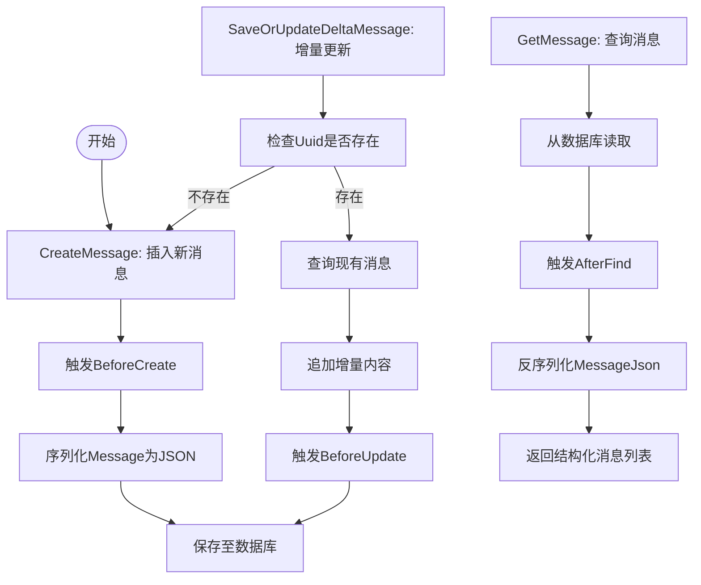

# 消息实体 (Message)

<cite>
**本文档引用的文件**  
- [chat.go](file://backend/models/data_models/chat.go)
- [chat_message.go](file://backend/storage/chat_message.go)
- [message.go](file://backend/models/view_models/message.go)
</cite>

## 目录
1. [简介](#简介)
2. [核心字段设计](#核心字段设计)
3. [GORM钩子实现机制](#gorm钩子实现机制)
4. [可搜索内容生成策略](#可搜索内容生成策略)
5. [消息的增删改查操作](#消息的增删改查操作)
6. [事务处理与批量插入](#事务处理与批量插入)
7. [总结](#总结)

## 简介
`Message` 实体是本系统中用于表示聊天消息的核心数据结构，承载了用户与AI交互过程中的所有文本与元数据。该实体通过GORM ORM框架实现持久化，并结合钩子函数实现了运行时对象与数据库字段之间的自动序列化与反序列化。本文将深入解析其设计原理与实现机制。

**Section sources**
- [chat.go](file://backend/models/data_models/chat.go#L18-L62)

## 核心字段设计
`Message` 结构体定义了以下关键字段：

- **Uuid**：消息的唯一标识符，作为全局唯一键，确保每条消息在系统中具有唯一性。
- **ChatUuid**：外键字段，关联所属会话（Chat），用于组织消息的层级结构。
- **SearchableContent**：存储可搜索的文本内容，直接来源于 `Message.Content`，支持全文检索。
- **SearchableReasoningContent**：存储推理过程中的可搜索内容，来源于 `Message.ReasoningContent`，用于增强检索语义。
- **MessageJson**：持久化字段，存储 `Message` 对象的JSON序列化字符串，用于数据库保存。
- **Message**：非持久化字段（`gorm:"-"`），运行时通过反序列化 `MessageJson` 恢复为结构化对象，供业务逻辑使用。

这些字段的设计实现了数据持久化与运行时性能之间的平衡，既保证了数据完整性，又提升了查询效率。

**Section sources**
- [chat.go](file://backend/models/data_models/chat.go#L18-L26)

## GORM钩子实现机制
为实现 `Message` 对象与数据库字段的自动同步，系统定义了多个GORM生命周期钩子函数：

### 保存前钩子（BeforeCreate、BeforeUpdate、BeforeSave）
这三个钩子均调用私有方法 `before(tx *gorm.DB)`，其核心逻辑如下：
1. 将 `Message` 字段（`*schema.Message` 类型）进行JSON序列化，结果存入 `MessageJson` 字段。
2. 提取 `Message.Content` 和 `Message.ReasoningContent` 的值，分别赋给 `SearchableContent` 和 `SearchableReasoningContent` 字段，以支持后续的全文检索。

此机制确保了每次保存或更新消息时，结构化对象能自动转换为可持久化的文本格式。

### 查询后钩子（AfterFind）
`AfterFind` 钩子在从数据库读取记录后自动触发，执行以下操作：
1. 检查 `MessageJson` 是否为空，若为空则跳过反序列化。
2. 使用 `json.Unmarshal` 将 `MessageJson` 字符串反序列化为 `schema.Message` 对象。
3. 将反序列化结果赋值给 `Message` 字段，恢复运行时可用的结构化数据。

这一机制实现了“透明持久化”，开发者可直接操作 `Message` 对象，而无需关心底层的序列化细节。

**Diagram sources**
- [chat.go](file://backend/models/data_models/chat.go#L28-L54)

**Section sources**
- [chat.go](file://backend/models/data_models/chat.go#L28-L54)

## 可搜索内容生成策略
`SearchableContent` 和 `SearchableReasoningContent` 字段的设计旨在支持高效的全文检索功能。其生成策略如下：
- 在每次保存消息前，自动从 `Message.Content` 和 `Message.ReasoningContent` 字段提取文本内容。
- 这些字段在数据库中被定义为 `text` 类型，并建立全文索引（未在代码中显示，但为常见实践），从而支持模糊匹配、关键词搜索等高级查询功能。
- 通过将可搜索内容单独存储，避免了每次查询时对 `MessageJson` 字段进行JSON解析，显著提升了检索性能。

该策略体现了“读写分离”的设计思想，优化了读密集型场景下的系统响应速度。

**Section sources**
- [chat.go](file://backend/models/data_models/chat.go#L22-L24)

## 消息的增删改查操作
系统通过 `Storage` 结构体提供对消息的CRUD操作接口：

### 创建消息（CreateMessage）
调用 `CreateMessage` 方法将新消息插入数据库。GORM的 `BeforeCreate` 钩子会自动处理序列化逻辑。

### 增量更新消息（SaveOrUpdateDeltaMessage）
该方法支持流式响应场景下的消息更新：
- 若消息 `Uuid` 不存在，则创建新消息。
- 若已存在，则先查询原记录，将增量内容（如流式输出的文本片段）追加到 `Content` 或 `ReasoningContent` 字段。
- 更新完成后，通过 `BeforeUpdate` 钩子重新序列化并保存。

### 查询消息（GetMessage）
根据 `ChatUuid` 分页获取消息列表，`AfterFind` 钩子会自动恢复每个消息的 `Message` 对象，使调用方可以直接访问结构化数据。

**Diagram sources**
- [chat_message.go](file://backend/storage/chat_message.go#L7-L72)

**Section sources**
- [chat_message.go](file://backend/storage/chat_message.go#L7-L72)

## 事务处理与批量插入
在批量插入消息的场景下，事务处理至关重要。虽然当前代码未显式展示事务逻辑，但基于GORM的特性，可通过以下方式实现：
- 使用 `db.Transaction(func(tx *gorm.DB) error)` 包裹批量操作，确保所有消息要么全部成功插入，要么全部回滚。
- 在高并发场景下，事务能有效防止数据不一致和竞态条件。
- 结合 `CreateMessage` 方法，可在事务中循环插入多条消息，利用钩子机制自动处理每条消息的序列化。

事务的引入显著提升了数据操作的原子性与可靠性，是构建健壮消息系统的关键保障。

**Section sources**
- [chat_message.go](file://backend/storage/chat_message.go#L7-L15)

## 总结
`Message` 实体通过精巧的字段设计与GORM钩子机制，实现了结构化对象与持久化存储之间的无缝转换。`SearchableContent` 等字段的引入优化了全文检索性能，而 `Before*` 和 `AfterFind` 钩子则隐藏了序列化复杂性，提升了开发效率。结合事务处理，该设计为聊天系统的稳定运行提供了坚实基础。