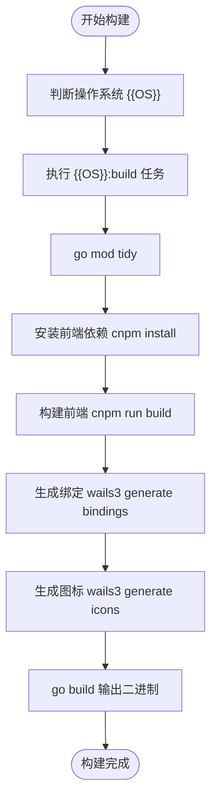
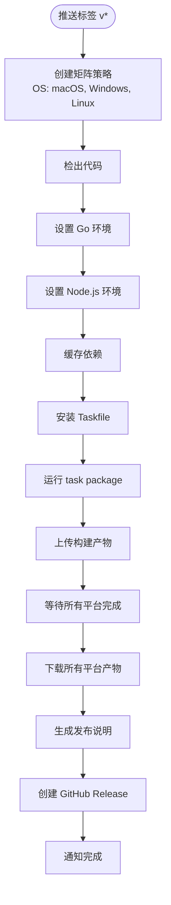

# CI/CD 集成指南

<cite>
**本文档中引用的文件**  
- [Taskfile.yml](file://Taskfile.yml)
- [build/Taskfile.yml](file://build/Taskfile.yml)
- [build/config.yml](file://build/config.yml)
- [build/darwin/Taskfile.yml](file://build/darwin/Taskfile.yml)
- [build/linux/Taskfile.yml](file://build/linux/Taskfile.yml)
- [build/windows/Taskfile.yml](file://build/windows/Taskfile.yml)
- [main.go](file://main.go)
- [README.md](file://README.md)
</cite>

## 目录
1. [简介](#简介)
2. [项目结构与构建系统](#项目结构与构建系统)
3. [基于 Taskfile 的跨平台构建机制](#基于-taskfile-的跨平台构建机制)
4. [GitHub Actions 工作流设计](#github-actions-工作流设计)
5. [Runner 环境配置与依赖缓存](#runner-环境配置与依赖缓存)
6. [安全凭证管理](#安全凭证管理)
7. [自动打包与发布到 GitHub Releases](#自动打包与发布到-github-releases)
8. [错误处理与日志查看](#错误处理与日志查看)
9. [扩展支持其他 CI 平台](#扩展支持其他-ci-平台)
10. [总结](#总结)

## 简介
本文档旨在为 `lemon_tea_desktop` 项目提供完整的 CI/CD 集成方案，指导如何通过 GitHub Actions 实现自动化构建与发布。基于 `Taskfile.yml` 中定义的跨平台任务，设计在推送标签时自动触发 macOS、Windows 和 Linux 版本构建的工作流。详细说明 runner 环境配置、依赖缓存策略、安全地管理签名证书（如 macOS codesign）和发布令牌的方法。描述构建完成后如何自动打包、生成发布说明并推送到 GitHub Releases。同时包含错误处理机制、构建日志查看方式以及如何扩展支持 GitLab CI 和 CircleCI 等其他 CI 平台。

## 项目结构与构建系统
本项目采用 Wails3 框架构建跨平台桌面应用，前端使用 Vite + TypeScript，后端使用 Go。项目根目录下的 `Taskfile.yml` 是核心构建入口，通过包含不同平台的子 Taskfile（`darwin/`, `linux/`, `windows/`）实现跨平台构建逻辑。`build/Taskfile.yml` 定义了通用任务，如前端依赖安装、前端构建、绑定生成等。

**Section sources**
- [Taskfile.yml](file://Taskfile.yml#L1-L34)
- [build/Taskfile.yml](file://build/Taskfile.yml#L1-L86)
- [README.md](file://README.md#L1-L60)

## 基于 Taskfile 的跨平台构建机制
`Taskfile.yml` 使用 `includes` 引入各平台特定任务，并通过 `{{OS}}` 变量动态调用对应平台的 `build`、`package` 和 `run` 任务。每个平台的 Taskfile 定义了具体的构建、打包和运行逻辑。

### 构建流程分析


**Diagram sources**
- [Taskfile.yml](file://Taskfile.yml#L1-L34)
- [build/Taskfile.yml](file://build/Taskfile.yml#L1-L86)
- [build/darwin/Taskfile.yml](file://build/darwin/Taskfile.yml#L1-L81)
- [build/linux/Taskfile.yml](file://build/linux/Taskfile.yml#L1-L119)
- [build/windows/Taskfile.yml](file://build/windows/Taskfile.yml#L1-L98)

### 打包流程分析
各平台打包任务 (`package`) 调用平台特定的打包逻辑：
- **macOS**: 调用 `create:app:bundle` 创建 `.app` 包并使用 `codesign` 签名
- **Linux**: 支持 AppImage、deb、rpm、AUR 多种格式
- **Windows**: 支持 NSIS 安装包和 MSIX 包

**Section sources**
- [build/darwin/Taskfile.yml](file://build/darwin/Taskfile.yml#L1-L81)
- [build/linux/Taskfile.yml](file://build/linux/Taskfile.yml#L1-L119)
- [build/windows/Taskfile.yml](file://build/windows/Taskfile.yml#L1-L98)

## GitHub Actions 工作流设计
创建 `.github/workflows/release.yml` 文件，定义在推送标签时触发的多平台构建工作流。



**Diagram sources**
- [Taskfile.yml](file://Taskfile.yml#L1-L34)
- [build/Taskfile.yml](file://build/Taskfile.yml#L1-L86)

## Runner 环境配置与依赖缓存
GitHub Actions 提供 `ubuntu-latest`、`windows-latest`、`macos-latest` 三种 runner。需在工作流中配置：
- Go 版本使用 `actions/setup-go`
- Node.js 版本使用 `actions/setup-node`
- 缓存 `go mod` 和 `node_modules` 以加速构建

```yaml
- name: Cache Go modules
  uses: actions/cache@v4
  with:
    path: ~/go/pkg/mod
    key: ${{ runner.os }}-go-${{ hashFiles('**/go.sum') }}
    restore-keys: |
      ${{ runner.os }}-go-

- name: Cache Node.js modules
  uses: actions/cache@v4
  with:
    path: node_modules
    key: ${{ runner.os }}-node-${{ hashFiles('**/package-lock.json') }}
    restore-keys: |
      ${{ runner.os }}-node-
```

**Section sources**
- [build/Taskfile.yml](file://build/Taskfile.yml#L1-L86)

## 安全凭证管理
敏感信息如代码签名证书和发布令牌应通过 GitHub Secrets 管理。

### macOS CodeSign 证书
将 `.p12` 证书和密码存储为 Secrets：
```yaml
env:
  APPLE_CERTIFICATE: ${{ secrets.APPLE_CERTIFICATE }}
  APPLE_CERTIFICATE_PASSWORD: ${{ secrets.APPLE_CERTIFICATE_PASSWORD }}
```
在构建时导入证书：
```bash
security create-keychain -p "" build.keychain
security import cert.p12 -P $APPLE_CERTIFICATE_PASSWORD -A -t cert -f pkcs12 -k build.keychain
security set-keychain-settings -lut 7200 build.keychain
security unlock-keychain -p "" build.keychain
```

### GitHub 发布令牌
使用 `GITHUB_TOKEN` 或自定义 PAT（Personal Access Token）进行发布：
```yaml
- name: Create Release
  uses: actions/create-release@v1
  env:
    GITHUB_TOKEN: ${{ secrets.GITHUB_TOKEN }}
```

**Section sources**
- [build/darwin/Taskfile.yml](file://build/darwin/Taskfile.yml#L1-L81)
- [build/windows/Taskfile.yml](file://build/windows/Taskfile.yml#L1-L98)

## 自动打包与发布到 GitHub Releases
构建完成后，使用 `actions/upload-artifact` 上传各平台产物，然后在单独的作业中下载所有产物并创建 Release。

```yaml
jobs:
  build:
    strategy:
      matrix:
        os: [ubuntu-latest, windows-latest, macos-latest]
    steps:
      # ... 构建步骤
      - name: Upload Artifact
        uses: actions/upload-artifact@v4
        with:
          name: ${{ matrix.os }}-artifact
          path: bin/

  release:
    needs: build
    runs-on: ubuntu-latest
    steps:
      - name: Download Artifacts
        uses: actions/download-artifact@v4
        with:
          path: artifacts/

      - name: Generate Release Notes
        id: release_notes
        run: |
          echo "RELEASE_BODY=$(cat CHANGELOG.md | sed -n '/## v${{ github.ref_name }}/,$p' | sed '/## v${{ github.ref_name }}/d' | sed '/^## /q' | sed 's/"/\\"/g')" >> $GITHUB_ENV

      - name: Create Release
        uses: actions/create-release@v1
        with:
          tag_name: ${{ github.ref }}
          release_name: Release ${{ github.ref_name }}
          body: ${{ env.RELEASE_BODY }}
          draft: false
          prerelease: false
```

**Section sources**
- [Taskfile.yml](file://Taskfile.yml#L1-L34)
- [build/darwin/Taskfile.yml](file://build/darwin/Taskfile.yml#L1-L81)
- [build/linux/Taskfile.yml](file://build/linux/Taskfile.yml#L1-L119)
- [build/windows/Taskfile.yml](file://build/windows/Taskfile.yml#L1-L98)

## 错误处理与日志查看
GitHub Actions 提供完整的构建日志查看功能。在工作流中添加错误处理：
```yaml
- name: Run Build
  run: task package
  continue-on-error: false
```
使用 `actions/upload-artifact` 上传构建日志以便调试：
```yaml
- name: Upload Build Log
  if: failure()
  uses: actions/upload-artifact@v4
  with:
    name: build-log
    path: build.log
```

**Section sources**
- [build/Taskfile.yml](file://build/Taskfile.yml#L1-L86)

## 扩展支持其他 CI 平台
### GitLab CI
创建 `.gitlab-ci.yml`，使用 `include` 复用 Taskfile 逻辑：
```yaml
stages:
  - build
  - package
  - release

build_macos:
  stage: build
  image: docker:20.10.16-dind
  script:
    - task darwin:build
  artifacts:
    paths:
      - bin/

release:
  stage: release
  script:
    - # 使用 GitLab API 创建 Release
```

### CircleCI
创建 `.circleci/config.yml`：
```yaml
jobs:
  build:
    docker:
      - image: cimg/go:1.21
    steps:
      - checkout
      - run: task package
      - persist_to_workspace:
          root: .
          paths: [bin/]
workflows:
  version: 2
  build-and-release:
    jobs:
      - build
      - release:
          requires:
            - build
```

**Section sources**
- [Taskfile.yml](file://Taskfile.yml#L1-L34)
- [build/Taskfile.yml](file://build/Taskfile.yml#L1-L86)

## 总结
本文档详细介绍了如何基于 `Taskfile.yml` 中的跨平台任务，通过 GitHub Actions 实现 `lemon_tea_desktop` 项目的自动化 CI/CD 流程。涵盖了从构建、打包、签名到发布的完整链条，并提供了安全凭证管理、错误处理和多平台扩展的最佳实践。该方案可确保每次版本发布都经过一致、可重复且安全的自动化流程。