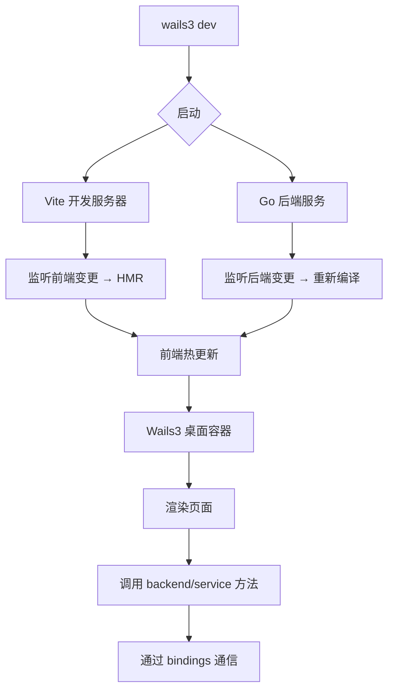

# 开发模式构建

<cite>
**本文档引用的文件**  
- [main.go](file://main.go)
- [Taskfile.yml](file://Taskfile.yml)
- [vite.config.ts](file://frontend/vite.config.ts)
- [main.tsx](file://frontend/src/main.tsx)
- [App.tsx](file://frontend/src/App.tsx)
- [index.html](file://frontend/index.html)
- [service.go](file://backend/service/service.go)
- [settings.go](file://backend/service/settings.go)
</cite>

## 目录
1. [简介](#简介)
2. [开发模式启动流程](#开发模式启动流程)
3. [前端 Vite 配置详解](#前端-vite-配置详解)
4. [前后端集成机制](#前后端集成机制)
5. [开发服务器访问与调试](#开发服务器访问与调试)
6. [常见开发问题及解决方案](#常见开发问题及解决方案)
7. [总结](#总结)

## 简介
本文档详细说明本项目在开发模式下的构建流程，涵盖从启动命令到前后端热重载、配置集成、调试方式以及常见问题的完整开发体验。项目基于 Wails3 框架，结合 Go 后端与 React 前端，通过 `wails3 dev` 命令实现前后端协同热重载，提升开发效率。

## 开发模式启动流程

执行 `wails3 dev` 命令后，Wails3 启动开发环境，同时监听前端与后端代码变更。该命令通过 `Taskfile.yml` 中定义的 `dev` 任务调用，并传入自定义配置文件和端口参数：

```bash
wails3 dev -config ./build/config.yml -port {{.VITE_PORT}}
```

此命令启动两个核心进程：
- **前端开发服务器**：基于 Vite，在指定端口（默认 9245）启动热重载服务
- **后端 Go 服务**：编译并运行 `main.go`，监听前端事件并与桌面容器集成

当 Go 代码发生变更时，Wails3 自动重新编译并重启后端服务；前端代码变更则由 Vite 实现模块热更新（HMR），无需刷新页面即可更新界面。

**Section sources**
- [Taskfile.yml](file://Taskfile.yml#L25-L32)
- [main.go](file://main.go#L15-L58)

## 前端 Vite 配置详解

`vite.config.ts` 是前端构建的核心配置文件，确保与 Wails3 桌面环境正确集成。其关键配置如下：

- **服务器主机绑定**：`server.host = '0.0.0.0'` 允许外部连接，确保 Wails3 容器可访问前端服务
- **路径别名**：定义 `@` 指向 `src` 目录，`@bindings` 指向自动生成的前端绑定代码，提升模块引用可读性与维护性
- **React 插件**：启用 `@vitejs/plugin-react` 以支持 JSX 与 React 18+ 特性

该配置确保开发服务器能正确解析模块、支持热更新，并与后端服务通过统一端口通信。

**Section sources**
- [vite.config.ts](file://frontend/vite.config.ts#L1-L17)

## 前后端集成机制

项目通过 Wails3 的服务注册机制实现前后端通信。在 `main.go` 中，通过 `application.NewService()` 注册 `service.NewService()`，将后端 Go 服务暴露给前端调用。

前端通过自动生成的绑定文件（位于 `frontend/bindings/`）调用后端方法，如打开设置窗口：

```go
func (s *Service) OpenSettingsWindow()
```

该方法在前端可通过 `service.OpenSettingsWindow()` 直接调用，Wails3 自动处理跨进程通信。

此外，前端入口由 `index.html` 指定，加载 `main.tsx` 作为应用主入口，通过 React Router 实现路由控制，支持 `/home`、`/settings` 等路径跳转。



**Diagram sources**
- [main.go](file://main.go#L1-L58)
- [service.go](file://backend/service/service.go#L1-L29)
- [settings.go](file://backend/service/settings.go#L1-L22)
- [vite.config.ts](file://frontend/vite.config.ts#L1-L17)
- [index.html](file://frontend/index.html#L1-L14)
- [main.tsx](file://frontend/src/main.tsx#L1-L26)
- [App.tsx](file://frontend/src/App.tsx#L1-L86)

**Section sources**
- [main.go](file://main.go#L1-L58)
- [service.go](file://backend/service/service.go#L1-L29)
- [settings.go](file://backend/service/settings.go#L1-L22)
- [App.tsx](file://frontend/src/App.tsx#L1-L86)

## 开发服务器访问与调试

开发服务器启动后，默认可通过 `http://localhost:9245` 访问前端界面。Wails3 桌面容器将自动加载该地址并渲染为原生窗口。

### 调试方式
- **浏览器开发者工具**：在开发模式下，Wails3 支持打开 DevTools，可通过代码触发或快捷键查看 DOM、网络请求与控制台日志
- **Go 日志输出**：后端日志通过 `log.Fatal` 或自定义日志包输出，可在终端直接查看，便于追踪服务启动、错误与事件流
- **事件调试**：通过 `app.Event.Emit("time", now)` 示例可见，项目支持事件驱动通信，可用于调试状态同步

## 常见开发问题及解决方案

### 1. 类型绑定未同步
前端 `@bindings` 目录下的类型由 Wails3 自动生成，若后端结构体变更后前端未更新：
- **解决方案**：停止开发服务器，重新运行 `wails3 dev`，确保绑定代码重新生成

### 2. 端口被占用
若 `9245` 端口已被占用，Vite 服务无法启动：
- **解决方案**：修改 `Taskfile.yml` 中 `VITE_PORT` 变量，或设置环境变量 `WAILS_VITE_PORT=9246` 指定新端口

### 3. 热重载失效
前端修改无反应：
- **检查** `vite.config.ts` 中 `server.host` 是否为 `0.0.0.0`
- **检查** 文件是否在 `src` 目录下，确保被 Vite 正确监听

### 4. 后端服务未重启
Go 代码修改后未自动重启：
- **检查** `wails3 dev` 是否正确监听 `backend/` 目录
- **检查** 是否存在编译错误导致重启失败

**Section sources**
- [Taskfile.yml](file://Taskfile.yml#L25-L32)
- [vite.config.ts](file://frontend/vite.config.ts#L1-L17)
- [main.go](file://main.go#L1-L58)

## 总结
本项目通过 `wails3 dev` 实现高效的全栈热重载开发体验。前端基于 Vite 提供快速模块热更新，后端 Go 代码变更自动触发重新编译与服务重启。通过合理的路径别名、服务注册与事件机制，前后端紧密集成，配合完善的调试手段与问题解决方案，构建了现代化桌面应用的高效开发流程。