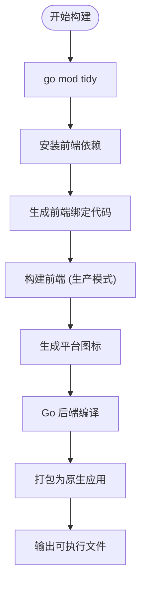
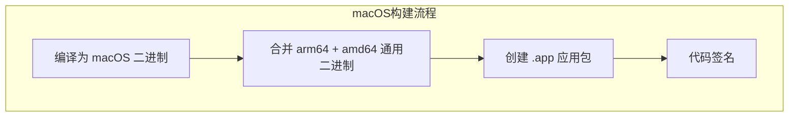
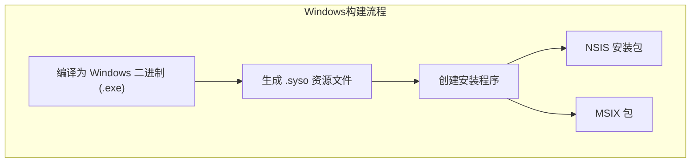
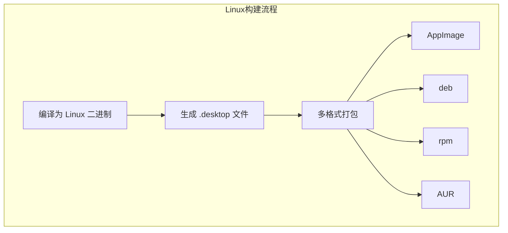

# 生产环境构建

<cite>
**本文档引用的文件**  
- [main.go](file://main.go)
- [Taskfile.yml](file://Taskfile.yml)
- [build/Taskfile.yml](file://build/Taskfile.yml)
- [build/darwin/Taskfile.yml](file://build/darwin/Taskfile.yml)
- [build/windows/Taskfile.yml](file://build/windows/Taskfile.yml)
- [build/linux/Taskfile.yml](file://build/linux/Taskfile.yml)
</cite>

## 目录
1. [简介](#简介)
2. [构建流程概览](#构建流程概览)
3. [核心构建命令解析](#核心构建命令解析)
4. [平台专用构建任务](#平台专用构建任务)
5. [wails.json 配置说明](#wailsjson-配置说明)
6. [构建产物与运行方式](#构建产物与运行方式)

## 简介
本文档全面阐述了 `lemon_tea_desktop` 项目的生产环境构建流程。通过 Wails 框架提供的 `wails3 build` 命令和 Taskfile.yml 定义的任务，实现跨平台原生桌面应用的自动化构建。涵盖代码压缩、资源嵌入、图标打包等优化步骤，并详细解析各平台的构建细节。

## 构建流程概览

整个构建流程由 `Taskfile.yml` 统一调度，结合 Wails 工具链完成前端编译、Go 后端构建、资源打包和平台适配。主要流程如下：

**Diagram sources**  
- [Taskfile.yml](file://Taskfile.yml#L1-L34)
- [build/Taskfile.yml](file://build/Taskfile.yml#L1-L87)

**Section sources**  
- [Taskfile.yml](file://Taskfile.yml#L1-L34)
- [build/Taskfile.yml](file://build/Taskfile.yml#L1-L87)

## 核心构建命令解析

### 主构建入口
`Taskfile.yml` 中定义了统一的构建入口任务：

- `task: build`：根据当前操作系统自动调用对应平台的构建任务
- `task: package`：打包生产版本的应用程序
- `task: run`：运行已构建的应用程序
- `task: dev`：开发模式运行，使用热重载

这些任务通过 `{{OS}}` 变量动态包含对应平台的构建逻辑。

### 公共构建任务
位于 `build/Taskfile.yml` 的公共任务为所有平台共享：

- `common:go:mod:tidy`：清理和同步 Go 模块依赖
- `common:install:frontend:deps`：使用 cnpm 安装前端依赖
- `common:build:frontend`：构建前端项目，根据 `PRODUCTION` 环境变量决定是否启用生产模式优化
- `common:generate:bindings`：生成 Go 与前端之间的类型绑定代码
- `common:generate:icons`：将 `appicon.png` 转换为各平台所需的图标格式（`.icns` 和 `.ico`）

**Section sources**  
- [build/Taskfile.yml](file://build/Taskfile.yml#L1-L87)

## 平台专用构建任务

### macOS 构建 (`build:darwin`)

**Diagram sources**  
- [build/darwin/Taskfile.yml](file://build/darwin/Taskfile.yml#L1-L82)

**Section sources**  
- [build/darwin/Taskfile.yml](file://build/darwin/Taskfile.yml#L1-L82)

#### 关键特性：
- 支持 `arm64` 和 `amd64` 架构
- 使用 `lipo` 工具创建通用二进制
- 生成标准 `.app` 包并进行代码签名
- 设置最低支持 macOS 版本为 10.15
- 使用 `Info.plist` 配置应用元数据

### Windows 构建 (`build:windows`)

**Diagram sources**  
- [build/windows/Taskfile.yml](file://build/windows/Taskfile.yml#L1-L99)

**Section sources**  
- [build/windows/Taskfile.yml](file://build/windows/Taskfile.yml#L1-L99)

#### 关键特性：
- 生成 `.exe` 可执行文件
- 使用 `wails3 generate syso` 嵌入图标和版本信息
- 支持两种打包格式：
  - **NSIS**：传统安装程序
  - **MSIX**：现代 Windows 应用包
- 自动包含 WebView2 引导程序
- 支持代码签名

### Linux 构建 (`build:linux`)

**Diagram sources**  
- [build/linux/Taskfile.yml](file://build/linux/Taskfile.yml#L1-L120)

**Section sources**  
- [build/linux/Taskfile.yml](file://build/linux/Taskfile.yml#L1-L120)

#### 关键特性：
- 支持多种 Linux 发行版格式
- 自动生成 `.desktop` 启动器文件
- 使用 `nfpm` 工具生成 deb/rpm/aur 包
- 支持 AppImage 便携式格式
- 通过 `wails3 generate appimage` 创建自包含应用

## wails.json 配置说明

虽然当前上下文中未直接提供 `wails.json` 文件内容，但根据构建脚本可推断其关键作用：

- **应用元数据**：名称、版本、描述等信息
- **窗口属性**：默认尺寸、最小尺寸、背景色等
- **权限配置**：系统权限申请（如文件访问）
- **构建选项**：资源嵌入、代码压缩等
- **MSIX 打包配置**：用于 Windows MSIX 包生成

这些配置在 `wails3 tool msix` 和 `wails3 update build-assets` 等命令中被引用。

**Section sources**  
- [build/windows/Taskfile.yml](file://build/windows/Taskfile.yml#L1-L99)
- [build/linux/Taskfile.yml](file://build/linux/Taskfile.yml#L1-L120)

## 构建产物与运行方式

### 构建产物存放位置
所有构建产物统一存放在 `bin/` 目录下：

- **macOS**: `bin/lemon_tea_desktop` (通用二进制) 或 `bin/lemon_tea_desktop.app`
- **Windows**: `bin/lemon_tea_desktop.exe`
- **Linux**: `bin/lemon_tea_desktop`

打包格式则根据平台生成相应文件：
- macOS: `.app` 包
- Windows: `.exe`, `.msix`, NSIS 安装程序
- Linux: `.AppImage`, `.deb`, `.rpm`, AUR 包

### 运行生成的应用程序
各平台可通过以下方式运行：

- **macOS**: 双击 `.app` 包或终端执行 `./bin/lemon_tea_desktop`
- **Windows**: 双击 `lemon_tea_desktop.exe`
- **Linux**: 终端执行 `./bin/lemon_tea_desktop`

开发模式下可通过 `task: dev` 命令直接启动热重载开发服务器。

**Section sources**  
- [Taskfile.yml](file://Taskfile.yml#L1-L34)
- [build/darwin/Taskfile.yml](file://build/darwin/Taskfile.yml#L1-L82)
- [build/windows/Taskfile.yml](file://build/windows/Taskfile.yml#L1-L99)
- [build/linux/Taskfile.yml](file://build/linux/Taskfile.yml#L1-L120)