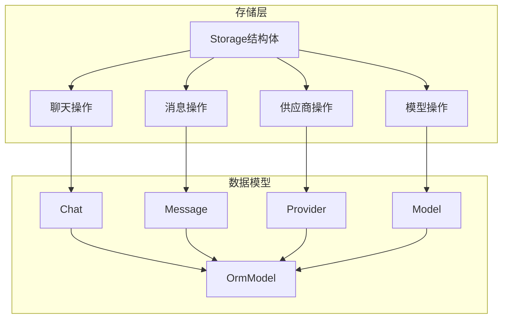
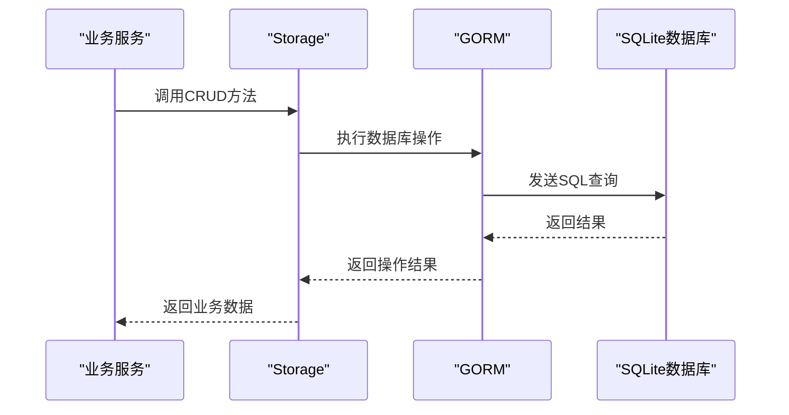
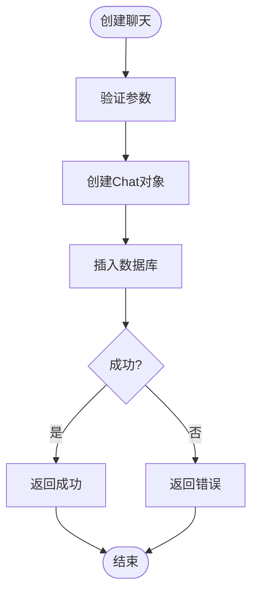
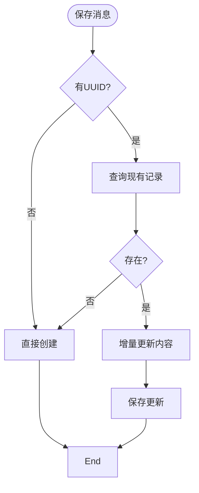
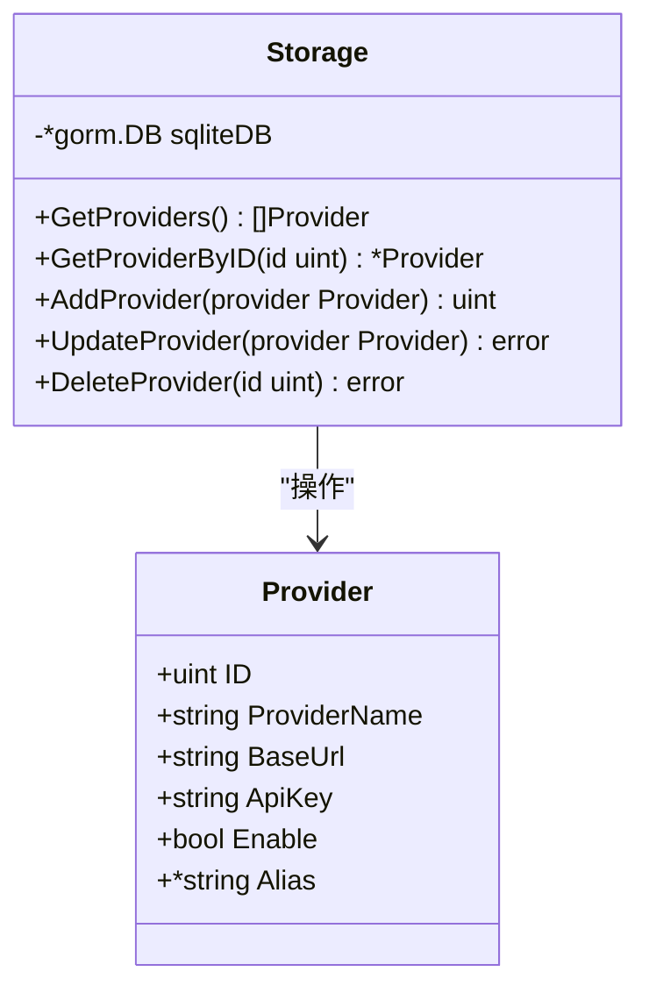
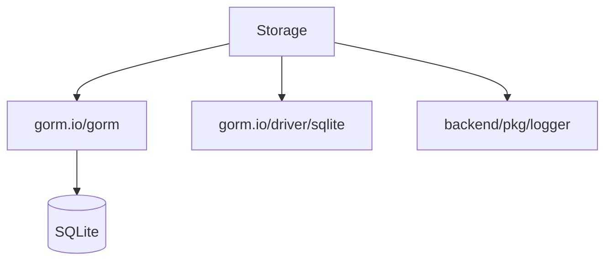

# 存储层实现

<cite>
**本文档引用的文件**  
- [storage.go](file://backend/storage/storage.go)
- [chat.go](file://backend/models/data_models/chat.go)
- [provider.go](file://backend/models/data_models/provider.go)
- [models.go](file://backend/models/data_models/models.go)
- [common.go](file://backend/models/data_models/common.go)
- [chat.go](file://backend/storage/chat.go)
- [chat_message.go](file://backend/storage/chat_message.go)
- [provider.go](file://backend/storage/provider.go)
- [models.go](file://backend/storage/models.go)
</cite>

## 目录
1. [简介](#简介)
2. [项目结构](#项目结构)
3. [核心组件](#核心组件)
4. [架构概述](#架构概述)
5. [详细组件分析](#详细组件分析)
6. [依赖分析](#依赖分析)
7. [性能考虑](#性能考虑)
8. [故障排除指南](#故障排除指南)
9. [结论](#结论)

## 简介
本文档深入解析基于GORM的本地数据库访问封装机制，重点阐述`Storage`结构体如何封装`*gorm.DB`连接并提供类型安全的操作接口。详细说明自动迁移机制、各实体的CRUD操作实现、GORM钩子函数的使用场景、数据库约束配置以及性能优化建议。

## 项目结构
存储层位于`backend/storage`目录下，主要包含以下文件：
- `storage.go`：定义`Storage`结构体及初始化逻辑
- `chat.go`：聊天记录相关操作
- `chat_message.go`：消息记录操作
- `provider.go`：供应商配置操作
- `models.go`：模型相关操作

数据模型定义在`backend/models/data_models`目录中，包括`chat.go`、`provider.go`等文件。

**图示来源**  
- [storage.go](file://backend/storage/storage.go#L1-L82)
- [chat.go](file://backend/models/data_models/chat.go#L1-L63)
- [provider.go](file://backend/models/data_models/provider.go#L1-L10)

**本节来源**  
- [backend/storage](file://backend/storage)
- [backend/models/data_models](file://backend/models/data_models)

## 核心组件
`Storage`结构体是存储层的核心，封装了`*gorm.DB`连接，提供类型安全的数据库操作接口。通过`NewStorage()`函数初始化时，自动执行数据模型的迁移，确保数据库表结构与代码定义一致。

**本节来源**  
- [storage.go](file://backend/storage/storage.go#L1-L82)
- [common.go](file://backend/models/data_models/common.go#L1-L13)

## 架构概述
存储层采用封装模式，将GORM的原始接口包装为业务友好的方法。`Storage`结构体持有数据库连接，各操作方法通过该连接执行具体的CRUD操作。

**图示来源**  
- [storage.go](file://backend/storage/storage.go#L1-L82)
- [chat.go](file://backend/storage/chat.go#L1-L110)

## 详细组件分析

### Chat表操作分析
`Chat`表的CRUD操作通过`Storage`结构体的方法实现，包括创建、查询、删除、重命名和收藏功能。

**图示来源**  
- [chat.go](file://backend/storage/chat.go#L45-L60)
- [chat.go](file://backend/models/data_models/chat.go#L1-L63)

**本节来源**  
- [chat.go](file://backend/storage/chat.go#L1-L110)
- [chat.go](file://backend/models/data_models/chat.go#L1-L63)

### Message表操作分析
`Message`表支持批量插入和事务处理，通过`SaveOrUpdateDeltaMessage`方法实现增量更新。

**图示来源**  
- [chat_message.go](file://backend/storage/chat_message.go#L15-L73)
- [chat.go](file://backend/models/data_models/chat.go#L28-L51)

**本节来源**  
- [chat_message.go](file://backend/storage/chat_message.go#L1-L73)
- [chat.go](file://backend/models/data_models/chat.go#L1-L63)

### Provider配置分析
供应商配置的持久化通过`Provider`结构体实现，支持增删改查操作。

**图示来源**  
- [provider.go](file://backend/models/data_models/provider.go#L1-L10)
- [provider.go](file://backend/storage/provider.go#L1-L49)

**本节来源**  
- [provider.go](file://backend/storage/provider.go#L1-L49)
- [provider.go](file://backend/models/data_models/provider.go#L1-L10)

## 依赖分析
存储层依赖GORM作为ORM框架，SQLite作为数据库驱动，通过`gorm.io/gorm`和`gorm.io/driver/sqlite`包实现数据库操作。

**图示来源**  
- [storage.go](file://backend/storage/storage.go#L1-L82)
- [go.mod](file://go.mod#L1-L20)

**本节来源**  
- [storage.go](file://backend/storage/storage.go#L1-L82)
- [go.mod](file://go.mod#L1-L20)

## 性能考虑
为优化大量消息加载性能，建议使用`FindInBatches`方法分批处理数据。对于频繁查询的字段，已在模型定义中添加索引。

**本节来源**  
- [chat_message.go](file://backend/storage/chat_message.go#L60-L73)
- [chat.go](file://backend/models/data_models/chat.go#L1-L63)

## 故障排除指南
常见问题包括SQLite文件路径权限错误和连接泄漏。确保数据库目录有写权限，使用事务时注意正确提交或回滚。

**本节来源**  
- [storage.go](file://backend/storage/storage.go#L65-L82)
- [storage.go](file://backend/storage/storage.go#L35-L45)

## 结论
存储层通过`Storage`结构体有效封装了GORM数据库操作，提供了类型安全、易于使用的接口。自动迁移机制确保了数据模型与数据库表结构的一致性，GORM钩子函数实现了数据的自动序列化和反序列化。