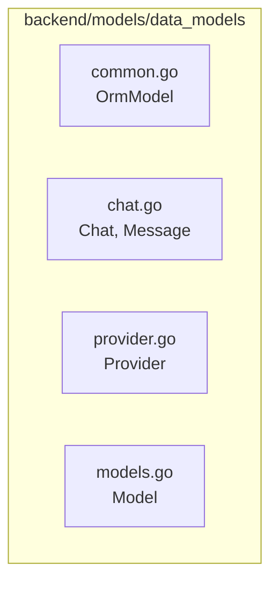
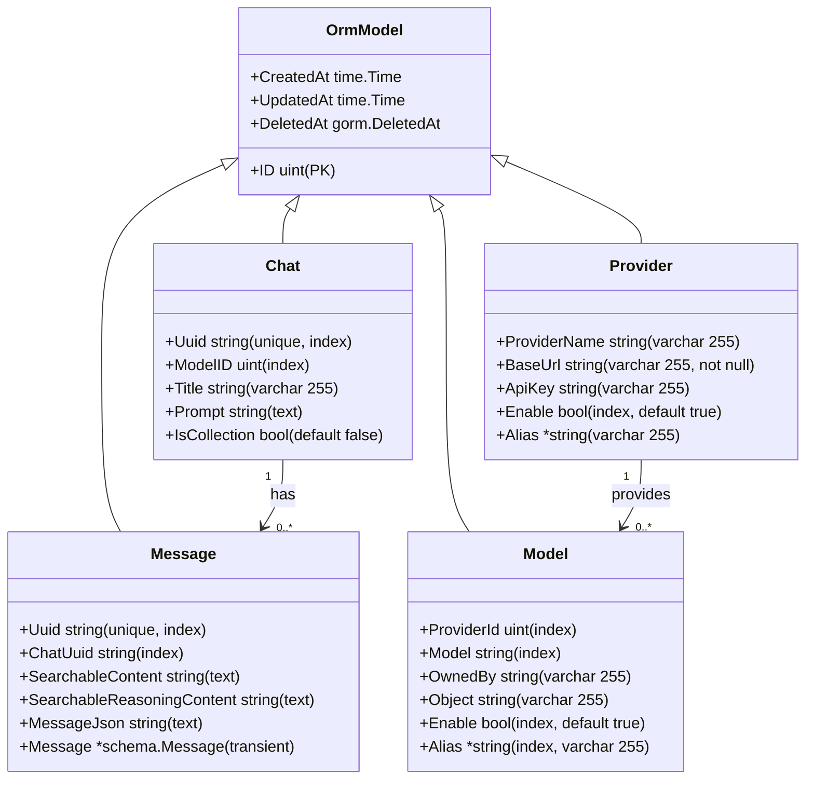
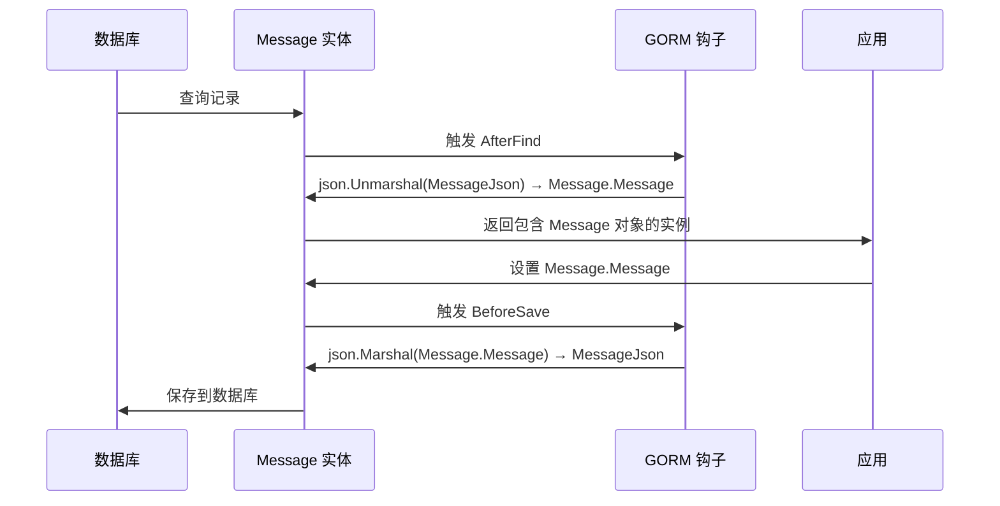
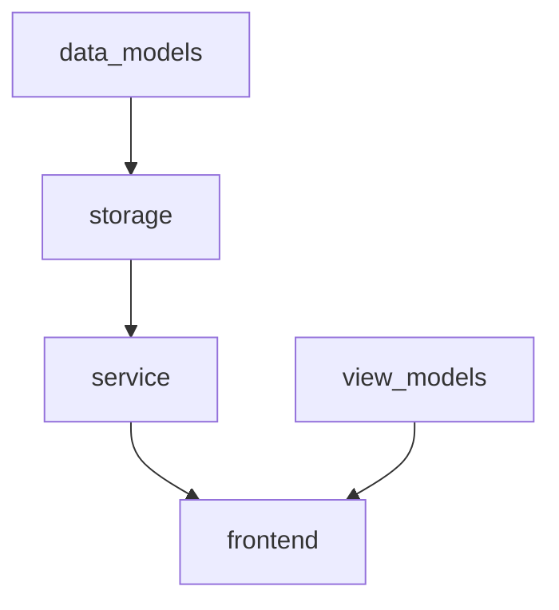

# 数据模型层

<cite>
**本文档引用文件**  
- [chat.go](file://backend/models/data_models/chat.go)
- [common.go](file://backend/models/data_models/common.go)
- [provider.go](file://backend/models/data_models/provider.go)
- [models.go](file://backend/models/data_models/models.go)
- [message.go](file://backend/models/data_models/chat.go)
</cite>

## 目录
1. [简介](#简介)
2. [项目结构](#项目结构)
3. [核心组件](#核心组件)
4. [架构概述](#架构概述)
5. [详细组件分析](#详细组件分析)
6. [依赖分析](#依赖分析)
7. [性能考虑](#性能考虑)
8. [故障排除指南](#故障排除指南)
9. [结论](#结论)
10. [附录](#附录)

## 简介
本文档旨在全面描述 `data_models` 包中的 GORM 实体定义及其与数据库的映射关系。重点涵盖 `Chat`、`Message`、`Provider` 和 `Model` 四个核心结构体的字段语义、GORM 标签用途、时间戳自动管理机制以及通用字段复用设计。同时说明该层与 `view_models` 的职责分离原则，确保数据持久化逻辑清晰独立。

## 项目结构
`data_models` 包位于 `backend/models/data_models` 路径下，包含多个 Go 文件，分别定义了与数据库表直接映射的结构体。该包通过 GORM 实现 ORM 映射，不包含任何业务逻辑，仅用于数据持久化操作。



**Diagram sources**  
- [common.go](file://backend/models/data_models/common.go#L1-L15)
- [chat.go](file://backend/models/data_models/chat.go#L1-L64)
- [provider.go](file://backend/models/data_models/provider.go#L1-L11)
- [models.go](file://backend/models/data_models/models.go#L1-L12)

**Section sources**  
- [common.go](file://backend/models/data_models/common.go#L1-L15)
- [chat.go](file://backend/models/data_models/chat.go#L1-L64)

## 核心组件
`data_models` 包的核心是四个 GORM 实体结构体：`Chat`、`Message`、`Provider` 和 `Model`，它们分别对应数据库中的 `chats`、`messages`、`providers` 和 `models` 表。所有结构体均嵌入 `OrmModel` 以复用通用字段。

**Section sources**  
- [chat.go](file://backend/models/data_models/chat.go#L5-L64)
- [provider.go](file://backend/models/data_models/provider.go#L3-L11)
- [models.go](file://backend/models/data_models/models.go#L3-L12)

## 架构概述
数据模型层采用标准的 ORM 设计模式，通过结构体字段标签（tag）声明数据库列属性、索引、约束等。所有实体继承 `OrmModel` 中的 `ID`、`CreatedAt`、`UpdatedAt` 和 `DeletedAt` 字段，实现主键、时间戳和软删除功能。



**Diagram sources**  
- [common.go](file://backend/models/data_models/common.go#L5-L14)
- [chat.go](file://backend/models/data_models/chat.go#L5-L25)
- [provider.go](file://backend/models/data_models/provider.go#L3-L11)
- [models.go](file://backend/models/data_models/models.go#L3-L12)

## 详细组件分析

### Chat 与 Message 分析
`Chat` 结构体表示一次对话会话，其 `ID` 字段作为主键由 GORM 自动管理。`Uuid` 字段使用唯一索引确保全局唯一性，`Title` 字段不可为空，用于展示对话标题。`Message` 结构体通过 `ChatUuid` 字段与 `Chat` 建立外键关联，实现一对多关系。

`Message` 结构体中，`MessageJson` 字段用于持久化存储原始消息 JSON 数据，而 `Message` 字段标记为 `gorm:"-"`，表示非数据库字段，仅用于运行时反序列化。通过 `AfterFind` 和 `BeforeSave` 钩子实现自动序列化与反序列化。



**Diagram sources**  
- [chat.go](file://backend/models/data_models/chat.go#L27-L63)

**Section sources**  
- [chat.go](file://backend/models/data_models/chat.go#L5-L64)

### Provider 与 Model 分析
`Provider` 结构体表示 LLM 服务提供商，`BaseUrl` 字段通过 `gorm:"not null"` 确保非空，`Enable` 字段默认启用。`Model` 结构体通过 `ProviderId` 字段与 `Provider` 关联，表示某提供商下的具体模型。

`Model` 的 `Alias` 字段为可空字符串（`*string`），允许用户自定义模型别名。`OwnedBy` 和 `Object` 字段存储模型元信息，便于前端展示。

**Section sources**  
- [provider.go](file://backend/models/data_models/provider.go#L3-L11)
- [models.go](file://backend/models/data_models/models.go#L3-L12)

### 通用字段复用机制
`common.go` 中定义的 `OrmModel` 结构体封装了所有实体共用的字段：`ID` 为主键并自动递增；`CreatedAt` 和 `UpdatedAt` 由 GORM 自动管理创建和更新时间戳；`DeletedAt` 支持软删除功能，配合 `gorm:"index"` 实现高效查询。

所有实体通过匿名嵌入 `OrmModel` 实现字段复用，避免重复定义，提升代码一致性与可维护性。

```mermaid
classDiagram
class OrmModel {
+ID uint
+CreatedAt time.Time
+UpdatedAt time.Time
+DeletedAt gorm.DeletedAt
}
OrmModel <|-- Chat
OrmModel <|-- Message
OrmModel <|-- Provider
OrmModel <|-- Model
note right of OrmModel
所有实体继承通用字段
- ID : 主键
- CreatedAt : 创建时间
- UpdatedAt : 更新时间
- DeletedAt : 软删除时间
end note
```

**Diagram sources**  
- [common.go](file://backend/models/data_models/common.go#L5-L14)

**Section sources**  
- [common.go](file://backend/models/data_models/common.go#L1-L15)

## 依赖分析
`data_models` 包被 `storage` 和 `service` 层直接依赖，用于数据库操作。`storage` 层调用 GORM API 执行 CRUD 操作，`service` 层通过 `storage` 间接使用数据模型。`view_models` 包与 `data_models` 职责分离，前者用于 API 数据传输（DTO），后者用于数据库映射。



**Diagram sources**  
- [go.mod](file://go.mod#L1-L20)
- [chat.go](file://backend/models/data_models/chat.go#L1-L64)

**Section sources**  
- [chat.go](file://backend/models/data_models/chat.go#L1-L64)
- [provider.go](file://backend/models/data_models/provider.go#L1-L11)

## 性能考虑
- 所有频繁查询字段（如 `Uuid`、`ChatUuid`、`ProviderId`）均建立数据库索引，提升查询效率。
- `MessageJson` 使用 `text` 类型存储大文本，避免字段长度限制。
- `BeforeSave` 和 `AfterFind` 钩子在内存中完成序列化操作，避免数据库层面的复杂处理。

## 故障排除指南
- 若 `Message.Message` 为空，请检查 `AfterFind` 钩子是否正常执行，确认 `MessageJson` 字段内容为有效 JSON。
- 若时间戳未自动更新，请确认结构体正确嵌入 `OrmModel` 并使用 GORM 进行更新操作。
- 若软删除无效，请确保使用 `db.Delete()` 而非 `db.Unscoped().Delete()`。

**Section sources**  
- [chat.go](file://backend/models/data_models/chat.go#L45-L63)
- [common.go](file://backend/models/data_models/common.go#L5-L14)

## 结论
`data_models` 包通过 GORM 实现了清晰的数据持久化层设计，结构体字段语义明确，标签配置合理，通用字段复用机制有效减少冗余。该层严格遵循单一职责原则，仅负责 ORM 映射，与业务逻辑和数据传输层分离，为系统提供了稳定可靠的数据访问基础。

## 附录

### 字段类型映射表（Go ↔ SQLite）
| Go 类型 | SQLite 类型 | 示例字段 |
|--------|------------|--------|
| `uint` | INTEGER | `ID`, `ModelID` |
| `string` | TEXT | `Title`, `Prompt`, `MessageJson` |
| `bool` | BOOLEAN | `IsCollection`, `Enable` |
| `*string` | TEXT (NULLABLE) | `Alias` |
| `time.Time` | DATETIME | `CreatedAt`, `UpdatedAt` |
| `gorm.DeletedAt` | DATETIME (NULLABLE) | `DeletedAt` |