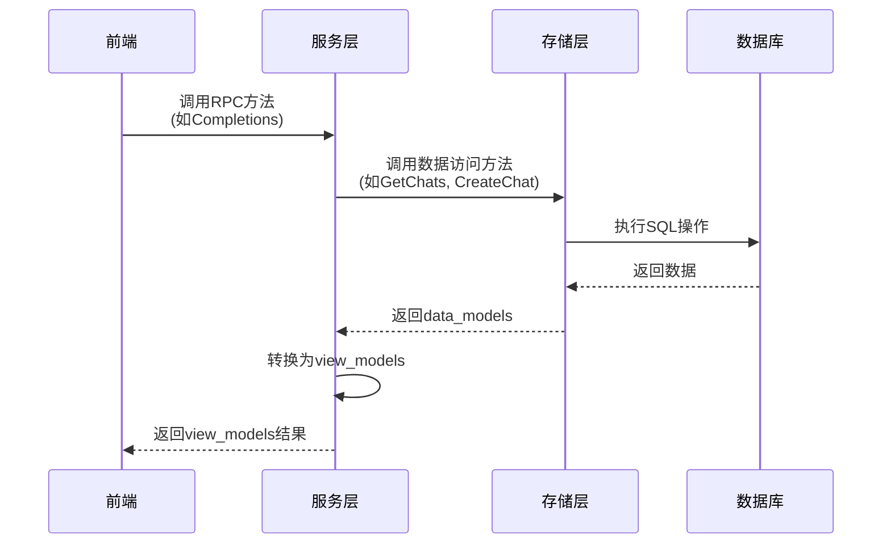
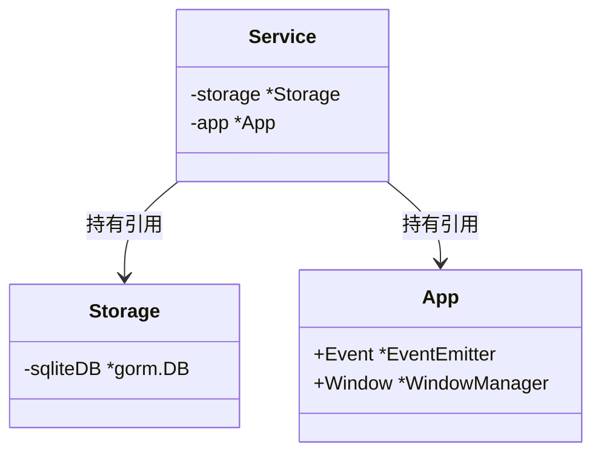
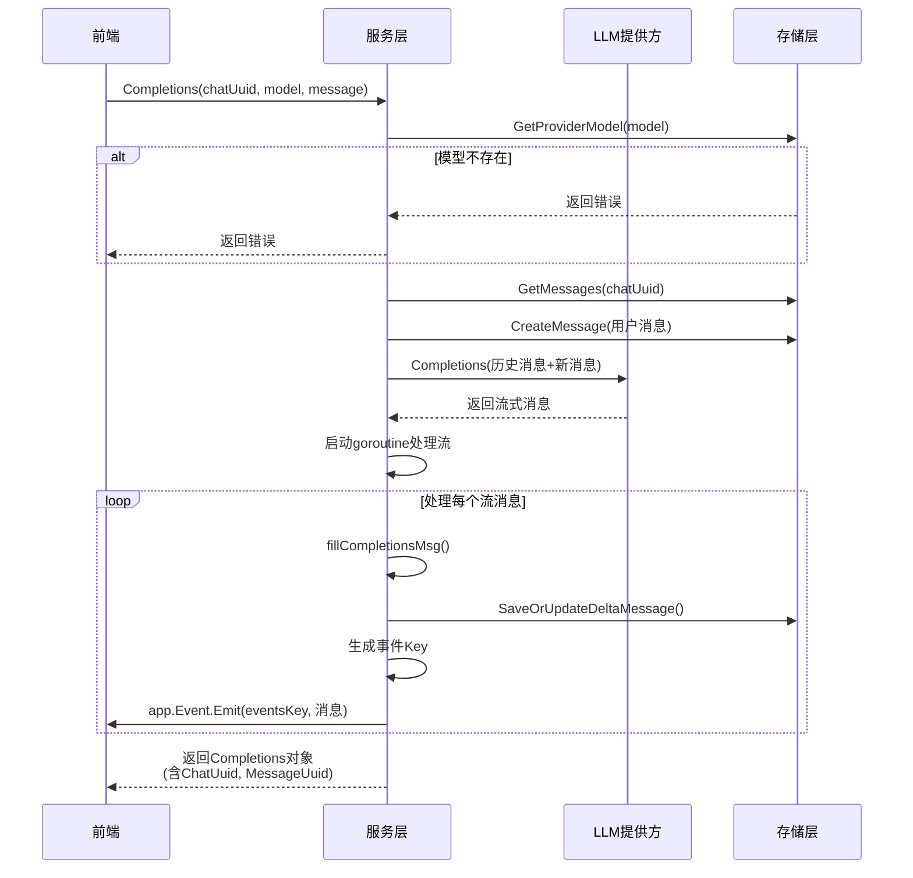
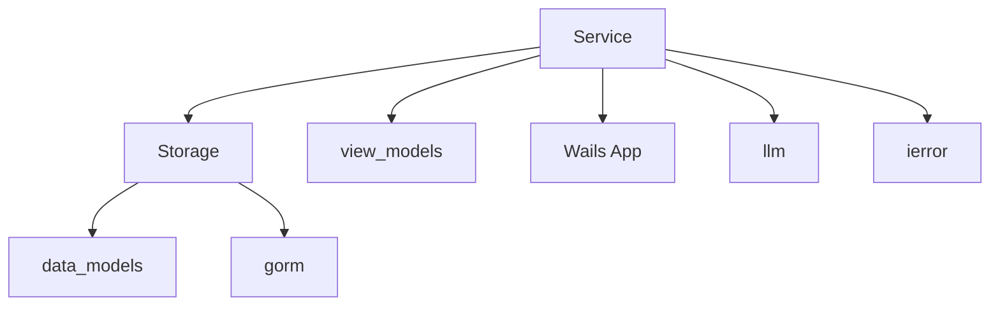

# 服务层设计

<cite>
**本文档引用的文件**
- [service.go](file://backend/service/service.go)
- [chat.go](file://backend/service/chat.go)
- [provider.go](file://backend/service/provider.go)
- [settings.go](file://backend/service/settings.go)
- [main.go](file://main.go)
- [storage.go](file://backend/storage/storage.go)
- [models.go](file://backend/models/view_models/models.go)
- [events.go](file://backend/utils/events.go)
</cite>

## 目录
1. [引言](#引言)
2. [项目结构](#项目结构)
3. [核心组件](#核心组件)
4. [架构概述](#架构概述)
5. [详细组件分析](#详细组件分析)
6. [依赖分析](#依赖分析)
7. [性能考虑](#性能考虑)
8. [故障排除指南](#故障排除指南)
9. [结论](#结论)

## 引言
本文档详细阐述了基于Wails框架的桌面AI客户端`lemon_tea_desktop`中服务层（service包）的设计与实现。重点分析`Service`结构体作为业务逻辑聚合入口的角色，其如何通过Wails的RPC机制暴露给前端调用，以及`NewService()`函数的依赖注入和初始化流程。文档还将深入探讨关键方法的职责、调用链路和事件驱动模式的应用。

## 项目结构
服务层位于`backend/service`目录下，是连接前端UI与后端数据存储（storage）的核心枢纽。它封装了所有业务逻辑，并通过Wails框架暴露为前端可调用的API。

```mermaid
graph TB
subgraph "前端"
Frontend[前端组件]
end
subgraph "后端"
Service[服务层<br>backend/service]
Storage[存储层<br>backend/storage]
Models[数据模型<br>backend/models]
end
Frontend --> Service : Wails RPC调用
Service --> Storage : 调用方法
Service --> Models : 使用view_models
Storage --> Models : 使用data_models
```

**图示来源**
- [service.go](file://backend/service/service.go)
- [storage.go](file://backend/storage/storage.go)

**本节来源**
- [service.go](file://backend/service/service.go)
- [storage.go](file://backend/storage/storage.go)

## 核心组件
服务层的核心是`Service`结构体，它持有对`Storage`实例和Wails应用实例的引用，从而能够访问数据库和触发前端事件。`NewService()`函数负责创建该结构体的实例，并在`ServiceStartup`方法中完成依赖注入和初始化。

**本节来源**
- [service.go](file://backend/service/service.go#L9-L16)

## 架构概述
服务层采用典型的分层架构，`Service`结构体作为业务逻辑的统一入口。前端通过Wails的RPC机制调用`Service`的方法，这些方法处理业务逻辑后，调用`Storage`层进行数据持久化操作，最后将结果以`view_models`数据结构返回给前端。



**图示来源**
- [service.go](file://backend/service/service.go#L9-L12)
- [chat.go](file://backend/service/chat.go#L15-L30)
- [storage.go](file://backend/storage/storage.go)

## 详细组件分析

### 服务结构体与初始化分析
`Service`结构体是服务层的中心，它通过组合的方式依赖`Storage`和Wails的`App`实例。

#### 结构体定义


**图示来源**
- [service.go](file://backend/service/service.go#L9-L12)

#### 初始化流程
`NewService()`函数是服务的工厂方法，它创建一个空的`Service`实例。真正的依赖注入发生在`ServiceStartup`方法中，该方法由Wails框架在应用启动时自动调用。
```mermaid
flowchart TD
Start([NewService()]) --> CreateInstance["创建空Service实例"]
CreateInstance --> FrameworkCall["Wails框架调用ServiceStartup"]
FrameworkCall --> NewStorage["调用storage.NewStorage()"]
NewStorage --> InitDB["初始化SQLite数据库"]
InitDB --> StoreRef["将Storage实例赋值给s.storage"]
StoreRef --> GetApp["获取Wails App实例"]
GetApp --> StoreApp["将App实例赋值给s.app"]
StoreApp --> End([初始化完成])
```

**图示来源**
- [service.go](file://backend/service/service.go#L14-L28)
- [storage.go](file://backend/storage/storage.go#L15-L35)

**本节来源**
- [service.go](file://backend/service/service.go#L14-L28)
- [storage.go](file://backend/storage/storage.go#L15-L35)

### 聊天功能分析
`Completions()`方法是处理聊天流式响应的核心，它实现了从接收用户消息到生成AI回复的完整流程。

#### 聊天流式响应流程


**图示来源**
- [chat.go](file://backend/service/chat.go#L35-L100)
- [service.go](file://backend/service/service.go#L9-L12)
- [events.go](file://backend/utils/events.go#L4-L6)

**本节来源**
- [chat.go](file://backend/service/chat.go#L35-L100)

### 供应商管理分析
`provider.go`文件中的方法负责管理AI模型的提供方配置。

#### 添加供应商流程
```mermaid
flowchart TD
A[AddProvider] --> B[调用storage.AddProvider]
B --> C[获取新创建的providerId]
C --> D[调用updateProviderModel]
D --> E[GetProviderByID]
E --> F[GetModels(通过API)]
F --> G[开启事务]
G --> H[DeleteAllProviderModel]
H --> I[循环AddProviderModel]
I --> J[提交事务]
J --> K[返回成功]
```

**图示来源**
- [provider.go](file://backend/service/provider.go#L25-L80)

**本节来源**
- [provider.go](file://backend/service/provider.go#L25-L80)

### 事件驱动模式分析
服务层利用Wails的事件系统实现事件驱动，例如在流式响应时实时推送消息。

#### 事件广播流程
当`Completions()`方法接收到AI的流式响应时，会启动一个goroutine，将每个部分消息通过`app.Event.Emit()`发送到前端，前端通过`eventsKey`监听并更新UI。

**本节来源**
- [chat.go](file://backend/service/chat.go#L75-L95)
- [settings.go](file://backend/service/settings.go#L4-L15)

## 依赖分析
服务层的依赖关系清晰，主要依赖于`storage`包进行数据操作，依赖于`view_models`包进行数据传输，以及Wails框架的核心模块。



**图示来源**
- [go.mod](file://go.mod)
- [service.go](file://backend/service/service.go)

**本节来源**
- [service.go](file://backend/service/service.go)
- [provider.go](file://backend/service/provider.go)

## 性能考虑
- **流式传输**：`Completions()`方法使用goroutine和channel处理流式响应，避免阻塞主线程，保证了UI的响应性。
- **数据库事务**：在`updateProviderModel`中使用事务确保了模型数据更新的原子性。
- **缓存**：当前设计未显式使用缓存，频繁的模型列表获取可能成为性能瓶颈，未来可考虑引入缓存机制。

## 故障排除指南
- **RPC调用失败**：最常见的原因是方法未导出。确保服务层的方法名首字母大写（如`Completions`而非`completions`），否则Wails无法将其暴露为RPC接口。
- **数据库连接失败**：检查`getDbPath()`函数确定的数据库路径是否可写，确保`lemontea/data.db`文件所在目录存在且有权限。
- **事件未触发**：检查`GenEventsKey`生成的key是否与前端监听的key完全匹配，注意字符串拼写和大小写。

**本节来源**
- [service.go](file://backend/service/service.go)
- [chat.go](file://backend/service/chat.go)
- [storage.go](file://backend/storage/storage.go)

## 结论
服务层设计良好，职责清晰，成功地将业务逻辑与数据访问、前端交互分离。通过Wails框架的RPC和事件系统，实现了前后端的高效通信。`Service`结构体作为聚合入口，配合`NewService()`和`ServiceStartup`的初始化模式，构成了一个可维护、可扩展的架构基础。未来可进一步优化错误处理和增加缓存以提升性能。