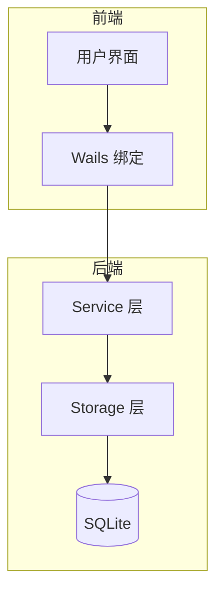
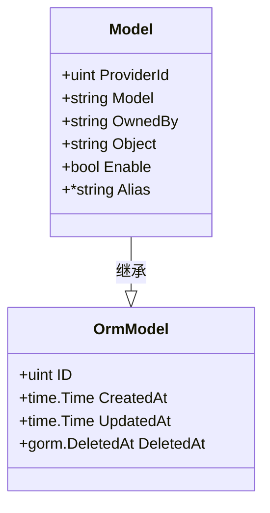
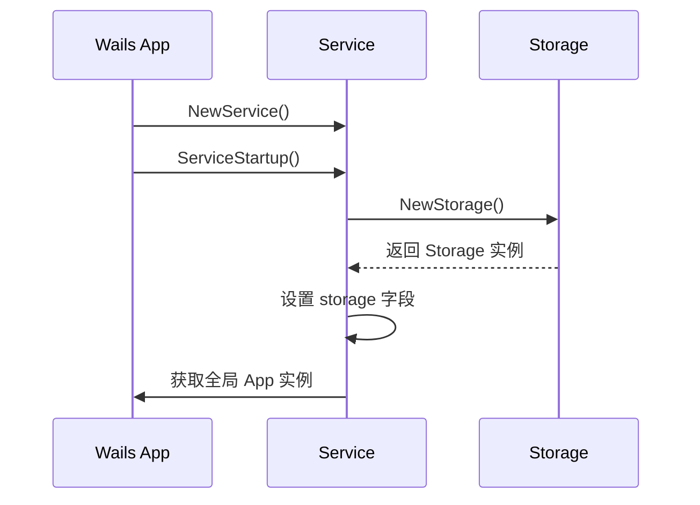
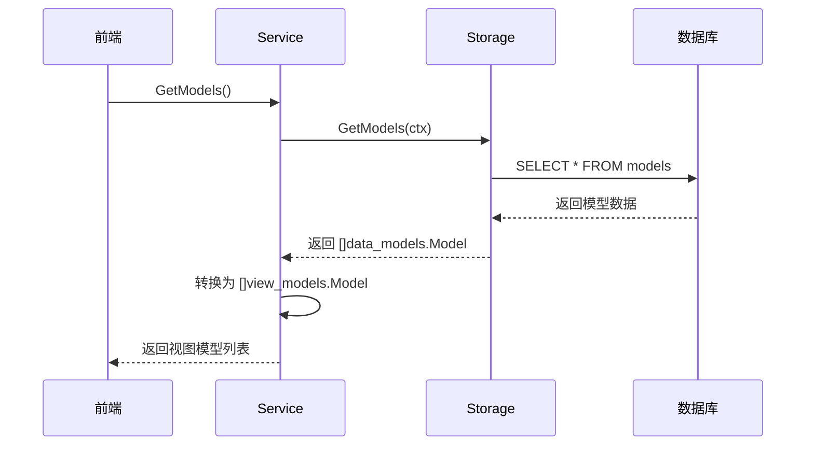

# 核心模块设计

<cite>
**本文档引用的文件**  
- [backend/models/data_models/models.go](file://backend/models/data_models/models.go)
- [backend/models/data_models/common.go](file://backend/models/data_models/common.go)
- [backend/models/view_models/models.go](file://backend/models/view_models/models.go)
- [backend/storage/storage.go](file://backend/storage/storage.go)
- [backend/storage/models.go](file://backend/storage/models.go)
- [backend/service/service.go](file://backend/service/service.go)
- [backend/service/models.go](file://backend/service/models.go)
- [frontend/src/hooks/useModels.ts](file://frontend/src/hooks/useModels.ts)
- [frontend/bindings/gitlab.linhf.cn/project/lemontea/lemon_tea_desktop/backend/models/view_models/models.ts](file://frontend/bindings/gitlab.linhf.cn/project/lemontea/lemon_tea_desktop/backend/models/view_models/models.ts)
</cite>

## 目录
1. [项目结构概述](#项目结构概述)
2. [三层架构设计](#三层架构设计)
3. [数据模型层（data_models）](#数据模型层data_models)
4. [存储层（storage）](#存储层storage)
5. [服务层（service）](#服务层service)
6. [依赖注入与初始化流程](#依赖注入与初始化流程)
7. [事件驱动机制](#事件驱动机制)
8. [请求调用链分析](#请求调用链分析)
9. [前端集成与数据转换](#前端集成与数据转换)

## 项目结构概述

本项目采用清晰的分层架构，后端主要分为 `models`、`storage`、`service` 三大模块，分别对应数据模型、数据访问与业务逻辑。前端通过 Wails 绑定调用后端服务，实现跨层通信。

**Section sources**
- [backend/models/data_models/models.go](file://backend/models/data_models/models.go)
- [backend/storage/storage.go](file://backend/storage/storage.go)
- [backend/service/service.go](file://backend/service/service.go)

## 三层架构设计

系统采用典型的三层架构模式：
- **data_models**：GORM 实体层，映射数据库表结构
- **storage**：数据访问层，封装 CRUD 操作与事务管理
- **service**：业务逻辑层，聚合功能并通过 Wails 暴露为 RPC 接口

该设计实现了关注点分离，提升了代码可维护性与可测试性。



**Diagram sources**
- [backend/service/service.go](file://backend/service/service.go#L1-L30)
- [backend/storage/storage.go](file://backend/storage/storage.go#L1-L82)

## 数据模型层（data_models）

`data_models` 包定义了与数据库表直接映射的 GORM 实体结构。所有模型均继承 `OrmModel`，包含通用字段如 ID、CreatedAt、UpdatedAt 和 DeletedAt，支持软删除。

例如，`Model` 结构体表示 AI 模型配置，包含提供方 ID、模型名称、启用状态等属性。



**Diagram sources**
- [backend/models/data_models/common.go](file://backend/models/data_models/common.go#L5-L13)
- [backend/models/data_models/models.go](file://backend/models/data_models/models.go#L3-L10)

**Section sources**
- [backend/models/data_models/models.go](file://backend/models/data_models/models.go#L1-L11)
- [backend/models/data_models/common.go](file://backend/models/data_models/common.go#L1-L14)

## 存储层（storage）

`storage` 层封装了对数据库的访问操作，通过 `Storage` 结构体持有 GORM DB 实例，提供类型安全的数据访问接口。

关键特性包括：
- `NewStorage()` 初始化数据库连接并执行自动迁移
- 支持事务操作 `NewFnTransaction`
- 提供 `GetModels`、`AddProviderModel` 等具体 CRUD 方法

```go
func (s *Storage) GetModels(ctx context.Context) ([]data_models.Model, error)
func (s *Storage) AddProviderModel(ctx context.Context, model data_models.Model) error
```

**Section sources**
- [backend/storage/storage.go](file://backend/storage/storage.go#L1-L82)
- [backend/storage/models.go](file://backend/storage/models.go#L1-L67)

## 服务层（service）

`service` 层是业务逻辑的核心，通过 `Service` 结构体聚合 `storage` 实例，并暴露方法供前端调用。

`GetModels()` 方法从存储层获取原始数据模型，转换为视图模型 `view_models.Model` 后返回，实现数据脱敏与格式适配。

```go
func (s *Service) GetModels() ([]view_models.Model, error)
```

**Section sources**
- [backend/service/service.go](file://backend/service/service.go#L1-L30)
- [backend/service/models.go](file://backend/service/models.go#L1-L33)

## 依赖注入与初始化流程

系统采用依赖注入模式完成组件初始化：
- `NewService()` 创建空 `Service` 实例
- `ServiceStartup` 钩子中调用 `storage.NewStorage()` 获取存储实例并赋值
- 通过 `application.Get()` 获取全局 Wails 应用实例，实现单例模式



**Diagram sources**
- [backend/service/service.go](file://backend/service/service.go#L14-L30)
- [backend/storage/storage.go](file://backend/storage/storage.go#L18-L25)

**Section sources**
- [backend/service/service.go](file://backend/service/service.go#L14-L30)

## 事件驱动机制

系统采用事件驱动设计实现前后端解耦。当数据更新时，可通过 `app.Event.Emit` 触发前端响应，例如模型列表变更后通知前端刷新 UI。

尽管当前代码中未直接展示事件触发逻辑，但已引入 `application.App` 实例，具备完整的事件发布能力。

**Section sources**
- [backend/service/service.go](file://backend/service/service.go#L28-L30)

## 请求调用链分析

以获取模型列表为例，展示请求从 UI 到数据库的完整穿透路径：



**Diagram sources**
- [backend/service/models.go](file://backend/service/models.go#L7-L33)
- [backend/storage/models.go](file://backend/storage/models.go#L5-L15)

**Section sources**
- [backend/service/models.go](file://backend/service/models.go#L7-L33)
- [backend/storage/models.go](file://backend/storage/models.go#L5-L15)

## 前端集成与数据转换

前端通过 Wails 自动生成的绑定调用后端服务。`useModels.ts` 中的 `useModels` Hook 调用 `Service.GetModels()`，并将返回的 `Model` 对象转换为前端所需的 `ModelOption` 格式，完成字段映射与别名处理。

```ts
const convertBackendModel = (backendModel: Model): ModelOption => { ... }
```

**Section sources**
- [frontend/src/hooks/useModels.ts](file://frontend/src/hooks/useModels.ts#L1-L31)
- [frontend/bindings/gitlab.linhf.cn/project/lemontea/lemon_tea_desktop/backend/models/view_models/models.ts](file://frontend/bindings/gitlab.linhf.cn/project/lemontea/lemon_tea_desktop/backend/models/view_models/models.ts#L178-L264)