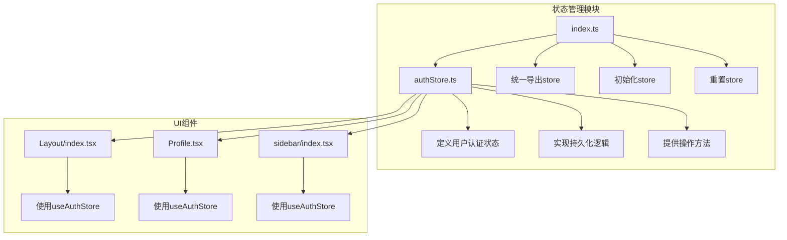
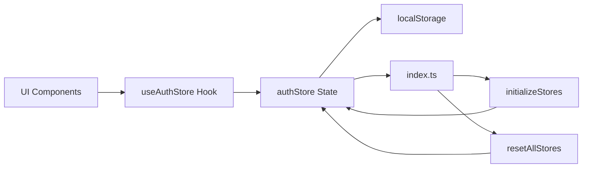
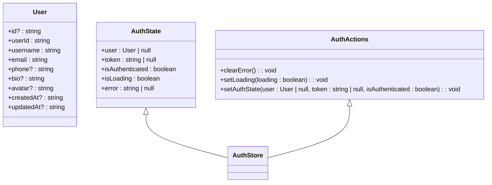
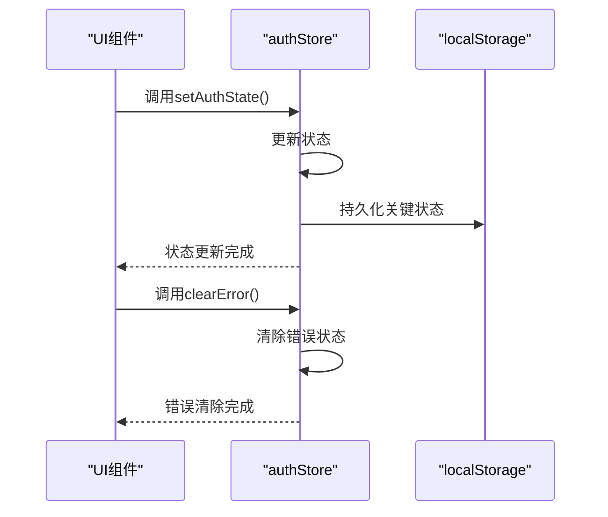
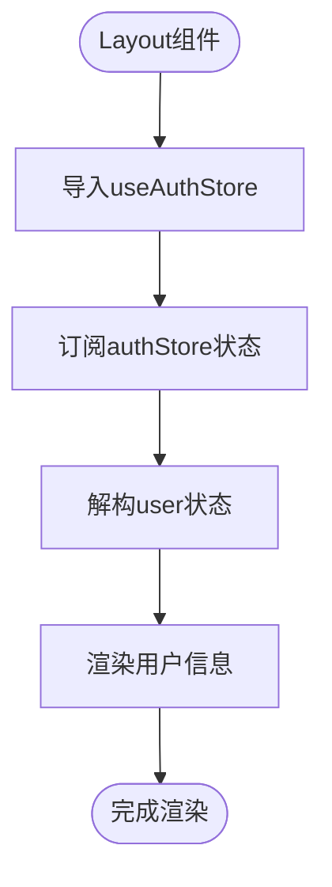
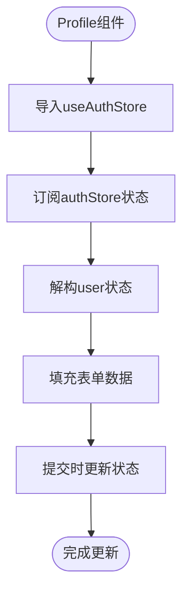
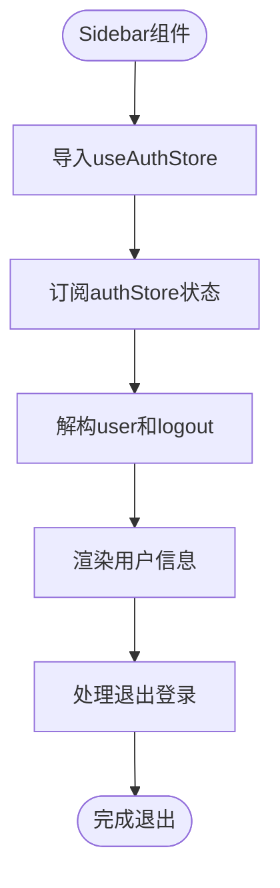
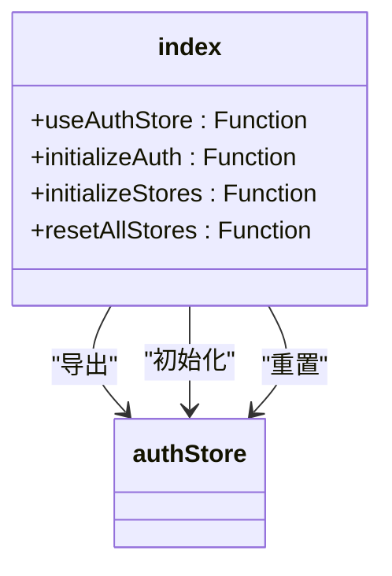
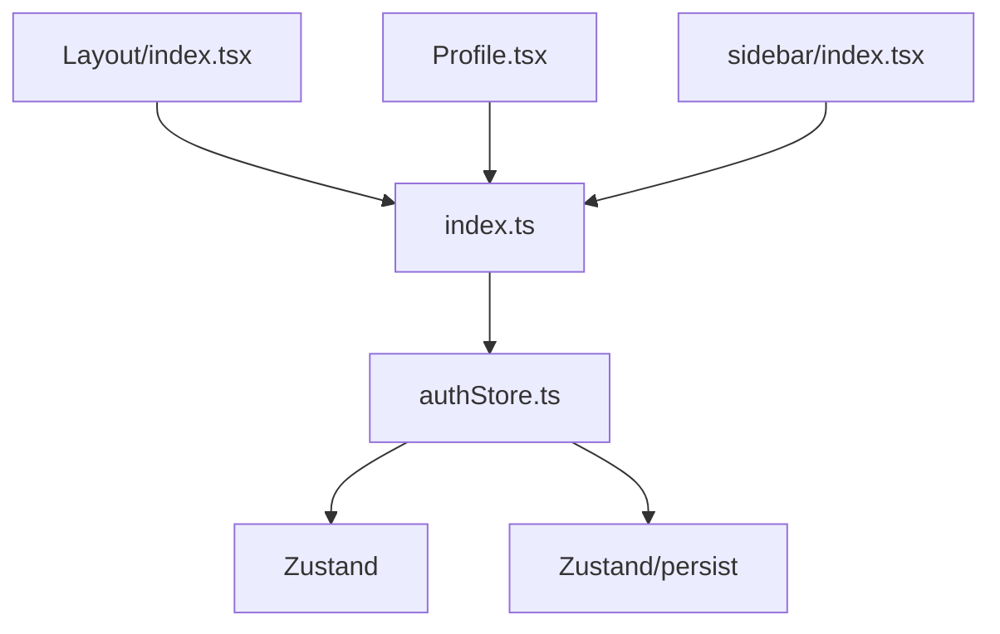

# 状态管理方案

<cite>
**本文档引用的文件**   
- [authStore.ts](file://frontend/src/stores/authStore.ts)
- [index.ts](file://frontend/src/stores/index.ts)
- [Layout/index.tsx](file://frontend/src/components/Layout/index.tsx)
- [Profile.tsx](file://frontend/src/pages/Profile.tsx)
- [sidebar/index.tsx](file://frontend/src/pages/home/sidebar/index.tsx)
</cite>

## 目录
1. [项目结构](#项目结构)
2. [核心组件](#核心组件)
3. [架构概述](#架构概述)
4. [详细组件分析](#详细组件分析)
5. [依赖分析](#依赖分析)
6. [性能考虑](#性能考虑)
7. [故障排除指南](#故障排除指南)
8. [结论](#结论)

## 项目结构

前端状态管理模块位于 `frontend/src/stores` 目录下，采用模块化设计，包含认证状态管理（authStore）和统一导出机制（index.ts）。该设计遵循轻量级、高内聚的原则，将状态逻辑与UI组件分离。

**Diagram sources**
- [authStore.ts](file://frontend/src/stores/authStore.ts#L1-L82)
- [index.ts](file://frontend/src/stores/index.ts#L1-L16)

**Section sources**
- [authStore.ts](file://frontend/src/stores/authStore.ts#L1-L82)
- [index.ts](file://frontend/src/stores/index.ts#L1-L16)

## 核心组件

`authStore` 是基于 Zustand 实现的用户认证状态管理器，包含用户信息、认证令牌、认证状态等核心数据。通过 `persist` 中间件实现本地持久化，确保页面刷新后状态不丢失。`index.ts` 文件提供统一的导出和初始化接口，简化了store的使用和管理。

**Section sources**
- [authStore.ts](file://frontend/src/stores/authStore.ts#L1-L82)
- [index.ts](file://frontend/src/stores/index.ts#L1-L16)

## 架构概述

本项目采用 Zustand 作为状态管理方案，替代传统的 Redux，实现了更轻量、更简洁的状态管理。`authStore` 作为核心状态容器，管理用户认证相关的所有状态，通过 React 的 Context 机制在组件间共享。持久化中间件确保关键状态在 localStorage 中持久保存，提升用户体验。

**Diagram sources**
- [authStore.ts](file://frontend/src/stores/authStore.ts#L1-L82)
- [index.ts](file://frontend/src/stores/index.ts#L1-L16)

## 详细组件分析

### authStore 分析

`authStore` 定义了用户认证所需的所有状态和操作方法，采用 TypeScript 接口确保类型安全。初始状态预设了演示用户信息，便于开发和测试。

#### 状态定义

**Diagram sources**
- [authStore.ts](file://frontend/src/stores/authStore.ts#L5-L45)

#### 操作方法
`authStore` 提供了三个核心操作方法：`setAuthState` 用于更新认证状态，`clearError` 用于清除错误信息，`setLoading` 用于设置加载状态。这些方法通过 Zustand 的 `set` 函数更新状态，确保状态变更的可预测性。

**Diagram sources**
- [authStore.ts](file://frontend/src/stores/authStore.ts#L50-L82)

**Section sources**
- [authStore.ts](file://frontend/src/stores/authStore.ts#L1-L82)

### 组件连接方式分析

多个UI组件通过 `useAuthStore` Hook 订阅认证状态，实现状态共享和响应式更新。

#### 布局组件连接

**Diagram sources**
- [Layout/index.tsx](file://frontend/src/components/Layout/index.tsx#L10-L23)

#### 个人资料组件连接

**Diagram sources**
- [Profile.tsx](file://frontend/src/pages/Profile.tsx#L4-L7)

#### 侧边栏组件连接

**Diagram sources**
- [sidebar/index.tsx](file://frontend/src/pages/home/sidebar/index.tsx#L13-L44)

**Section sources**
- [Layout/index.tsx](file://frontend/src/components/Layout/index.tsx#L10-L23)
- [Profile.tsx](file://frontend/src/pages/Profile.tsx#L4-L7)
- [sidebar/index.tsx](file://frontend/src/pages/home/sidebar/index.tsx#L13-L44)

### 统一导出机制分析

`index.ts` 文件实现了store的统一导出和管理，提供初始化和重置功能，确保应用启动时状态的一致性。

**Diagram sources**
- [index.ts](file://frontend/src/stores/index.ts#L1-L16)

**Section sources**
- [index.ts](file://frontend/src/stores/index.ts#L1-L16)

## 依赖分析

状态管理模块与其他组件存在明确的依赖关系，通过 Hook 机制实现松耦合。

**Diagram sources**
- [authStore.ts](file://frontend/src/stores/authStore.ts#L1-L2)
- [index.ts](file://frontend/src/stores/index.ts#L1-L16)

**Section sources**
- [authStore.ts](file://frontend/src/stores/authStore.ts#L1-L82)
- [index.ts](file://frontend/src/stores/index.ts#L1-L16)

## 性能考虑

Zustand 的轻量级设计和高效的更新机制确保了状态管理的高性能。持久化中间件仅保存关键状态，减少 localStorage 的存储压力。组件通过选择性订阅，避免不必要的重新渲染。

## 故障排除指南

当遇到状态管理相关问题时，可检查以下方面：
1. 确认 `useAuthStore` 是否正确导入
2. 检查 localStorage 中的持久化数据是否完整
3. 验证状态更新方法是否正确调用
4. 确认组件是否正确订阅了所需状态

**Section sources**
- [authStore.ts](file://frontend/src/stores/authStore.ts#L1-L82)
- [index.ts](file://frontend/src/stores/index.ts#L1-L16)

## 结论

本项目采用 Zustand 实现状态管理，相比 Redux 等传统方案，具有更简洁的API、更小的包体积和更好的开发体验。`authStore` 的设计充分考虑了类型安全、持久化和易用性，`index.ts` 的统一导出机制简化了store的管理。这种轻量级状态管理方案非常适合中小型应用，能够有效提升开发效率和应用性能。