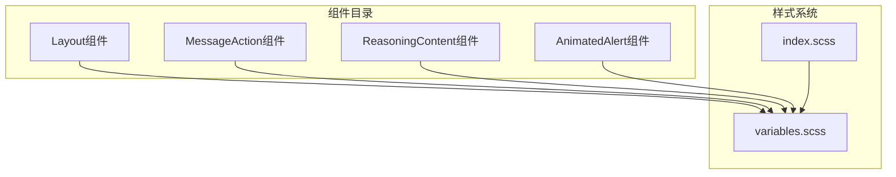
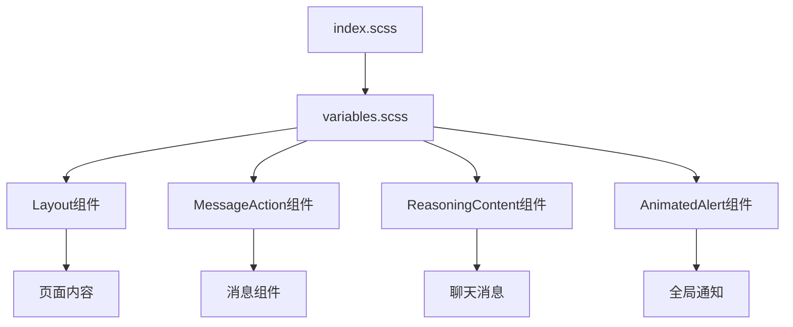
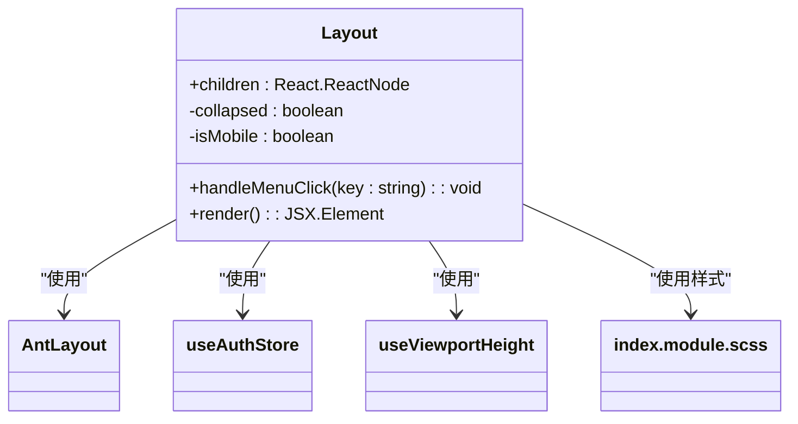
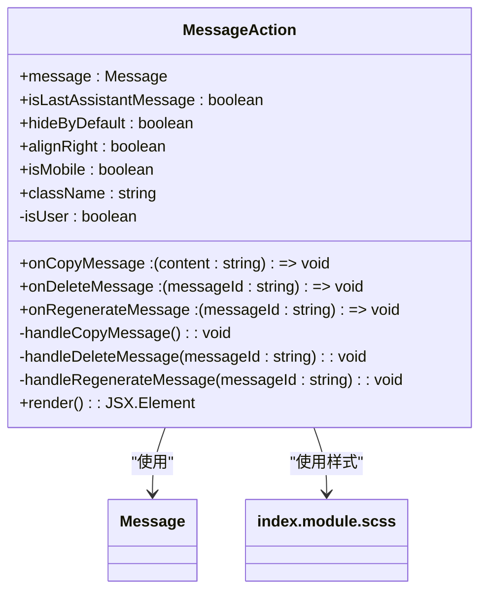
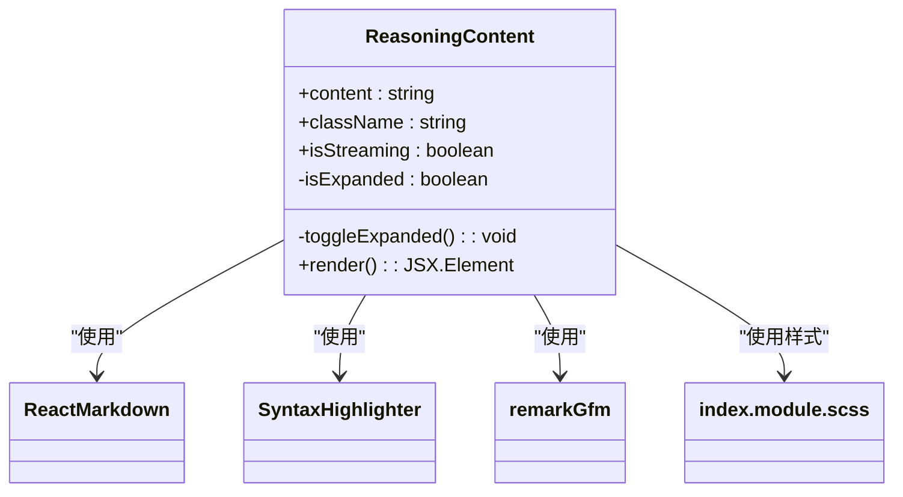
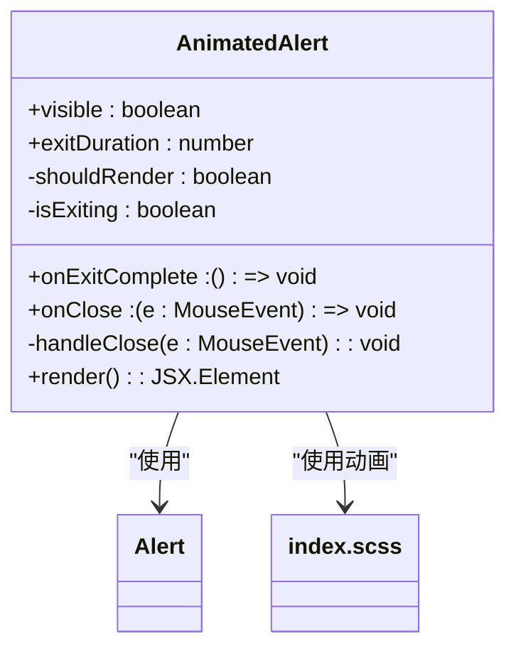
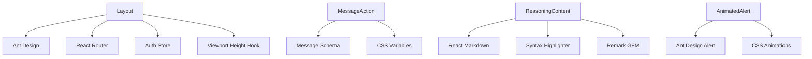

# UI组件设计与实现

<cite>
**本文档引用文件**  
- [Layout/index.tsx](file://frontend/src/components/Layout/index.tsx)
- [Layout/index.module.scss](file://frontend/src/components/Layout/index.module.scss)
- [MessageAction/index.tsx](file://frontend/src/components/MessageAction/index.tsx)
- [MessageAction/index.module.scss](file://frontend/src/components/MessageAction/index.module.scss)
- [ReasoningContent/index.tsx](file://frontend/src/components/ReasoningContent/index.tsx)
- [ReasoningContent/index.module.scss](file://frontend/src/components/ReasoningContent/index.module.scss)
- [AnimatedAlert.tsx](file://frontend/src/components/AnimatedAlert.tsx)
- [variables.scss](file://frontend/src/styles/variables.scss)
- [index.scss](file://frontend/src/styles/index.scss)
</cite>

## 目录
1. [引言](#引言)
2. [项目结构](#项目结构)
3. [核心组件](#核心组件)
4. [架构概览](#架构概览)
5. [详细组件分析](#详细组件分析)
6. [依赖分析](#依赖分析)
7. [性能考虑](#性能考虑)
8. [故障排除指南](#故障排除指南)
9. [结论](#结论)

## 引言
本文档深入解析前端可复用UI组件的设计理念与实现细节，重点阐述主布局容器、消息操作交互、推理内容渲染及动画提示等核心组件的技术实现。通过分析组件的结构划分、响应式策略、事件绑定机制和样式隔离方案，为开发者提供全面的组件使用与扩展指南。

## 项目结构
前端组件采用模块化组织方式，核心UI组件集中存放于`src/components`目录下，每个组件包含独立的TypeScript文件和SCSS模块化样式文件。样式系统基于CSS变量和Sass混合器构建，实现主题继承与响应式适配。

**图示来源**
- [Layout/index.tsx](file://frontend/src/components/Layout/index.tsx)
- [MessageAction/index.tsx](file://frontend/src/components/MessageAction/index.tsx)
- [ReasoningContent/index.tsx](file://frontend/src/components/ReasoningContent/index.tsx)
- [AnimatedAlert.tsx](file://frontend/src/components/AnimatedAlert.tsx)
- [variables.scss](file://frontend/src/styles/variables.scss)

**章节来源**
- [frontend/src/components](file://frontend/src/components)
- [frontend/src/styles](file://frontend/src/styles)

## 核心组件
系统包含四个核心UI组件：Layout作为主布局容器，MessageAction处理消息操作交互，ReasoningContent负责推理过程内容的动态渲染，AnimatedAlert提供轻量级动画提示功能。这些组件通过props定义、状态管理和事件系统实现高度可复用性和可扩展性。

**章节来源**
- [Layout/index.tsx](file://frontend/src/components/Layout/index.tsx)
- [MessageAction/index.tsx](file://frontend/src/components/MessageAction/index.tsx)
- [ReasoningContent/index.tsx](file://frontend/src/components/ReasoningContent/index.tsx)
- [AnimatedAlert.tsx](file://frontend/src/components/AnimatedAlert.tsx)

## 架构概览
系统采用React组件化架构，结合Ant Design UI库构建。组件间通过props传递数据和回调函数，状态管理通过React Hooks实现。样式系统采用CSS Modules和Sass预处理器，确保样式作用域隔离和主题一致性。

**图示来源**
- [Layout/index.tsx](file://frontend/src/components/Layout/index.tsx)
- [MessageAction/index.tsx](file://frontend/src/components/MessageAction/index.tsx)
- [ReasoningContent/index.tsx](file://frontend/src/components/ReasoningContent/index.tsx)
- [AnimatedAlert.tsx](file://frontend/src/components/AnimatedAlert.tsx)
- [variables.scss](file://frontend/src/styles/variables.scss)

## 详细组件分析
对每个核心组件进行深入分析，包括其设计模式、实现细节和使用方式。

### Layout组件分析
Layout组件作为主布局容器，采用Ant Design的Layout组件构建，包含侧边栏、头部和内容区域三部分。通过useState管理折叠状态，利用useViewportHeight Hook检测移动端环境。

**图示来源**
- [Layout/index.tsx](file://frontend/src/components/Layout/index.tsx)
- [Layout/index.module.scss](file://frontend/src/components/Layout/index.module.scss)

**章节来源**
- [Layout/index.tsx](file://frontend/src/components/Layout/index.tsx)
- [Layout/index.module.scss](file://frontend/src/components/Layout/index.module.scss)

### MessageAction组件分析
MessageAction组件处理消息操作交互，支持复制、删除和重新生成等操作。通过props接收消息对象和事件回调，采用SVG图标实现操作按钮，确保样式隔离。

**图示来源**
- [MessageAction/index.tsx](file://frontend/src/components/MessageAction/index.tsx)
- [MessageAction/index.module.scss](file://frontend/src/components/MessageAction/index.module.scss)

**章节来源**
- [MessageAction/index.tsx](file://frontend/src/components/MessageAction/index.tsx)
- [MessageAction/index.module.scss](file://frontend/src/components/MessageAction/index.module.scss)

### ReasoningContent组件分析
ReasoningContent组件实现推理过程内容的动态渲染，支持Markdown解析、代码高亮和表格展示。通过useState管理展开状态，利用useEffect在流式输入时自动展开。

**图示来源**
- [ReasoningContent/index.tsx](file://frontend/src/components/ReasoningContent/index.tsx)
- [ReasoningContent/index.module.scss](file://frontend/src/components/ReasoningContent/index.module.scss)

**章节来源**
- [ReasoningContent/index.tsx](file://frontend/src/components/ReasoningContent/index.tsx)
- [ReasoningContent/index.module.scss](file://frontend/src/components/ReasoningContent/index.module.scss)

### AnimatedAlert组件分析
AnimatedAlert组件提供轻量级动画提示，基于Ant Design的Alert组件封装，添加入场和退场动画效果。通过useState管理渲染状态，利用useEffect处理可见性变化。

**图示来源**
- [AnimatedAlert.tsx](file://frontend/src/components/AnimatedAlert.tsx)
- [index.scss](file://frontend/src/styles/index.scss)

**章节来源**
- [AnimatedAlert.tsx](file://frontend/src/components/AnimatedAlert.tsx)
- [index.scss](file://frontend/src/styles/index.scss)

## 依赖分析
组件间依赖关系清晰，通过props传递数据和回调函数。样式系统采用CSS变量实现主题继承，Sass混合器提供响应式支持。第三方库通过模块导入方式使用，确保依赖管理的清晰性。

**图示来源**
- [Layout/index.tsx](file://frontend/src/components/Layout/index.tsx)
- [MessageAction/index.tsx](file://frontend/src/components/MessageAction/index.tsx)
- [ReasoningContent/index.tsx](file://frontend/src/components/ReasoningContent/index.tsx)
- [AnimatedAlert.tsx](file://frontend/src/components/AnimatedAlert.tsx)
- [variables.scss](file://frontend/src/styles/variables.scss)

**章节来源**
- [Layout/index.tsx](file://frontend/src/components/Layout/index.tsx)
- [MessageAction/index.tsx](file://frontend/src/components/MessageAction/index.tsx)
- [ReasoningContent/index.tsx](file://frontend/src/components/ReasoningContent/index.tsx)
- [AnimatedAlert.tsx](file://frontend/src/components/AnimatedAlert.tsx)
- [variables.scss](file://frontend/src/styles/variables.scss)

## 性能考虑
组件实现注重性能优化，采用React.memo避免不必要的重渲染，使用CSS变量和Sass混合器减少样式重复。动画效果通过CSS实现而非JavaScript，确保流畅的用户体验。响应式设计通过媒体查询和CSS变量实现，避免JavaScript计算开销。

## 故障排除指南
常见问题包括布局错位和样式冲突。布局错位通常由CSS变量未正确设置或响应式断点配置不当引起。样式冲突多源于全局样式污染或CSS变量继承问题。建议使用浏览器开发者工具检查CSS变量值和样式优先级。

**章节来源**
- [variables.scss](file://frontend/src/styles/variables.scss)
- [index.scss](file://frontend/src/styles/index.scss)
- [Layout/index.module.scss](file://frontend/src/components/Layout/index.module.scss)

## 结论
本文档详细解析了前端可复用UI组件的设计理念与实现细节，为开发者提供了全面的技术参考。通过模块化设计、CSS变量主题系统和清晰的组件接口，这些组件实现了高度的可复用性和可维护性，为构建现代化Web应用提供了坚实基础。