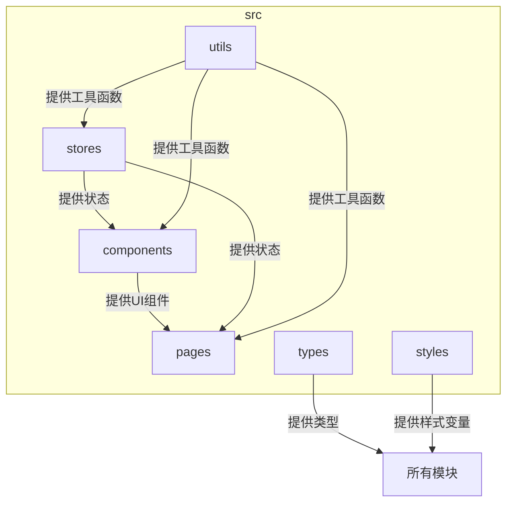
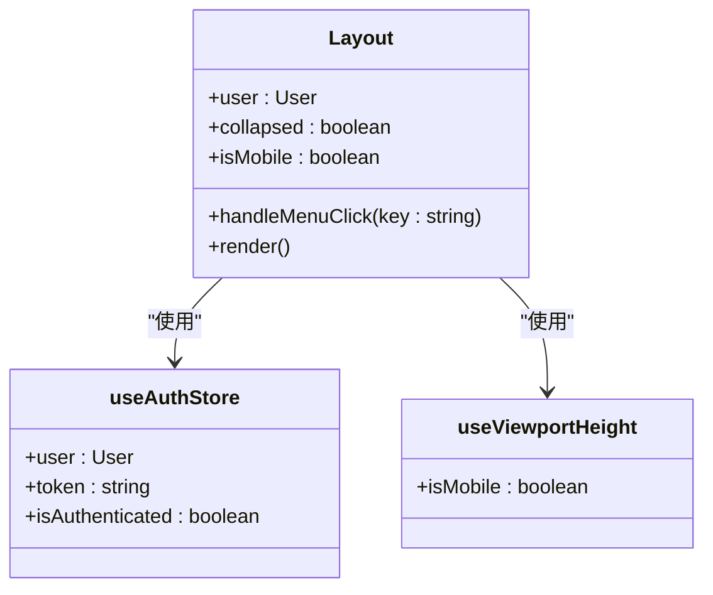
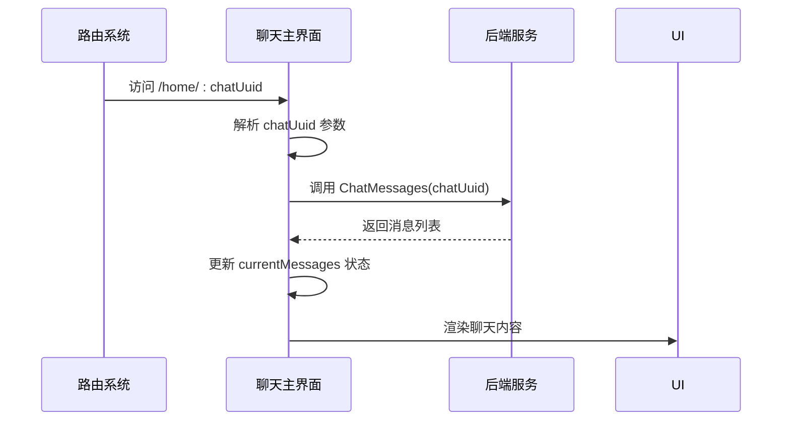
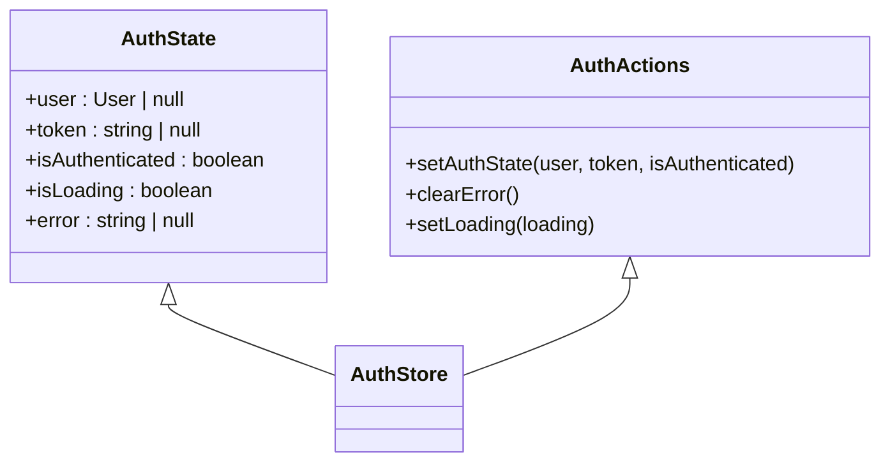
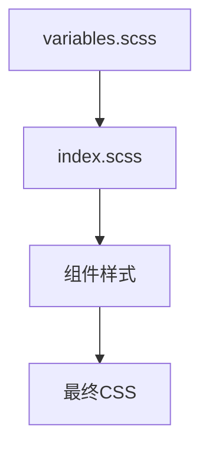

# 前端目录结构

<cite>
**本文档中引用的文件**  
- [Layout/index.tsx](file://frontend/src/components/Layout/index.tsx)
- [Layout/index.module.scss](file://frontend/src/components/Layout/index.module.scss)
- [MessageAction/index.tsx](file://frontend/src/components/MessageAction/index.tsx)
- [MessageAction/index.module.scss](file://frontend/src/components/MessageAction/index.module.scss)
- [home/index.tsx](file://frontend/src/pages/home/index.tsx)
- [home/index.module.scss](file://frontend/src/pages/home/index.module.scss)
- [settings/index.tsx](file://frontend/src/pages/settings/index.tsx)
- [authStore.ts](file://frontend/src/stores/authStore.ts)
- [errorHandler.ts](file://frontend/src/utils/errorHandler.ts)
- [events.ts](file://frontend/src/utils/events.ts)
- [crypto.ts](file://frontend/src/utils/crypto.ts)
- [types/index.ts](file://frontend/src/types/index.ts)
- [styles/variables.scss](file://frontend/src/styles/variables.scss)
- [styles/index.scss](file://frontend/src/styles/index.scss)
</cite>

## 目录

1. [项目结构概览](#项目结构概览)  
2. [可复用UI组件设计](#可复用ui组件设计)  
3. [页面路由与懒加载](#页面路由与懒加载)  
4. [状态管理实践](#状态管理实践)  
5. [工具集应用](#工具集应用)  
6. [类型定义与样式管理](#类型定义与样式管理)  
7. [总结](#总结)

## 项目结构概览

前端项目采用模块化组织方式，`src` 目录下主要分为 `components`（可复用组件）、`pages`（页面级组件）、`stores`（状态管理）、`utils`（工具函数）、`types`（全局类型定义）和 `styles`（样式管理）六大模块。整体结构清晰，职责分离明确，便于团队协作与功能扩展。

**Diagram sources**  
- [src/components](file://frontend/src/components)
- [src/pages](file://frontend/src/pages)
- [src/stores](file://frontend/src/stores)
- [src/utils](file://frontend/src/utils)
- [src/types](file://frontend/src/types)
- [src/styles](file://frontend/src/styles)

## 可复用UI组件设计

### Layout主布局容器

`Layout` 组件作为应用的主布局容器，封装了侧边栏、头部导航和内容区域，使用 Ant Design 的 `Layout` 组件构建响应式布局。通过 `useAuthStore` 获取用户信息，并结合 `useViewportHeight` Hook 检测设备类型，实现移动端适配。

组件采用 CSS Modules 进行样式隔离，确保类名局部作用域，避免全局污染。通过 `styles.layout`、`styles.sider` 等方式引用样式，实现高内聚的样式管理。

**Diagram sources**  
- [Layout/index.tsx](file://frontend/src/components/Layout/index.tsx)
- [authStore.ts](file://frontend/src/stores/authStore.ts)
- [useViewportHeight.ts](file://frontend/src/hooks/useViewportHeight.ts)

**Section sources**  
- [Layout/index.tsx](file://frontend/src/components/Layout/index.tsx)
- [Layout/index.module.scss](file://frontend/src/components/Layout/index.module.scss)

### MessageAction消息操作组件

`MessageAction` 组件用于展示消息的复制、删除、重新生成等操作按钮。组件设计遵循单一职责原则，仅接收 `message` 对象及回调函数作为 props，不直接处理业务逻辑。

该组件同样使用 CSS Modules 实现样式隔离，所有样式类通过 `styles` 对象引用。通过 `hideByDefault`、`alignRight` 等布尔属性控制显示行为，提升组件灵活性。

**Section sources**  
- [MessageAction/index.tsx](file://frontend/src/components/MessageAction/index.tsx)
- [MessageAction/index.module.scss](file://frontend/src/components/MessageAction/index.module.scss)

## 页面路由与懒加载

### 聊天主界面 (home)

`home` 页面是应用的核心功能区，采用 `react-router-dom` 实现路由控制。页面结构包含侧边栏（聊天列表）和主内容区（聊天对话），通过 `Outlet` 组件嵌套子路由。

在代码中，通过 `useParams` 获取 `chatUuid` 参数，实现不同聊天会话的切换。页面通过 `useNavigate` 控制路由跳转，并结合 `useEffect` 监听参数变化，动态加载对应聊天记录。

**Diagram sources**  
- [home/index.tsx](file://frontend/src/pages/home/index.tsx)
- [service/index.ts](file://frontend/bindings/gitlab.linhf.cn/project/lemontea/lemon_tea_desktop/backend/service/index.ts)

**Section sources**  
- [home/index.tsx](file://frontend/src/pages/home/index.tsx)
- [home/index.module.scss](file://frontend/src/pages/home/index.module.scss)

### 设置页面 (settings)

`settings` 页面采用侧边栏菜单形式组织多个子设置项，如“模型供应商”、“通用设置”等。通过 `selectedKey` 状态控制当前激活的菜单项，并使用 `renderContent` 函数动态渲染对应内容组件。

该页面未使用懒加载，所有子组件在初始时即被导入。未来可结合 `React.lazy` 和 `Suspense` 实现按需加载，提升首屏性能。

**Section sources**  
- [settings/index.tsx](file://frontend/src/pages/settings/index.tsx)

## 状态管理实践

### Zustand状态管理

项目使用 `Zustand` 进行全局状态管理，`stores` 目录下通过 `create` 函数定义状态模型。相比 Redux，Zustand 更加轻量且无需过多模板代码。

#### authStore持久化配置

`authStore.ts` 中定义了用户认证状态，包括 `user`、`token`、`isAuthenticated` 等字段。通过 `persist` 中间件实现状态持久化，配置如下：

- `name`: 存储键名为 `auth-storage`
- `partialize`: 仅持久化 `user`、`token` 和 `isAuthenticated` 字段

初始状态预设为演示用户，便于本地开发调试。`setAuthState` 方法用于统一更新认证状态，确保状态一致性。

**Diagram sources**  
- [authStore.ts](file://frontend/src/stores/authStore.ts)

**Section sources**  
- [authStore.ts](file://frontend/src/stores/authStore.ts)

## 工具集应用

### 错误处理 (errorHandler)

`errorHandler.ts` 提供统一的错误消息映射机制，将后端返回的错误码转换为用户友好的提示信息。核心函数 `extractErrorMessage` 支持多种错误格式（如 AxiosError），并优先匹配预定义的 `ERROR_MESSAGE_MAP`。

此外，支持动态添加错误映射（`addErrorMapping`）和检查是否为 API 错误（`isApiError`），增强可扩展性。

**Section sources**  
- [errorHandler.ts](file://frontend/src/utils/errorHandler.ts)

### 事件通信 (events)

`events.ts` 提供简单的事件键生成函数 `GenEventsKey`，用于规范化事件命名，避免命名冲突。例如将用户ID转换为 `"user:123"` 形式的事件键，便于事件订阅与发布。

**Section sources**  
- [events.ts](file://frontend/src/utils/events.ts)

### 加密操作 (crypto)

`crypto.ts` 封装密码相关操作，包括：

- `hashPassword`: 使用 `crypto-js/md5` 对密码进行MD5哈希
- `validatePassword`: 验证密码强度（至少6位，包含字母和数字）

这些工具函数在登录、注册等场景中被调用，确保安全性。

**Section sources**  
- [crypto.ts](file://frontend/src/utils/crypto.ts)

## 类型定义与样式管理

### 全局类型定义 (types/index.ts)

`types/index.ts` 作为全局类型中心，定义了项目中广泛使用的接口和类型别名，例如：

- `ApiResponse<T>`: 统一API响应格式
- `ChatState`: 聊天相关状态结构
- `ThemeMode`: 主题模式枚举
- `DeepPartial<T>`: 深度可选工具类型

通过集中管理类型，提升代码可维护性与类型安全。

**Section sources**  
- [types/index.ts](file://frontend/src/types/index.ts)

### SCSS变量统一管理

`styles` 目录通过 `variables.scss` 定义全局SCSS变量，包括：

- 颜色（`--primary-color`）
- 字体（`--font-size`）
- 间距（`--spacing-md`）
- 阴影（`--shadow-2`）
- 响应式断点（`$breakpoints`）

`index.scss` 导入这些变量并定义通用样式（如按钮、表单、滚动条），通过 `@use` 机制实现模块化引入，避免重复编译。

**Diagram sources**  
- [styles/variables.scss](file://frontend/src/styles/variables.scss)
- [styles/index.scss](file://frontend/src/styles/index.scss)

**Section sources**  
- [styles/variables.scss](file://frontend/src/styles/variables.scss)
- [styles/index.scss](file://frontend/src/styles/index.scss)

## 总结

本项目前端结构清晰，模块职责分明。通过 Zustand 实现高效状态管理，CSS Modules 保障样式隔离，全局类型定义提升类型安全。建议未来在 `settings` 页面引入懒加载，并考虑将部分工具函数抽离为独立库，进一步提升可复用性。