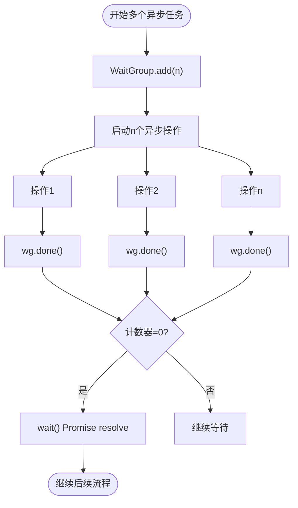

# 工具函数库

<cite>
**本文档中引用的文件**  
- [errorHandler.ts](file://frontend/src/utils/errorHandler.ts)
- [crypto.ts](file://frontend/src/utils/crypto.ts)
- [completions.ts](file://frontend/src/utils/completions.ts)
- [events.ts](file://frontend/src/utils/events.ts)
- [notification.ts](file://frontend/src/utils/notification.ts)
- [wait_group.ts](file://frontend/src/utils/wait_group.ts)
</cite>

## 目录
1. [简介](#简介)
2. [核心工具函数详解](#核心工具函数详解)
3. [统一错误处理机制](#统一错误处理机制)
4. [加密辅助方法](#加密辅助方法)
5. [LLM流式响应解析](#llm流式响应解析)
6. [事件订阅/发布模式与Wails桥接](#事件订阅发布模式与wails桥接)
7. [轻量级通知服务](#轻量级通知服务)
8. [并发控制结构（WaitGroup）](#并发控制结构waitgroup)
9. [扩展指南](#扩展指南)
10. [常见误用与性能优化](#常见误用与性能优化)

## 简介
本工具函数库为前端应用提供了一系列可复用、高内聚的辅助功能模块，涵盖错误处理、数据加密、异步流控制、事件通信、用户通知及并发协调等关键场景。设计目标是提升代码可维护性、增强用户体验、保障数据安全，并简化与后端Wails框架的交互逻辑。

## 核心工具函数详解
前端工具函数集中位于 `frontend/src/utils` 目录，各模块职责清晰，低耦合，便于独立测试与复用。以下对各核心模块进行深入解析。

## 统一错误处理机制
`errorHandler.ts` 提供了前端统一的错误消息提取与转换机制，屏蔽底层错误细节，向用户呈现友好提示。

### 异常分类与映射
通过 `ERROR_MESSAGE_MAP` 静态映射表，将后端返回的错误码（如 `'ErrCodeInvalidAccountPassword'`）转换为中文用户提示。分类涵盖认证、注册、权限、服务器、数据及通用错误。

### 用户提示策略
- 优先使用预定义映射消息
- 其次根据 HTTP 状态码（401、403、500 等）生成通用提示
- 网络异常（超时、连接拒绝）单独处理
- 最终兜底使用默认消息

### 日志上报与调试
- `extractErrorMessage` 函数捕获并安全处理错误，避免二次异常
- `addErrorMapping` 支持运行时动态添加错误映射
- `getErrorMappings` 便于调试时查看当前映射状态
- `isApiError` 和 `extractErrorCode` 提供类型判断与错误码提取能力

**Section sources**
- [errorHandler.ts](file://frontend/src/utils/errorHandler.ts#L1-L179)

## 加密辅助方法
`crypto.ts` 封装了密码处理相关的基础加密与验证功能。

### 敏感数据处理
- `hashPassword` 使用 MD5 哈希原始密码，确保传输与存储安全（注：生产环境建议使用更安全的算法如 bcrypt）
- 哈希操作在前端完成，避免明文密码暴露

### 密码强度验证
- `validatePassword` 实现基础强度策略：
  - 长度不少于6位
  - 必须包含字母和数字
- 返回结构化结果 `{ isValid: boolean, message?: string }`，便于UI展示具体原因

**Section sources**
- [crypto.ts](file://frontend/src/utils/crypto.ts#L1-L30)

## LLM流式响应解析
`completions.ts` 负责调用后端 Completions API 并处理流式响应。

### 解析逻辑
1. 调用 `Service.Completions` 发起请求，获取消息 UUID
2. 使用 `Events.On` 订阅以 `user:{message_uuid}` 为键的Wails事件
3. 在事件回调中逐条接收 `Message` 对象
4. 通过 `response_meta.finish_reason` 判断流是否结束
5. 完成后自动清理事件监听器

### 回调机制
支持传入 `onMessage`、`onError`、`onComplete` 回调函数，实现响应式更新UI、错误处理与流程控制。

### 取消支持
接受可选的 `AbortController`，监听其 `abort` 事件以取消请求并清理资源。

**Section sources**
- [completions.ts](file://frontend/src/utils/completions.ts#L1-L101)

## 事件订阅/发布模式与Wails桥接
`events.ts` 实现了前端与Wails后端的事件通信桥接。

### 命名规范
- `GenEventsKey(input: string)` 生成统一的事件键名：`user:{input}`
- 避免命名冲突，确保事件通道唯一性

### 桥接方式
- 使用 `@wailsio/runtime` 的 `Events.On` 和 `Events.Off` 进行订阅与取消
- 将后端推送的事件映射到前端逻辑处理函数
- 实现了松耦合的跨层通信机制

**Section sources**
- [events.ts](file://frontend/src/utils/events.ts#L1-L2)

## 轻量级通知服务
`notification.ts` 基于 Ant Design 的 notification 组件封装了统一的通知接口。

### 调用接口
- `showNotification(config: NotificationConfig)`：通用通知方法
- `notify.success/info/warning/error`：便捷方法，简化常用场景调用
- `notify.clear()`：清除所有通知

### 配置项
支持自定义类型、标题、消息、持续时间与弹出位置，默认值可全局配置。

**Section sources**
- [notification.ts](file://frontend/src/utils/notification.ts#L1-L49)

## 并发控制结构（WaitGroup）
`wait_group.ts` 模拟 Golang 的 WaitGroup，用于协调多个异步操作。

### 核心方法
- `add(delta: number)`：增加计数器
- `done()`：计数器减一（等价于 `add(-1)`）
- `wait()`：返回 Promise，当计数器归零时 resolve

### 使用场景
适用于需等待多个异步任务（如多个API请求）全部完成后再执行后续逻辑的场景。

**Diagram sources**
- [wait_group.ts](file://frontend/src/utils/wait_group.ts#L1-L23)

**Section sources**
- [wait_group.ts](file://frontend/src/utils/wait_group.ts#L1-L23)

## 扩展指南
### 新增日志级别
可通过扩展 `notification.ts` 的 `NotificationType` 类型与 `showNotification` 分支逻辑，支持如 'debug' 或 'critical' 级别。

### 集成第三方监控SDK
- 在 `errorHandler.ts` 的 `extractErrorMessage` 捕获块中，调用 Sentry 或其他 APM SDK 的上报接口
- 将错误码、原始错误、堆栈等信息一并发送
- 建议添加采样率控制以避免上报风暴

## 常见误用与性能优化
### 误用场景
- 在 `wait_group.add()` 传入负数导致异常
- 忘记调用 `done()` 导致 `wait()` 永不 resolve
- 在 `completions.ts` 中未正确处理 `abortController` 导致内存泄漏
- 直接暴露 `crypto.ts` 中的 `hashPassword` 给用户输入，可能被用于暴力破解

### 性能瓶颈规避
- 避免在高频事件中频繁创建 `WaitGroup` 实例
- `errorHandler` 的映射表过大时可考虑分模块动态加载
- 事件监听器务必在适当时机调用 `Off` 清理，防止重复订阅
- 流式响应处理中避免在 `onMessage` 回调中执行重计算，可节流或防抖