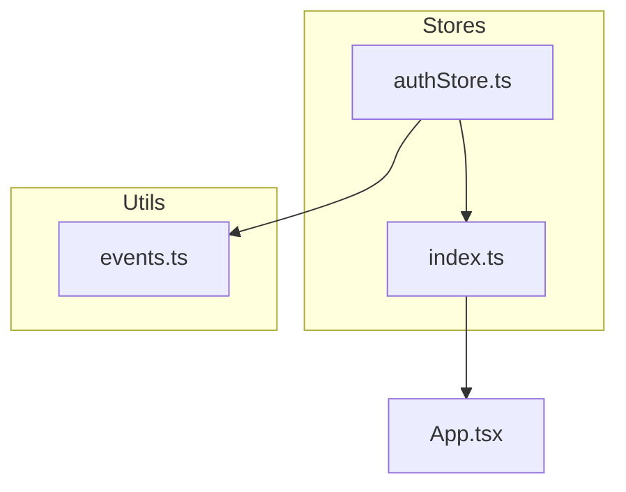
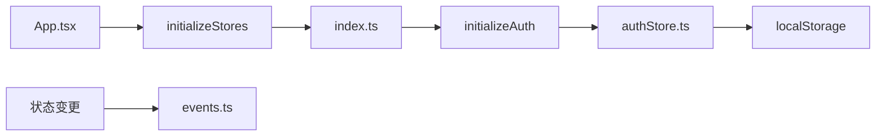
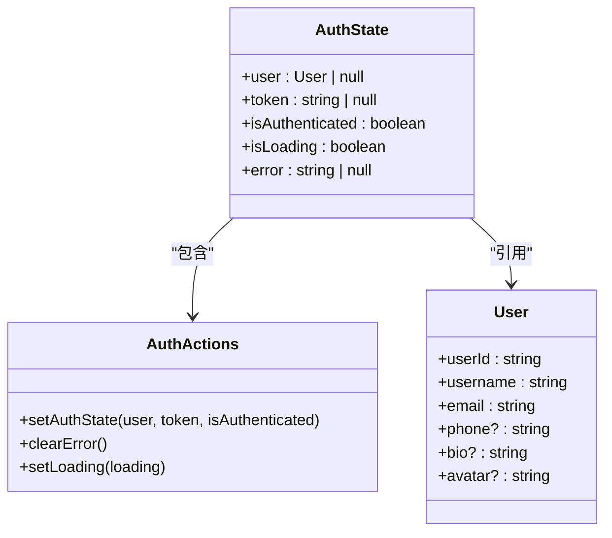
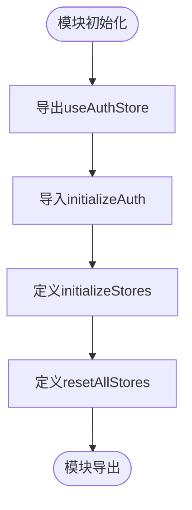
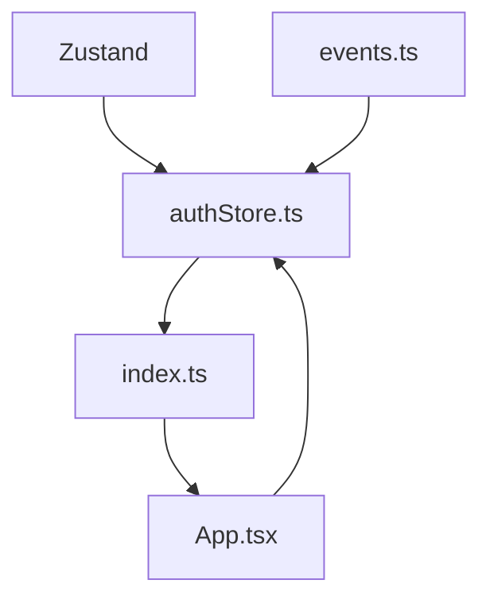

# 状态管理方案

<cite>
**本文档引用文件**  
- [authStore.ts](file://frontend/src/stores/authStore.ts)
- [index.ts](file://frontend/src/stores/index.ts)
- [events.ts](file://frontend/src/utils/events.ts)
- [App.tsx](file://frontend/src/App.tsx)
</cite>

## 目录
1. [项目结构](#项目结构)
2. [核心组件](#核心组件)
3. [架构概述](#架构概述)
4. [详细组件分析](#详细组件分析)
5. [依赖分析](#依赖分析)
6. [性能考虑](#性能考虑)
7. [故障排除指南](#故障排除指南)
8. [结论](#结论)

## 项目结构

项目前端状态管理模块采用模块化设计，集中于`frontend/src/stores`目录。`authStore.ts`定义了基于Zustand的全局认证状态，`index.ts`负责聚合导出所有store并提供初始化接口。状态变更事件通过`utils/events.ts`进行键值生成，确保事件命名一致性。

**Diagram sources**
- [authStore.ts](file://frontend/src/stores/authStore.ts#L1-L82)
- [index.ts](file://frontend/src/stores/index.ts#L1-L16)
- [events.ts](file://frontend/src/utils/events.ts#L1-L3)

**Section sources**
- [authStore.ts](file://frontend/src/stores/authStore.ts#L1-L82)
- [index.ts](file://frontend/src/stores/index.ts#L1-L16)

## 核心组件

`authStore.ts`实现了基于Zustand的状态管理核心，包含用户认证信息、令牌、认证状态等全局状态。通过`persist`中间件实现状态持久化至localStorage，确保页面刷新后状态不丢失。`index.ts`提供统一的store初始化和重置接口，实现模块解耦。

**Section sources**
- [authStore.ts](file://frontend/src/stores/authStore.ts#L1-L82)
- [index.ts](file://frontend/src/stores/index.ts#L1-L16)

## 架构概述

系统采用Zustand作为状态管理库，通过create和persist中间件构建可持久化的全局状态。认证状态在应用启动时由App.tsx调用initializeStores进行初始化，状态变更可通过事件系统触发副作用。

**Diagram sources**
- [App.tsx](file://frontend/src/App.tsx#L1-L46)
- [index.ts](file://frontend/src/stores/index.ts#L1-L16)
- [authStore.ts](file://frontend/src/stores/authStore.ts#L1-L82)
- [events.ts](file://frontend/src/utils/events.ts#L1-L3)

## 详细组件分析

### 认证状态分析

`authStore.ts`定义了完整的认证状态模型，包括用户信息、令牌、认证状态等。通过partialize配置仅持久化关键字段，优化存储效率。

**Diagram sources**
- [authStore.ts](file://frontend/src/stores/authStore.ts#L1-L82)

**Section sources**
- [authStore.ts](file://frontend/src/stores/authStore.ts#L1-L82)

### 状态聚合分析

`index.ts`采用聚合导出模式，将多个store统一暴露给应用层，同时提供initializeStores和resetAllStores等生命周期管理函数。

**Diagram sources**
- [index.ts](file://frontend/src/stores/index.ts#L1-L16)

**Section sources**
- [index.ts](file://frontend/src/stores/index.ts#L1-L16)

## 依赖分析

状态管理模块依赖Zustand库的核心功能和persist中间件，与应用其他部分通过标准ES模块导入导出机制进行交互。事件系统通过简单函数生成事件键，保持低耦合。

**Diagram sources**
- [authStore.ts](file://frontend/src/stores/authStore.ts#L1-L82)
- [index.ts](file://frontend/src/stores/index.ts#L1-L16)
- [events.ts](file://frontend/src/utils/events.ts#L1-L3)
- [App.tsx](file://frontend/src/App.tsx#L1-L46)

**Section sources**
- [authStore.ts](file://frontend/src/stores/authStore.ts#L1-L82)
- [index.ts](file://frontend/src/stores/index.ts#L1-L16)

## 性能考虑

状态持久化采用partialize策略，仅存储必要字段，减少localStorage占用。状态更新通过Zustand的高效更新机制，避免不必要的重渲染。建议在开发环境集成Zustand DevTools进行状态调试。

## 故障排除指南

当遇到状态不一致问题时，可调用resetAllStores重置所有状态。localStorage中的持久化数据可通过浏览器开发者工具手动清除。状态初始化失败时检查App.tsx中的initializeStores调用。

**Section sources**
- [index.ts](file://frontend/src/stores/index.ts#L1-L16)
- [App.tsx](file://frontend/src/App.tsx#L1-L46)

## 结论

本状态管理方案通过Zustand实现了轻量高效的全局状态管理，结合持久化存储和模块化设计，为应用提供了稳定可靠的状态基础设施。未来可基于相同模式扩展其他全局状态模型，如模型配置状态等。